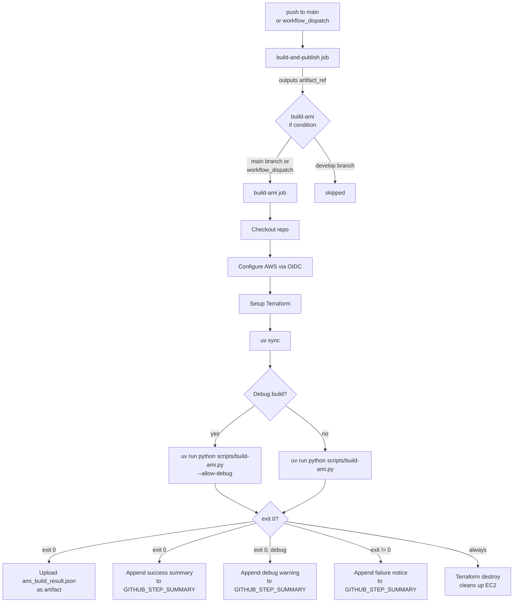

# Design Document: `ami-build-ci-job`

## Overview

This feature adds a `build-ami` CI job to `.github/workflows/build-attestable-image.yml`. The job runs automatically after the existing `build-and-publish` job succeeds on pushes to `main` and on all `workflow_dispatch` triggers (including debug builds with `enable_ssh: true`). It invokes `scripts/build-ami.py` with the artifact reference produced by `build-and-publish`, which provisions an EC2 instance via Terraform, verifies the artifact's GitHub attestation, converts the raw disk image into an EBS snapshot, registers an AMI, and writes the result to a JSON file. When triggered as a debug build, the job passes `--allow-debug` to the script and appends an explicit warning to the GitHub Actions step summary. The job uploads the result JSON as a workflow artifact and appends a summary to the GitHub Actions step summary. EC2 infrastructure is always cleaned up, whether the build succeeds or fails.

The design is intentionally narrow: this is a CI job definition, not a new application. The primary deliverable is a well-structured YAML job block added to the existing workflow file.

## Architecture



The `build-ami` job is a downstream consumer of `build-and-publish`. It does not modify the workflow's trigger conditions or the `build-and-publish` job itself. The job-level `if:` expression excludes only pushes to non-`main` branches. Debug builds (`workflow_dispatch` with `enable_ssh: true`) are allowed to run, with the `--allow-debug` flag conditionally passed to the script and a warning appended to the step summary.

## Components and Interfaces

### Job: `build-ami`

Defined in `.github/workflows/build-attestable-image.yml` as a new top-level job entry.

**Key attributes:**

| Attribute | Value |
|---|---|
| `needs` | `build-and-publish` |
| `runs-on` | `ubuntu-24.04` |
| `if` condition | `github.ref == 'refs/heads/main' \|\| github.event_name == 'workflow_dispatch'` |
| Permissions | `id-token: write`, `contents: read`, `packages: read` |

**Inputs consumed from `build-and-publish`:**

- `needs.build-and-publish.outputs.artifact_ref` — the fully-qualified GHCR reference passed as `--artifact-ref` to the script.

**Outputs produced:**

- Workflow artifact `ami-build-result` containing `ami_build_result.json` (retained 90 days).
- GitHub Actions step summary with AMI ID, snapshot ID, region, and build timestamp on success; failure notice on error.

### Script: `scripts/build-ami.py`

The script is pre-existing. The CI job invokes it as:

```bash
# Base invocation (production builds)
uv run python scripts/build-ami.py \
  --artifact-ref "${{ needs.build-and-publish.outputs.artifact_ref }}" \
  --region "${{ vars.AWS_REGION || 'us-east-1' }}" \
  --output-file ami_build_result.json \
  --expected-workflow .github/workflows/build-attestable-image.yml

# Debug builds additionally pass --allow-debug:
#   --allow-debug
```

The `--allow-debug` flag is conditionally appended when the workflow is triggered via `workflow_dispatch` with `enable_ssh: true`. On production builds (push to `main` or `workflow_dispatch` with `enable_ssh: false`), the flag is omitted. The conditional logic uses a shell variable set from the GitHub Actions context:

```bash
ALLOW_DEBUG_FLAG=""
if [ "${{ github.event_name }}" = "workflow_dispatch" ] && [ "${{ inputs.enable_ssh }}" = "true" ]; then
  ALLOW_DEBUG_FLAG="--allow-debug"
fi
```

The script exits 0 on success and non-zero on any failure; the CI job relies on this contract for conditional steps.

### Step Ordering

Steps within `build-ami` must follow this order to satisfy dependency constraints:

1. `actions/checkout@v4` (with `submodules: recursive`)
2. `aws-actions/configure-aws-credentials` (OIDC, before any AWS or Terraform calls)
3. `hashicorp/setup-terraform` (pinned version, before script invocation)
4. `uv sync` (install Python deps, before script invocation)
5. `uv run python scripts/build-ami.py` (main build step, with conditional `--allow-debug`)
6. Upload artifact (`if: success()`)
7. Write success summary (`if: success()`)
8. Write debug warning (`if: success() && github.event_name == 'workflow_dispatch' && inputs.enable_ssh == true`)
9. Write failure summary (`if: failure()`)

Steps 6–9 are conditional; step 5's cleanup (Terraform destroy) is handled inside the script's `finally` block, so no separate cleanup step is needed in the workflow.

## Data Models

### `ami_build_result.json`

Produced by `scripts/build-ami.py` (`generate_build_result` function). Schema:

```json
{
  "ami_id": "ami-0123456789abcdef0",
  "snapshot_id": "snap-0123456789abcdef0",
  "region": "us-east-1",
  "build_timestamp": "2025-01-15T12:34:56.789012+00:00",
  "pcr_measurements": {
    "pcr4": "<hex string>",
    "pcr7": "<hex string>"
  }
}
```

This file is written to the runner's working directory and uploaded as the `ami-build-result` workflow artifact.

### Job Condition Expression

The `if:` expression on the `build-ami` job is a pure boolean function of the GitHub Actions context:

```
github.ref == 'refs/heads/main'
|| github.event_name == 'workflow_dispatch'
```

Truth table:

| Trigger | `github.ref` | `enable_ssh` | Result |
|---|---|---|---|
| push to `main` | `refs/heads/main` | N/A | ✅ run |
| push to `develop` | `refs/heads/develop` | N/A | ⛔ skip |
| `workflow_dispatch` | any | `false` | ✅ run |
| `workflow_dispatch` | any | `true` | ✅ run |

Note: The `enable_ssh` input no longer affects whether the job runs. It only affects whether `--allow-debug` is passed to the script and whether a debug warning is appended to the step summary.

### AWS Region Expression

The region value used in both `configure-aws-credentials` and `--region` is:

```
${{ vars.AWS_REGION || 'us-east-1' }}
```

This expression must be identical in both places to ensure consistency.

## Terraform IAM Role Stack (`terraform/github-actions-iam-role/`)

### Purpose

This stack is a one-time bootstrap step. It creates the AWS IAM role that the `build-ami` CI job assumes via OIDC. Once applied, the operator copies the `role_arn` output into the GitHub repository variable `vars.AWS_ROLE_ARN`. The stack does not need to be re-applied on every CI run.

### File Layout

```
terraform/github-actions-iam-role/
├── main.tf          # OIDC provider (conditional) + IAM role + trust policy
├── iam_policy.tf    # IAM policy document and attachment
├── variables.tf     # Input variables
├── outputs.tf       # role_arn output
└── README.md        # Usage instructions
```

No modules. No remote state configuration is prescribed (operators may add a backend block for their environment).

### Input Variables

| Variable | Type | Default | Description |
|---|---|---|---|
| `aws_region` | `string` | `"us-east-1"` | AWS region to deploy into |
| `github_org` | `string` | — | GitHub organisation or user name (e.g. `my-org`) |
| `github_repo` | `string` | `"github-runner-ec2-attestation"` | Repository name |
| `create_oidc_provider` | `bool` | `true` | Whether to create the GitHub Actions OIDC provider (set `false` if it already exists) |

### Trust Policy

The role's assume-role policy allows `sts:AssumeRoleWithWebIdentity` from the GitHub Actions OIDC provider, with two conditions:

- `token.actions.githubusercontent.com:aud` equals `sts.amazonaws.com`
- `token.actions.githubusercontent.com:sub` matches `repo:<github_org>/<github_repo>:*`

The wildcard on the subject allows any branch, tag, or environment within the repository to assume the role. Operators who want tighter scoping (e.g. only the `main` branch) can narrow the subject to `repo:<org>/<repo>:ref:refs/heads/main`.

### IAM Permissions

The attached policy grants the minimum permissions needed by `scripts/build-ami.py` and the `terraform/build-ami/` stack it invokes.

**Important boundary:** `coldsnap upload` and `ec2:RegisterImage` run **on the EC2 build instance** using the instance's own IAM role (`build-ami-instance-role`, defined in `terraform/build-ami/iam.tf`). Those EBS Direct API and AMI registration permissions belong to the instance role, not to the GitHub Actions CI role. The CI role only needs to manage the infrastructure lifecycle and the small set of boto3 calls made directly by `scripts/build-ami.py` on the runner.

---

**EC2 — instance lifecycle (Terraform `aws_instance` apply/destroy + boto3 waiters):**
- `ec2:RunInstances` — create the build instance
- `ec2:TerminateInstances` — destroy the build instance
- `ec2:DescribeInstances` — Terraform state refresh + boto3 `instance_running` waiter
- `ec2:DescribeInstanceStatus` — boto3 `instance_status_ok` waiter
- `ec2:DescribeInstanceAttribute` — Terraform reads instance attributes on refresh

**EC2 — key pair (Terraform `aws_key_pair`):**
- `ec2:ImportKeyPair` — Terraform uses `ImportKeyPair` (not `CreateKeyPair`) for `aws_key_pair` resources
- `ec2:DeleteKeyPair`
- `ec2:DescribeKeyPairs`

**EC2 — security group (Terraform `aws_security_group`):**
- `ec2:CreateSecurityGroup`, `ec2:DeleteSecurityGroup`
- `ec2:AuthorizeSecurityGroupIngress`, `ec2:RevokeSecurityGroupIngress`
- `ec2:DescribeSecurityGroups`, `ec2:DescribeSecurityGroupRules` — Terraform 5.x reads rules separately

**EC2 — VPC and networking (Terraform `aws_vpc`, `aws_subnet`, `aws_internet_gateway`, `aws_route_table`):**
- `ec2:CreateVpc`, `ec2:DeleteVpc`, `ec2:DescribeVpcs`, `ec2:ModifyVpcAttribute`
- `ec2:CreateSubnet`, `ec2:DeleteSubnet`, `ec2:DescribeSubnets`, `ec2:ModifySubnetAttribute`
- `ec2:CreateInternetGateway`, `ec2:DeleteInternetGateway`, `ec2:AttachInternetGateway`, `ec2:DetachInternetGateway`, `ec2:DescribeInternetGateways`
- `ec2:CreateRouteTable`, `ec2:DeleteRouteTable`, `ec2:CreateRoute`, `ec2:DeleteRoute`, `ec2:AssociateRouteTable`, `ec2:DisassociateRouteTable`, `ec2:DescribeRouteTables`

**EC2 — tagging and data sources:**
- `ec2:CreateTags` — applied to all resources at creation time
- `ec2:DescribeAvailabilityZones` — `data.aws_availability_zones` in `data.tf`
- `ec2:DescribeImages` — `data.aws_ami` lookup in `data.tf`

**EC2 — snapshot waiter (boto3 `snapshot_completed` waiter in `wait_for_snapshot`):**
- `ec2:DescribeSnapshots` — the snapshot is created by coldsnap on the instance; the runner only polls its completion status

**EC2 — AMI registration (boto3 `register_image` call in `register_ami`):**
- `ec2:RegisterImage` — called directly by `scripts/build-ami.py` on the runner after the snapshot completes

**IAM — instance role and profile lifecycle (Terraform `aws_iam_role`, `aws_iam_policy`, `aws_iam_instance_profile`):**
- `iam:CreateRole`, `iam:DeleteRole`, `iam:GetRole`, `iam:TagRole`
- `iam:ListRolePolicies`, `iam:ListAttachedRolePolicies`
- `iam:CreatePolicy`, `iam:DeletePolicy`, `iam:GetPolicy`, `iam:GetPolicyVersion`, `iam:ListPolicyVersions`, `iam:TagPolicy`
- `iam:AttachRolePolicy`, `iam:DetachRolePolicy`
- `iam:CreateInstanceProfile`, `iam:DeleteInstanceProfile`, `iam:GetInstanceProfile`, `iam:TagInstanceProfile`
- `iam:AddRoleToInstanceProfile`, `iam:RemoveRoleFromInstanceProfile`
- `iam:PassRole` — scoped to `arn:aws:iam::<account>:role/build-ami-instance-role`; required so Terraform can attach the instance profile to the EC2 instance

**STS — identity check:**
- `sts:GetCallerIdentity` — used by both the Terraform AWS provider and boto3 at startup (`data.aws_caller_identity` in `data.tf`)

### Output

```hcl
output "role_arn" {
  description = "ARN of the IAM role to set as vars.AWS_ROLE_ARN in GitHub"
  value       = aws_iam_role.github_actions.arn
}
```

### Relationship to Existing Stacks

```
terraform/
├── build-ami/          # Invoked at runtime by scripts/build-ami.py
│                       # Creates the EC2 build instance; its IAM instance
│                       # profile is managed here, not by the CI role stack.
├── deploy/             # Separate deployment stack (unrelated)
└── github-actions-iam-role/   # NEW — one-time bootstrap; creates the role
                                # that the CI job assumes via OIDC
```

The `github-actions-iam-role` stack is applied once by a human operator with sufficient AWS permissions. It does not depend on `terraform/build-ami/` and does not share state with it.

---

## Correctness Properties

*A property is a characteristic or behavior that should hold true across all valid executions of a system — essentially, a formal statement about what the system should do. Properties serve as the bridge between human-readable specifications and machine-verifiable correctness guarantees.*

This feature is a GitHub Actions workflow configuration. Most acceptance criteria are structural (SMOKE) checks on the YAML. However, three areas involve logic that varies meaningfully with input and is worth property-based testing:

1. **The job condition expression** — a pure boolean function of trigger context that must correctly classify all trigger combinations.
2. **The summary generation script** — a shell/Python snippet that parses `ami_build_result.json` and formats output; correctness must hold for any valid JSON content.
3. **The debug warning logic** — a conditional that must produce a warning if and only if the build is a debug build.

Property-based testing library: **Hypothesis** (Python), consistent with the existing test suite in this repository.

---

### Property 1: Job condition correctly classifies all trigger contexts

*For any* GitHub Actions trigger context (event name, ref, and `enable_ssh` input), the `build-ami` job's `if:` condition expression SHALL evaluate to `true` if and only if the trigger is a push to `main` OR a `workflow_dispatch` (regardless of `enable_ssh` value).

**Validates: Requirements 1.2, 1.3, 1.4, 1.5**

---

### Property 2: Summary script extracts all required fields from any valid build result

*For any* valid `ami_build_result.json` containing `ami_id`, `snapshot_id`, `region`, and `build_timestamp`, the summary generation step SHALL produce output that contains each of those four field values.

**Validates: Requirements 7.1**

---

### Property 3: Debug warning is present if and only if the build is a debug build

*For any* successful build result and any trigger context, the summary generation step SHALL include a debug warning if and only if the trigger is a `workflow_dispatch` with `enable_ssh == true`.

**Validates: Requirements 7.3**

---

### Property Reflection

- Property 1 subsumes requirements 1.2, 1.3, 1.4, and 1.5 — all four are cases of the same boolean expression evaluated over different inputs. A single property with a generator covering all trigger combinations is more comprehensive than four separate examples.
- Property 2 is independent of Property 1 and covers a different code path (shell/Python JSON parsing vs. YAML expression logic).
- Property 3 covers the debug warning logic, ensuring the warning is present when and only when the build is a debug build. This is a conditional formatting concern independent of the other two properties.
- No redundancy between the three properties.

## Error Handling

### Script Failure

`scripts/build-ami.py` exits non-zero on any error (attestation failure, Terraform failure, snapshot failure, etc.). The CI job propagates this as a job failure. The `if: success()` guard on the artifact upload step ensures the artifact is not uploaded on failure. The `if: failure()` guard on the failure summary step ensures a notice is written to the step summary.

### Infrastructure Cleanup

Terraform destroy runs inside the script's `finally` block unconditionally. If `terraform destroy` itself fails, the script logs the error but does not re-raise it (to avoid masking the original error). This means cleanup failures are visible in logs but do not change the job's exit code.

### Missing `vars.AWS_REGION`

The expression `${{ vars.AWS_REGION || 'us-east-1' }}` defaults to `us-east-1` when the variable is unset or empty. This is safe because `us-east-1` is a valid AWS region and the script validates the region format before use.

### Debug Artifact Gate

The script enforces a debug gate: if the artifact has `debug=true` annotation and `--allow-debug` is not passed, the script exits non-zero before creating any AWS resources. On debug builds (`workflow_dispatch` with `enable_ssh: true`), the CI job passes `--allow-debug`, allowing the script to proceed. On production builds, `--allow-debug` is omitted, so debug artifacts are rejected at the script level, providing defense-in-depth. When a debug build succeeds, the CI job appends an explicit warning to the step summary to ensure operators are aware the AMI was built from a debug artifact.

## Testing Strategy

### Dual Testing Approach

Unit/property tests verify the logic components in isolation; integration tests (manual or in a staging environment) verify the end-to-end workflow.

### Property-Based Tests (Hypothesis)

**Property 1 — Job condition expression:**

```python
# Feature: ami-build-ci-job, Property 1: job condition correctly classifies all trigger contexts
@given(
    event_name=st.sampled_from(["push", "workflow_dispatch", "pull_request"]),
    ref=st.one_of(
        st.just("refs/heads/main"),
        st.just("refs/heads/develop"),
        st.text(alphabet=st.characters(whitelist_categories=("Lu", "Ll", "Nd")), min_size=1)
    ),
    enable_ssh=st.booleans(),
)
@settings(max_examples=200)
def test_build_ami_job_condition(event_name, ref, enable_ssh):
    result = evaluate_job_condition(event_name, ref, enable_ssh)
    expected = (ref == "refs/heads/main") or (event_name == "workflow_dispatch")
    assert result == expected
```

The `evaluate_job_condition` function is a pure Python implementation of the YAML `if:` expression, extracted for testability. Note that `enable_ssh` no longer affects the job condition — it only affects the `--allow-debug` flag and the debug warning.

**Property 2 — Summary script field extraction:**

```python
# Feature: ami-build-ci-job, Property 2: summary script extracts all required fields
@given(
    ami_id=st.from_regex(r"ami-[0-9a-f]{17}", fullmatch=True),
    snapshot_id=st.from_regex(r"snap-[0-9a-f]{17}", fullmatch=True),
    region=st.sampled_from(["us-east-1", "eu-west-1", "ap-southeast-2"]),
    build_timestamp=st.datetimes(timezones=st.just(timezone.utc)).map(lambda d: d.isoformat()),
)
@settings(max_examples=100)
def test_summary_generation(ami_id, snapshot_id, region, build_timestamp):
    build_result = {
        "ami_id": ami_id,
        "snapshot_id": snapshot_id,
        "region": region,
        "build_timestamp": build_timestamp,
        "pcr_measurements": {"pcr4": "aabbcc", "pcr7": "ddeeff"},
    }
    summary = generate_summary(build_result)
    assert ami_id in summary
    assert snapshot_id in summary
    assert region in summary
    assert build_timestamp in summary
```

### Unit Tests (Example-Based)

- Verify the `build-ami` job YAML block contains `needs: build-and-publish`.
- Verify `runs-on: ubuntu-24.04`.
- Verify `actions/checkout@v4` with `submodules: recursive` is the first step.
- Verify `aws-actions/configure-aws-credentials` uses `role-to-assume: ${{ vars.AWS_ROLE_ARN }}`.
- Verify `hashicorp/setup-terraform` is present with a pinned `terraform_version`.
- Verify the script invocation includes `--output-file ami_build_result.json` and `--expected-workflow .github/workflows/build-attestable-image.yml`.
- Verify the script invocation conditionally includes `--allow-debug` based on the `enable_ssh` input.
- Verify the upload step uses `if: success()`, artifact name `ami-build-result`, and `retention-days: 90`.
- Verify the failure summary step uses `if: failure()`.
- Verify a debug warning step exists with a condition that checks for `workflow_dispatch` and `enable_ssh == true`.
- Verify job permissions: `id-token: write`, `contents: read`, `packages: read`; and that `attestations: write` and `packages: write` are absent.
- Verify `aws-access-key-id` and `aws-secret-access-key` are absent from the job.

### Integration Tests

End-to-end validation requires a real GitHub Actions run with AWS credentials configured. These are not automated in the unit test suite:

- Trigger a push to `main` and verify the `build-ami` job runs and produces the `ami-build-result` artifact.
- Trigger a `workflow_dispatch` with `enable_ssh: true` and verify `build-ami` runs, passes `--allow-debug`, and the step summary contains a debug warning.
- Trigger a `workflow_dispatch` with `enable_ssh: false` and verify `build-ami` runs without `--allow-debug` and no debug warning appears.
- Verify the step summary contains the AMI ID after a successful run.
- Verify EC2 infrastructure is cleaned up after both success and failure runs.
