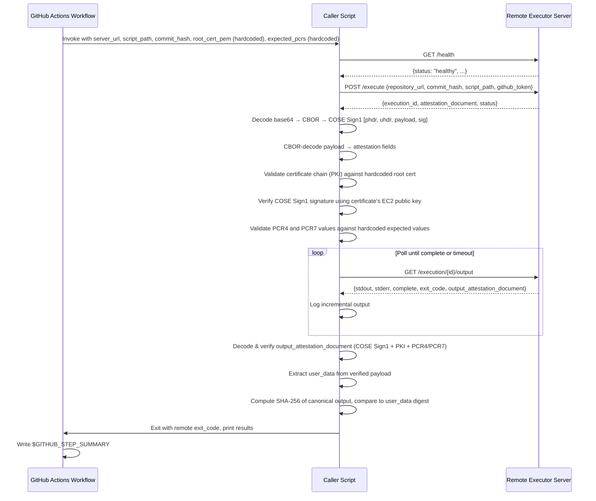

# Design Document: GitHub Actions Remote Executor Caller

## Overview

The GitHub Actions Remote Executor Caller is the client-side counterpart to the Remote Executor server. It consists of a GitHub Actions workflow (`call-remote-executor.yml`) and a Python caller script (`.github/scripts/call_remote_executor.py`) that together orchestrate the full lifecycle of a remote script execution: health check, submission, attestation validation, output polling, output integrity verification, and result reporting.

The caller is designed to be triggered manually via `workflow_dispatch`, targeting a specific Remote Executor server URL. It validates the server's NitroTPM attestation documents at two points: once when the execution request is accepted (server identity attestation) and again when the output is returned (output integrity attestation). This dual-attestation approach ensures both that the server is a genuine attested environment and that the output has not been tampered with in transit.

### Key Design Decisions

1. **Single Python script**: All client logic (HTTP calls, COSE Sign1 verification, attestation validation, polling) lives in one `.github/scripts/call_remote_executor.py` file to keep the caller self-contained and easy to audit.
2. **`cbor2` for CBOR decoding**: The attestation documents are COSE Sign1 structures encoded in CBOR. We use the `cbor2` library (pure Python) for decoding both the outer COSE structure and the inner attestation payload.
3. **`cose` for COSE Sign1 verification**: The `cose` library provides `Sign1Message` and `EC2` key types for verifying the COSE signature using the signing certificate's public key.
4. **`pyOpenSSL` for certificate chain validation**: The `OpenSSL.crypto` module provides `X509Store` and `X509StoreContext` for validating the signing certificate against the CA bundle and root certificate, matching the AWS Nitro Enclaves attestation verification pattern.
5. **`pycryptodome` for key parameter extraction**: The `Crypto.Util.number.long_to_bytes` utility converts the EC public key coordinates from integers to bytes for COSE key construction.
6. **`requests` for HTTP**: Simple synchronous HTTP client is sufficient since the caller performs sequential operations (health check → execute → poll loop).
7. **Canonical output format**: The server constructs `Script_Output` as `stdout:{stdout}\nstderr:{stderr}\nexit_code:{exit_code}`. The caller must replicate this exact format when computing the SHA-256 digest for output attestation verification.
8. **Exit code propagation**: The caller script exits with the remote script's exit code, allowing the GitHub Actions workflow to naturally fail when the remote script fails.
9. **Hardcoded trust anchors**: The AWS Nitro Enclaves root CA certificate PEM and expected PCR4/PCR7 values are hardcoded directly in the GitHub Actions workflow YAML. This eliminates the need for users to supply these values at dispatch time, ensuring every invocation performs full cryptographic verification. PKI validation and PCR validation are always performed. COSE signature verification is always performed when the signing certificate is present.

## Architecture



### Component Layout

```
.github/
  workflows/
    call-remote-executor.yml    # workflow_dispatch workflow
  scripts/
    sample-build.sh             # sample build script for remote execution
    call_remote_executor.py     # Python caller script
    pyproject.toml              # caller dependencies (requests, cbor2, cose, pyOpenSSL, pycryptodome, cryptography)
```

## Components and Interfaces

### 1. GitHub Actions Workflow (`call-remote-executor.yml`)

Responsibilities:
- Define `workflow_dispatch` inputs: `server_url` (required), `script_path` (optional, default `.github/scripts/sample-build.sh`), `commit_hash` (optional, default `${{ github.sha }}`)
- Hardcode the AWS Nitro Enclaves root CA certificate PEM inline in the workflow YAML as an environment variable or step output, and pass it to the caller script via `--root-cert-pem`
- Hardcode the expected PCR4 and PCR7 values as a JSON map inline in the workflow YAML, and pass it to the caller script via `--expected-pcrs`
- Validate that `server_url` is not empty
- Check out the repository
- Install Python dependencies from `.github/scripts/pyproject.toml`
- Invoke `.github/scripts/call_remote_executor.py` with the appropriate arguments and `GITHUB_TOKEN`
- Write a job summary to `$GITHUB_STEP_SUMMARY`

### 2. Caller Script (`.github/scripts/call_remote_executor.py`)

The script is structured as a `RemoteExecutorCaller` class with the following interface:

```python
class RemoteExecutorCaller:
    def __init__(self, server_url: str, timeout: int = 30,
                 poll_interval: int = 5, max_poll_duration: int = 600,
                 max_retries: int = 3,
                 root_cert_pem: str = "",
                 expected_pcrs: dict[int, str] | None = None):
        """
        Initialize caller with server URL and configuration.
        
        Args:
            root_cert_pem: PEM-encoded AWS Nitro root CA certificate string.
                           Hardcoded in the workflow and always provided.
            expected_pcrs: Dict mapping PCR index (int) to expected hex value (str).
                           Hardcoded in the workflow for PCR4 and PCR7.
        """

    def health_check(self) -> dict:
        """
        GET /health - verify server is healthy.
        Returns parsed JSON response.
        Raises CallerError if unhealthy or unreachable.
        """

    def execute(self, repository_url: str, commit_hash: str,
                script_path: str, github_token: str) -> dict:
        """
        POST /execute - submit execution request.
        Returns parsed JSON response with execution_id and attestation_document.
        Raises CallerError on HTTP errors or connection failures.
        """

    def validate_attestation(self, attestation_b64: str) -> dict:
        """
        Full attestation verification:
        1. Decode base64 → binary → CBOR → COSE Sign1 array [phdr, uhdr, payload, sig]
        2. CBOR-decode payload to extract attestation fields
        3. Validate structural fields (module_id, digest, timestamp, pcrs, certificate, cabundle)
        4. Validate certificate chain (PKI) against hardcoded root cert
        5. Verify COSE Sign1 signature using signing certificate's EC2 public key (P-384/ES384)
        6. Validate PCR4 and PCR7 values against hardcoded expected values
        Returns parsed attestation payload dict.
        Raises CallerError on any verification failure.
        """

    def _verify_certificate_chain(self, cert_der: bytes, cabundle: list[bytes]) -> None:
        """
        Validate the signing certificate against the CA bundle and root certificate.
        Constructs an X509Store with root_cert_pem and intermediate certs from cabundle[1:].
        Raises CallerError if certificate chain validation fails.
        Always called — root_cert_pem is hardcoded in the workflow.
        """

    def _verify_cose_signature(self, cose_array: list) -> None:
        """
        Verify the COSE Sign1 signature using the signing certificate's public key.
        Extracts EC2 key parameters (x, y on P-384) from the certificate.
        Constructs a Sign1Message and verifies the signature with ES384.
        Raises CallerError if signature verification fails.
        """

    def _validate_pcrs(self, document_pcrs: dict) -> None:
        """
        Compare expected PCR values (PCR4 and PCR7) against those in the attestation document.
        Raises CallerError if any expected PCR is missing or mismatched.
        Always called — expected_pcrs is hardcoded in the workflow.
        """

    def poll_output(self, execution_id: str) -> dict:
        """
        Poll GET /execution/{id}/output until complete or timeout.
        Logs incremental output during polling.
        Returns final response with stdout, stderr, exit_code, output_attestation_document.
        Raises CallerError on timeout or repeated HTTP failures.
        """

    def validate_output_attestation(self, output_attestation_b64: str,
                                     stdout: str, stderr: str,
                                     exit_code: int) -> bool:
        """
        Full output attestation verification:
        1. Decode base64 → COSE Sign1 → attestation payload (same as validate_attestation)
        2. Validate certificate chain (PKI) against hardcoded root cert
        3. Verify COSE Sign1 signature
        4. Validate PCR4 and PCR7 values against hardcoded expected values
        5. Extract user_data from verified payload (SHA-256 hex digest)
        6. Compute SHA-256 of canonical output format
        7. Compare digests
        Returns True if match. Raises CallerError on any failure.
        """

    def run(self, repository_url: str, commit_hash: str,
            script_path: str, github_token: str) -> int:
        """
        Orchestrate full flow: health_check → execute → validate_attestation
        → poll_output → validate_output_attestation → report results.
        Returns remote script exit code.
        """
```

```python
class CallerError(Exception):
    """Raised when the caller encounters a fatal error."""
    def __init__(self, message: str, phase: str, details: dict | None = None):
        self.message = message
        self.phase = phase  # "health_check", "execute", "attestation", "polling", "output_attestation"
        self.details = details or {}
```

### 3. Sample Build Script (`.github/scripts/sample-build.sh`)

```bash
#!/usr/bin/env bash
set -euo pipefail
echo "=== Remote Executor Sample Build ==="
echo "Hostname: $(hostname)"
echo "Date: $(date -u)"
echo "Kernel: $(uname -r)"
echo "User: $(whoami)"
echo "Working directory: $(pwd)"
echo "=== Build Complete ==="
```

### 4. Attestation Validation Logic

The attestation document is a COSE Sign1 structure. When base64-decoded and CBOR-decoded, it yields a 4-element array:

```python
# Outer COSE Sign1 structure (after first CBOR decode)
cose_array = cbor2.loads(raw_bytes)
# cose_array[0] = protected header (CBOR-encoded bytes)
# cose_array[1] = unprotected header (map, typically empty)
# cose_array[2] = payload (CBOR-encoded attestation document bytes)
# cose_array[3] = signature (bytes)
```

The payload (index 2) is itself CBOR-encoded and contains the attestation fields:

```python
EXPECTED_ATTESTATION_FIELDS = [
    "module_id",    # Identifier of the attestation module
    "digest",       # Digest algorithm used (e.g. "SHA384")
    "timestamp",    # When attestation was generated (Unix epoch ms)
    "pcrs",         # Platform Configuration Registers {index: bytes}
    "certificate",  # DER-encoded signing certificate (bytes)
    "cabundle",     # Certificate authority bundle (list[bytes])
]
```

Validation steps for server identity attestation (`validate_attestation`):

**Step 1: COSE Sign1 Parsing**
1. Base64-decode the `attestation_document` string to raw bytes
2. CBOR-decode the raw bytes — result must be a list/array of exactly 4 elements
3. CBOR-decode element at index 2 (payload) to get the attestation fields dict
4. Verify all `EXPECTED_ATTESTATION_FIELDS` are present as keys in the payload dict

**Step 2: Certificate Chain (PKI) Validation**
1. Create an `OpenSSL.crypto.X509Store`
2. Load the `root_cert_pem` as a PEM certificate and add to the store
3. For each certificate in `cabundle[1:]` (skipping the first/root entry), load as DER and add to the store
4. Load the `certificate` field from the payload as a DER certificate
5. Create an `X509StoreContext` with the store and the signing certificate
6. Call `verify_certificate()` — raises on failure

**Step 3: COSE Signature Verification**
1. Load the signing certificate and extract its public key's `public_numbers()` (x, y coordinates)
2. Convert x and y from integers to bytes using `long_to_bytes`
3. Construct a `cose.EC2` key with `alg=ES384`, `crv=P_384`, and the x/y bytes
4. CBOR-decode the protected header from `cose_array[0]`
5. Construct a `cose.Sign1Message` with `phdr`, `uhdr=cose_array[1]`, `payload=cose_array[2]`
6. Set `msg.signature = cose_array[3]`
7. Call `msg.verify_signature(key)` — raise CallerError if it returns False

**Step 4: PCR Validation**
1. For each `(index, expected_hex)` in `expected_pcrs` (PCR4 and PCR7):
   - Verify the index exists in the payload's `pcrs` dict and is not None
   - Convert the document PCR bytes to hex: `document_pcrs[index].hex()`
   - Compare against `expected_hex` — raise CallerError on mismatch

**Step 5: Audit Logging**
1. Log attestation field values for audit trail
2. Return the parsed payload dict

Validation steps for output integrity attestation (`validate_output_attestation`):
1. Perform Steps 1–4 above on the output attestation document (same COSE Sign1 verification)
2. Extract the `user_data` field from the verified payload (CBOR-decoded, then `.decode()` to string — contains SHA-256 hex digest)
3. Reconstruct the canonical `Script_Output`: `stdout:{stdout}\nstderr:{stderr}\nexit_code:{exit_code}`
4. Compute SHA-256 hex digest of the canonical output
5. Compare computed digest against `user_data` digest
6. Return True if they match, raise CallerError if they don't

## Data Models

### Workflow Dispatch Inputs

| Input | Type | Required | Default | Description |
|-------|------|----------|---------|-------------|
| `server_url` | string | yes | — | Base URL of the Remote Executor server |
| `script_path` | string | no | `.github/scripts/sample-build.sh` | Path to script in the repository |
| `commit_hash` | string | no | `${{ github.sha }}` | Git commit SHA to execute |

### Hardcoded Workflow Constants

The following values are hardcoded inline in the workflow YAML definition (not user inputs):

| Constant | Description |
|----------|-------------|
| `ROOT_CERT_PEM` | AWS Nitro Enclaves root CA certificate in PEM format, embedded as a multi-line string in the workflow env or step |
| `EXPECTED_PCRS` | JSON map `{"4": "<hex>", "7": "<hex>"}` containing expected PCR4 and PCR7 values for the enclave |

### API Request/Response Shapes (from server)

**POST /execute request:**
```json
{
  "repository_url": "https://github.com/owner/repo",
  "commit_hash": "abc123...",
  "script_path": ".github/scripts/sample-build.sh",
  "github_token": "ghp_..."
}
```

**POST /execute response:**
```json
{
  "execution_id": "uuid-v4",
  "attestation_document": "<base64-encoded-cbor>",
  "status": "queued"
}
```

**GET /execution/{id}/output response (complete):**
```json
{
  "execution_id": "uuid-v4",
  "status": "completed",
  "stdout": "...",
  "stderr": "...",
  "stdout_offset": 2048,
  "stderr_offset": 512,
  "complete": true,
  "exit_code": 0,
  "output_attestation_document": "<base64-encoded-cbor>"
}
```

**GET /health response:**
```json
{
  "status": "healthy",
  "attestation_available": true,
  "disk_space_mb": 10240,
  "active_executions": 0
}
```

### COSE Sign1 Attestation Document Structure

The attestation document is a COSE Sign1 structure. After base64-decoding and the first CBOR decode, it is a 4-element array:

```python
# Outer COSE Sign1 structure
[
    protected_header,    # bytes (CBOR-encoded map, e.g. {1: -35} for ES384)
    unprotected_header,  # map (typically empty {})
    payload,             # bytes (CBOR-encoded attestation document)
    signature,           # bytes (ECDSA signature over the payload)
]
```

After CBOR-decoding the payload (index 2), the attestation document is a map with these keys:

```python
{
    "module_id": str,        # e.g. "i-0abc123-enc0abc123"
    "digest": str,           # e.g. "SHA384"
    "timestamp": int,        # Unix epoch milliseconds
    "pcrs": dict,            # {0: bytes, 1: bytes, ...} PCR values
    "certificate": bytes,    # DER-encoded signing certificate (X.509, P-384 EC key)
    "cabundle": list[bytes], # Certificate chain (DER-encoded), first entry is root CA
    "user_data": bytes | None, # For output attestation: SHA-256 hex digest (UTF-8 encoded)
    "nonce": bytes | None,   # Optional nonce (UTF-8 encoded)
    "public_key": bytes | None, # Optional enclave public key (e.g. X25519)
}
```

The signing certificate uses an EC key on the P-384 (secp384r1) curve. The COSE signature algorithm is ES384.

### Canonical Script Output Format

The server constructs the canonical output as (from `src/server.py`):
```
stdout:{stdout_value}\nstderr:{stderr_value}\nexit_code:{exit_code_value}
```

The caller must replicate this exact format for SHA-256 digest comparison.


## Correctness Properties

*A property is a characteristic or behavior that should hold true across all valid executions of a system — essentially, a formal statement about what the system should do. Properties serve as the bridge between human-readable specifications and machine-verifiable correctness guarantees.*

### Property 1: COSE Sign1 attestation decode round-trip

*For any* valid attestation payload dict (with expected structural fields), constructing a COSE Sign1 structure (wrapping the CBOR-encoded payload in a 4-element array with a protected header, empty unprotected header, and dummy signature), CBOR-encoding the outer structure, base64-encoding the result, then passing that base64 string through `validate_attestation` (with signature verification disabled or using a matching test key) should produce a payload dict equivalent to the original for the structural fields the validator inspects.

**Validates: Requirements 4A.1, 4A.2, 4A.3, 6A.1, 6A.2, 6A.3**

### Property 2: Attestation structural field validation

*For any* Python dict representing a decoded attestation payload, `validate_attestation` should accept it (not raise on structural grounds) if and only if all expected structural fields (`module_id`, `digest`, `timestamp`, `pcrs`, `certificate`, `cabundle`) are present as keys.

**Validates: Requirements 4A.7**

### Property 3: Output integrity verification

*For any* stdout string, stderr string, and integer exit code, if an output attestation document's `user_data` field contains the SHA-256 hex digest of the canonical output `stdout:{stdout}\nstderr:{stderr}\nexit_code:{exit_code}`, then `validate_output_attestation` should return True (assuming signature verification passes). If any of stdout, stderr, or exit_code is altered after the digest was computed, `validate_output_attestation` should raise a `CallerError`.

**Validates: Requirements 6B.8, 6B.9, 6B.10, 6B.12**

### Property 4: Health check acceptance

*For any* health response JSON, `health_check` should succeed (not raise) if and only if the HTTP status is 200 and the `status` field equals `"healthy"`. For all other combinations of HTTP status or `status` field value, it should raise a `CallerError`.

**Validates: Requirements 8.2, 8.3**

### Property 5: Execute HTTP error propagation

*For any* HTTP error status code (4xx or 5xx), when the `/execute` endpoint returns that status, the `execute` method should raise a `CallerError` containing the status code and error details.

**Validates: Requirements 3.5**

### Property 6: Polling termination on completion

*For any* sequence of poll responses where the first N responses have `complete: false` and the (N+1)th response has `complete: true`, the `poll_output` method should make exactly N+1 HTTP requests and return the final response containing `stdout`, `stderr`, `exit_code`, and `output_attestation_document`.

**Validates: Requirements 5.3, 5.4**

### Property 7: Polling retry on transient errors

*For any* number of consecutive HTTP errors K where K < max_retries, followed by a successful response, `poll_output` should recover and continue polling. When K >= max_retries consecutive errors occur, `poll_output` should raise a `CallerError`.

**Validates: Requirements 5.7**

### Property 8: Exit code propagation

*For any* integer exit code returned by the remote script, the `run` method should return that same exit code, preserving the value exactly.

**Validates: Requirements 7.6**

### Property 9: Summary contains execution results

*For any* execution result (stdout, stderr, exit_code, attestation status, output integrity status), the generated GitHub Actions job summary string should contain the stdout content, stderr content, exit code value, attestation validation result, and output integrity verification result.

**Validates: Requirements 7.7**

### Property 10: COSE signature verification rejects tampered payloads

*For any* valid COSE Sign1 attestation document (signed with a test EC P-384 key), if the payload bytes are modified after signing (even a single byte change), `_verify_cose_signature` should raise a `CallerError` indicating signature verification failure.

**Validates: Requirements 4C.15, 4C.16**

### Property 11: PCR validation accepts matching and rejects mismatching values

*For any* set of expected PCR values (dict of int→hex string) and a document PCR dict, `_validate_pcrs` should accept if and only if every expected PCR index exists in the document and the hex-encoded value matches exactly. Missing indices or mismatched values should raise a `CallerError`.

**Validates: Requirements 4D.17, 4D.18, 4D.19**

### Property 12: Certificate chain validation rejects untrusted certificates

*For any* signing certificate not chained to the configured root CA, `_verify_certificate_chain` should raise a `CallerError`. Conversely, a certificate properly chained through the cabundle to the root CA should pass validation.

**Validates: Requirements 4B.8, 4B.11, 4B.12**

## Error Handling

### Error Categories and Responses

| Phase | Error Condition | Behavior |
|-------|----------------|----------|
| Health Check | Server unreachable | Raise `CallerError(phase="health_check")`, workflow step fails |
| Health Check | Non-200 or status != "healthy" | Raise `CallerError(phase="health_check")`, workflow step fails |
| Execute | Connection error | Raise `CallerError(phase="execute")`, workflow step fails |
| Execute | HTTP 4xx/5xx | Raise `CallerError(phase="execute")` with status code and response body |
| Attestation | Invalid base64 | Raise `CallerError(phase="attestation")` with decoding details |
| Attestation | Invalid CBOR or not a 4-element array | Raise `CallerError(phase="attestation")` with COSE Sign1 structure error |
| Attestation | Payload CBOR decode failure | Raise `CallerError(phase="attestation")` with payload parsing details |
| Attestation | Missing structural fields | Raise `CallerError(phase="attestation")` listing missing fields |
| Attestation | Certificate chain validation failure | Raise `CallerError(phase="attestation")` with PKI validation details |
| Attestation | COSE signature verification failure | Raise `CallerError(phase="attestation")` with signature error |
| Attestation | PCR value missing or mismatch | Raise `CallerError(phase="attestation")` identifying the PCR index |
| Polling | HTTP error (transient) | Retry up to `max_retries` times, then raise `CallerError(phase="polling")` |
| Polling | Timeout exceeded | Raise `CallerError(phase="polling")` with elapsed duration |
| Output Attestation | Null/missing document | Log warning, continue (verification skipped) |
| Output Attestation | Invalid base64/CBOR/COSE structure | Raise `CallerError(phase="output_attestation")` |
| Output Attestation | Certificate chain validation failure | Raise `CallerError(phase="output_attestation")` with PKI details |
| Output Attestation | COSE signature verification failure | Raise `CallerError(phase="output_attestation")` with signature error |
| Output Attestation | PCR value missing or mismatch | Raise `CallerError(phase="output_attestation")` identifying the PCR index |
| Output Attestation | Digest mismatch | Raise `CallerError(phase="output_attestation")` with both digests |

### Error Propagation Strategy

1. The `CallerError` exception carries `phase`, `message`, and `details` to provide structured error information.
2. The `run()` method catches `CallerError` and prints a formatted error message including the phase and details.
3. On any `CallerError`, the script exits with code 1 (unless the error occurs after output is received, in which case the remote exit code is used if available).
4. The GitHub Actions workflow step naturally fails when the script exits with a non-zero code.
5. All errors are logged to stderr so they appear in the GitHub Actions workflow log.

### Timeout Configuration

| Parameter | Default | Environment Variable |
|-----------|---------|---------------------|
| HTTP request timeout | 30 seconds | `CALLER_HTTP_TIMEOUT` |
| Poll interval | 5 seconds | `CALLER_POLL_INTERVAL` |
| Max poll duration | 600 seconds (10 min) | `CALLER_MAX_POLL_DURATION` |
| Max retries per poll | 3 | `CALLER_MAX_RETRIES` |

## Testing Strategy

### Dual Testing Approach

The caller uses both unit tests and property-based tests for comprehensive coverage:

- **Unit tests** (`tests/test_caller_unit.py`): Verify specific examples, edge cases, integration points, and error conditions. These cover workflow YAML structure, sample build script content, connection error handling, null attestation documents, and specific API response scenarios.
- **Property-based tests** (`tests/test_caller_properties.py`): Verify universal properties across randomly generated inputs using the Hypothesis library. Each property test runs a minimum of 100 iterations.

### Property-Based Testing Configuration

- **Library**: [Hypothesis](https://hypothesis.readthedocs.io/) (already in project dev dependencies)
- **CBOR library**: `cbor2` for encoding/decoding in tests
- **COSE library**: `cose` for constructing test COSE Sign1 messages
- **Crypto libraries**: `pyOpenSSL`, `cryptography` for generating test certificates and keys
- **Minimum iterations**: 100 per property test (via `@settings(max_examples=100)`)
- **Each property test references its design property** with a tag comment in the format:
  `# Feature: gha-remote-executor-caller, Property {number}: {property_text}`
- **Each correctness property is implemented by a single property-based test**
- **Test key fixtures**: Property tests that involve COSE signature verification use a shared test EC P-384 key pair fixture to sign and verify test attestation documents

### Test Plan

**Property-based tests** (one per correctness property):

1. **COSE Sign1 attestation decode round-trip**: Generate random dicts with expected attestation fields, wrap in a COSE Sign1 structure (signed with a test P-384 key), CBOR-encode + base64-encode, pass through `validate_attestation`, verify decoded payload matches original fields.
   `# Feature: gha-remote-executor-caller, Property 1: COSE Sign1 attestation decode round-trip`

2. **Attestation structural field validation**: Generate random dicts with random subsets of expected fields, verify `validate_attestation` accepts iff all required fields present (with COSE Sign1 wrapping and test signature).
   `# Feature: gha-remote-executor-caller, Property 2: Attestation structural field validation`

3. **Output integrity verification**: Generate random stdout, stderr, exit_code. Compute canonical output and SHA-256 digest. Build a COSE Sign1 attestation with that digest in user_data (signed with test key). Verify `validate_output_attestation` returns True. Then mutate one of stdout/stderr/exit_code and verify it raises.
   `# Feature: gha-remote-executor-caller, Property 3: Output integrity verification`

4. **Health check acceptance**: Generate random HTTP status codes and random `status` field values. Verify `health_check` succeeds iff status code is 200 and status field is "healthy".
   `# Feature: gha-remote-executor-caller, Property 4: Health check acceptance`

5. **Execute HTTP error propagation**: Generate random 4xx/5xx status codes and response bodies. Verify `execute` raises `CallerError` with the status code.
   `# Feature: gha-remote-executor-caller, Property 5: Execute HTTP error propagation`

6. **Polling termination on completion**: Generate random N (0-20), create a mock that returns `complete: false` N times then `complete: true`. Verify exactly N+1 requests made and final response fields extracted.
   `# Feature: gha-remote-executor-caller, Property 6: Polling termination on completion`

7. **Polling retry on transient errors**: Generate random K < max_retries consecutive errors followed by success. Verify polling recovers. Generate K >= max_retries and verify CallerError raised.
   `# Feature: gha-remote-executor-caller, Property 7: Polling retry on transient errors`

8. **Exit code propagation**: Generate random integer exit codes (0-255). Mock the full run flow. Verify `run()` returns the same exit code.
   `# Feature: gha-remote-executor-caller, Property 8: Exit code propagation`

9. **Summary contains execution results**: Generate random execution results. Call summary generation. Verify the output string contains all expected fields.
   `# Feature: gha-remote-executor-caller, Property 9: Summary contains execution results`

10. **COSE signature verification rejects tampered payloads**: Generate random attestation payloads, sign with a test P-384 key, then modify the payload bytes. Verify `_verify_cose_signature` raises CallerError.
    `# Feature: gha-remote-executor-caller, Property 10: COSE signature verification rejects tampered payloads`

11. **PCR validation accepts matching and rejects mismatching values**: Generate random PCR dicts (index→bytes). Generate expected_pcrs that match a subset, verify acceptance. Then mutate one expected value or add a missing index, verify rejection.
    `# Feature: gha-remote-executor-caller, Property 11: PCR validation accepts matching and rejects mismatching values`

12. **Certificate chain validation rejects untrusted certificates**: Generate a test root CA and signing certificate chain. Verify `_verify_certificate_chain` accepts. Then use a different root CA and verify rejection.
    `# Feature: gha-remote-executor-caller, Property 12: Certificate chain validation rejects untrusted certificates`

**Unit tests** (specific examples and edge cases):

- Empty `server_url` raises error (Req 1.5)
- Sample build script file exists and is executable (Req 2.1)
- Sample build script contains system info commands (Req 2.4)
- Connection refused raises `CallerError` with phase "health_check" (Req 8.4)
- Connection refused raises `CallerError` with phase "execute" (Req 3.6)
- Null `output_attestation_document` logs warning and continues (Req 6C.13)
- Invalid base64 in attestation raises `CallerError` (Req 4A.4)
- Invalid CBOR in attestation raises `CallerError` (Req 4A.5)
- CBOR result that is not a 4-element array raises `CallerError` with COSE structure error (Req 4A.5)
- Payload CBOR decode failure raises `CallerError` (Req 4A.6)
- Certificate chain validation failure raises `CallerError` with PKI details (Req 4B.12)
- COSE signature verification failure raises `CallerError` (Req 4C.16)
- PCR index missing from attestation raises `CallerError` (Req 4D.18)
- PCR value mismatch raises `CallerError` (Req 4D.19)
- Poll timeout raises `CallerError` after configured duration (Req 5.5, 5.6)
- Default poll interval is 5 seconds (Req 5.2)
- Default max poll duration is 600 seconds (Req 5.5)
