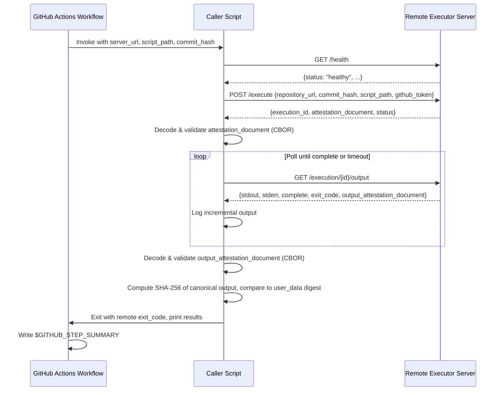

# Design Document: GitHub Actions Remote Executor Caller

## Overview

The GitHub Actions Remote Executor Caller is the client-side counterpart to the Remote Executor server. It consists of a GitHub Actions workflow (`call-remote-executor.yml`) and a Python caller script (`.github/scripts/call_remote_executor.py`) that together orchestrate the full lifecycle of a remote script execution: health check, submission, attestation validation, output polling, output integrity verification, and result reporting.

The caller is designed to be triggered manually via `workflow_dispatch`, targeting a specific Remote Executor server URL. It validates the server's NitroTPM attestation documents at two points: once when the execution request is accepted (server identity attestation) and again when the output is returned (output integrity attestation). This dual-attestation approach ensures both that the server is a genuine attested environment and that the output has not been tampered with in transit.

### Key Design Decisions

1. **Single Python script**: All client logic (HTTP calls, CBOR decoding, attestation validation, polling) lives in one `.github/scripts/call_remote_executor.py` file to keep the caller self-contained and easy to audit.
2. **`cbor2` for CBOR decoding**: The attestation documents are CBOR-encoded binary. We use the `cbor2` library (pure Python) for decoding rather than implementing CBOR parsing from scratch.
3. **`requests` for HTTP**: Simple synchronous HTTP client is sufficient since the caller performs sequential operations (health check → execute → poll loop).
4. **Canonical output format**: The server constructs `Script_Output` as `stdout:{stdout}\nstderr:{stderr}\nexit_code:{exit_code}`. The caller must replicate this exact format when computing the SHA-256 digest for output attestation verification.
5. **Exit code propagation**: The caller script exits with the remote script's exit code, allowing the GitHub Actions workflow to naturally fail when the remote script fails.

## Architecture



### Component Layout

```
.github/
  workflows/
    call-remote-executor.yml    # workflow_dispatch workflow
  scripts/
    sample-build.sh             # sample build script for remote execution
    call_remote_executor.py     # Python caller script
    pyproject.toml              # caller dependencies (requests, cbor2)
```

## Components and Interfaces

### 1. GitHub Actions Workflow (`call-remote-executor.yml`)

Responsibilities:
- Define `workflow_dispatch` inputs: `server_url` (required), `script_path` (optional, default `.github/scripts/sample-build.sh`), `commit_hash` (optional, default `${{ github.sha }}`)
- Validate that `server_url` is not empty
- Check out the repository
- Install Python dependencies from `.github/scripts/pyproject.toml`
- Invoke `.github/scripts/call_remote_executor.py` with the appropriate arguments and `GITHUB_TOKEN`
- Write a job summary to `$GITHUB_STEP_SUMMARY`

### 2. Caller Script (`.github/scripts/call_remote_executor.py`)

The script is structured as a `RemoteExecutorCaller` class with the following interface:

```python
class RemoteExecutorCaller:
    def __init__(self, server_url: str, timeout: int = 30,
                 poll_interval: int = 5, max_poll_duration: int = 600,
                 max_retries: int = 3):
        """Initialize caller with server URL and configuration."""

    def health_check(self) -> dict:
        """
        GET /health - verify server is healthy.
        Returns parsed JSON response.
        Raises CallerError if unhealthy or unreachable.
        """

    def execute(self, repository_url: str, commit_hash: str,
                script_path: str, github_token: str) -> dict:
        """
        POST /execute - submit execution request.
        Returns parsed JSON response with execution_id and attestation_document.
        Raises CallerError on HTTP errors or connection failures.
        """

    def validate_attestation(self, attestation_b64: str) -> dict:
        """
        Decode base64 → binary → CBOR. Validate structural fields.
        Returns parsed attestation document as dict.
        Raises CallerError on decode/parse/validation failures.
        """

    def poll_output(self, execution_id: str) -> dict:
        """
        Poll GET /execution/{id}/output until complete or timeout.
        Logs incremental output during polling.
        Returns final response with stdout, stderr, exit_code, output_attestation_document.
        Raises CallerError on timeout or repeated HTTP failures.
        """

    def validate_output_attestation(self, output_attestation_b64: str,
                                     stdout: str, stderr: str,
                                     exit_code: int) -> bool:
        """
        Decode output attestation CBOR, extract user_data digest.
        Compute SHA-256 of canonical output format.
        Compare digests. Returns True if match.
        Raises CallerError on decode/parse failures.
        """

    def run(self, repository_url: str, commit_hash: str,
            script_path: str, github_token: str) -> int:
        """
        Orchestrate full flow: health_check → execute → validate_attestation
        → poll_output → validate_output_attestation → report results.
        Returns remote script exit code.
        """
```

```python
class CallerError(Exception):
    """Raised when the caller encounters a fatal error."""
    def __init__(self, message: str, phase: str, details: dict | None = None):
        self.message = message
        self.phase = phase  # "health_check", "execute", "attestation", "polling", "output_attestation"
        self.details = details or {}
```

### 3. Sample Build Script (`.github/scripts/sample-build.sh`)

```bash
#!/usr/bin/env bash
set -euo pipefail
echo "=== Remote Executor Sample Build ==="
echo "Hostname: $(hostname)"
echo "Date: $(date -u)"
echo "Kernel: $(uname -r)"
echo "User: $(whoami)"
echo "Working directory: $(pwd)"
echo "=== Build Complete ==="
```

### 4. Attestation Validation Logic

The CBOR-decoded attestation document is expected to have these structural fields (based on NitroTPM attestation format):

```python
EXPECTED_ATTESTATION_FIELDS = [
    "module_id",    # Identifier of the attestation module
    "digest",       # Digest algorithm used
    "timestamp",    # When attestation was generated
    "pcrs",         # Platform Configuration Registers
    "certificate",  # Signing certificate
    "cabundle",     # Certificate authority bundle
]
```

Validation steps for server identity attestation (`validate_attestation`):
1. Base64-decode the `attestation_document` string to raw bytes
2. CBOR-decode the raw bytes into a Python dict
3. Verify all expected structural fields are present
4. Log field values for audit trail
5. Return the parsed dict

Validation steps for output integrity attestation (`validate_output_attestation`):
1. Base64-decode the `output_attestation_document` string to raw bytes
2. CBOR-decode the raw bytes into a Python dict
3. Extract the `user_data` field (contains SHA-256 hex digest)
4. Reconstruct the canonical `Script_Output`: `stdout:{stdout}\nstderr:{stderr}\nexit_code:{exit_code}`
5. Compute SHA-256 hex digest of the canonical output
6. Compare computed digest against `user_data` digest
7. Return True if they match, raise CallerError if they don't

## Data Models

### Workflow Dispatch Inputs

| Input | Type | Required | Default | Description |
|-------|------|----------|---------|-------------|
| `server_url` | string | yes | — | Base URL of the Remote Executor server |
| `script_path` | string | no | `.github/scripts/sample-build.sh` | Path to script in the repository |
| `commit_hash` | string | no | `${{ github.sha }}` | Git commit SHA to execute |

### API Request/Response Shapes (from server)

**POST /execute request:**
```json
{
  "repository_url": "https://github.com/owner/repo",
  "commit_hash": "abc123...",
  "script_path": ".github/scripts/sample-build.sh",
  "github_token": "ghp_..."
}
```

**POST /execute response:**
```json
{
  "execution_id": "uuid-v4",
  "attestation_document": "<base64-encoded-cbor>",
  "status": "queued"
}
```

**GET /execution/{id}/output response (complete):**
```json
{
  "execution_id": "uuid-v4",
  "status": "completed",
  "stdout": "...",
  "stderr": "...",
  "stdout_offset": 2048,
  "stderr_offset": 512,
  "complete": true,
  "exit_code": 0,
  "output_attestation_document": "<base64-encoded-cbor>"
}
```

**GET /health response:**
```json
{
  "status": "healthy",
  "attestation_available": true,
  "disk_space_mb": 10240,
  "active_executions": 0
}
```

### CBOR Attestation Document Structure

When decoded from CBOR, the attestation document is a map with these keys:

```python
{
    "module_id": str,        # e.g. "i-0abc123-enc0abc123"
    "digest": str,           # e.g. "SHA384"
    "timestamp": int,        # Unix epoch milliseconds
    "pcrs": dict,            # {0: bytes, 1: bytes, ...} PCR values
    "certificate": bytes,    # DER-encoded signing certificate
    "cabundle": list[bytes], # Certificate chain
    "user_data": str | None, # For output attestation: SHA-256 hex digest
    "nonce": str | None,     # Optional nonce
    "public_key": bytes | None,
}
```

### Canonical Script Output Format

The server constructs the canonical output as (from `src/server.py`):
```
stdout:{stdout_value}\nstderr:{stderr_value}\nexit_code:{exit_code_value}
```

The caller must replicate this exact format for SHA-256 digest comparison.


## Correctness Properties

*A property is a characteristic or behavior that should hold true across all valid executions of a system — essentially, a formal statement about what the system should do. Properties serve as the bridge between human-readable specifications and machine-verifiable correctness guarantees.*

### Property 1: Attestation decode round-trip

*For any* valid attestation document (a Python dict with string/bytes/int values), CBOR-encoding it, then base64-encoding the result, then passing that base64 string through `validate_attestation` should produce a dict equivalent to the original (for the fields the validator inspects). This also applies to `validate_output_attestation`'s decoding path.

**Validates: Requirements 4.1, 4.2, 6.1, 6.2**

### Property 2: Attestation structural field validation

*For any* Python dict representing a decoded attestation document, `validate_attestation` should accept it (not raise) if and only if all expected structural fields (`module_id`, `digest`, `timestamp`, `pcrs`, `certificate`, `cabundle`) are present as keys.

**Validates: Requirements 4.6**

### Property 3: Output integrity verification

*For any* stdout string, stderr string, and integer exit code, if an output attestation document's `user_data` field contains the SHA-256 hex digest of the canonical output `stdout:{stdout}\nstderr:{stderr}\nexit_code:{exit_code}`, then `validate_output_attestation` should return True. If any of stdout, stderr, or exit_code is altered after the digest was computed, `validate_output_attestation` should raise a `CallerError`.

**Validates: Requirements 6.3, 6.4, 6.5, 6.7**

### Property 4: Health check acceptance

*For any* health response JSON, `health_check` should succeed (not raise) if and only if the HTTP status is 200 and the `status` field equals `"healthy"`. For all other combinations of HTTP status or `status` field value, it should raise a `CallerError`.

**Validates: Requirements 8.2, 8.3**

### Property 5: Execute HTTP error propagation

*For any* HTTP error status code (4xx or 5xx), when the `/execute` endpoint returns that status, the `execute` method should raise a `CallerError` containing the status code and error details.

**Validates: Requirements 3.5**

### Property 6: Polling termination on completion

*For any* sequence of poll responses where the first N responses have `complete: false` and the (N+1)th response has `complete: true`, the `poll_output` method should make exactly N+1 HTTP requests and return the final response containing `stdout`, `stderr`, `exit_code`, and `output_attestation_document`.

**Validates: Requirements 5.3, 5.4**

### Property 7: Polling retry on transient errors

*For any* number of consecutive HTTP errors K where K < max_retries, followed by a successful response, `poll_output` should recover and continue polling. When K >= max_retries consecutive errors occur, `poll_output` should raise a `CallerError`.

**Validates: Requirements 5.7**

### Property 8: Exit code propagation

*For any* integer exit code returned by the remote script, the `run` method should return that same exit code, preserving the value exactly.

**Validates: Requirements 7.6**

### Property 9: Summary contains execution results

*For any* execution result (stdout, stderr, exit_code, attestation status, output integrity status), the generated GitHub Actions job summary string should contain the stdout content, stderr content, exit code value, attestation validation result, and output integrity verification result.

**Validates: Requirements 7.7**

## Error Handling

### Error Categories and Responses

| Phase | Error Condition | Behavior |
|-------|----------------|----------|
| Health Check | Server unreachable | Raise `CallerError(phase="health_check")`, workflow step fails |
| Health Check | Non-200 or status != "healthy" | Raise `CallerError(phase="health_check")`, workflow step fails |
| Execute | Connection error | Raise `CallerError(phase="execute")`, workflow step fails |
| Execute | HTTP 4xx/5xx | Raise `CallerError(phase="execute")` with status code and response body |
| Attestation | Invalid base64 | Raise `CallerError(phase="attestation")` with decoding details |
| Attestation | Invalid CBOR | Raise `CallerError(phase="attestation")` with parsing details |
| Attestation | Missing structural fields | Raise `CallerError(phase="attestation")` listing missing fields |
| Polling | HTTP error (transient) | Retry up to `max_retries` times, then raise `CallerError(phase="polling")` |
| Polling | Timeout exceeded | Raise `CallerError(phase="polling")` with elapsed duration |
| Output Attestation | Null/missing document | Log warning, continue (verification skipped) |
| Output Attestation | Invalid base64/CBOR | Raise `CallerError(phase="output_attestation")` |
| Output Attestation | Digest mismatch | Raise `CallerError(phase="output_attestation")` with both digests |

### Error Propagation Strategy

1. The `CallerError` exception carries `phase`, `message`, and `details` to provide structured error information.
2. The `run()` method catches `CallerError` and prints a formatted error message including the phase and details.
3. On any `CallerError`, the script exits with code 1 (unless the error occurs after output is received, in which case the remote exit code is used if available).
4. The GitHub Actions workflow step naturally fails when the script exits with a non-zero code.
5. All errors are logged to stderr so they appear in the GitHub Actions workflow log.

### Timeout Configuration

| Parameter | Default | Environment Variable |
|-----------|---------|---------------------|
| HTTP request timeout | 30 seconds | `CALLER_HTTP_TIMEOUT` |
| Poll interval | 5 seconds | `CALLER_POLL_INTERVAL` |
| Max poll duration | 600 seconds (10 min) | `CALLER_MAX_POLL_DURATION` |
| Max retries per poll | 3 | `CALLER_MAX_RETRIES` |

## Testing Strategy

### Dual Testing Approach

The caller uses both unit tests and property-based tests for comprehensive coverage:

- **Unit tests** (`tests/test_caller_unit.py`): Verify specific examples, edge cases, integration points, and error conditions. These cover workflow YAML structure, sample build script content, connection error handling, null attestation documents, and specific API response scenarios.
- **Property-based tests** (`tests/test_caller_properties.py`): Verify universal properties across randomly generated inputs using the Hypothesis library. Each property test runs a minimum of 100 iterations.

### Property-Based Testing Configuration

- **Library**: [Hypothesis](https://hypothesis.readthedocs.io/) (already in project dev dependencies)
- **CBOR library**: `cbor2` for encoding/decoding in tests
- **Minimum iterations**: 100 per property test (via `@settings(max_examples=100)`)
- **Each property test references its design property** with a tag comment in the format:
  `# Feature: gha-remote-executor-caller, Property {number}: {property_text}`
- **Each correctness property is implemented by a single property-based test**

### Test Plan

**Property-based tests** (one per correctness property):

1. **Attestation decode round-trip**: Generate random dicts with expected attestation fields, CBOR-encode + base64-encode, pass through `validate_attestation`, verify decoded output matches.
   `# Feature: gha-remote-executor-caller, Property 1: Attestation decode round-trip`

2. **Attestation structural field validation**: Generate random dicts with random subsets of expected fields, verify `validate_attestation` accepts iff all required fields present.
   `# Feature: gha-remote-executor-caller, Property 2: Attestation structural field validation`

3. **Output integrity verification**: Generate random stdout, stderr, exit_code. Compute canonical output and SHA-256 digest. Build a mock CBOR attestation with that digest in user_data. Verify `validate_output_attestation` returns True. Then mutate one of stdout/stderr/exit_code and verify it raises.
   `# Feature: gha-remote-executor-caller, Property 3: Output integrity verification`

4. **Health check acceptance**: Generate random HTTP status codes and random `status` field values. Verify `health_check` succeeds iff status code is 200 and status field is "healthy".
   `# Feature: gha-remote-executor-caller, Property 4: Health check acceptance`

5. **Execute HTTP error propagation**: Generate random 4xx/5xx status codes and response bodies. Verify `execute` raises `CallerError` with the status code.
   `# Feature: gha-remote-executor-caller, Property 5: Execute HTTP error propagation`

6. **Polling termination on completion**: Generate random N (0-20), create a mock that returns `complete: false` N times then `complete: true`. Verify exactly N+1 requests made and final response fields extracted.
   `# Feature: gha-remote-executor-caller, Property 6: Polling termination on completion`

7. **Polling retry on transient errors**: Generate random K < max_retries consecutive errors followed by success. Verify polling recovers. Generate K >= max_retries and verify CallerError raised.
   `# Feature: gha-remote-executor-caller, Property 7: Polling retry on transient errors`

8. **Exit code propagation**: Generate random integer exit codes (0-255). Mock the full run flow. Verify `run()` returns the same exit code.
   `# Feature: gha-remote-executor-caller, Property 8: Exit code propagation`

9. **Summary contains execution results**: Generate random execution results. Call summary generation. Verify the output string contains all expected fields.
   `# Feature: gha-remote-executor-caller, Property 9: Summary contains execution results`

**Unit tests** (specific examples and edge cases):

- Empty `server_url` raises error (Req 1.5)
- Sample build script file exists and is executable (Req 2.1)
- Sample build script contains system info commands (Req 2.4)
- Connection refused raises `CallerError` with phase "health_check" (Req 8.4)
- Connection refused raises `CallerError` with phase "execute" (Req 3.6)
- Null `output_attestation_document` logs warning and continues (Req 6.8)
- Invalid base64 in attestation raises `CallerError` (Req 4.3)
- Invalid CBOR in attestation raises `CallerError` (Req 4.4)
- Poll timeout raises `CallerError` after configured duration (Req 5.5, 5.6)
- Default poll interval is 5 seconds (Req 5.2)
- Default max poll duration is 600 seconds (Req 5.5)
