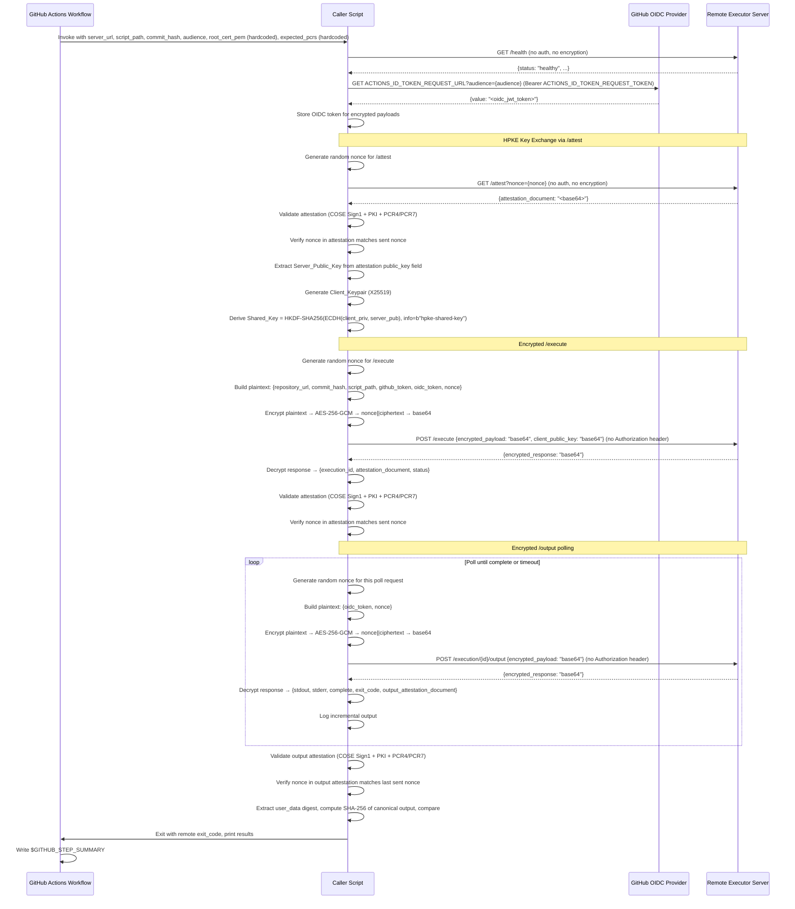

# Design Document: GitHub Actions Remote Executor Caller

## Overview

The GitHub Actions Remote Executor Caller is the client-side counterpart to the Remote Executor server. It consists of a GitHub Actions workflow (`call-remote-executor.yml`) and a Python caller script (`.github/scripts/call_remote_executor.py`) that together orchestrate the full lifecycle of a remote script execution: health check, OIDC token acquisition, server attestation and public key retrieval, HPKE key exchange, encrypted execution submission, attestation validation, encrypted output polling, output integrity verification, and result reporting.

The caller communicates with the Remote Executor server using HPKE-based encryption for all sensitive endpoints (`/execute` and `/execution/{id}/output`). It first obtains the server's X25519 public key via the unauthenticated `/attest` endpoint (which also returns a NitroTPM attestation document for server identity verification), generates a client-side X25519 keypair, derives a shared AES-256-GCM key via ECDH + HKDF-SHA256, and encrypts all request payloads (including the OIDC token) before transmission. The OIDC token is transmitted exclusively within the encrypted payload — no `Authorization` header is used on any request.

The caller validates the server's NitroTPM attestation documents at three points: (1) when the server's public key is retrieved via `/attest`, (2) when the execution request is accepted via `/execute`, and (3) when the output is returned via `/execution/{id}/output`. Each request includes a unique random nonce that is verified in the returned attestation document to ensure freshness and prevent replay attacks.

### Key Design Decisions

1. **Single Python script**: All client logic (HTTP calls, HPKE encryption, COSE Sign1 verification, attestation validation, polling) lives in one `.github/scripts/call_remote_executor.py` file to keep the caller self-contained and easy to audit.
2. **`cbor2` for CBOR decoding**: The attestation documents are COSE Sign1 structures encoded in CBOR. We use the `cbor2` library (pure Python) for decoding both the outer COSE structure and the inner attestation payload.
3. **`pycose` for COSE Sign1 verification**: The `pycose` library provides `Sign1Message` and `EC2` key types for verifying the COSE signature using the signing certificate's public key.
4. **`pyOpenSSL` for certificate chain validation**: The `OpenSSL.crypto` module provides `X509Store` and `X509StoreContext` for validating the signing certificate against the CA bundle and root certificate, matching the NitroTPM attestation verification pattern for attestable AMIs.
5. **`pycryptodome` for key parameter extraction**: The `Crypto.Util.number.long_to_bytes` utility converts the EC public key coordinates from integers to bytes for COSE key construction.
6. **`cryptography` for HPKE**: The `cryptography` library provides X25519 key generation, ECDH key exchange, HKDF-SHA256 key derivation, and AES-256-GCM encryption/decryption — all components needed for the HPKE encryption scheme.
7. **`requests` for HTTP**: Simple synchronous HTTP client is sufficient since the caller performs sequential operations (health check → OIDC → attest → execute → poll loop).
8. **Canonical output format**: The server constructs `Script_Output` as `stdout:{stdout}\nstderr:{stderr}\nexit_code:{exit_code}`. The caller must replicate this exact format when computing the SHA-256 digest for output attestation verification.
9. **Exit code propagation**: The caller script exits with the remote script's exit code, allowing the GitHub Actions workflow to naturally fail when the remote script fails.
10. **Hardcoded trust anchors**: The NitroTPM attestation root CA certificate PEM and expected PCR4/PCR7 values are hardcoded directly in the GitHub Actions workflow YAML. This eliminates the need for users to supply these values at dispatch time, ensuring every invocation performs full cryptographic verification.
11. **OIDC token in encrypted payload**: The caller acquires a GitHub Actions OIDC token and includes it in the `oidc_token` field of the encrypted request payload for `/execute` and `/execution/{id}/output`. No `Authorization` header is sent on any request. This ensures the token is protected by HPKE encryption in transit.
12. **Per-session HPKE keypair**: A fresh X25519 keypair is generated for each execution session. The keypair is held in memory only and never persisted to disk. The derived shared key is reused for all `/execution/{id}/output` requests within the same session.
13. **Mandatory nonces on all attested endpoints**: Every request to `/attest`, `/execute`, and `/execution/{id}/output` includes a unique random nonce. The caller verifies the nonce appears in the returned attestation document to ensure freshness.

## Architecture



### Component Layout

```
.github/
  workflows/
    call-remote-executor.yml    # workflow_dispatch workflow
  scripts/
    sample-build.sh             # sample build script for remote execution
    call_remote_executor.py     # Python caller script (HTTP, HPKE, attestation, polling)
    pyproject.toml              # caller dependencies (requests, cbor2, pycose, pyOpenSSL, pycryptodome, cryptography)
```

## Components and Interfaces

### 1. GitHub Actions Workflow (`call-remote-executor.yml`)

Responsibilities:
- Define `workflow_dispatch` inputs: `server_url` (required), `script_path` (optional, default `.github/scripts/sample-build.sh`), `commit_hash` (optional, default `${{ github.sha }}`), `audience` (optional, specifies the OIDC audience value)
- Declare `id-token: write` in the `permissions` block to enable OIDC token requests
- Hardcode the NitroTPM attestation root CA certificate PEM inline in the workflow YAML as an environment variable, and pass it to the caller script via `--root-cert-pem`
- Hardcode the expected PCR4 and PCR7 values as a JSON map inline in the workflow YAML, and pass it to the caller script via `--expected-pcrs`
- Pass the `audience` input to the caller script via `--audience`
- Validate that `server_url` is not empty
- Check out the repository
- Install Python dependencies from `.github/scripts/pyproject.toml`
- Invoke `.github/scripts/call_remote_executor.py` with the appropriate arguments and `GITHUB_TOKEN`
- Write a job summary to `$GITHUB_STEP_SUMMARY`

### 2. Caller Script (`.github/scripts/call_remote_executor.py`)

The script is structured as a `RemoteExecutorCaller` class with an `ClientEncryption` helper for HPKE operations:

```python
class ClientEncryption:
    """HPKE encryption helper for the caller side.
    
    Generates a client X25519 keypair, derives a shared AES-256-GCM key
    from the server's public key via ECDH + HKDF-SHA256, and provides
    encrypt/decrypt methods for request/response payloads.
    """

    def __init__(self):
        """Generate a fresh X25519 keypair for this session."""

    @property
    def client_public_key_bytes(self) -> bytes:
        """Return the raw 32-byte client public key for transmission."""

    def derive_shared_key(self, server_public_key_bytes: bytes) -> None:
        """
        Derive the Shared_Key from ECDH(client_private, server_public) + HKDF-SHA256.
        
        HKDF parameters: salt=None, info=b"hpke-shared-key", length=32.
        Stores the derived key for use by encrypt_payload/decrypt_response.
        
        Raises CallerError if server_public_key_bytes is not a valid 32-byte X25519 key.
        """

    def encrypt_payload(self, payload_dict: dict) -> str:
        """
        Serialize payload_dict to JSON, encrypt with AES-256-GCM using Shared_Key.
        
        Returns base64-encoded string of (12-byte random nonce || ciphertext).
        Raises CallerError if Shared_Key has not been derived yet.
        """

    def decrypt_response(self, encrypted_response_b64: str) -> dict:
        """
        Base64-decode, split into 12-byte nonce + ciphertext, decrypt with AES-256-GCM.
        
        Returns the deserialized JSON dict.
        Raises CallerError on decryption failure or invalid JSON.
        """
```

```python
class RemoteExecutorCaller:
    def __init__(self, server_url: str, timeout: int = 30,
                 poll_interval: int = 5, max_poll_duration: int = 600,
                 max_retries: int = 3,
                 root_cert_pem: str = "",
                 expected_pcrs: dict[int, str] | None = None,
                 audience: str = ""):
        """
        Initialize caller with server URL and configuration.
        
        Args:
            root_cert_pem: PEM-encoded AWS Nitro root CA certificate string.
                           Hardcoded in the workflow and always provided.
            expected_pcrs: Dict mapping PCR index (int) to expected hex value (str).
                           Hardcoded in the workflow for PCR4 and PCR7.
            audience: Audience value for OIDC token request. Must match the
                      Remote Executor server's expected audience configuration.
        """

    @staticmethod
    def generate_nonce() -> str:
        """
        Generate a unique random nonce string for attestation freshness verification.
        
        Returns a hex-encoded random string (e.g., 32 random bytes → 64 hex chars).
        Each call produces a unique value.
        """

    def request_oidc_token(self) -> str:
        """
        Request an OIDC token from GitHub's OIDC provider.
        
        Reads ACTIONS_ID_TOKEN_REQUEST_URL and ACTIONS_ID_TOKEN_REQUEST_TOKEN
        from environment variables. Makes an HTTP GET to the request URL with:
        - Header: Authorization: Bearer {ACTIONS_ID_TOKEN_REQUEST_TOKEN}
        - Query parameter: audience={self.audience}
        
        Extracts the JWT token from the response JSON 'value' field.
        Stores the token on self._oidc_token for use in encrypted payloads.
        
        Returns the OIDC JWT token string.
        Raises CallerError(phase="oidc") if env vars are missing or request fails.
        """

    def health_check(self) -> dict:
        """
        GET /health - verify server is healthy.
        Does NOT include Authorization header or any authentication.
        Returns parsed JSON response.
        Raises CallerError if unhealthy or unreachable.
        """

    def attest(self) -> bytes:
        """
        GET /attest?nonce={nonce} - retrieve server attestation and public key.
        
        Does NOT include Authorization header or any authentication.
        Generates a unique random nonce and includes it as a query parameter.
        Validates the returned attestation document (COSE Sign1 + PKI + PCR).
        Verifies the nonce in the attestation matches the sent nonce.
        Extracts the Server_Public_Key from the attestation's public_key field.
        
        Initializes self._encryption (ClientEncryption) and derives the Shared_Key.
        
        Returns the raw server public key bytes.
        Raises CallerError on validation failure, missing public_key, or connection error.
        """

    def execute(self, repository_url: str, commit_hash: str,
                script_path: str, github_token: str) -> dict:
        """
        POST /execute - submit encrypted execution request.
        
        Builds plaintext payload: {repository_url, commit_hash, script_path,
        github_token, oidc_token, nonce}.
        Encrypts with Shared_Key via ClientEncryption.
        Sends JSON body: {encrypted_payload: "base64", client_public_key: "base64"}.
        No Authorization header.
        
        Decrypts the encrypted response to extract execution_id and attestation_document.
        Validates the attestation and verifies the nonce matches.
        
        Returns parsed decrypted response dict.
        Raises CallerError on HTTP errors, encryption/decryption failures, or attestation failures.
        """

    def validate_attestation(self, attestation_b64: str, expected_nonce: str | None = None) -> dict:
        """
        Full attestation verification:
        1. Decode base64 → binary → CBOR → COSE Sign1 array [phdr, uhdr, payload, sig]
        2. CBOR-decode payload to extract attestation fields
        3. Validate structural fields (module_id, digest, timestamp, pcrs, certificate, cabundle)
        4. Validate certificate chain (PKI) against hardcoded root cert
        5. Verify COSE Sign1 signature using signing certificate's EC2 public key (P-384/ES384)
        6. Validate PCR4 and PCR7 values against hardcoded expected values
        7. If expected_nonce is provided, verify the nonce field in the attestation matches
        Returns parsed attestation payload dict.
        Raises CallerError on any verification failure.
        """

    def _verify_certificate_chain(self, cert_der: bytes, cabundle: list[bytes]) -> None:
        """
        Validate the signing certificate against the CA bundle and root certificate.
        Constructs an X509Store with root_cert_pem and intermediate certs from cabundle.
        Raises CallerError if certificate chain validation fails.
        """

    def _verify_cose_signature(self, cose_array: list) -> None:
        """
        Verify the COSE Sign1 signature using the signing certificate's public key.
        Extracts EC2 key parameters (x, y on P-384) from the certificate.
        Constructs a Sign1Message and verifies the signature with ES384.
        Raises CallerError if signature verification fails.
        """

    def _validate_pcrs(self, document_pcrs: dict) -> None:
        """
        Compare expected PCR values (PCR4 and PCR7) against those in the attestation document.
        Raises CallerError if any expected PCR is missing or mismatched.
        """

    def _verify_nonce(self, payload_doc: dict, expected_nonce: str, phase: str) -> None:
        """
        Verify the nonce field in the attestation payload matches the expected nonce.
        Raises CallerError if the nonce is missing or does not match.
        """

    def poll_output(self, execution_id: str) -> dict:
        """
        Poll POST /execution/{id}/output until complete or timeout.
        
        Each poll request:
        - Generates a unique random nonce
        - Builds plaintext: {oidc_token, nonce}
        - Encrypts with Shared_Key via ClientEncryption
        - Sends JSON body: {encrypted_payload: "base64"} (no client_public_key)
        - No Authorization header
        - Decrypts the encrypted response
        
        On final response (complete=true), verifies the nonce in the
        output_attestation_document matches the nonce sent in that request.
        
        Logs incremental output during polling.
        Returns final decrypted response with stdout, stderr, exit_code,
        output_attestation_document.
        Raises CallerError on timeout, repeated HTTP failures, or decryption errors.
        """

    def validate_output_attestation(self, output_attestation_b64: str,
                                     stdout: str, stderr: str,
                                     exit_code: int,
                                     expected_nonce: str | None = None) -> bool:
        """
        Full output attestation verification:
        1. Decode base64 → COSE Sign1 → attestation payload (same as validate_attestation)
        2. Validate certificate chain (PKI) against hardcoded root cert
        3. Verify COSE Sign1 signature
        4. Validate PCR4 and PCR7 values against hardcoded expected values
        5. If expected_nonce provided, verify nonce in attestation matches
        6. Extract user_data from verified payload (SHA-256 hex digest)
        7. Compute SHA-256 of canonical output format
        8. Compare digests
        Returns True if match. Raises CallerError on any failure.
        """

    def run(self, repository_url: str, commit_hash: str,
            script_path: str, github_token: str) -> int:
        """
        Orchestrate full flow:
        health_check → request_oidc_token → attest (get server public key + derive shared key)
        → execute (encrypted) → validate_attestation → poll_output (encrypted)
        → validate_output_attestation → report results.
        Returns remote script exit code.
        """
```

```python
class CallerError(Exception):
    """Raised when the caller encounters a fatal error."""
    def __init__(self, message: str, phase: str, details: dict | None = None):
        self.message = message
        self.phase = phase  # "health_check", "execute", "attestation", "polling",
                            # "output_attestation", "oidc", "attest", "encryption"
        self.details = details or {}
```

### 3. Sample Build Script (`.github/scripts/sample-build.sh`)

```bash
#!/usr/bin/env bash
set -euo pipefail
echo "=== Remote Executor Sample Build ==="
echo "Hostname: $(hostname)"
echo "Date: $(date -u)"
echo "Kernel: $(uname -r)"
echo "User: $(whoami)"
echo "Working directory: $(pwd)"
echo "=== Build Complete ==="
```

### 4. ClientEncryption Implementation Details

The `ClientEncryption` class mirrors the server's `EncryptionManager` (from `src/encryption.py`) but from the client perspective:

**Key Generation:**
- Uses `cryptography.hazmat.primitives.asymmetric.x25519.X25519PrivateKey.generate()` to create a fresh keypair
- Serializes the public key via `public_key.public_bytes(Encoding.Raw, PublicFormat.Raw)` → 32 bytes

**Key Derivation (must match server exactly):**
```python
from cryptography.hazmat.primitives.asymmetric.x25519 import X25519PrivateKey, X25519PublicKey
from cryptography.hazmat.primitives.kdf.hkdf import HKDF
from cryptography.hazmat.primitives.hashes import SHA256
from cryptography.hazmat.primitives.ciphers.aead import AESGCM

# ECDH shared secret
shared_secret = client_private_key.exchange(server_public_key)

# HKDF-SHA256 derivation (must match server: salt=None, info=b"hpke-shared-key", length=32)
shared_key = HKDF(
    algorithm=SHA256(),
    length=32,
    salt=None,
    info=b"hpke-shared-key",
).derive(shared_secret)
```

**Encryption (request payloads):**
```python
plaintext = json.dumps(payload_dict).encode("utf-8")
nonce = os.urandom(12)  # 12-byte random nonce for AES-GCM
ciphertext = AESGCM(shared_key).encrypt(nonce, plaintext, None)
wire_bytes = nonce + ciphertext  # nonce (12 bytes) || ciphertext
encrypted_payload_b64 = base64.b64encode(wire_bytes).decode("ascii")
```

**Decryption (response payloads):**
```python
wire_bytes = base64.b64decode(encrypted_response_b64)
nonce = wire_bytes[:12]
ciphertext = wire_bytes[12:]
plaintext = AESGCM(shared_key).decrypt(nonce, ciphertext, None)
response_dict = json.loads(plaintext.decode("utf-8"))
```

### 5. Attestation Validation Logic

The attestation document is a COSE Sign1 structure. When base64-decoded and CBOR-decoded, it yields a 4-element array:

```python
# Outer COSE Sign1 structure (after first CBOR decode)
cose_array = cbor2.loads(raw_bytes)
# cose_array[0] = protected header (CBOR-encoded bytes)
# cose_array[1] = unprotected header (map, typically empty)
# cose_array[2] = payload (CBOR-encoded attestation document bytes)
# cose_array[3] = signature (bytes)
```

The payload (index 2) is itself CBOR-encoded and contains the attestation fields:

```python
EXPECTED_ATTESTATION_FIELDS = [
    "module_id",    # Identifier of the attestation module
    "digest",       # Digest algorithm used (e.g. "SHA384")
    "timestamp",    # When attestation was generated (Unix epoch ms)
    "pcrs",         # Platform Configuration Registers {index: bytes}
    "certificate",  # DER-encoded signing certificate (bytes)
    "cabundle",     # Certificate authority bundle (list[bytes])
]
```

Validation steps for server identity attestation (`validate_attestation`):

**Step 1: COSE Sign1 Parsing**
1. Base64-decode the `attestation_document` string to raw bytes
2. CBOR-decode the raw bytes — result must be a list/array of exactly 4 elements
3. CBOR-decode element at index 2 (payload) to get the attestation fields dict
4. Verify all `EXPECTED_ATTESTATION_FIELDS` are present as keys in the payload dict

**Step 2: Certificate Chain (PKI) Validation**
1. Create an `OpenSSL.crypto.X509Store`
2. Load the `root_cert_pem` as a PEM certificate and add to the store
3. For each certificate in `cabundle[1:]` (skipping the first/root entry), load as DER and add to the store
4. Load the `certificate` field from the payload as a DER certificate
5. Create an `X509StoreContext` with the store and the signing certificate
6. Call `verify_certificate()` — raises on failure

**Step 3: COSE Signature Verification**
1. Load the signing certificate and extract its public key's `public_numbers()` (x, y coordinates)
2. Convert x and y from integers to bytes using `long_to_bytes`
3. Construct a `pycose.EC2` key with `alg=ES384`, `crv=P_384`, and the x/y bytes
4. CBOR-decode the protected header from `cose_array[0]`
5. Construct a `pycose.Sign1Message` with `phdr`, `uhdr=cose_array[1]`, `payload=cose_array[2]`
6. Set `msg.signature = cose_array[3]`
7. Call `msg.verify_signature(key)` — raise CallerError if it returns False

**Step 4: PCR Validation**
1. For each `(index, expected_hex)` in `expected_pcrs` (PCR4 and PCR7):
   - Verify the index exists in the payload's `pcrs` dict and is not None
   - Convert the document PCR bytes to hex: `document_pcrs[index].hex()`
   - Compare against `expected_hex` — raise CallerError on mismatch

**Step 5: Nonce Verification**
1. If `expected_nonce` is provided:
   - Extract the `nonce` field from the attestation payload
   - Decode from bytes to string if necessary
   - Compare against `expected_nonce` — raise CallerError on mismatch or if nonce is missing

**Step 6: Audit Logging**
1. Log attestation field values for audit trail
2. Return the parsed payload dict

Validation steps for output integrity attestation (`validate_output_attestation`):
1. Perform Steps 1–5 above on the output attestation document (same COSE Sign1 verification + nonce check)
2. Extract the `user_data` field from the verified payload (CBOR-decoded, then `.decode()` to string — contains SHA-256 hex digest)
3. Reconstruct the canonical `Script_Output`: `stdout:{stdout}\nstderr:{stderr}\nexit_code:{exit_code}`
4. Compute SHA-256 hex digest of the canonical output
5. Compare computed digest against `user_data` digest
6. Return True if they match, raise CallerError if they don't

## Data Models

### Workflow Dispatch Inputs

| Input | Type | Required | Default | Description |
|-------|------|----------|---------|-------------|
| `server_url` | string | yes | — | Base URL of the Remote Executor server |
| `script_path` | string | no | `.github/scripts/sample-build.sh` | Path to script in the repository |
| `commit_hash` | string | no | `${{ github.sha }}` | Git commit SHA to execute |
| `audience` | string | no | — | Audience value for OIDC token request, must match server's expected audience |

### Workflow Permissions

| Permission | Value | Description |
|------------|-------|-------------|
| `id-token` | `write` | Required to request OIDC tokens from GitHub's OIDC provider |

### Hardcoded Workflow Constants

The following values are hardcoded inline in the workflow YAML definition (not user inputs):

| Constant | Description |
|----------|-------------|
| `ROOT_CERT_PEM` | NitroTPM attestation root CA certificate in PEM format, embedded as a multi-line string in the workflow env |
| `EXPECTED_PCRS` | JSON map `{"4": "<hex>", "7": "<hex>"}` containing expected PCR4 and PCR7 values for the attestable AMI |

### API Request/Response Shapes

**GET /health request:**
- No request body, no Authorization header

**GET /health response:**
```json
{
  "status": "healthy",
  "attestation_available": true,
  "disk_space_mb": 10240,
  "active_executions": 0
}
```

**GET /attest?nonce={nonce} request:**
- No request body, no Authorization header
- Query parameter: `nonce` (random hex string for freshness verification)

**GET /attest response:**
```json
{
  "attestation_document": "<base64-encoded-cbor>"
}
```

The attestation document's payload contains the `public_key` field (raw X25519 server public key bytes) and the `nonce` field (the nonce sent in the query parameter).

**POST /execute request (encrypted envelope):**
```json
{
  "encrypted_payload": "<base64-encoded nonce||ciphertext>",
  "client_public_key": "<base64-encoded raw 32-byte X25519 public key>"
}
```
No Authorization header.

Plaintext payload (before encryption):
```json
{
  "repository_url": "https://github.com/owner/repo",
  "commit_hash": "abc123...",
  "script_path": ".github/scripts/sample-build.sh",
  "github_token": "ghp_...",
  "oidc_token": "<jwt_token>",
  "nonce": "<random_hex_string>"
}
```

**POST /execute response (encrypted):**
```json
{
  "encrypted_response": "<base64-encoded nonce||ciphertext>"
}
```

Decrypted response payload:
```json
{
  "execution_id": "uuid-v4",
  "attestation_document": "<base64-encoded-cbor>",
  "status": "queued"
}
```

**POST /execution/{id}/output request (encrypted):**
```json
{
  "encrypted_payload": "<base64-encoded nonce||ciphertext>"
}
```
No Authorization header. No `client_public_key` (server already has the shared key from the execution context).

Plaintext payload (before encryption):
```json
{
  "oidc_token": "<jwt_token>",
  "nonce": "<random_hex_string>"
}
```

**POST /execution/{id}/output response (encrypted, complete):**
```json
{
  "encrypted_response": "<base64-encoded nonce||ciphertext>"
}
```

Decrypted response payload:
```json
{
  "execution_id": "uuid-v4",
  "status": "completed",
  "stdout": "...",
  "stderr": "...",
  "stdout_offset": 2048,
  "stderr_offset": 512,
  "complete": true,
  "exit_code": 0,
  "output_attestation_document": "<base64-encoded-cbor>"
}
```

### OIDC Token Request/Response (GitHub OIDC Provider)

**GET {ACTIONS_ID_TOKEN_REQUEST_URL}?audience={audience} request headers:**
```
Authorization: Bearer {ACTIONS_ID_TOKEN_REQUEST_TOKEN}
```

**OIDC token response:**
```json
{
  "value": "<jwt_token_string>"
}
```

### HPKE Encryption Parameters

| Parameter | Value | Description |
|-----------|-------|-------------|
| Key type | X25519 | Elliptic curve Diffie-Hellman key agreement |
| Key derivation | HKDF-SHA256 | `salt=None`, `info=b"hpke-shared-key"`, `length=32` |
| Symmetric cipher | AES-256-GCM | 256-bit key, 12-byte random nonce, authenticated encryption |
| Wire format | `nonce (12 bytes) \|\| ciphertext` | Concatenated, then base64-encoded |
| Client public key format | Raw X25519 | 32 bytes, base64-encoded for transmission |

### COSE Sign1 Attestation Document Structure

The attestation document is a COSE Sign1 structure. After base64-decoding and the first CBOR decode, it is a 4-element array:

```python
# Outer COSE Sign1 structure
[
    protected_header,    # bytes (CBOR-encoded map, e.g. {1: -35} for ES384)
    unprotected_header,  # map (typically empty {})
    payload,             # bytes (CBOR-encoded attestation document)
    signature,           # bytes (ECDSA signature over the payload)
]
```

After CBOR-decoding the payload (index 2), the attestation document is a map with these keys:

```python
{
    "module_id": str,        # e.g. "i-0abc123-enc0abc123"
    "digest": str,           # e.g. "SHA384"
    "timestamp": int,        # Unix epoch milliseconds
    "pcrs": dict,            # {0: bytes, 1: bytes, ...} PCR values
    "certificate": bytes,    # DER-encoded signing certificate (X.509, P-384 EC key)
    "cabundle": list[bytes], # Certificate chain (DER-encoded), first entry is root CA
    "user_data": bytes | None, # For output attestation: SHA-256 hex digest (UTF-8 encoded)
    "nonce": bytes | None,   # Nonce for freshness verification (UTF-8 encoded)
    "public_key": bytes | None, # For /attest: raw X25519 server public key (32 bytes)
}
```

The signing certificate uses an EC key on the P-384 (secp384r1) curve. The COSE signature algorithm is ES384.

### Canonical Script Output Format

The server constructs the canonical output as (from `src/server.py`):
```
stdout:{stdout_value}\nstderr:{stderr_value}\nexit_code:{exit_code_value}
```

The caller must replicate this exact format for SHA-256 digest comparison.

## Correctness Properties

*A property is a characteristic or behavior that should hold true across all valid executions of a system — essentially, a formal statement about what the system should do. Properties serve as the bridge between human-readable specifications and machine-verifiable correctness guarantees.*

### Property 1: COSE Sign1 attestation decode round-trip

*For any* valid attestation payload dict (with expected structural fields including `nonce` and `public_key`), constructing a COSE Sign1 structure (wrapping the CBOR-encoded payload in a 4-element array with a protected header, empty unprotected header, and a valid test signature), CBOR-encoding the outer structure, base64-encoding the result, then passing that base64 string through `validate_attestation` (signed with a matching test key) should produce a payload dict equivalent to the original for the structural fields the validator inspects, including the `nonce` and `public_key` fields.

**Validates: Requirements 4A.1, 4A.2, 4A.3, 6A.1, 6A.2, 6A.3, 11.5**

### Property 2: Attestation structural field validation

*For any* Python dict representing a decoded attestation payload, `validate_attestation` should accept it (not raise on structural grounds) if and only if all expected structural fields (`module_id`, `digest`, `timestamp`, `pcrs`, `certificate`, `cabundle`) are present as keys.

**Validates: Requirements 4A.7**

### Property 3: Output integrity verification

*For any* stdout string, stderr string, and integer exit code, if an output attestation document's `user_data` field contains the SHA-256 hex digest of the canonical output `stdout:{stdout}\nstderr:{stderr}\nexit_code:{exit_code}`, then `validate_output_attestation` should return True (assuming signature verification passes). If any of stdout, stderr, or exit_code is altered after the digest was computed, `validate_output_attestation` should raise a `CallerError`.

**Validates: Requirements 6B.8, 6B.9, 6B.10, 6B.12**

### Property 4: Health check acceptance

*For any* health response JSON, `health_check` should succeed (not raise) if and only if the HTTP status is 200 and the `status` field equals `"healthy"`. For all other combinations of HTTP status or `status` field value, it should raise a `CallerError`.

**Validates: Requirements 8.2, 8.3**

### Property 5: Execute HTTP error propagation

*For any* HTTP error status code (4xx or 5xx), when the `/execute` endpoint returns that status, the `execute` method should raise a `CallerError` containing the status code and error details.

**Validates: Requirements 3.8**

### Property 6: Polling termination on completion

*For any* sequence of encrypted poll responses where the first N decrypted responses have `complete: false` and the (N+1)th decrypted response has `complete: true`, the `poll_output` method should make exactly N+1 HTTP POST requests (each with an encrypted payload) and return the final decrypted response containing `stdout`, `stderr`, `exit_code`, and `output_attestation_document`.

**Validates: Requirements 5.6, 5.7**

### Property 7: Polling retry on transient errors

*For any* number of consecutive HTTP errors K where K < max_retries, followed by a successful response, `poll_output` should recover and continue polling. When K >= max_retries consecutive errors occur, `poll_output` should raise a `CallerError`.

**Validates: Requirements 5.10**

### Property 8: Exit code propagation

*For any* integer exit code returned by the remote script, the `run` method should return that same exit code, preserving the value exactly.

**Validates: Requirements 7.6**

### Property 9: Summary contains execution results

*For any* execution result (stdout, stderr, exit_code, attestation status, output integrity status), the generated GitHub Actions job summary string should contain the stdout content, stderr content, exit code value, attestation validation result, and output integrity verification result.

**Validates: Requirements 7.7**

### Property 10: COSE signature verification rejects tampered payloads

*For any* valid COSE Sign1 attestation document (signed with a test EC P-384 key), if the payload bytes are modified after signing (even a single byte change), `_verify_cose_signature` should raise a `CallerError` indicating signature verification failure.

**Validates: Requirements 4C.15, 4C.16**

### Property 11: PCR validation accepts matching and rejects mismatching values

*For any* set of expected PCR values (dict of int→hex string) and a document PCR dict, `_validate_pcrs` should accept if and only if every expected PCR index exists in the document and the hex-encoded value matches exactly. Missing indices or mismatched values should raise a `CallerError`.

**Validates: Requirements 4D.17, 4D.18, 4D.19**

### Property 12: Certificate chain validation rejects untrusted certificates

*For any* signing certificate not chained to the configured root CA, `_verify_certificate_chain` should raise a `CallerError`. Conversely, a certificate properly chained through the cabundle to the root CA should pass validation.

**Validates: Requirements 4B.8, 4B.11, 4B.12**

### Property 13: OIDC token acquisition

*For any* audience string and valid OIDC provider response containing a JWT token in the `value` field, `request_oidc_token` should make an HTTP GET to `ACTIONS_ID_TOKEN_REQUEST_URL` with the `audience` query parameter set to the configured audience and an `Authorization: Bearer {ACTIONS_ID_TOKEN_REQUEST_TOKEN}` header, and should store the returned token for reuse in subsequent encrypted payloads.

**Validates: Requirements 9.3, 9.4, 9.7**

### Property 14: OIDC token in encrypted payload, not in headers

*For any* OIDC token stored on the caller instance, `execute` and `poll_output` should include the token in the `oidc_token` field of the encrypted request payload. No HTTP request to any endpoint (`/health`, `/attest`, `/execute`, `/execution/{id}/output`) should include an `Authorization` header.

**Validates: Requirements 10.1, 10.2, 10.3, 10.4, 10.5**

### Property 15: OIDC authentication error handling

*For any* HTTP 401 or 403 response from the Remote Executor server on `/execute` or `/execution/{id}/output`, the caller should raise a `CallerError` with an appropriate error message: "authentication failure" for 401 and "repository is not authorized" for 403. For any missing `ACTIONS_ID_TOKEN_REQUEST_URL` or `ACTIONS_ID_TOKEN_REQUEST_TOKEN` environment variable, `request_oidc_token` should raise a `CallerError` indicating that `id-token: write` permission is required.

**Validates: Requirements 9.5, 9.6, 10.6, 10.7**

### Property 16: AES-256-GCM encryption round-trip

*For any* JSON-serializable Python dict and any valid 32-byte AES key, encrypting the dict via `ClientEncryption.encrypt_payload` and then decrypting the result via `ClientEncryption.decrypt_response` using the same shared key should produce a dict equal to the original.

**Validates: Requirements 3.2, 14.1, 15.3, 15.4, 15.5**

### Property 17: HPKE key derivation symmetry

*For any* X25519 client keypair and X25519 server keypair, deriving the shared key on the client side (ECDH(client_private, server_public) → HKDF-SHA256) and on the server side (ECDH(server_private, client_public) → HKDF-SHA256) with the same HKDF parameters (`salt=None`, `info=b"hpke-shared-key"`, `length=32`) should produce identical 32-byte shared keys.

**Validates: Requirements 13.1, 13.2**

### Property 18: Nonce freshness verification

*For any* random nonce string, if the attestation document's `nonce` field matches the sent nonce, `validate_attestation` (with `expected_nonce` set) should accept. If the attestation document's `nonce` field differs from the sent nonce (or is missing), `validate_attestation` should raise a `CallerError`.

**Validates: Requirements 3.11, 3.12, 3.13, 5.13, 5.14, 11.3, 11.11, 11.12**

### Property 19: Encrypted envelope structure

*For any* request to `/execute`, the HTTP request body should be a JSON object with exactly `encrypted_payload` and `client_public_key` fields (both base64-encoded strings). *For any* request to `/execution/{id}/output`, the HTTP request body should be a JSON object with exactly `encrypted_payload` (base64-encoded string) and no `client_public_key` field.

**Validates: Requirements 3.1, 14.6, 14.7**

### Property 20: AES-256-GCM decryption rejects tampered ciphertext

*For any* valid encrypted payload (produced by `ClientEncryption.encrypt_payload`), if any byte of the base64-decoded wire format (nonce || ciphertext) is modified, `ClientEncryption.decrypt_response` should raise a `CallerError` indicating decryption failure.

**Validates: Requirements 15.6**

## Error Handling

### Error Categories and Responses

| Phase | Error Condition | Behavior |
|-------|----------------|----------|
| OIDC | `ACTIONS_ID_TOKEN_REQUEST_URL` not set | Raise `CallerError(phase="oidc")` indicating `id-token: write` permission required |
| OIDC | `ACTIONS_ID_TOKEN_REQUEST_TOKEN` not set | Raise `CallerError(phase="oidc")` indicating `id-token: write` permission required |
| OIDC | OIDC provider request fails (HTTP error or connection error) | Raise `CallerError(phase="oidc")` with failure details |
| Health Check | Server unreachable | Raise `CallerError(phase="health_check")`, workflow step fails |
| Health Check | Non-200 or status != "healthy" | Raise `CallerError(phase="health_check")`, workflow step fails |
| Attest | Server unreachable | Raise `CallerError(phase="attest")`, workflow step fails |
| Attest | HTTP error status | Raise `CallerError(phase="attest")` with status code and response body |
| Attest | Attestation validation failure (COSE/PKI/PCR) | Raise `CallerError(phase="attest")` with validation details |
| Attest | Nonce mismatch in attestation | Raise `CallerError(phase="attest")` indicating nonce verification failure |
| Attest | Missing `public_key` in attestation payload | Raise `CallerError(phase="attest")` indicating server did not provide a public key |
| Attest | Invalid server public key (not 32-byte X25519) | Raise `CallerError(phase="encryption")` indicating invalid server public key |
| Encryption | Shared key not yet derived | Raise `CallerError(phase="encryption")` indicating key exchange not completed |
| Encryption | AES-256-GCM encryption failure | Raise `CallerError(phase="encryption")` with encryption error details |
| Decryption | Base64 decode failure on encrypted_response | Raise `CallerError(phase="encryption")` with decoding details |
| Decryption | AES-256-GCM decryption failure (invalid key, tampered ciphertext, corrupt nonce) | Raise `CallerError(phase="encryption")` with decryption error |
| Decryption | Decrypted bytes not valid JSON | Raise `CallerError(phase="encryption")` with deserialization error |
| Execute | Connection error | Raise `CallerError(phase="execute")`, workflow step fails |
| Execute | HTTP 401 Unauthorized | Raise `CallerError(phase="execute")` with authentication failure message |
| Execute | HTTP 403 Forbidden | Raise `CallerError(phase="execute")` with repository not authorized message |
| Execute | HTTP 4xx/5xx (other) | Raise `CallerError(phase="execute")` with status code and response body |
| Execute | Nonce mismatch in attestation from /execute response | Raise `CallerError(phase="attestation")` indicating nonce verification failure |
| Attestation | Invalid base64 | Raise `CallerError(phase="attestation")` with decoding details |
| Attestation | Invalid CBOR or not a 4-element array | Raise `CallerError(phase="attestation")` with COSE Sign1 structure error |
| Attestation | Payload CBOR decode failure | Raise `CallerError(phase="attestation")` with payload parsing details |
| Attestation | Missing structural fields | Raise `CallerError(phase="attestation")` listing missing fields |
| Attestation | Certificate chain validation failure | Raise `CallerError(phase="attestation")` with PKI validation details |
| Attestation | COSE signature verification failure | Raise `CallerError(phase="attestation")` with signature error |
| Attestation | PCR value missing or mismatch | Raise `CallerError(phase="attestation")` identifying the PCR index |
| Attestation | Nonce missing or mismatch | Raise `CallerError(phase="attestation")` with expected vs actual nonce |
| Polling | HTTP error (transient) | Retry up to `max_retries` times, then raise `CallerError(phase="polling")` |
| Polling | HTTP 401 Unauthorized | Raise `CallerError(phase="polling")` with authentication failure message (no retry) |
| Polling | HTTP 403 Forbidden | Raise `CallerError(phase="polling")` with repository not authorized message (no retry) |
| Polling | Decryption failure on poll response | Raise `CallerError(phase="polling")` with decryption error details |
| Polling | Timeout exceeded | Raise `CallerError(phase="polling")` with elapsed duration |
| Output Attestation | Null/missing document | Log warning, continue (verification skipped) |
| Output Attestation | Invalid base64/CBOR/COSE structure | Raise `CallerError(phase="output_attestation")` |
| Output Attestation | Certificate chain validation failure | Raise `CallerError(phase="output_attestation")` with PKI details |
| Output Attestation | COSE signature verification failure | Raise `CallerError(phase="output_attestation")` with signature error |
| Output Attestation | PCR value missing or mismatch | Raise `CallerError(phase="output_attestation")` identifying the PCR index |
| Output Attestation | Nonce missing or mismatch | Raise `CallerError(phase="output_attestation")` with expected vs actual nonce |
| Output Attestation | Digest mismatch | Raise `CallerError(phase="output_attestation")` with both digests |

### Error Propagation Strategy

1. The `CallerError` exception carries `phase`, `message`, and `details` to provide structured error information.
2. The `run()` method catches `CallerError` and prints a formatted error message including the phase and details.
3. On any `CallerError`, the script exits with code 1 (unless the error occurs after output is received, in which case the remote exit code is used if available).
4. The GitHub Actions workflow step naturally fails when the script exits with a non-zero code.
5. All errors are logged to stderr so they appear in the GitHub Actions workflow log.
6. If the `/attest` step fails, the caller fails immediately before attempting any encrypted requests.

### Timeout Configuration

| Parameter | Default | Environment Variable |
|-----------|---------|---------------------|
| HTTP request timeout | 30 seconds | `CALLER_HTTP_TIMEOUT` |
| Poll interval | 5 seconds | `CALLER_POLL_INTERVAL` |
| Max poll duration | 600 seconds (10 min) | `CALLER_MAX_POLL_DURATION` |
| Max retries per poll | 3 | `CALLER_MAX_RETRIES` |

## Testing Strategy

### Dual Testing Approach

The caller uses both unit tests and property-based tests for comprehensive coverage:

- **Unit tests** (`tests/test_caller_unit.py`): Verify specific examples, edge cases, integration points, and error conditions. These cover workflow YAML structure, sample build script content, connection error handling, null attestation documents, specific API response scenarios, and encryption edge cases.
- **Property-based tests** (`tests/test_caller_properties.py`): Verify universal properties across randomly generated inputs using the Hypothesis library. Each property test runs a minimum of 100 iterations.

### Property-Based Testing Configuration

- **Library**: [Hypothesis](https://hypothesis.readthedocs.io/) (already in project dev dependencies)
- **CBOR library**: `cbor2` for encoding/decoding in tests
- **COSE library**: `pycose` for constructing test COSE Sign1 messages
- **Crypto libraries**: `pyOpenSSL`, `cryptography` for generating test certificates, keys, and HPKE operations
- **Minimum iterations**: 100 per property test (via `@settings(max_examples=100)`)
- **Each property test references its design property** with a tag comment in the format:
  `# Feature: gha-remote-executor-caller, Property {number}: {property_text}`
- **Each correctness property is implemented by a single property-based test**
- **Test key fixtures**: Property tests that involve COSE signature verification use a shared test EC P-384 key pair fixture. Property tests involving HPKE use test X25519 keypairs.

### Test Plan

**Property-based tests** (one per correctness property):

1. **COSE Sign1 attestation decode round-trip**: Generate random dicts with expected attestation fields (including `nonce` and `public_key`), wrap in a COSE Sign1 structure (signed with a test P-384 key), CBOR-encode + base64-encode, pass through `validate_attestation` with matching `expected_nonce`, verify decoded payload matches original fields.
   `# Feature: gha-remote-executor-caller, Property 1: COSE Sign1 attestation decode round-trip`

2. **Attestation structural field validation**: Generate random dicts with random subsets of expected fields, verify `validate_attestation` accepts iff all required fields present (with COSE Sign1 wrapping and test signature).
   `# Feature: gha-remote-executor-caller, Property 2: Attestation structural field validation`

3. **Output integrity verification**: Generate random stdout, stderr, exit_code. Compute canonical output and SHA-256 digest. Build a COSE Sign1 attestation with that digest in user_data (signed with test key). Verify `validate_output_attestation` returns True. Then mutate one of stdout/stderr/exit_code and verify it raises.
   `# Feature: gha-remote-executor-caller, Property 3: Output integrity verification`

4. **Health check acceptance**: Generate random HTTP status codes and random `status` field values. Verify `health_check` succeeds iff status code is 200 and status field is "healthy".
   `# Feature: gha-remote-executor-caller, Property 4: Health check acceptance`

5. **Execute HTTP error propagation**: Generate random 4xx/5xx status codes and response bodies. Verify `execute` raises `CallerError` with the status code.
   `# Feature: gha-remote-executor-caller, Property 5: Execute HTTP error propagation`

6. **Polling termination on completion**: Generate random N (0-20), create a mock that returns encrypted `complete: false` N times then encrypted `complete: true`. Verify exactly N+1 POST requests made and final decrypted response fields extracted.
   `# Feature: gha-remote-executor-caller, Property 6: Polling termination on completion`

7. **Polling retry on transient errors**: Generate random K < max_retries consecutive errors followed by success. Verify polling recovers. Generate K >= max_retries and verify CallerError raised.
   `# Feature: gha-remote-executor-caller, Property 7: Polling retry on transient errors`

8. **Exit code propagation**: Generate random integer exit codes (0-255). Mock the full run flow (including HPKE key exchange). Verify `run()` returns the same exit code.
   `# Feature: gha-remote-executor-caller, Property 8: Exit code propagation`

9. **Summary contains execution results**: Generate random execution results. Call summary generation. Verify the output string contains all expected fields.
   `# Feature: gha-remote-executor-caller, Property 9: Summary contains execution results`

10. **COSE signature verification rejects tampered payloads**: Generate random attestation payloads, sign with a test P-384 key, then modify the payload bytes. Verify `_verify_cose_signature` raises CallerError.
    `# Feature: gha-remote-executor-caller, Property 10: COSE signature verification rejects tampered payloads`

11. **PCR validation accepts matching and rejects mismatching values**: Generate random PCR dicts (index→bytes). Generate expected_pcrs that match a subset, verify acceptance. Then mutate one expected value or add a missing index, verify rejection.
    `# Feature: gha-remote-executor-caller, Property 11: PCR validation accepts matching and rejects mismatching values`

12. **Certificate chain validation rejects untrusted certificates**: Generate a test root CA and signing certificate chain. Verify `_verify_certificate_chain` accepts. Then use a different root CA and verify rejection.
    `# Feature: gha-remote-executor-caller, Property 12: Certificate chain validation rejects untrusted certificates`

13. **OIDC token acquisition**: Generate random audience strings. Mock the OIDC provider endpoint. Verify `request_oidc_token` makes an HTTP GET to `ACTIONS_ID_TOKEN_REQUEST_URL` with the correct `audience` query parameter and `Authorization: Bearer {ACTIONS_ID_TOKEN_REQUEST_TOKEN}` header, and that the returned token is stored on the instance.
    `# Feature: gha-remote-executor-caller, Property 13: OIDC token acquisition`

14. **OIDC token in encrypted payload, not in headers**: Generate random OIDC tokens. Set the token on the caller instance. Mock HTTP endpoints and HPKE encryption. Verify `execute` and `poll_output` include the token in the encrypted payload's `oidc_token` field. Verify NO HTTP request to any endpoint includes an `Authorization` header.
    `# Feature: gha-remote-executor-caller, Property 14: OIDC token in encrypted payload, not in headers`

15. **OIDC authentication error handling**: Generate random 401 and 403 HTTP responses for `/execute` and `/execution/{id}/output`. Verify the caller raises `CallerError` with appropriate auth error messages. Also test missing `ACTIONS_ID_TOKEN_REQUEST_URL` and `ACTIONS_ID_TOKEN_REQUEST_TOKEN` env vars cause `CallerError` with `id-token: write` permission message.
    `# Feature: gha-remote-executor-caller, Property 15: OIDC authentication error handling`

16. **AES-256-GCM encryption round-trip**: Generate random JSON-serializable dicts and random 32-byte AES keys. Encrypt via `ClientEncryption.encrypt_payload`, decrypt via `ClientEncryption.decrypt_response` with the same key. Verify the result equals the original dict.
    `# Feature: gha-remote-executor-caller, Property 16: AES-256-GCM encryption round-trip`

17. **HPKE key derivation symmetry**: Generate random X25519 keypairs for both client and server. Derive the shared key on both sides using ECDH + HKDF-SHA256 with `salt=None`, `info=b"hpke-shared-key"`, `length=32`. Verify both sides produce identical 32-byte keys.
    `# Feature: gha-remote-executor-caller, Property 17: HPKE key derivation symmetry`

18. **Nonce freshness verification**: Generate random nonce strings. Build attestation documents with matching and non-matching nonces. Verify `validate_attestation` with `expected_nonce` accepts when nonces match and raises `CallerError` when they differ or the nonce field is missing.
    `# Feature: gha-remote-executor-caller, Property 18: Nonce freshness verification`

19. **Encrypted envelope structure**: Generate random payloads. Call `execute` (mocked HTTP) and verify the request body is JSON with `encrypted_payload` and `client_public_key` fields. Call `poll_output` (mocked HTTP) and verify the request body is JSON with `encrypted_payload` only (no `client_public_key`).
    `# Feature: gha-remote-executor-caller, Property 19: Encrypted envelope structure`

20. **AES-256-GCM decryption rejects tampered ciphertext**: Generate random dicts, encrypt via `ClientEncryption.encrypt_payload`. Modify a random byte in the base64-decoded wire format. Verify `ClientEncryption.decrypt_response` raises a `CallerError`.
    `# Feature: gha-remote-executor-caller, Property 20: AES-256-GCM decryption rejects tampered ciphertext`

**Unit tests** (specific examples and edge cases):

- Empty `server_url` raises error (Req 1.5)
- Sample build script file exists and is executable (Req 2.1)
- Sample build script contains system info commands (Req 2.4)
- Connection refused raises `CallerError` with phase "health_check" (Req 8.4)
- Connection refused raises `CallerError` with phase "execute" (Req 3.9)
- Connection refused raises `CallerError` with phase "attest" (Req 11.9)
- Null `output_attestation_document` logs warning and continues (Req 6C.13)
- Invalid base64 in attestation raises `CallerError` (Req 4A.4)
- Invalid CBOR in attestation raises `CallerError` (Req 4A.5)
- CBOR result that is not a 4-element array raises `CallerError` with COSE structure error (Req 4A.5)
- Payload CBOR decode failure raises `CallerError` (Req 4A.6)
- Certificate chain validation failure raises `CallerError` with PKI details (Req 4B.12)
- COSE signature verification failure raises `CallerError` (Req 4C.16)
- PCR index missing from attestation raises `CallerError` (Req 4D.18)
- PCR value mismatch raises `CallerError` (Req 4D.19)
- Poll timeout raises `CallerError` after configured duration (Req 5.8, 5.9)
- Default poll interval is 5 seconds (Req 5.4)
- Default max poll duration is 600 seconds (Req 5.8)
- Missing `ACTIONS_ID_TOKEN_REQUEST_URL` raises `CallerError` with phase "oidc" (Req 9.5)
- Missing `ACTIONS_ID_TOKEN_REQUEST_TOKEN` raises `CallerError` with phase "oidc" (Req 9.5)
- OIDC provider returns HTTP error raises `CallerError` with phase "oidc" (Req 9.6)
- Execute with HTTP 401 raises `CallerError` with authentication failure message (Req 10.6)
- Execute with HTTP 403 raises `CallerError` with repository not authorized message (Req 10.7)
- Poll output with HTTP 401 raises `CallerError` with authentication failure message (Req 10.6)
- Poll output with HTTP 403 raises `CallerError` with repository not authorized message (Req 10.7)
- No Authorization header on any HTTP request (Req 10.3)
- Health check does not include OIDC token (Req 10.4)
- Attest does not include OIDC token or Authorization header (Req 10.5, 11.2)
- Workflow YAML contains `id-token: write` permission (Req 9.1)
- Workflow YAML contains `audience` input (Req 9.2)
- Missing `public_key` in /attest attestation raises `CallerError` (Req 11.7)
- Invalid server public key (not 32 bytes) raises `CallerError` (Req 13.5)
- Decryption failure on tampered response raises `CallerError` with phase "encryption" (Req 15.6)
- Decrypted response that is not valid JSON raises `CallerError` (Req 15.7)
- Attest failure prevents encrypted requests from being sent (Req 16.6)
- /health and /attest requests have no request body (Req 16.4, 16.5)
