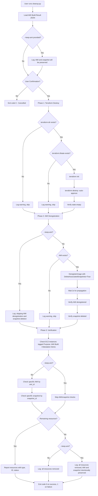
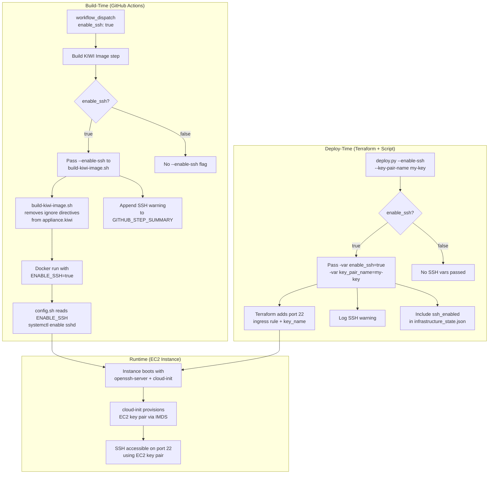

# Design Document: GitHub Actions Remote Executor

## Overview

The GitHub Actions Remote Executor is an HTTP server that runs on an Attestable EC2 instance with NitroTPM, providing a secure and attestable environment for executing scripts from GitHub repositories. The system receives execution requests from GitHub Actions workflows, generates cryptographic attestation documents proving the execution environment, and executes scripts inside ephemeral Docker containers asynchronously while allowing clients to poll for output and status. Each script execution runs in a newly created Docker container that is destroyed after completion, ensuring complete isolation between executions.

This design document covers five major aspects of the system:

1. **Runtime Design**: How the Remote Executor operates when deployed - the HTTP server, request handling, script execution, attestation generation, and output polling mechanisms.

2. **Build Design**: How the attestable AMI containing the Remote Executor is built - the GitHub Actions workflow that builds a KIWI image in a reproducible Docker environment, attests build artifacts using GitHub's attestation service, publishes them to GitHub Container Registry with PCR measurements, and converts the KIWI image to an AWS AMI using a temporary EC2 instance that verifies signatures before AMI creation.

3. **Deployment Design**: How the built attestable AMI is deployed as a running target EC2 instance - provisioning an isolated VPC with network infrastructure, configuring security groups for HTTP-only access, launching the instance with NitroTPM and IMDSv2, and automating the deployment via a Python script that orchestrates Terraform and persists infrastructure state.

4. **Cleanup Design**: How all AWS resources created during the build and deployment process are removed - loading resource identifiers from the AMI build result file, destroying Terraform-managed infrastructure, deregistering the AMI and associated EBS snapshot, and verifying all resources have been cleaned up.

5. **Debug Design**: How optional SSH debug access is enabled across the build and deployment pipeline - adding a `workflow_dispatch` input to the GitHub Actions workflow, modifying the KIWI image build to conditionally include SSH packages, and extending the deploy script and Terraform to open port 22 and attach an EC2 key pair when debug access is requested.

### Key Design Principles

1. **Asynchronous Execution Model**: Requests return immediately with an execution ID and attestation document, while script execution proceeds in the background
2. **Polling-based Output Retrieval**: Clients poll a separate endpoint to retrieve incremental output rather than maintaining long HTTP connections
3. **Ephemeral Docker Container Isolation**: Each script execution runs inside a newly created Docker container from a configured Container_Image; containers are never reused and are destroyed after completion, failure, or timeout
4. **Attestable Environment**: NitroTPM-based attestation on the Attestable EC2 instance provides cryptographic proof of the execution environment
5. **Stateless Request Handling**: Each request is independent, with execution state stored separately

### Architecture Goals

- Support concurrent execution of multiple scripts
- Provide verifiable proof of execution environment through attestation
- Enable reliable output retrieval through polling
- Maintain execution tracking and monitoring capabilities

### Python Dependency Management

The project maintains separate Python dependency configurations:

- **Remote Executor (pyproject.toml)**: Contains dependencies for the HTTP service (fastapi, uvicorn, requests, docker) that runs in the KIWI image. The remote executor does NOT use boto3.
- **Build Scripts (scripts/pyproject.toml)**: Contains dependencies for build and deployment scripts (boto3, paramiko) used during AMI creation. These are NOT installed in the KIWI image.

This separation ensures the KIWI image only contains libraries needed for the remote executor service, keeping it minimal and focused.

---

# PART 1: RUNTIME DESIGN

## Architecture

### System Components

The system consists of the following major components:

```
┌─────────────────────────────────────────────────────────────┐
│                     GitHub Actions Workflow                  │
└────────────┬────────────────────────────────┬────────────────┘
             │ POST /execute                  │ GET /execution/{id}/output
             │                                │
┌────────────▼────────────────────────────────▼────────────────┐
│                        HTTP Server                            │
│  ┌──────────────────┐  ┌──────────────────┐                 │
│  │ Request Handler  │  │ Output Handler   │                 │
│  └────────┬─────────┘  └────────┬─────────┘                 │
└───────────┼─────────────────────┼───────────────────────────┘
            │                     │
┌───────────▼─────────────────────▼───────────────────────────┐
│                    Core Services Layer                        │
│  ┌──────────────┐  ┌──────────────┐  ┌──────────────┐      │
│  │   Request    │  │  Repository  │  │ Attestation  │      │
│  │  Validator   │  │    Client    │  │  Generator   │      │
│  └──────────────┘  └──────────────┘  └──────────────┘      │
└───────────────────────────────────────────────────────────────┘
            │                     │                     │
┌───────────▼─────────────────────▼─────────────────────▼─────┐
│                   Execution Management Layer                  │
│  ┌──────────────┐  ┌──────────────┐  ┌──────────────┐      │
│  │  Execution   │  │    Script    │  │    Output    │      │
│  │   Manager    │  │   Executor   │  │  Collector   │      │
│  └──────────────┘  └──┬───────┬──┘  └──────────────┘      │
│                        │       │                             │
│              ┌─────────▼───────▼──────────┐                 │
│              │     Docker Daemon (SDK)     │                 │
│              │  ┌────────┐  ┌────────┐    │                 │
│              │  │Container│  │Container│   │                 │
│              │  │ exec-1  │  │ exec-2 │   │                 │
│              │  └────────┘  └────────┘    │                 │
│              └────────────────────────────┘                 │
└───────────────────────────────────────────────────────────────┘
            │                     │                     │
┌───────────▼─────────────────────▼─────────────────────▼─────┐
│                    Storage Layer                              │
│  ┌──────────────┐  ┌──────────────┐                         │
│  │  Execution   │  │  Temporary   │                         │
│  │    Store     │  │   Storage    │                         │
│  └──────────────┘  └──────────────┘                         │
└───────────────────────────────────────────────────────────────┘
```

### Component Responsibilities

**HTTP Server**
- Listens for incoming HTTP requests on configured port
- Routes requests to appropriate handlers
- Manages concurrent connections
- Implements rate limiting per source IP

**Request Handler**
- Parses and validates execution requests
- Coordinates repository file retrieval
- Generates attestation documents
- Creates execution records
- Initiates asynchronous script execution
- Returns immediate response with execution ID and attestation

**Output Handler**
- Retrieves execution status and output by execution ID
- Supports offset-based output retrieval
- Returns completion status and exit codes
- When execution is complete, generates an Output_Attestation_Document containing a SHA-256 digest of the Script_Output in the user_data field
- Returns Output_Attestation_Document in base64 encoding alongside Script_Output and Attestation_Document
- If Output_Attestation_Document generation fails, still returns Script_Output and Attestation_Document with an error field

**Request Validator**
- Validates OIDC JWT tokens on protected endpoints (/execute, /execution/{id}/output)
- Fetches and caches GitHub's OIDC provider JWKS from `https://token.actions.githubusercontent.com/.well-known/jwks`
- Verifies JWT signature against JWKS; refreshes cache on unknown key ID
- Validates JWT claims: `iss` matches `https://token.actions.githubusercontent.com`, `aud` matches configured Expected_Audience, `repository` matches an entry in configured Allowed_Repositories, `exp` is not past current time
- Returns 401 for missing/invalid/expired tokens and signature failures; returns 403 for valid tokens from unauthorized repositories
- Does NOT require authentication for /health endpoint
- Validates request structure and required fields
- Validates repository URL format
- Validates Git commit SHA format
- Validates script file path
- Validates file size limits

**Repository Client**
- Clones the entire repository at the specified commit into a temporary directory under `temp_storage_path` using `git clone --depth 1`
- Authenticates using the GitHub token embedded in the clone URL (`https://{token}@github.com/owner/repo.git`)
- Checks out the exact commit after cloning
- Validates the script file exists within the cloned repository
- Returns the path to the cloned repository directory and the relative script path
- Handles clone failures (authentication errors, repository not found, network errors)
- Cleans up cloned repository directories after execution

**Attestation Generator**
- Interfaces with the NitroTPM on the Attestable EC2 instance via the `nitro-tpm-attest` command-line tool
- Creates attestation documents with execution metadata
- Signs documents using NitroTPM cryptographic capabilities
- Encodes attestation in standard format (CBOR)
- Implementation approach (based on `demo_api.py::AttestationAPIHandler.generate_attestation_document()`):
  1. Accepts optional user_data and nonce parameters for inclusion in attestation
  2. Writes user_data and nonce to temporary files if provided
  3. Invokes `/usr/bin/nitro-tpm-attest` with optional `--user-data` and `--nonce` flags
  4. Captures binary CBOR-encoded attestation document from stdout
  5. Implements 30-second timeout for attestation generation
  6. Returns attestation document as bytes or detailed error information
  7. Cleans up temporary files in finally block
  8. Error handling includes: subprocess failures, timeouts, and OS errors
  9. Error responses include command, exit code, stdout, stderr, and context for debugging

**Execution Manager**
- Generates unique execution IDs
- Maintains execution state (queued, running, completed, failed, timed_out)
- Manages execution lifecycle
- Implements execution timeout handling
- Cleans up completed executions after retention period

**Script Executor**
- Creates a new ephemeral Docker container (Execution_Container) from the configured Container_Image for each script execution using the Docker SDK (`docker` Python package)
- Assigns a unique container name derived from the Execution_ID to each container
- Configures containers with security constraints: memory limits, CPU limits, read-only root filesystem (with a writable execution directory via tmpfs), network disabled, no privilege escalation, non-root user
- Mounts the cloned repository directory read-only into the container at `/workspace` using Docker volumes
- Sets the container working directory to `/workspace` so the script can reference sibling files
- Executes the script via `command=["sh", "/workspace/{script_path}"]` where `script_path` is the relative path within the repo
- Captures stdout and stderr streams from the container
- Monitors execution progress and enforces timeout
- Removes the container and its resources after completion, failure, or timeout
- Never reuses a container for more than one execution
- Verifies container removal after destruction
- Cleans up any dangling containers matching the naming convention on startup
- Records exit codes

**Output Collector**
- Captures streaming output from script execution
- Stores output incrementally
- Supports offset-based retrieval
- Manages output retention

**Execution Store**
- Persists execution metadata and state
- Stores output data
- Provides query interface by execution ID
- Implements retention policy

**Temporary Storage**
- Manages temporary storage for cloned repository directories
- Provides isolated directories per execution
- Handles cleanup of cloned repos after execution

### Request Flow

**Execution Request Flow:**

1. Client sends POST request to `/execute` with repository URL, commit hash, script path, GitHub token, and Bearer OIDC_Token in Authorization header
2. Request Validator validates the OIDC_Token (signature via JWKS, iss, aud, repository, exp claims)
3. Request Handler validates request structure
4. Request Validator validates all request body fields
5. Repository Client authenticates and clones the repository at the specified commit into a temporary directory
6. Attestation Generator creates attestation document with execution metadata
7. Execution Manager creates execution record with unique ID
8. Response returned immediately with execution ID and attestation document
9. Script Executor creates a new Docker container from the configured Container_Image and begins asynchronous execution inside it
10. Output Collector captures stdout/stderr streams from the container
11. Execution Manager updates status upon completion; container is removed

**Output Polling Flow:**

1. Client sends GET request to `/execution/{id}/output` with optional offset parameter and Bearer OIDC_Token in Authorization header
2. Request Validator validates the OIDC_Token (signature via JWKS, iss, aud, repository, exp claims)
3. Output Handler retrieves execution record by ID
4. Output Collector returns current status, output from offset, and completion flag
5. If complete, Output Handler computes SHA-256 digest of the Script_Output and generates an Output_Attestation_Document with the digest in user_data
6. If complete, response includes Script_Output, Attestation_Document, Output_Attestation_Document, and exit code
7. If Output_Attestation_Document generation fails, response still includes Script_Output and Attestation_Document with an attestation_error field
8. Client repeats polling until execution completes
9. Client can verify output integrity by comparing SHA-256 of returned Script_Output against the digest in Output_Attestation_Document's user_data

### Concurrency Model

- HTTP server handles multiple concurrent connections using async I/O (FastAPI with uvicorn)
- Each execution runs in a separate ephemeral Docker container (Execution_Container) created from the configured Container_Image
- Containers are never reused — each execution gets a fresh container that is destroyed after completion, failure, or timeout
- Execution state stored in thread-safe in-memory data structure
- Output collection uses buffered writes to avoid blocking
- Maximum concurrent Execution_Containers configurable to prevent resource exhaustion
- Docker daemon manages container lifecycle and resource isolation

## Components and Interfaces

### HTTP API Endpoints

#### POST /execute

Initiates script execution and returns attestation document.

**Request Body:**
```json
{
  "repository_url": "https://github.com/owner/repo",
  "commit_hash": "abc123def456...",
  "script_path": "scripts/build.sh",
  "github_token": "ghp_..."
}
```

**Response (200 OK):**
```json
{
  "execution_id": "uuid-v4",
  "attestation_document": "base64-encoded-cbor",
  "status": "queued"
}
```

**Error Responses:**
- 400 Bad Request: Malformed request or validation failure
- 401 Unauthorized: Missing/invalid/expired OIDC token, signature verification failure, invalid iss or aud claim
- 403 Forbidden: Valid OIDC token from an unauthorized repository
- 404 Not Found: Repository, commit, or file not found
- 413 Payload Too Large: Script file exceeds size limit
- 429 Too Many Requests: Rate limit exceeded
- 500 Internal Server Error: Attestation or system failure

#### GET /execution/{execution_id}/output

Retrieves execution status and output.

**Query Parameters:**
- `offset` (optional): Byte offset to start retrieving output from

**Response (200 OK):**
```json
{
  "execution_id": "uuid-v4",
  "status": "running|completed|failed|timed_out",
  "stdout": "output text...",
  "stderr": "error text...",
  "stdout_offset": 1024,
  "stderr_offset": 256,
  "complete": false,
  "exit_code": null
}
```

When complete:
```json
{
  "execution_id": "uuid-v4",
  "status": "completed",
  "stdout": "output text...",
  "stderr": "error text...",
  "stdout_offset": 2048,
  "stderr_offset": 512,
  "complete": true,
  "exit_code": 0,
  "output_attestation_document": "base64-encoded-cbor"
}
```

When complete but Output_Attestation_Document generation fails:
```json
{
  "execution_id": "uuid-v4",
  "status": "completed",
  "stdout": "output text...",
  "stderr": "error text...",
  "stdout_offset": 2048,
  "stderr_offset": 512,
  "complete": true,
  "exit_code": 0,
  "output_attestation_document": null,
  "attestation_error": "Failed to generate output attestation document"
}
```

**Error Responses:**
- 401 Unauthorized: Missing/invalid/expired OIDC token, signature verification failure, invalid iss or aud claim
- 403 Forbidden: Valid OIDC token from an unauthorized repository
- 404 Not Found: Execution ID does not exist

#### GET /health

Health check endpoint for monitoring.

**Response (200 OK):**
```json
{
  "status": "healthy",
  "attestation_available": true,
  "docker_available": true,
  "disk_space_mb": 10240,
  "active_executions": 3
}
```

#### GET /metrics

Metrics endpoint for monitoring.

**Response (200 OK):**
```json
{
  "total_executions": 1523,
  "successful_executions": 1450,
  "failed_executions": 73,
  "average_duration_ms": 3421,
  "active_executions": 3
}
```

### Internal Interfaces

#### RequestValidator Interface

```python
class RequestValidator:
    def __init__(self, allowed_repositories: list[str], expected_audience: str):
        """Initialize with OIDC configuration"""
        pass

    def validate_oidc_token(self, authorization_header: str | None) -> OIDCValidationResult:
        """
        Validates the OIDC Bearer token from the Authorization header.
        Fetches JWKS from GitHub's OIDC provider, verifies JWT signature,
        and validates iss, aud, repository, and exp claims.
        Returns 401 for missing/invalid/expired tokens, 403 for unauthorized repos.
        """
        pass

    def _fetch_jwks(self, force_refresh: bool = False) -> dict:
        """
        Fetches JWKS from https://token.actions.githubusercontent.com/.well-known/jwks
        Caches the result; refreshes when force_refresh=True (e.g., unknown key ID).
        """
        pass

    def validate_execution_request(self, request: dict) -> ValidationResult:
        """Validates execution request structure and fields"""
        pass
    
    def validate_repository_url(self, url: str) -> bool:
        """Validates GitHub repository URL format"""
        pass
    
    def validate_commit_hash(self, hash: str) -> bool:
        """Validates Git commit SHA format"""
        pass
    
    def validate_script_path(self, path: str) -> bool:
        """Validates script file path"""
        pass
```

#### RepositoryClient Interface

```python
class RepositoryClient:
    def authenticate(self, token: str) -> AuthResult:
        """Authenticates with GitHub using token"""
        pass
    
    def clone_repo(self, repo_url: str, commit: str, token: str) -> CloneResult:
        """Clones repository at specific commit into temp directory"""
        pass
    
    def validate_script_exists(self, clone_path: str, script_path: str) -> bool:
        """Validates script file exists within cloned repo"""
        pass
    
    def cleanup_clone(self, clone_path: str) -> None:
        """Removes cloned repository directory"""
        pass
```

#### AttestationGenerator Interface

```python
class AttestationGenerator:
    def generate_attestation(self, metadata: ExecutionMetadata) -> AttestationDocument:
        """Generates signed attestation document"""
        pass
    
    def verify_tpm_available(self) -> bool:
        """Checks if NitroTPM device is available"""
        pass
```

#### ExecutionManager Interface

```python
class ExecutionManager:
    def create_execution(self, request: ExecutionRequest) -> ExecutionID:
        """Creates new execution record"""
        pass
    
    def get_execution(self, execution_id: str) -> ExecutionRecord:
        """Retrieves execution record by ID"""
        pass
    
    def update_status(self, execution_id: str, status: ExecutionStatus) -> None:
        """Updates execution status"""
        pass
    
    def cleanup_expired(self) -> None:
        """Removes executions past retention period"""
        pass
```

#### ScriptExecutor Interface

```python
import docker

class ScriptExecutor:
    def __init__(self, docker_client: docker.DockerClient, container_image: str,
                 memory_limit: str, cpu_limit: float, timeout_seconds: int):
        """
        Initialize with Docker client and container configuration.
        
        Args:
            docker_client: Docker SDK client instance
            container_image: Name of the Container_Image to use for Execution_Containers
            memory_limit: Docker memory constraint (e.g., '512m')
            cpu_limit: Docker CPU constraint (e.g., 1.0 for one CPU)
            timeout_seconds: Maximum execution timeout
        """
        pass

    def execute_async(self, execution_id: str, repo_path: str, script_path: str) -> None:
        """
        Creates a new Execution_Container from Container_Image, mounts the
        cloned repository directory read-only at /workspace, and executes the
        script asynchronously. The container is assigned a unique name derived
        from the execution_id.
        """
        pass

    def terminate(self, execution_id: str) -> None:
        """Stops and removes the Execution_Container for the given execution"""
        pass

    def cleanup_dangling_containers(self) -> None:
        """
        Removes any dangling Execution_Containers on startup that match
        the container naming convention.
        """
        pass

    def verify_container_removed(self, execution_id: str) -> bool:
        """Verifies the container no longer exists on the Docker host"""
        pass

    def verify_docker_daemon(self) -> bool:
        """Checks if the Docker daemon is accessible"""
        pass
```

#### OutputCollector Interface

```python
class OutputCollector:
    def capture_output(self, execution_id: str, stream: str, data: bytes) -> None:
        """Captures output data from execution"""
        pass
    
    def get_output(self, execution_id: str, offset: int = 0) -> OutputData:
        """Retrieves output from specified offset"""
        pass
```

## Data Models

### ExecutionRequest

```python
@dataclass
class ExecutionRequest:
    repository_url: str
    commit_hash: str
    script_path: str
    github_token: str
```

### ExecutionRecord

```python
@dataclass
class ExecutionRecord:
    execution_id: str
    repository_url: str
    commit_hash: str
    script_path: str
    status: ExecutionStatus
    created_at: datetime
    started_at: Optional[datetime]
    completed_at: Optional[datetime]
    exit_code: Optional[int]
    timeout_seconds: int
```

### ExecutionStatus

```python
class ExecutionStatus(Enum):
    QUEUED = "queued"
    RUNNING = "running"
    COMPLETED = "completed"
    FAILED = "failed"
    TIMED_OUT = "timed_out"
```

### AttestationDocument

```python
@dataclass
class AttestationDocument:
    repository_url: str
    commit_hash: str
    script_path: str
    timestamp: datetime
    signature: bytes  # CBOR-encoded NitroTPM attestation
```

### OutputData

```python
@dataclass
class OutputData:
    stdout: str
    stderr: str
    stdout_offset: int
    stderr_offset: int
    complete: bool
    exit_code: Optional[int]
```

### Configuration

```python
@dataclass
class ServerConfig:
    port: int
    max_concurrent_executions: int
    execution_timeout_seconds: int
    max_script_size_bytes: int
    rate_limit_per_ip: int
    rate_limit_window_seconds: int
    temp_storage_path: str
    output_retention_hours: int
    tpm_attest_path: str
    allowed_repositories: list[str]
    expected_audience: str
    container_image: str  # Docker image name for Execution_Containers
    container_memory_limit: str  # Docker memory constraint (e.g., '512m')
    container_cpu_limit: float  # Docker CPU constraint (e.g., 1.0)
```

### OIDCValidationResult

```python
@dataclass
class OIDCValidationResult:
    valid: bool
    status_code: int  # 200 on success, 401 or 403 on failure
    error_message: str | None
    claims: dict | None  # Decoded JWT claims on success
```

### OIDCTokenClaims

```python
@dataclass
class OIDCTokenClaims:
    iss: str       # Must be https://token.actions.githubusercontent.com
    aud: str       # Must match Expected_Audience
    repository: str  # Must match an entry in Allowed_Repositories
    exp: int       # Unix timestamp, must not be expired
    sub: str       # Subject (e.g., repo:owner/repo:ref:refs/heads/main)
```

### CloneResult

```python
@dataclass
class CloneResult:
    clone_path: str      # Path to cloned repository directory
    script_path: str     # Relative path to script within repo
```


## Correctness Properties

*A property is a characteristic or behavior that should hold true across all valid executions of a system-essentially, a formal statement about what the system should do. Properties serve as the bridge between human-readable specifications and machine-verifiable correctness guarantees.*

### Property 1: Valid Request Acceptance

*For any* execution request containing a valid repository URL, commit hash, script file path, and GitHub token, the server should accept and process the request.

**Validates: Requirements 1.3**

### Property 2: Malformed Request Rejection

*For any* malformed request body, the Request Validator should return HTTP 400 with a descriptive error message.

**Validates: Requirements 1.4**

### Property 3: Concurrent Request Handling

*For any* set of concurrent execution requests, the server should handle all requests without blocking or failure.

**Validates: Requirements 1.5**

### Property 4: Required Field Validation

*For any* execution request with one or more missing required fields (repository_url, commit_hash, script_path, github_token), the Request Validator should reject the request and return HTTP 400.

**Validates: Requirements 2.1, 2.6**

### Property 5: Repository URL Format Validation

*For any* invalid repository URL format, the Request Validator should reject the request and return HTTP 400.

**Validates: Requirements 2.2**

### Property 6: Commit Hash Format Validation

*For any* invalid Git commit SHA format, the Request Validator should reject the request and return HTTP 400.

**Validates: Requirements 2.3**

### Property 7: Validation Error Response

*For any* validation failure, the Request Validator should return HTTP 400 with specific validation error details.

**Validates: Requirements 2.5**

### Property 8: OIDC Token Required on Protected Endpoints

*For any* request to `/execute` or `/execution/{id}/output` without a valid Bearer OIDC_Token in the Authorization header, the server should reject the request with HTTP 401 Unauthorized.

**Validates: Requirements 2.1, 2.2, 2.3**

### Property 9: Exact Commit File Retrieval

*For any* valid repository, commit hash, and file path, the Repository Client should fetch the file content that exists at that exact commit.

**Validates: Requirements 3.2**

### Property 10: OIDC Token Signature Verification

*For any* OIDC_Token whose signature cannot be verified against the JWKS fetched from GitHub's OIDC provider, the Request Validator should reject the request with HTTP 401 Unauthorized.

**Validates: Requirements 2.4, 2.6**

### Property 11: Repository Not Found Response

*For any* non-existent repository URL, the Repository Client should return HTTP 404 with a repository not found error.

**Validates: Requirements 3.4**

### Property 12: Commit Not Found Response

*For any* non-existent commit hash in a valid repository, the Repository Client should return HTTP 404 with a commit not found error.

**Validates: Requirements 3.5**

### Property 13: File Not Found Response

*For any* non-existent file path at a valid commit, the Repository Client should return HTTP 404 with a file not found error.

**Validates: Requirements 3.6**

### Property 14: Temporary Repository Clone Storage

*For any* successfully cloned repository, the Repository Client should clone the repository into a temporary secure directory accessible by the execution ID.

**Validates: Requirements 3.7**

### Property 15: Attestation Document Generation

*For any* successfully retrieved script file, the Attestation Generator should create an attestation document.

**Validates: Requirements 4.1**

### Property 16: Attestation Document Completeness

*For any* generated attestation document, it should include the repository URL, commit hash, script file path, and timestamp.

**Validates: Requirements 4.2, 4.3, 4.4, 4.5**

### Property 17: Attestation Document Signing

*For any* generated attestation document, it should be signed using NitroTPM attestation capabilities on the Attestable EC2 instance and the signature should be verifiable.

**Validates: Requirements 4.6**

### Property 18: Execution ID Uniqueness

*For any* set of execution requests, all generated execution IDs should be unique.

**Validates: Requirements 4.7**

### Property 19: Immediate Response with Attestation

*For any* valid execution request, the server should return a response containing both the attestation document and execution ID before script execution completes.

**Validates: Requirements 4.8, 4.9**

### Property 20: Attestation Failure Response

*For any* attestation generation failure, the server should return HTTP 500 with an attestation error message.

**Validates: Requirements 4.10**

### Property 21: Asynchronous Script Execution

*For any* execution request, the script should execute asynchronously after the initial response is sent.

**Validates: Requirements 5.1**

### Property 22: Docker Container Isolation

*For any* script execution, the script should run inside a newly created ephemeral Docker container (Execution_Container) that is separate from the server process and from all other executions.

**Validates: Requirements 5.1, 5.2, 5.3, 5.11**

### Property 23: Output Stream Capture

*For any* script execution, both stdout and stderr streams should be captured completely.

**Validates: Requirements 5.3**

### Property 24: Output Storage Round-Trip

*For any* script execution with captured output, storing the output by execution ID and then retrieving it should return the same output content.

**Validates: Requirements 5.4, 6.3, 6.4**

### Property 25: Execution Timeout Configuration

*For any* configured timeout value, script executions should respect that timeout limit.

**Validates: Requirements 5.5**

### Property 26: Timeout Termination

*For any* script execution that exceeds the configured timeout, the Script Executor should terminate the process and mark the execution status as timed_out.

**Validates: Requirements 5.6**

### Property 27: Exit Code Capture

*For any* completed script execution, the exit code should be captured and stored with the execution record.

**Validates: Requirements 5.7**

### Property 28: Execution Container and Cloned Repository Cleanup

*For any* script execution (successful, failed, or timed out), the Execution_Container should be removed and the cloned repository directory should be cleaned up after execution completes.

**Validates: Requirements 5.4, 5.5, 5.10, 8.9**

### Property 29: Execution Status Tracking

*For any* script execution, the status should transition correctly through the states: queued → running → (completed|failed|timed_out).

**Validates: Requirements 5.9**

### Property 30: Output Endpoint Status Return

*For any* execution ID, accessing the output endpoint should return the current execution status.

**Validates: Requirements 6.2**

### Property 31: Output Structure Separation

*For any* output endpoint response, stdout and stderr should be in separate, distinguishable fields.

**Validates: Requirements 6.5**

### Property 32: Offset-Based Output Retrieval

*For any* execution with captured output and a specified offset, the output endpoint should return only the output from that offset onward.

**Validates: Requirements 6.6**

### Property 33: Completion Exit Code Inclusion

*For any* completed script execution, the output endpoint response should include the exit code.

**Validates: Requirements 6.5**

### Property 34: Completion Flag Accuracy

*For any* execution, the output endpoint response should include a boolean completion flag that accurately reflects whether execution is complete.

**Validates: Requirements 6.4**

### Property 35: Invalid Execution ID Response

*For any* non-existent execution ID, the output endpoint should return HTTP 404 with an execution not found error.

**Validates: Requirements 6.10**

### Property 36: Output Retention Period

*For any* completed execution, the output should be retained and accessible for the configured retention period, and removed after that period expires.

**Validates: Requirements 6.12**

### Property 37: Error Logging with Context

*For any* error that occurs, the server should create a log entry containing the error, timestamp, and request context.

**Validates: Requirements 7.1**

### Property 38: Request Logging without Token

*For any* incoming execution request, the server should log the request details (repository URL, commit hash, script path) but exclude the GitHub token.

**Validates: Requirements 7.2**

### Property 39: Execution Event Logging

*For any* script execution, the server should log both the execution start event and the completion event.

**Validates: Requirements 7.3**

### Property 40: Attestation Event Logging

*For any* attestation generation, the server should log the attestation generation event.

**Validates: Requirements 7.4**

### Property 41: Unexpected Error Response

*For any* unexpected error, the server should return HTTP 500 with a generic error message.

**Validates: Requirements 7.5**

### Property 42: Error Response Security

*For any* error response, the message should not expose internal system details such as file paths, stack traces, or configuration values.

**Validates: Requirements 7.6**

### Property 43: Request Phase Duration Logging

*For any* execution request, the server should log the duration of each processing phase (validation, authentication, file retrieval, attestation, execution).

**Validates: Requirements 7.7**

### Property 47: Script Size Validation

*For any* execution request, the server should validate the script file size before execution.

**Validates: Requirements 8.2**

### Property 48: Oversized Script Rejection

*For any* script file that exceeds the maximum allowed size, the server should return HTTP 413 with a file too large error.

**Validates: Requirements 8.3**

### Property 49: Rate Limiting per IP

*For any* source IP address that exceeds the configured rate limit, subsequent requests should be rejected with HTTP 429.

**Validates: Requirements 8.5**

### Property 50: Configuration Loading

*For any* server startup, configuration should be loaded from environment variables or a configuration file, including Allowed_Repositories and Expected_Audience.

**Validates: Requirements 9.1**

### Property 51: Port Configuration

*For any* configured HTTP port value, the server should listen on that port.

**Validates: Requirements 9.2**

### Property 52: Timeout Configuration

*For any* configured execution timeout value, that timeout should be applied to script executions.

**Validates: Requirements 9.3**

### Property 53: Size Limit Configuration

*For any* configured maximum script file size, that limit should be enforced during validation.

**Validates: Requirements 9.4**

### Property 54: Rate Limit Configuration

*For any* configured rate limiting parameters, those limits should be enforced for incoming requests.

**Validates: Requirements 9.5**

### Property 55: Storage Path Configuration

*For any* configured temporary file storage location, temporary files should be stored in that location.

**Validates: Requirements 9.6**

### Property 56: Retention Period Configuration

*For any* configured output retention period, execution output should be retained for that duration.

**Validates: Requirements 9.7**

### Property 57: Missing Configuration Failure

*For any* required configuration parameter that is missing, the server should fail to start with a descriptive error message.

**Validates: Requirements 9.8**

### Property 58: Health Check Attestation Status

*For any* health check request, the response should include the attestation capability status.

**Validates: Requirements 10.3**

### Property 59: Health Check Disk Space

*For any* health check request, the response should include disk space availability information.

**Validates: Requirements 10.4**

### Property 60: Execution Metrics Tracking

*For any* set of script executions, the metrics endpoint should accurately track the count of successful and failed executions.

**Validates: Requirements 10.6**

### Property 44: Output Attestation Digest Integrity

*For any* completed script execution with Script_Output, the Output_Attestation_Document's user_data field should contain a SHA-256 digest that matches the SHA-256 digest of the returned Script_Output, enabling the client to verify output integrity via round-trip comparison.

**Validates: Requirements 6.7, 6.9**

### Property 45: Output Attestation Base64 Encoding

*For any* completed script execution where Output_Attestation_Document generation succeeds, the output_attestation_document field in the response should be a valid base64-encoded string.

**Validates: Requirements 6.8**

### Property 46: Output Attestation Failure Graceful Degradation

*For any* completed script execution where Output_Attestation_Document generation fails, the response should still include the Script_Output and Attestation_Document, with an attestation_error field indicating the failure reason and output_attestation_document set to null.

**Validates: Requirements 6.11**

### Property 104: OIDC Issuer Claim Validation

*For any* OIDC_Token where the `iss` claim does not match `https://token.actions.githubusercontent.com`, the Request Validator should reject the request with HTTP 401 Unauthorized.

**Validates: Requirements 2.7, 2.8**

### Property 105: OIDC Audience Claim Validation

*For any* OIDC_Token where the `aud` claim does not match the configured Expected_Audience, the Request Validator should reject the request with HTTP 401 Unauthorized.

**Validates: Requirements 2.9, 2.10**

### Property 106: OIDC Repository Authorization

*For any* OIDC_Token where the `repository` claim does not match any entry in the configured Allowed_Repositories, the Request Validator should reject the request with HTTP 403 Forbidden.

**Validates: Requirements 2.11, 2.12**

### Property 107: OIDC Token Expiration Validation

*For any* OIDC_Token where the `exp` claim is in the past relative to the current time, the Request Validator should reject the request with HTTP 401 Unauthorized.

**Validates: Requirements 2.13, 2.14**

### Property 108: Health Endpoint No Authentication

*For any* request to the /health endpoint, the server should respond without requiring an Authorization header or OIDC token.

**Validates: Requirements 2.20**

### Property 109: Container Non-Reuse

*For any* two script executions, the Execution_Containers used should be distinct — no container is ever reused for more than one execution.

**Validates: Requirements 5.3**

### Property 110: Container Unique Naming

*For any* script execution, the Execution_Container should be assigned a unique container name derived from the Execution_ID.

**Validates: Requirements 5.13**

### Property 111: Docker Container Security Constraints

*For any* Execution_Container created by the Script_Executor, the container should be configured with: a non-root user, network access disabled, a read-only root filesystem (except for a designated execution directory), privilege escalation disabled, memory limits enforced, and CPU limits enforced.

**Validates: Requirements 8.1, 8.2, 8.3, 8.4, 8.5, 8.6**

### Property 112: Container Removal Verification

*For any* Execution_Container that is removed, the Script_Executor should verify the container no longer exists on the Docker host.

**Validates: Requirements 8.9**

### Property 113: Dangling Container Cleanup on Startup

*For any* server startup, the Script_Executor should remove any dangling Execution_Containers that match the container naming convention.

**Validates: Requirements 8.10**

### Property 114: Docker Daemon Accessibility Check

*For any* server startup, the Script_Executor should verify that the Docker daemon is accessible; if not, the server should fail to start with a descriptive error.

**Validates: Requirements 9.11, 9.12**

### Property 115: Container Image Configuration

*For any* configured Container_Image name, the Script_Executor should use that image when creating Execution_Containers.

**Validates: Requirements 9.7**

### Error Categories

The system handles errors in the following categories:

1. **Client Errors (4xx)**
   - 400 Bad Request: Malformed requests, validation failures
   - 401 Unauthorized: Missing/invalid/expired OIDC tokens, JWT signature verification failures, invalid iss or aud claims
   - 403 Forbidden: Valid OIDC token from an unauthorized repository (repository claim not in Allowed_Repositories)
   - 404 Not Found: Repository, commit, file, or execution ID not found
   - 413 Payload Too Large: Script file exceeds size limit
   - 429 Too Many Requests: Rate limit exceeded

2. **Server Errors (5xx)**
   - 500 Internal Server Error: Attestation failures, unexpected errors

### Error Response Format

All error responses follow a consistent JSON structure:

```json
{
  "error": "error_code",
  "message": "Human-readable error description",
  "details": {
    "field": "Additional context when applicable"
  }
}
```

### Error Handling Strategies

**Request Validation Errors**
- Validate all fields before processing
- Return specific error messages for each validation failure
- Log validation failures with request context

**GitHub API Errors**
- Distinguish between authentication, not found, and rate limit errors
- Map GitHub API error codes to appropriate HTTP status codes
- Retry transient errors with exponential backoff

**OIDC Authentication Errors**
- Return 401 for missing Authorization header with descriptive error message
- Return 401 for JWT signature verification failures (invalid signature against JWKS)
- Return 401 for invalid `iss` claim (not `https://token.actions.githubusercontent.com`)
- Return 401 for invalid `aud` claim (does not match Expected_Audience)
- Return 401 for expired tokens (`exp` claim in the past)
- Return 403 for valid tokens from unauthorized repositories (`repository` claim not in Allowed_Repositories)
- Cache JWKS and refresh on unknown key ID to handle key rotation
- Log authentication failures with claim details (excluding the token itself)

**Attestation Errors**
- Verify NitroTPM device availability at startup
- Return 500 errors for pre-execution attestation failures
- Log detailed attestation error information
- Include health check status for attestation capability

**Output Attestation Errors**
- When Output_Attestation_Document generation fails at output retrieval time, do NOT fail the entire response
- Return Script_Output and Attestation_Document normally with an attestation_error field
- Set output_attestation_document to null in the response
- Log the output attestation failure with execution ID context

**Execution Errors**
- Capture script stderr from the Execution_Container for error diagnosis
- Mark execution status appropriately (failed vs timed_out)
- Remove the Execution_Container and clean up resources even when errors occur
- Verify container removal after destruction
- Log execution errors with execution ID context

**Docker Container Errors**
- Docker daemon not accessible at startup: fail to start with descriptive error
- Container creation failure: record error for execution ID, log Docker API error
- Container timeout: stop and remove container, mark execution as timed_out
- Container removal failure: log error, retry removal, verify container state
- Dangling container cleanup failure on startup: log warning, continue startup

**Resource Exhaustion**
- Implement rate limiting to prevent abuse
- Limit concurrent Execution_Containers to prevent resource exhaustion
- Monitor disk space and reject requests when low
- Implement execution timeouts to prevent runaway containers
- Docker memory and CPU constraints prevent individual containers from consuming excessive host resources

### Logging Strategy

**Log Levels**
- ERROR: All errors, failed executions, attestation failures
- WARN: Rate limit hits, approaching resource limits, long execution times
- INFO: Request received, execution started, execution completed, cleanup events
- DEBUG: Detailed request/response data, GitHub API calls, attestation details

**Log Context**
- Include execution ID in all execution-related logs
- Include request ID for request tracing
- Include timestamp in ISO 8601 format
- Exclude sensitive data (tokens, credentials)

**Log Retention**
- Rotate logs daily
- Retain logs for configurable period (default 30 days)
- Compress archived logs

## Testing Strategy

### Dual Testing Approach

The system requires both unit testing and property-based testing for comprehensive coverage:

**Unit Tests** focus on:
- Specific examples demonstrating correct behavior
- Edge cases (empty inputs, boundary values, special characters)
- Error conditions and error response formats
- Integration points between components
- Mocking external dependencies (GitHub API, NitroTPM device)

**Property-Based Tests** focus on:
- Universal properties that hold for all inputs
- Comprehensive input coverage through randomization
- Invariants that must be maintained
- Round-trip properties (serialization, storage/retrieval)
- Concurrent behavior under load

Together, unit tests catch concrete bugs while property tests verify general correctness across the input space.

### Property-Based Testing Configuration

**Testing Library**: Use `hypothesis` for Python

**Test Configuration**:
- Minimum 100 iterations per property test
- Each property test must reference its design document property
- Tag format: `# Feature: github-actions-remote-executor, Property {number}: {property_text}`

**Example Property Test Structure**:

```python
from hypothesis import given, strategies as st

# Feature: github-actions-remote-executor, Property 18: Execution ID Uniqueness
@given(st.lists(st.builds(ExecutionRequest), min_size=2, max_size=100))
def test_execution_id_uniqueness(requests):
    """For any set of execution requests, all generated execution IDs should be unique"""
    execution_ids = [generate_execution_id(req) for req in requests]
    assert len(execution_ids) == len(set(execution_ids))
```

### Test Coverage Areas

**Request Validation Testing**
- Unit tests: Specific invalid formats, missing fields
- Property tests: Random valid/invalid requests, field combinations

**GitHub Integration Testing**
- Unit tests: Mock GitHub API responses, specific error codes
- Property tests: Random repository URLs, commit hashes, file paths

**Attestation Testing**
- Unit tests: Mock NitroTPM device, specific attestation formats
- Property tests: Random execution metadata, attestation verification

**OIDC Authentication Testing**
- Unit tests: Mock JWKS endpoint, specific token claim combinations, expired tokens, wrong issuer/audience, unauthorized repositories
- Property tests: Random JWT claims with valid/invalid signatures, random repository names against Allowed_Repositories, random expiration times relative to current time
- Test JWKS caching behavior: verify cache hit on known key ID, cache refresh on unknown key ID
- Test 401 vs 403 distinction: invalid tokens → 401, valid token from unauthorized repo → 403
- Test /health endpoint accessibility without authentication

**Output Attestation Testing**
- Unit tests: Mock NitroTPM for output attestation generation, verify graceful degradation on failure
- Property tests: Random Script_Output content, SHA-256 digest round-trip verification, base64 encoding validation

**Execution Testing**
- Unit tests: Specific scripts with known output, timeout scenarios, container creation/removal
- Property tests: Random script content, concurrent executions in separate containers, container cleanup verification

**Output Collection Testing**
- Unit tests: Specific output patterns, offset edge cases
- Property tests: Random output sizes, offset values, concurrent access

**Security Testing**
- Unit tests: Path traversal attempts, token handling, Docker container security constraints
- Property tests: Random input validation scenarios, container isolation verification

**Configuration Testing**
- Unit tests: Specific missing config, invalid values
- Property tests: Random configuration combinations

### Integration Testing

**End-to-End Scenarios**:
1. Complete execution flow: request → attestation → container creation → execution → output retrieval → container removal
2. Error scenarios: authentication failure, timeout, file not found, Docker daemon unavailable
3. Concurrent execution: multiple simultaneous requests in separate Docker containers
4. Rate limiting: exceeding limits from single IP
5. Cleanup: verify containers removed and temporary files cleaned up after execution
6. Startup: verify dangling container cleanup on server start

**External Dependencies**:
- Mock GitHub API for predictable testing
- Mock NitroTPM device for attestation testing
- Mock Docker SDK for container lifecycle testing
- Use separate containers for execution testing

### Performance Testing

**Load Testing**:
- Concurrent request handling capacity
- Execution throughput under load with multiple Docker containers
- Memory usage during concurrent container executions
- Disk I/O performance for output collection
- Docker container creation/removal overhead

**Stress Testing**:
- Maximum concurrent Execution_Containers
- Large script file handling
- Long-running script behavior within containers
- Output retention with many executions
- Docker daemon resource limits under load

### Security Testing

**Penetration Testing**:
- Token extraction attempts
- Resource exhaustion attacks
- Input validation bypass attempts

**Compliance Testing**:
- Verify no sensitive data in logs
- Verify no sensitive data in error responses
- Verify proper cleanup of temporary files
- Verify attestation signature validity


---

# PART 2: BUILD DESIGN

## Build Overview

The build process creates an attestable AMI containing the GitHub Actions Remote Executor. The build is performed in two distinct phases:

1. **KIWI Image Build Phase**: A GitHub Actions workflow builds a KIWI image inside a Docker container, generates PCR measurements, attests the artifacts using GitHub's attestation service, and publishes them to GitHub Container Registry (GHCR). The KIWI image includes the Docker daemon (enabled at boot). The Container_Image used for Execution_Containers is pulled by the GHA_Server at startup time, not baked into the KIWI image.

2. **AMI Conversion Phase**: A Python script provisions a temporary EC2 instance using Terraform, installs required tools, verifies artifact signatures, downloads the KIWI image, uploads it as an EBS snapshot using coldsnap, and registers it as an AMI with TPM 2.0 support.

### Build Design Principles

1. **Reproducible Builds**: KIWI image built in Docker with pinned dependency versions
2. **Cryptographic Attestation**: Build artifacts signed using GitHub's attestation service with Sigstore
3. **Signature Verification**: AMI conversion only proceeds after verifying artifact signatures
4. **Isolated Build Environment**: Temporary EC2 instance provisioned for each AMI build
5. **Infrastructure as Code**: Terraform manages all build infrastructure
6. **Automated Cleanup**: All temporary resources destroyed after build completion

## Build Architecture

### Build System Components

```
┌─────────────────────────────────────────────────────────────────┐
│                    GitHub Actions Workflow                       │
│                  (build-attestable-image.yml)                    │
└────────┬────────────────────────────────────┬───────────────────┘
         │                                    │
         │ 1. Build KIWI Image                │ 2. Attest & Publish
         │                                    │
┌────────▼────────────────────┐    ┌─────────▼──────────────────┐
│   KIWI Builder Container    │    │  GitHub Attestation Service │
│  (Docker + KIWI NG)         │    │     (Sigstore)              │
└────────┬────────────────────┘    └─────────┬──────────────────┘
         │                                    │
         │ Produces                           │ Signs
         │                                    │
┌────────▼────────────────────────────────────▼──────────────────┐
│              GitHub Container Registry (GHCR)                   │
│  ┌──────────────────────────────────────────────────────────┐  │
│  │  Artifact Bundle:                                        │  │
│  │    - KIWI raw disk image (.raw)                         │  │
│  │    - PCR measurements (pcr_measurements.json)           │  │
│  │    - Attestation bundle (Sigstore signature)            │  │
│  │  Annotations: pcr4, pcr7                                │  │
│  └──────────────────────────────────────────────────────────┘  │
└────────────────────────────┬───────────────────────────────────┘
                             │
                             │ 3. Pull & Verify
                             │
┌────────────────────────────▼───────────────────────────────────┐
│                    AMI Converter Script                         │
│                     (build-ami.py)                              │
└────────┬───────────────────────────────────────┬───────────────┘
         │                                       │
         │ 4. Provision                          │ 5. Convert
         │                                       │
┌────────▼────────────────────┐    ┌────────────▼───────────────┐
│  Terraform Infrastructure   │    │   Build Instance (EC2)     │
│  - EC2 Instance             │    │   - Verify Signature       │
│  - Security Groups          │    │   - Download Artifacts     │
│  - SSH Key Pair             │    │   - Upload Snapshot        │
└─────────────────────────────┘    │   - Register AMI           │
                                   └────────────────────────────┘
                                              │
                                              │ 6. Create
                                              │
                                   ┌──────────▼─────────────────┐
                                   │   AWS AMI with TPM 2.0     │
                                   │   - EBS Snapshot           │
                                   │   - UEFI Boot Mode         │
                                   │   - PCR Measurements       │
                                   └────────────────────────────┘
```

### Build Component Responsibilities

**Build_Workflow (GitHub Actions)**
- Orchestrates the entire KIWI image build process
- Checks out repository with submodules
- Builds KIWI builder Docker image
- Configures loop devices for KIWI image building
- Executes KIWI NG build script inside container (optionally with `--enable-ssh` flag — see [PART 5: DEBUG DESIGN](#part-5-debug-design))
- Extracts PCR measurements from build output
- Publishes artifacts to GHCR with ORAS
- Triggers GitHub attestation service
- Generates workflow summary with verification instructions (includes SSH warning when debug access is enabled)

**KIWI_Builder (Docker Container)**
- Provides reproducible build environment
- Contains KIWI NG and all build dependencies with pinned versions
- Executes KIWI image build process
- Generates raw disk image (.raw file)
- Calculates PCR4 and PCR7 measurements
- Outputs pcr_measurements.json file

**Artifact_Publisher (ORAS)**
- Authenticates to GitHub Container Registry
- Bundles KIWI image and PCR measurements
- Annotates artifacts with PCR values
- Pushes artifacts to GHCR
- Calculates and returns artifact digest

**Attestation_Service (GitHub + Sigstore)**
- Generates build provenance attestation
- Signs attestation using Sigstore
- Includes artifact digest and repository identity
- Pushes attestation bundle to registry
- Provides attestation ID and verification URL

**AMI_Converter (Python Script)**
- Provisions temporary EC2 build instance using Terraform
- Detects user's public IP for SSH access configuration (via checkip.amazonaws.com)
- Manages SSH connectivity with keepalive (30-second intervals) using paramiko
- Installs required tools:
  - System dependencies: git, gcc via dnf
  - Rust toolchain via rustup from sh.rustup.rs
  - ORAS CLI 1.3.0 from GitHub releases
  - GitHub CLI via dnf repository
  - Coldsnap built from source using cargo
- Verifies artifact signatures before proceeding
- Downloads artifacts from GHCR to ~/artifacts/build-output
- Uploads raw disk image to EBS snapshot using coldsnap
- Waits for snapshot completion (15s delay, 40 attempts) using boto3
- Registers AMI with TPM 2.0, UEFI boot mode, and ENA support using boto3
- Saves build results with PCR measurements to JSON file
- Cleans up all temporary infrastructure in finally block
- Dependencies: boto3 (AWS SDK), paramiko (SSH connectivity)

**Signature_Verifier (GitHub CLI)**
- Extracts repository identity from artifact reference (owner/repo format)
- Fetches artifact manifest digest using ORAS manifest fetch
- Downloads GitHub attestation bundle from GitHub API
- Verifies attestation using gh attestation verify in offline mode with bundle.json
- Sets GH_FORCE_TTY=1 environment variable to force output
- Terminates build process if verification fails
- Logs detailed verification output for debugging

**Build_Instance (EC2)**
- Temporary Amazon Linux 2023 instance
- Provides isolated environment for artifact verification and AMI conversion
- Runs coldsnap from /home/ec2-user/.cargo/bin/coldsnap
- Configured with IMDSv2 enforcement (http_tokens = "required")
- Automatically destroyed after build completion via Terraform destroy

### Build Request Flow

**KIWI Image Build Flow:**

1. GitHub Actions workflow triggered (push to main or manual dispatch)
2. Repository checked out with submodules
3. KIWI builder Docker image built from Dockerfile
4. Build output directory created on host
5. Loop devices configured on host for KIWI
6. KIWI NG build script executed inside container (with `--enable-ssh` if `workflow_dispatch` input is true — see [PART 5: DEBUG DESIGN](#part-5-debug-design))
7. Raw disk image and PCR measurements generated
8. PCR4 and PCR7 extracted from pcr_measurements.json
9. Artifacts pushed to GHCR with ORAS (with PCR annotations)
10. GitHub attestation service signs artifacts
11. Workflow summary generated with verification instructions (SSH warning appended if debug access enabled)

**Artifact Publishing Flow:**

1. Artifact tag generated from branch name and timestamp
2. ORAS authenticates to GHCR using GitHub token
3. Artifact bundle created with raw image and PCR measurements
4. PCR4 and PCR7 added as artifact annotations
5. Artifact pushed to GHCR
6. Manifest digest calculated and returned
7. GitHub attestation action triggered with artifact digest
8. Attestation bundle pushed to registry

**Signature Verification Flow:**

1. Repository identity extracted from artifact reference (format: owner/repo from ghcr.io/owner/repo:tag)
2. Artifact manifest fetched using `oras manifest fetch`
3. Manifest digest calculated using sha256sum
4. Attestation bundle downloaded from GitHub API: `https://api.github.com/repos/{owner}/{repo}/attestations/sha256:{digest}`
5. Attestation bundle extracted using jq: `.attestations[0].bundle > bundle.json`
6. GitHub CLI verifies attestation in offline mode with GH_FORCE_TTY=1: `gh attestation verify oci://{artifact_ref} -R {identity} -b bundle.json`
7. Verification result logged with detailed output
8. Build terminates immediately if verification fails (no AMI creation)
9. Build proceeds to artifact download only if verification succeeds

**AMI Conversion Flow:**

1. User's public IP detected via checkip.amazonaws.com for SSH access configuration
2. Terraform provisions EC2 instance with complete networking infrastructure:
   - VPC with CIDR 10.2.0.0/16
   - Public subnet with CIDR 10.2.1.0/24
   - Internet Gateway for outbound connectivity
   - Route table with 0.0.0.0/0 route to IGW
   - Security group allowing SSH only from user's IP (/32 CIDR)
   - IAM role with EC2/EBS permissions for snapshot operations
   - Amazon Linux 2023 AMI as base image
   - IMDSv2 enforcement (http_tokens = "required")
3. SSH key pair generated by Terraform (RSA 4096-bit) and saved to temporary file with 0600 permissions
4. Script waits for instance to be running and pass status checks using EC2 waiters
5. SSH connectivity verified with retries (10 attempts, 30s delay) and keepalive enabled (30s intervals)
6. System dependencies installed via dnf: git, gcc
7. Rust toolchain installed via rustup: `curl https://sh.rustup.rs | sh -s -- -y`
8. ORAS CLI 1.3.0 installed from GitHub releases (linux_amd64.tar.gz)
9. GitHub CLI installed via dnf repository configuration
10. Coldsnap cloned from https://github.com/awslabs/coldsnap.git and built using `cargo install --locked coldsnap`
11. Artifact signature verified using multi-step process:
    - Extract manifest digest: `oras manifest fetch | sha256sum`
    - Download attestation: `curl https://api.github.com/repos/{owner}/{repo}/attestations/sha256:{digest}`
    - Extract bundle: `jq -cr '.attestations[0].bundle' > bundle.json`
    - Verify offline: `GH_FORCE_TTY=1 gh attestation verify oci://{ref} -R {identity} -b bundle.json`
12. Artifacts downloaded from GHCR using ORAS to ~/artifacts/build-output directory
13. Artifact files validated: *.raw image and pcr_measurements.json must exist
14. PCR measurements parsed from JSON (PCR4 and PCR7 values extracted)
15. Raw disk image uploaded to EBS snapshot using `/home/ec2-user/.cargo/bin/coldsnap upload`
16. Snapshot ID parsed from coldsnap stdout (searches for "snap-" prefix)
17. Snapshot completion awaited using EC2 waiter (15s delay, 40 attempts = up to 10 minutes)
18. AMI registered with configuration:
    - Name: `attestable-ami-imported-{architecture}-{timestamp}` (timestamp uses `%Y-%m-%dT%H-%M-%S` format to avoid AWS-invalid characters)
    - VirtualizationType: hvm
    - BootMode: uefi
    - Architecture: x86_64
    - RootDeviceName: /dev/xvda
    - TpmSupport: v2.0
    - EnaSupport: True
19. Build result saved to JSON file with ami_id, snapshot_id, region, build_timestamp, and pcr_measurements
20. SSH connection closed
21. Terraform destroy executed with same variables (region, instance_type, allowed_ssh_cidr)
22. Temporary SSH key file deleted
23. Cleanup guaranteed via finally block (executes even on failure, logs errors without failing)

### Build Concurrency Model

- GitHub Actions workflow runs on ubuntu-latest runner
- KIWI build executes inside Docker container with privileged access
- Loop devices shared between host and container
- AMI conversion uses single EC2 instance per build
- Multiple builds can run concurrently (separate instances)
- Terraform state isolated per build execution
- Each build creates unique artifact tags with timestamps

### Python Dependency Configuration

The project maintains two separate Python dependency configurations to ensure the KIWI image only contains libraries needed for the remote executor service:

**Scripts Configuration (scripts/pyproject.toml):**
- Purpose: Dependencies for build and deployment scripts
- Used by: build-ami.py, cleanup.py, deploy.py
- Key dependencies:
  - boto3: AWS SDK for EC2, EBS, and AMI operations
  - paramiko: SSH connectivity to build instances
- Installation: Managed independently using uv
- Scope: NOT installed in the KIWI image

**Remote Executor Configuration (pyproject.toml):**
- Purpose: Dependencies for the remote executor HTTP service
- Used by: Remote executor service running in the KIWI image
- Key dependencies:
  - fastapi: HTTP server framework
  - uvicorn: ASGI server for running FastAPI
  - requests: HTTP client for GitHub API calls
  - docker: Docker SDK for Python, used to manage Execution_Containers (create, run, remove)
  - PyJWT[crypto]: JWT decoding and JWKS-based signature verification for OIDC token validation (includes cryptography dependency)
- Development/testing dependencies:
  - hypothesis: Property-based testing library
  - pytest: Test execution framework
  - pytest-asyncio: Async test support
  - httpx: Async HTTP client for testing
- Installation: Only these dependencies are installed in the KIWI image
- Scope: Installed during KIWI image build process

**Key Separation:**
- The remote executor does NOT use boto3 (verified by source code inspection)
- The remote executor uses the `docker` Python SDK to manage Execution_Containers
- boto3 is only used by scripts in the scripts/ directory for AWS operations
- When building the KIWI image, only dependencies from pyproject.toml are installed
- The two configurations are managed independently using uv
- This separation keeps the KIWI image minimal and focused on service dependencies

### KIWI Image Build Process with Python Dependencies

The KIWI image build process includes installing Python dependencies into the system Python environment. This ensures the remote executor service has all required libraries available at runtime.

**Key Constraint:** The KIWI `config.sh` script runs inside a Docker container with no network access (no DNS, no pip index, no curl). All package downloads must happen before the KIWI build phase.

**Build Phase Integration:**

The Python dependency installation is split across two phases:

1. **Pre-Download Phase (build-kiwi-image.sh — has network access):**
   - The build script runs on the GitHub Actions runner with full network access
   - It extracts the dependency list dynamically from pyproject.toml using Python's `tomllib` module — package names are never hardcoded in the build script
   - It uses `pip3 download` to fetch all wheel files for the extracted dependencies and their transitive dependencies
   - Wheels are saved to `${TEMP_IMAGE_DIR}/root/tmp/kiwi-build/wheels/`
   - pyproject.toml and uv.lock are also copied to the build context for reference

2. **Offline Installation Phase (config.sh — no network access):**
   - The KIWI config.sh script runs inside the image being built (chroot environment)
   - It installs dependencies from the pre-downloaded wheels using `pip3 install --no-index --find-links /tmp/kiwi-build/wheels /tmp/kiwi-build/wheels/*.whl`
   - No network access is required — all packages come from the local wheel cache
   - No `uv` package manager is needed inside the image

3. **Installation Verification:**
   - The config.sh script verifies critical packages are importable
   - Example: `python3.11 -c "import fastapi"`, `python3.11 -c "import uvicorn"`, `python3.11 -c "import requests"`, `python3.11 -c "import docker"`, `python3.11 -c "import jwt"`
   - If verification fails, the KIWI build fails with an error
   - Successful verification is logged for build audit trail

4. **Image Finalization:**
   - After dependency installation and verification, KIWI continues with image finalization
   - The resulting .raw disk image contains the system Python with all installed dependencies
   - The remote executor service can import and use these libraries when the AMI is launched

**Build Script Location:**

The dependency installation logic is split across:
- `.github/scripts/build-kiwi-image.sh` — Pre-downloads wheels (network phase)
- `kiwi-descriptions/config.sh` — Installs from local wheels (offline phase)

**Dependency Isolation:**

This process ensures:
- Only remote executor dependencies (from pyproject.toml) are installed in the image
- Script dependencies (from scripts/pyproject.toml) remain outside the image
- The KIWI image stays minimal with only runtime dependencies
- The config.sh phase works reliably without any network dependency

### Docker Daemon Provisioning in KIWI Image

The KIWI image must include the Docker daemon so that the Script_Executor can create and manage Execution_Containers at runtime. The Docker daemon is provisioned during the KIWI image build process.

**Package Inclusion (appliance.kiwi):**

The `appliance.kiwi` package definition must include the `docker` package in the `<packages type="image">` section:

```xml
<packages type="image">
    <!-- existing packages -->
    <package name="docker"/>
</packages>
```

This ensures the Docker Engine (`dockerd`), CLI (`docker`), and `containerd` runtime are installed in the KIWI image. Without this package, the Script_Executor cannot create Execution_Containers and the Remote Executor service will fail at startup (Requirement 9, criteria 11-12 require Docker daemon accessibility verification).

**Service Enablement (config.sh):**

The `config.sh` configuration script enables the Docker service during image creation so it starts automatically on boot:

```bash
################################
# Enable Docker Daemon          #
################################
echo "Enabling Docker daemon..."
systemctl enable docker
echo "✓ Docker daemon enabled"
```

This block runs during the KIWI image build phase (inside the chroot environment). Since the KIWI image uses a read-only root filesystem with overlayroot (`overlayroot="true"`, `overlayroot_readonly_filesystem="erofs"`), the systemd unit enablement symlinks are baked into the read-only erofs layer. At boot, the tmpfs overlay allows Docker to write its runtime state (containers, images, layers) to the writable overlay.

**Runtime Behavior:**

When the KIWI image boots:
1. systemd starts the `docker.service` unit (enabled during image creation)
2. The Docker daemon (`dockerd`) starts and listens on the default Unix socket (`/var/run/docker.sock`)
3. The Script_Executor connects to the Docker daemon via the Docker SDK for Python (`docker` package)
4. The Script_Executor verifies Docker daemon accessibility at startup (Requirement 9, criteria 11)

**Design Rationale:**

- The Docker package is included at the KIWI image level (not installed at runtime) because the read-only root filesystem prevents package installation after boot
- The service is enabled in `config.sh` (not at runtime) because systemd unit enablement requires writing to `/etc/systemd/system/` which is in the read-only erofs layer
- This follows the same pattern as the `github-actions-remote-executor.service` enablement already in `config.sh`

### Container Image Pull at Server Startup

Execution_Containers are created from a configured Container_Image (Requirement 9, criteria 7). The Container_Image is pulled by the GHA_Server at startup time, before the server begins accepting execution requests. This approach avoids baking the container image into the KIWI image at build time, simplifying the build process and allowing the image to be updated without rebuilding the KIWI image.

**Startup Sequence Integration:**

The Container_Image pull is part of the GHA_Server startup sequence. The full startup order is:

1. **Verify Configuration**: Load and validate all configuration values (Requirement 9)
2. **Verify Docker Daemon**: Check that the Docker daemon is accessible (Requirement 9, criteria 11-12)
3. **Cleanup Dangling Containers**: Remove any dangling Execution_Containers from previous runs (Requirement 8, criteria 10)
4. **Pull Container_Image**: Pull the configured Container_Image from the container registry (Requirement 34)
5. **Start Accepting Requests**: Begin listening for HTTP requests on the configured port

**Pull Behavior:**

The GHA_Server pulls the Container_Image using the Docker daemon at startup:

1. **Check Local Availability**: Before pulling, the server checks if the Container_Image is already present in the local Docker image store. If present, the pull is skipped and the existing image is used.
2. **Pull from Registry**: If the image is not present locally, the server pulls it from the container registry using the Docker SDK (`docker.DockerClient.images.pull(container_image)`).
3. **Verify Availability**: After pulling (or skipping), the server verifies the Container_Image is available in the local Docker image store.
4. **Logging**: The server logs the pull operation including the image name, pull duration, and image size.

**Error Handling:**

- If the Container_Image pull fails (network error, image not found, authentication failure), the GHA_Server fails to start with a descriptive error message indicating the image name and failure reason.
- The server does NOT fall back to any alternative image — the configured Container_Image must be available for the server to start.
- If the Docker daemon is not accessible (checked in step 2), the server fails before attempting the pull.

**Relationship to Existing Design:**

- The Container_Image name comes from the runtime environment file at `kiwi-descriptions/root/etc/github-actions-remote-executor/env` (the `CONTAINER_IMAGE` variable), which is baked into the KIWI image and read by the Script_Executor at runtime via `ServerConfig.container_image`
- The build scripts (`build-kiwi-image.sh` and `config.sh`) do NOT handle container image pulling — this is entirely a server startup responsibility
- Since the Container_Image is pulled at runtime (not baked in), the KIWI image does not need to be rebuilt to change the container image — only the environment configuration needs updating

### Git Package Provisioning in KIWI Image

The KIWI image must include the `git` package so that the Repository_Client can clone GitHub repositories at runtime. The Repository_Client (`src/repository.py`) uses `subprocess.run(["git", "clone", ...])`, `subprocess.run(["git", "fetch", ...])`, and `subprocess.run(["git", "checkout", ...])` to clone repositories at specified commits. Without the `git` binary available in the system PATH, all repository cloning operations fail and the entire execution flow is broken.

**Package Inclusion (appliance.kiwi):**

The `appliance.kiwi` package definition must include the `git` package in the `<packages type="image">` section:

```xml
<packages type="image">
    <!-- existing packages -->
    <package name="git"/>
</packages>
```

This ensures the `git` binary is installed in the KIWI image. Without this package, the Repository_Client cannot clone repositories and every execution request will fail at the repository cloning step.

**Design Rationale:**

- The git package is included at the KIWI image level (not installed at runtime) because the read-only root filesystem (`overlayroot="true"`, `overlayroot_readonly_filesystem="erofs"`) prevents package installation after boot
- This follows the same pattern as the `docker` package inclusion (Requirement 33)
- No service enablement is needed for git (unlike Docker) since git is a command-line tool invoked on demand, not a daemon

## Infrastructure Provisioning Architecture

The AMI build process provisions temporary AWS infrastructure using Terraform. This infrastructure is created for each build and destroyed after completion.

### Network Architecture

**VPC Configuration:**
- CIDR Block: 10.2.0.0/16
- DNS Hostnames: Enabled
- DNS Support: Enabled
- Name: build-attestable-ami-vpc

**Subnet Configuration:**
- CIDR Block: 10.2.1.0/24
- Type: Public subnet
- Availability Zone: First available zone in region
- Auto-assign Public IP: Enabled
- Name: build-attestable-ami-subnet

**Internet Gateway:**
- Attached to VPC
- Provides outbound internet connectivity
- Name: build-attestable-ami-igw

**Route Table:**
- Default route: 0.0.0.0/0 → Internet Gateway
- Associated with public subnet
- Name: build-attestable-ami-rt

### Security Configuration

**Security Group:**
- Name: build-attestable-ami-sg
- VPC: build-attestable-ami-vpc
- Ingress Rules:
  - Protocol: TCP
  - Port: 22 (SSH)
  - Source: User's public IP address /32 CIDR
  - Description: "SSH access from allowed CIDR"
- Egress Rules:
  - Protocol: All (-1)
  - Port: All (0)
  - Destination: 0.0.0.0/0
  - Description: "Allow all outbound traffic"

**SSH Key Pair:**
- Algorithm: RSA
- Key Size: 4096 bits
- Generated by Terraform using tls_private_key resource
- Public key uploaded to AWS as aws_key_pair
- Private key returned as Terraform output (sensitive)
- Name: build-attestable-ami-key

### IAM Configuration

**IAM Role:**
- Name: build-attestable-ami-instance-role
- Trust Policy: Allows EC2 service to assume role
- Attached to instance via instance profile

**IAM Policy Permissions:**
- EC2 Operations:
  - ec2:CreateSnapshot
  - ec2:DescribeSnapshots
  - ec2:ModifySnapshotAttribute
  - ec2:CreateTags
  - ec2:RegisterImage
  - ec2:DescribeImages
- EBS Direct APIs:
  - ebs:StartSnapshot
  - ebs:PutSnapshotBlock
  - ebs:CompleteSnapshot
- Resource Scope: All resources (*)

**Instance Profile:**
- Name: build-attestable-ami-instance-profile
- Links IAM role to EC2 instance

### Compute Configuration

**EC2 Instance:**
- AMI: Amazon Linux 2023 (latest, x86_64, hvm)
- Instance Type: Configurable (default: c5.9xlarge)
- Subnet: Public subnet (10.2.1.0/24)
- Security Group: build-attestable-ami-sg
- IAM Instance Profile: build-attestable-ami-instance-profile
- SSH Key: build-attestable-ami-key
- Name: build-attestable-ami-instance

**Metadata Configuration:**
- IMDSv2: Required (http_tokens = "required")
- IMDS Endpoint: Enabled (http_endpoint = "enabled")

**Root Volume:**
- Volume Type: gp3
- Volume Size: 30 GB
- Encryption: Enabled

### Terraform Outputs

The Terraform configuration exposes the following outputs:

1. **instance_id**: EC2 instance ID for tracking and operations
2. **instance_public_ip**: Public IP address for SSH connectivity
3. **ssh_private_key**: Private key in PEM format (marked sensitive)
4. **vpc_id**: VPC ID for reference
5. **security_group_id**: Security group ID for reference

### Infrastructure Lifecycle

**Provisioning:**
1. Terraform init executed in terraform/build-ami directory
2. Variables passed: region, instance_type, allowed_ssh_cidr
3. Terraform apply with -auto-approve flag
4. Outputs retrieved via `terraform output -json`
5. Instance ID, public IP, and SSH key extracted from outputs

**Destruction:**
1. Executed in finally block to guarantee cleanup
2. Same variables passed as during provisioning
3. Terraform destroy with -auto-approve flag
4. Errors logged but do not fail overall process
5. SSH key file deleted from local filesystem

### Infrastructure Security Features

**Network Isolation:**
- Dedicated VPC per build (10.2.0.0/16)
- No VPC peering or VPN connections
- Isolated from other AWS resources

**Access Control:**
- SSH restricted to single IP address (/32 CIDR)
- No public services exposed except SSH
- IMDSv2 prevents SSRF attacks

**Credential Management:**
- IAM role provides temporary credentials
- No long-lived credentials stored on instance
- Permissions scoped to snapshot/AMI operations only

**Encryption:**
- Root volume encrypted at rest
- SSH key generated per build (not reused)
- Private key stored temporarily with 0600 permissions

### Infrastructure Cost Optimization

**Resource Cleanup:**
- All resources destroyed after build completion
- No persistent infrastructure costs
- Temporary resources billed only during build

**Instance Selection:**
- Default c5.9xlarge for fast coldsnap uploads
- Configurable via --instance-type parameter
- Can use smaller instances for testing

**Network Costs:**
- Minimal data transfer (artifacts downloaded once)
- Snapshot upload uses AWS internal network
- No cross-region transfer costs

## Tool Installation Process

The AMI build process requires several tools to be installed on the temporary EC2 instance. Each tool is installed and verified before proceeding to the next step.

### Installation Order and Dependencies

1. **System Dependencies** (git, gcc)
2. **Rust Toolchain** (required for coldsnap)
3. **ORAS CLI** (required for artifact download)
4. **GitHub CLI** (required for signature verification)
5. **Coldsnap** (requires Rust, used for snapshot upload)

### System Dependencies Installation

**Tools:** git, gcc

**Installation Method:**
```bash
sudo dnf install -y git gcc
```

**Purpose:**
- git: Required for cloning coldsnap repository
- gcc: Required for building Rust dependencies

**Verification:**
- Installation exit code checked (must be 0)
- Errors logged and build fails if installation fails

**Output:** Streamed to logger in real-time

### Rust Toolchain Installation

**Tool:** Rust (rustc, cargo, rustup)

**Installation Method:**
```bash
curl --proto "=https" --tlsv1.2 -sSf https://sh.rustup.rs | sh -s -- -y
```

**Installation Details:**
- Source: https://sh.rustup.rs (official Rust installer)
- Protocol: HTTPS with TLS 1.2 minimum
- Mode: Non-interactive (-y flag)
- Installation Path: /home/ec2-user/.cargo/bin/
- Components: rustc, cargo, rustup

**Purpose:**
- Required to build coldsnap from source
- Provides cargo package manager

**Verification:**
- Installation exit code checked (must be 0)
- Errors logged and build fails if installation fails

**Output:** Streamed to logger in real-time

### ORAS CLI Installation

**Tool:** ORAS (OCI Registry As Storage)

**Version:** 1.3.0

**Installation Method:**
```bash
cd /tmp
curl -LO "https://github.com/oras-project/oras/releases/download/v1.3.0/oras_1.3.0_linux_amd64.tar.gz"
tar -xzf oras_1.3.0_linux_amd64.tar.gz
sudo mv oras /usr/local/bin/
rm oras_1.3.0_linux_amd64.tar.gz
```

**Installation Details:**
- Source: GitHub releases (oras-project/oras)
- Architecture: linux_amd64
- Installation Path: /usr/local/bin/oras
- Cleanup: Temporary tar.gz file removed

**Purpose:**
- Download artifacts from GitHub Container Registry
- Fetch artifact manifests for signature verification

**Verification:**
```bash
oras version
```
- Version command executed after installation
- Output logged to confirm successful installation
- Build fails if verification fails

**Output:** Version information logged

### GitHub CLI Installation

**Tool:** GitHub CLI (gh)

**Installation Method:**
```bash
sudo dnf install dnf-utils -y
sudo dnf config-manager --add-repo https://cli.github.com/packages/rpm/gh-cli.repo
sudo dnf install gh -y
```

**Installation Details:**
- Source: Official GitHub CLI repository
- Package Manager: dnf (Amazon Linux 2023)
- Repository: https://cli.github.com/packages/rpm/gh-cli.repo
- Installation Path: /usr/bin/gh

**Purpose:**
- Verify artifact attestations using `gh attestation verify`
- Offline verification with attestation bundles

**Verification:**
```bash
gh version
```
- Version command executed after installation
- Output logged to confirm successful installation
- Build fails if verification fails

**Output:** Version information logged

### Coldsnap Installation

**Tool:** Coldsnap (AWS EBS snapshot upload utility)

**Installation Method:**
```bash
git clone https://github.com/awslabs/coldsnap.git
cd coldsnap
cargo install --locked coldsnap
```

**Installation Details:**
- Source: https://github.com/awslabs/coldsnap.git (AWS Labs)
- Build Method: Cargo (Rust package manager)
- Flags: --locked (use exact dependency versions from Cargo.lock)
- Installation Path: /home/ec2-user/.cargo/bin/coldsnap
- Build Time: Several minutes (compiles from source)

**Purpose:**
- Upload raw disk images to EBS snapshots
- Handles chunked upload and progress tracking

**Verification:**
```bash
/home/ec2-user/.cargo/bin/coldsnap --help
```
- Help command executed after installation
- Output checked for successful execution
- Build fails if verification fails

**Output:** Help text confirms installation

### SSH Command Execution

All tool installations are executed via SSH using the `execute_remote_command` function:

**Function Signature:**
```python
def execute_remote_command(
    ssh_client: paramiko.SSHClient,
    command: str,
    stream_output: bool = True
) -> tuple[int, str, str]
```

**Execution Details:**
- Non-blocking channel mode to prevent deadlock
- Concurrent stdout/stderr reading (4096-byte chunks)
- Real-time output streaming to logger (optional)
- Exit status captured after command completion
- Remaining output read after command finishes

**Return Values:**
- exit_code: Command exit status (0 = success)
- stdout: Complete stdout as string
- stderr: Complete stderr as string

**Error Handling:**
- Non-zero exit codes raise RuntimeError
- Error messages include stderr output
- Build terminates immediately on tool installation failure

### Installation Verification Strategy

**Per-Tool Verification:**
- Each tool verified immediately after installation
- Verification commands: `--version`, `--help`, or similar
- Exit code must be 0 for verification to pass
- Output logged for debugging

**Fail-Fast Approach:**
- Build fails immediately if any tool installation fails
- No attempt to proceed with missing tools
- Clear error messages indicate which tool failed

**Logging:**
- Installation progress logged at INFO level
- Installation output streamed in real-time
- Verification results logged with tool version
- Errors logged at ERROR level with full context

## Artifact Download and Validation

After signature verification succeeds, the build process downloads artifacts from GitHub Container Registry and validates their contents.

### Download Process

**Working Directory:**
- Base: ~/artifacts
- Output: ~/artifacts/build-output
- Created with: `mkdir -p ~/artifacts`

**ORAS Pull Command:**
```bash
cd ~/artifacts
oras pull {artifact_ref}
```

**Execution Details:**
- No authentication required for public repositories
- Artifacts extracted to build-output subdirectory
- Command output streamed to logger
- Exit code checked (must be 0)

**Downloaded Files:**
- *.raw: Raw disk image file (KIWI build output)
- pcr_measurements.json: PCR measurements file

### File Validation

**Validation Steps:**

1. **Verify build-output directory exists:**
```bash
cd ~/artifacts/build-output && ls -lh
```
- Lists all downloaded files
- Output logged for debugging

2. **Verify pcr_measurements.json exists:**
```bash
test -f ~/artifacts/build-output/pcr_measurements.json
```
- Exit code 0 = file exists
- Build fails if file missing

3. **Verify raw disk image exists:**
```bash
cd ~/artifacts/build-output && ls *.raw
```
- Finds any .raw file in directory
- Exit code 0 = at least one .raw file found
- Build fails if no .raw file found

4. **Read PCR measurements:**
```bash
cat ~/artifacts/build-output/pcr_measurements.json
```
- File contents read via SSH
- JSON parsed in Python script
- Build fails if JSON parsing fails

### PCR Measurements Format

**Expected JSON Structure:**
```json
{
  "Measurements": {
    "PCR4": "hex-encoded-sha384-hash",
    "PCR7": "hex-encoded-sha384-hash"
  }
}
```

**Extraction:**
```python
pcr_measurements = json.loads(stdout)
pcr4 = pcr_measurements['Measurements']['PCR4']
pcr7 = pcr_measurements['Measurements']['PCR7']
```

**Validation:**
- JSON must be valid
- "Measurements" key must exist
- "PCR4" and "PCR7" keys must exist
- Values must be non-empty strings
- Build fails if any validation fails

### Error Handling

**ORAS Pull Failures:**
- Network connectivity issues
- Invalid artifact reference
- Missing artifacts in registry
- Authentication failures (private repos)

**File Validation Failures:**
- Missing pcr_measurements.json
- Missing .raw disk image
- Invalid directory structure
- Corrupted files

**PCR Parsing Failures:**
- Invalid JSON syntax
- Missing required keys
- Empty or null values
- Incorrect data types

**Error Response:**
- RuntimeError raised with descriptive message
- Stderr output included in error message
- Build terminates immediately
- Cleanup process still executes

## Snapshot Upload and AMI Creation

After artifacts are downloaded and validated, the build process uploads the raw disk image to an EBS snapshot and registers it as an AMI.

### Snapshot Upload Process

**Coldsnap Execution:**

**Command:**
```bash
/home/ec2-user/.cargo/bin/coldsnap upload ~/artifacts/build-output/{image}.raw
```

**Execution Details:**
- Full path to coldsnap binary required
- Raw image path determined from ls *.raw output
- Command output streamed to logger in real-time
- Progress updates visible during upload
- Upload duration: Several minutes depending on image size

**Output Parsing:**

The snapshot ID is extracted from coldsnap stdout:

```python
snapshot_id = None
for line in stdout.split('\n'):
    if 'snap-' in line:
        parts = line.split()
        for part in parts:
            if part.startswith('snap-'):
                snapshot_id = part
                break
        if snapshot_id:
            break

# Fallback: check last line
if not snapshot_id:
    last_line = stdout.strip().split('\n')[-1]
    if last_line.startswith('snap-'):
        snapshot_id = last_line.strip()
```

**Snapshot ID Format:**
- Prefix: snap-
- Example: snap-0123456789abcdef0
- Must be extracted from coldsnap output
- Build fails if snapshot ID cannot be parsed

### Snapshot Completion Wait

**AWS Waiter Configuration:**

```python
waiter = ec2_client.get_waiter('snapshot_completed')
waiter.wait(
    SnapshotIds=[snapshot_id],
    WaiterConfig={
        'Delay': 15,        # 15 seconds between checks
        'MaxAttempts': 40   # Up to 10 minutes total
    }
)
```

**Wait Behavior:**
- Polls snapshot status every 15 seconds
- Maximum 40 attempts (10 minutes total)
- Waits for snapshot state to become "completed"
- Raises WaiterError if timeout exceeded
- Logs progress during wait

**Error Handling:**
- WaiterError logged with full context
- Build fails if snapshot doesn't complete
- Cleanup process still executes

### AMI Registration

**Registration Parameters:**

```python
response = ec2_client.register_image(
    Name=ami_name,
    VirtualizationType='hvm',
    BootMode='uefi',
    Architecture='x86_64',
    RootDeviceName='/dev/xvda',
    BlockDeviceMappings=[
        {
            'DeviceName': '/dev/xvda',
            'Ebs': {
                'SnapshotId': snapshot_id
            }
        }
    ],
    TpmSupport='v2.0',
    EnaSupport=True
)
```

**Parameter Details:**

- **Name:** `attestable-ami-imported-{architecture}-{timestamp}`
  - Architecture: x86_64 (hardcoded)
  - Timestamp: UTC timezone, formatted with `strftime('%Y-%m-%dT%H-%M-%S')` to avoid colons and `+` which are invalid in AWS AMI names
  - Example: attestable-ami-imported-x86_64-2024-01-15T10-30-00

- **VirtualizationType:** hvm
  - Hardware Virtual Machine
  - Required for modern EC2 instances

- **BootMode:** uefi
  - UEFI boot mode (not legacy BIOS)
  - Required for TPM 2.0 support

- **Architecture:** x86_64
  - CPU architecture
  - Currently hardcoded (not arm64)

- **RootDeviceName:** /dev/xvda
  - Root device path
  - Standard for EBS-backed instances

- **BlockDeviceMappings:**
  - Single device: /dev/xvda
  - EBS volume from snapshot
  - No additional volumes

- **TpmSupport:** v2.0
  - Enables TPM 2.0 virtual device
  - Required for attestation capabilities

- **EnaSupport:** True
  - Enhanced Networking Adapter
  - Improves network performance

**Response:**
```python
ami_id = response['ImageId']
```

**AMI ID Format:**
- Prefix: ami-
- Example: ami-0123456789abcdef0
- Returned immediately after registration
- AMI may not be immediately available (background processing)

### Build Result Output

**Result Structure:**

```json
{
  "ami_id": "ami-0123456789abcdef0",
  "snapshot_id": "snap-0123456789abcdef0",
  "region": "us-east-1",
  "build_timestamp": "2024-01-15T10:30:00+00:00",
  "pcr_measurements": {
    "pcr4": "hex-encoded-sha384-hash",
    "pcr7": "hex-encoded-sha384-hash"
  }
}
```

**File Output:**
- Default filename: ami_build_result.json
- Configurable via --output-file parameter
- Written to current working directory
- Formatted with 2-space indentation

**PCR Measurements:**
- Extracted from downloaded pcr_measurements.json
- Included in build result for reference
- Used for attestation verification at runtime

### Error Handling

**Coldsnap Upload Failures:**
- Network connectivity issues
- AWS API errors
- Insufficient IAM permissions
- Invalid raw disk image format
- Disk space issues

**Snapshot Completion Failures:**
- Timeout after 10 minutes
- Snapshot enters error state
- AWS service issues

**AMI Registration Failures:**
- Invalid snapshot ID
- Unsupported configuration
- Region-specific limitations
- AWS API errors
- Insufficient IAM permissions

**Error Response:**
- ClientError or RuntimeError raised
- Full error message logged
- Build terminates immediately
- Cleanup process still executes

### Success Logging

**Snapshot Upload:**
```
Snapshot created successfully: snap-0123456789abcdef0
```

**Snapshot Completion:**
```
Snapshot completed successfully
```

**AMI Registration:**
```
AMI registered successfully: ami-0123456789abcdef0
```

All success messages logged at INFO level with resource IDs for tracking.

## Cleanup Process

The build process guarantees cleanup of all temporary resources, even if the build fails.

### Cleanup Guarantee

**Implementation:**
```python
try:
    # Build process
    ...
except Exception as e:
    logger.error("AMI BUILD FAILED")
    logger.error(f"Error: {e}")
    return 1
finally:
    # Cleanup infrastructure
    logger.warning("Cleaning up infrastructure...")
    try:
        cleanup_infrastructure(...)
    except Exception as cleanup_error:
        logger.error(f"Failed to cleanup infrastructure: {cleanup_error}")
```

**Guarantee:**
- Finally block always executes
- Cleanup runs even if build fails
- Cleanup runs even if exception raised
- Cleanup errors logged but don't fail overall process

### SSH Connection Cleanup

**Process:**
```python
if ssh_client:
    ssh_client.close()
    ssh_client = None
```

**Timing:**
- Executed before Terraform destroy
- Prevents SSH connection from blocking destroy
- Ensures clean connection termination

### Terraform Infrastructure Destroy

**Command:**
```bash
terraform destroy -auto-approve \
  -var region={region} \
  -var instance_type={instance_type} \
  -var allowed_ssh_cidr={allowed_ssh_cidr}
```

**Execution Details:**
- Working directory: terraform/build-ami
- Same variables as terraform apply
- Auto-approve flag (no confirmation prompt)
- Stdout/stderr captured
- Exit code checked

**Resources Destroyed:**
- EC2 instance
- Security group
- SSH key pair
- IAM role and instance profile
- IAM policy
- Subnet
- Route table and association
- Internet gateway
- VPC

**Destruction Order:**
- Terraform handles dependency order automatically
- Dependent resources destroyed first
- VPC destroyed last

### SSH Key File Deletion

**Process:**
```python
if ssh_key_path and os.path.exists(ssh_key_path):
    try:
        os.unlink(ssh_key_path)
    except Exception:
        pass
```

**Details:**
- Temporary file created with mkstemp
- Permissions: 0600 (owner read/write only)
- Deleted after Terraform destroy
- Deletion errors silently ignored

### Error Handling During Cleanup

**Terraform Destroy Failures:**
- Errors logged at ERROR level
- Full stderr output included
- Process continues (doesn't raise exception)
- Manual cleanup may be required

**SSH Key Deletion Failures:**
- Exceptions caught and ignored
- File may remain on filesystem
- No security risk (temporary file, unique per build)

**Logging:**
```
logger.warning("Cleaning up infrastructure...")
logger.info("Infrastructure destroyed successfully")
# OR
logger.error(f"Terraform destroy failed: {result.stderr}")
```

### Cleanup Verification

**Success Indicators:**
- Terraform destroy exit code 0
- No AWS resources remain
- SSH key file deleted
- No error messages in logs

**Failure Indicators:**
- Terraform destroy exit code non-zero
- Error messages in logs
- Resources may still exist in AWS

**Manual Cleanup:**
If automated cleanup fails:
1. Navigate to terraform/build-ami directory
2. Run `terraform destroy` manually with same variables
3. Verify all resources destroyed in AWS console
4. Delete SSH key file if it still exists

### Cleanup Timing

**Normal Build:**
- Cleanup after AMI registration succeeds
- Cleanup after build result saved
- Total cleanup time: 1-2 minutes

**Failed Build:**
- Cleanup after exception caught
- Cleanup before script exits
- Total cleanup time: 1-2 minutes

**Interrupted Build:**
- Cleanup may not run if process killed
- Manual cleanup required
- Check AWS console for orphaned resources

### GitHub Actions Workflow Interface

**Workflow Triggers:**
- Push to main branch
- Manual workflow dispatch

**Workflow Permissions:**
- `contents: read` - Read repository contents
- `packages: write` - Push to GitHub Container Registry
- `id-token: write` - Generate attestation tokens
- `attestations: write` - Create attestations

**Workflow Outputs:**
- Artifact digest (sha256)
- Artifact path (GHCR URL)
- Artifact tag (branch-timestamp)
- PCR4 measurement
- PCR7 measurement
- Attestation ID
- Attestation URL

### KIWI Builder Interface

**Docker Image:**
- Base: openSUSE or compatible Linux distribution
- Installed: KIWI NG, Python, system build tools
- Privileged: Required for loop device access

**Build Script Interface:**
```bash
# Executed inside container
.github/scripts/build-kiwi-image.sh

# Inputs:
#   - KIWI image description files (from repository)
#   - Loop devices (from host)
#   - Container_Image name (from kiwi-descriptions/root/etc/github-actions-remote-executor/env)

# Outputs:
#   - build-output/*.raw (raw disk image)
#   - build-output/pcr_measurements.json (PCR values)
```

**Python Dependencies Installed in KIWI Image:**
- Only dependencies from pyproject.toml (remote executor configuration)
- fastapi: HTTP server framework
- uvicorn: ASGI server
- requests: HTTP client for GitHub API
- docker: Docker SDK for Python, used to manage Execution_Containers
- PyJWT[crypto]: JWT decoding and JWKS-based signature verification for OIDC token validation
- Development/test dependencies (hypothesis, pytest, pytest-asyncio, httpx) if included
- Script dependencies from scripts/pyproject.toml (boto3, paramiko) are NOT installed in the image

**Python Dependency Installation Process:**

The KIWI image build process installs Python dependencies using a two-phase approach to work around the lack of network access during the KIWI config.sh phase:

1. **Pre-Download Wheels (build-kiwi-image.sh — network available):**
   - The build script extracts the dependency list from pyproject.toml using `tomllib` and uses `pip3 download` to fetch all dependency wheels
   - Wheels are saved to the KIWI image overlay at /tmp/kiwi-build/wheels/
   - pyproject.toml and uv.lock are also copied for reference

2. **Offline Installation (config.sh — no network):**
   - config.sh installs from pre-downloaded wheels: `pip3 install --no-index --find-links /tmp/kiwi-build/wheels /tmp/kiwi-build/wheels/*.whl`
   - No uv or network access required

3. **Installation Verification:**
   - After installation, the script verifies that key packages are importable
   - Checks that fastapi, uvicorn, requests, docker, and jwt (PyJWT) are available
   - Logs installation results for debugging

4. **System Python Environment:**
   - Dependencies are installed to the system Python environment (not a virtual environment)
   - This ensures the remote executor service can import libraries without activation
   - System-wide installation simplifies service startup and configuration

**KIWI Configuration Script Integration:**

The dependency installation is split across two scripts:

- **build-kiwi-image.sh** (runs on GitHub Actions runner with network):
  - Extracts dependency list from pyproject.toml using `tomllib`
  - Pre-downloads all dependency wheels using `pip3 download`
  - Copies wheels into the KIWI image overlay directory
  - Pulls the configured Container_Image using `docker pull`
  - Exports the Container_Image as a tar archive using `docker save`
  - Copies the tar archive into the KIWI image build context at `/tmp/kiwi-build/container-image.tar`

- **config.sh** (runs inside KIWI chroot with no network):
  - Enables the Docker service using `systemctl enable docker`
  - Verifies pre-downloaded wheels exist at /tmp/kiwi-build/wheels/
  - Installs from local wheels using `pip3 install --no-index --find-links`
  - Verifies critical packages are importable (fastapi, uvicorn, requests, docker, jwt)
  - Loads the Container_Image tar archive into the local Docker image store using `docker load`
  - Installs from local wheels using `pip3 install --no-index --find-links`
  - Verifies critical packages are importable (fastapi, uvicorn, requests, docker, jwt)

This approach ensures that the remote executor service has all required dependencies available when the AMI is launched, without requiring network access during the KIWI image build phase.

**PCR Measurements Format:**
```json
{
  "Measurements": {
    "PCR4": "hex-encoded-sha384-hash",
    "PCR7": "hex-encoded-sha384-hash"
  }
}
```

### ORAS Interface

**Push Command:**
```bash
oras push <artifact-path>:<tag> \
  --annotation "pcr4=<value>" \
  --annotation "pcr7=<value>" \
  <file1>:<media-type> \
  <file2>:<media-type>
```

**Pull Command:**
```bash
oras pull <artifact-path>@<digest>
```

**Manifest Fetch:**
```bash
oras manifest fetch <artifact-path>:<tag>
```

### GitHub Attestation Interface

**Attestation Action:**
```yaml
- uses: actions/attest-build-provenance@v3
  with:
    subject-name: <artifact-path>
    subject-digest: <artifact-digest>
    push-to-registry: true
```

**Verification Command:**
```bash
gh attestation verify oci://<artifact-path> -R <repository> -b <bundle-file>
```

## Signature Verification Process

The signature verification process ensures that artifacts are authentic and have not been tampered with before AMI creation proceeds.

### Verification Steps

**Step 1: Extract Repository Identity**

```python
# Parse artifact reference: ghcr.io/owner/repo:tag or ghcr.io/owner/repo:tag@sha256:digest
parts = artifact_ref.replace('ghcr.io/', '').split(':')[0].split('/')
if len(parts) >= 2:
    owner = parts[0]
    repo = parts[1]
    identity = f"{owner}/{repo}"
```

**Example:**
- Input: `ghcr.io/myorg/myrepo:main-20240115@sha256:abc123`
- Owner: `myorg`
- Repo: `myrepo`
- Identity: `myorg/myrepo`

**Error Handling:**
- If identity cannot be determined, verification fails
- Build terminates immediately
- Error logged with artifact reference

**Step 2: Fetch Manifest Digest**

```bash
DIGEST=$(oras manifest fetch {artifact_ref} | sha256sum | cut -d ' ' -f 1)
```

**Process:**
- ORAS fetches artifact manifest from GHCR
- Manifest piped to sha256sum for digest calculation
- Digest extracted (first field from sha256sum output)
- Digest format: 64 hex characters (sha256)

**Example Output:**
```
abc123def456789...
```

**Error Handling:**
- ORAS fetch failure terminates verification
- Invalid manifest format fails verification
- Network errors logged and verification fails

**Step 3: Download Attestation Bundle**

```bash
curl -sL "https://api.github.com/repos/{owner}/{repo}/attestations/sha256:${DIGEST}" \
    | jq -cr '.attestations[0].bundle' > bundle.json
```

**API Details:**
- Endpoint: `https://api.github.com/repos/{owner}/{repo}/attestations/sha256:{digest}`
- Method: GET
- Authentication: Not required for public repositories
- Response: JSON array of attestations

**Response Structure:**
```json
{
  "attestations": [
    {
      "bundle": {
        "mediaType": "application/vnd.dev.sigstore.bundle+json;version=0.1",
        "verificationMaterial": {...},
        "dsseEnvelope": {...}
      }
    }
  ]
}
```

**Extraction:**
- jq extracts first attestation's bundle
- Bundle written to bundle.json file
- Compact output (-c flag)
- Raw output (-r flag, no quotes)

**Error Handling:**
- curl failure (network, 404, etc.) fails verification
- jq parsing failure fails verification
- Empty attestations array fails verification
- Missing bundle field fails verification

**Step 4: Verify Attestation Offline**

```bash
GH_FORCE_TTY=1 gh attestation verify oci://{artifact_ref} \
    -R {identity} \
    -b bundle.json
```

**Command Details:**
- **GH_FORCE_TTY=1**: Forces gh to output results (even without TTY)
- **oci://{artifact_ref}**: Full artifact reference with oci:// prefix
- **-R {identity}**: Repository identity (owner/repo format)
- **-b bundle.json**: Attestation bundle file (offline verification)

**Verification Process:**
- GitHub CLI verifies Sigstore signature
- Checks certificate chain
- Validates artifact digest matches
- Confirms repository identity matches
- Verifies timestamp and expiration

**Success Output:**
```
Loaded digest sha256:abc123... for oci://ghcr.io/owner/repo:tag
Loaded 1 attestation from GitHub API
✓ Verification succeeded!
```

**Failure Output:**
```
Error: verification failed: ...
```

**Error Handling:**
- Non-zero exit code indicates verification failure
- Stdout and stderr captured and logged
- Detailed error message logged
- Build terminates immediately

### Verification Result Handling

**Success:**
```python
if exit_code == 0:
    logger.info("✓ Artifact attestation verification SUCCEEDED")
    return True
```

**Failure:**
```python
else:
    logger.error("✗ Artifact signature verification FAILED")
    logger.error(f"command output: {stderr}")
    return False
```

**Build Termination on Failure:**

```python
if not signature_valid:
    logger.error("")
    logger.error("=" * 80)
    logger.error("SIGNATURE VERIFICATION FAILED")
    logger.error("=" * 80)
    logger.error("The artifact signature could not be verified.")
    logger.error("This could indicate:")
    logger.error("  - The artifact was not attested")
    logger.error("  - The signature does not match the expected GitHub identity")
    logger.error("  - The artifact has been tampered with")
    logger.error("")
    logger.error("AMI creation will NOT proceed.")
    logger.error("Please verify the artifact reference and try again.")
    logger.error("=" * 80)
    raise RuntimeError("SIGNATURE VERIFICATION FAILED")
```

**Security Implications:**
- No AMI created from unverified artifacts
- Build fails immediately on verification failure
- Clear error messages explain security implications
- No bypass mechanism (verification always required)

### Verification Logging

**Info Level:**
- Repository identity extracted
- Verification process started
- Verification succeeded

**Error Level:**
- Identity extraction failed
- Verification command failed
- Detailed error output

**Output Streaming:**
- Verification command output streamed to logger
- Real-time visibility into verification process
- Both stdout and stderr captured

### Offline Verification Benefits

**Security:**
- No network calls during verification (bundle pre-downloaded)
- Prevents MITM attacks during verification
- Reproducible verification (same bundle, same result)

**Reliability:**
- Works without internet connectivity (after bundle download)
- No dependency on GitHub API availability during verification
- Faster verification (no network latency)

**Auditability:**
- Bundle file can be saved for audit trail
- Verification can be repeated offline
- Bundle contains complete verification material

### Verification Error Scenarios

**Missing Attestation:**
- Artifact was not attested during build
- Attestation deleted or expired
- Wrong repository identity

**Invalid Signature:**
- Artifact modified after attestation
- Signature verification fails
- Certificate chain invalid

**Repository Mismatch:**
- Artifact from different repository
- Identity doesn't match expected value
- Forked repository with different identity

**Network Errors:**
- Cannot fetch manifest from GHCR
- Cannot download attestation bundle from GitHub API
- Timeout during API calls

**Tool Errors:**
- ORAS not installed or not in PATH
- GitHub CLI not installed or not in PATH
- jq not available (should be pre-installed on AL2023)

All error scenarios result in verification failure and build termination.

### AMI Converter Script Interface

**Command-Line Arguments:**
```python
python scripts/build-ami.py \
  --artifact-ref <ghcr-artifact-reference> \
  --region <aws-region> \
  --instance-type <ec2-instance-type> \
  --output-file <result-json-file>
```

**Build Result Format:**
```json
{
  "ami_id": "ami-xxxxx",
  "snapshot_id": "snap-xxxxx",
  "region": "us-east-1",
  "build_timestamp": "2024-01-15T10:30:00Z",
  "pcr_measurements": {
    "pcr4": "hex-encoded-hash",
    "pcr7": "hex-encoded-hash"
  }
}
```

### Terraform Interface

**Module Location:**
```
terraform/build-ami/
```

**Files:**
- main.tf: Resource definitions
- variables.tf: Input variable declarations
- outputs.tf: Output value definitions

**Input Variables:**
```hcl
variable "region" {
  description = "AWS region for infrastructure"
  type        = string
}

variable "allowed_ssh_cidr" {
  description = "CIDR block allowed to SSH to AMI build instance"
  type        = string
}

variable "instance_type" {
  description = "Instance type for AMI build instance"
  type        = string
  default     = "c5.9xlarge"
}
```

**Outputs:**
```hcl
output "instance_id" {
  description = "AMI build instance ID"
  value       = aws_instance.this.id
}

output "instance_public_ip" {
  description = "AMI build instance public IP"
  value       = aws_instance.this.public_ip
}

output "ssh_private_key" {
  description = "SSH private key for AMI build instance"
  value       = tls_private_key.this.private_key_pem
  sensitive   = true
}

output "vpc_id" {
  description = "VPC ID"
  value       = aws_vpc.this.id
}

output "security_group_id" {
  description = "Security group ID for AMI build instance"
  value       = aws_security_group.this.id
}
```

**Resources Created:**

1. **aws_vpc.this**
   - CIDR: 10.2.0.0/16
   - DNS hostnames: enabled
   - DNS support: enabled

2. **aws_subnet.this**
   - CIDR: 10.2.1.0/24
   - Public IP on launch: enabled
   - AZ: First available in region

3. **aws_internet_gateway.this**
   - Attached to VPC

4. **aws_route_table.this**
   - Route: 0.0.0.0/0 → IGW

5. **aws_route_table_association.this**
   - Associates route table with subnet

6. **aws_security_group.this**
   - Ingress: SSH (22) from allowed_ssh_cidr
   - Egress: All traffic to 0.0.0.0/0

7. **tls_private_key.this**
   - Algorithm: RSA
   - Bits: 4096

8. **aws_key_pair.this**
   - Public key from tls_private_key

9. **aws_iam_role.this**
   - Assume role policy for EC2

10. **aws_iam_role_policy.this**
    - EC2 snapshot/image permissions
    - EBS direct API permissions

11. **aws_iam_instance_profile.this**
    - Links role to instance

12. **aws_instance.this**
    - AMI: Amazon Linux 2023 (latest)
    - Instance type: from variable
    - Subnet: public subnet
    - Security group: build security group
    - IAM instance profile: build instance profile
    - Key pair: generated key
    - Metadata options: IMDSv2 required
    - Root volume: 30GB gp3, encrypted

**Data Sources:**

1. **data.aws_availability_zones.available**
   - Lists available AZs in region

2. **data.aws_ami.amazon_linux_2023**
   - Finds latest AL2023 AMI
   - Filters: x86_64, hvm, kernel-*

3. **data.aws_iam_policy_document.assume_role**
   - EC2 assume role policy

4. **data.aws_iam_policy_document.this**
   - Snapshot/image permissions policy

### SSH Command Execution Interface

```python
def execute_remote_command(
    ssh_client: paramiko.SSHClient,
    command: str,
    stream_output: bool = True
) -> tuple[int, str, str]:
    """
    Execute command on remote instance via SSH.
    
    Args:
        ssh_client: Connected paramiko SSHClient
        command: Shell command to execute
        stream_output: Whether to stream output to logger
    
    Returns:
        Tuple of (exit_code, stdout, stderr)
    """
```

**Implementation Details:**

**Channel Configuration:**
- PTY: Disabled (get_pty=False)
- Non-blocking mode: Enabled to prevent deadlock
- Concurrent stdout/stderr reading

**Output Handling:**
```python
# Set channels to non-blocking
stdout.channel.setblocking(0)
stderr.channel.setblocking(0)

# Read concurrently while command runs
while not stdout.channel.exit_status_ready():
    if stdout.channel.recv_ready():
        data = stdout.channel.recv(4096).decode('utf-8', errors='replace')
        # Process stdout
    
    if stderr.channel.recv_stderr_ready():
        data = stderr.channel.recv_stderr(4096).decode('utf-8', errors='replace')
        # Process stderr
    
    time.sleep(0.1)

# Read remaining data after command completes
while stdout.channel.recv_ready():
    # Read remaining stdout

while stderr.channel.recv_stderr_ready():
    # Read remaining stderr
```

**Output Streaming:**
- If stream_output=True: Log each line to logger
- Stdout lines: INFO level with "  " prefix
- Stderr lines: WARNING level with "  " prefix
- Lines stripped of trailing whitespace
- Empty lines skipped

**Exit Code:**
```python
exit_code = stdout.channel.recv_exit_status()
```

**Return Values:**
- exit_code: Integer (0 = success)
- stdout: Complete stdout as single string (lines joined with \n)
- stderr: Complete stderr as single string (lines joined with \n)

**Error Handling:**
- Decoding errors: 'replace' mode (invalid UTF-8 replaced with �)
- No automatic exception on non-zero exit code
- Caller responsible for checking exit code

**Usage Examples:**

**With output streaming:**
```python
exit_code, stdout, stderr = execute_remote_command(
    ssh_client,
    "sudo dnf install -y git gcc",
    stream_output=True
)
if exit_code != 0:
    raise RuntimeError(f"Installation failed: {stderr}")
```

**Without output streaming:**
```python
exit_code, stdout, stderr = execute_remote_command(
    ssh_client,
    "oras version",
    stream_output=False
)
if exit_code == 0:
    logger.info(f"ORAS installed: {stdout.strip()}")
```

**Multi-line commands:**
```python
command = """
cd /tmp && \
curl -LO "https://example.com/file.tar.gz" && \
tar -xzf file.tar.gz && \
sudo mv binary /usr/local/bin/
"""
exit_code, stdout, stderr = execute_remote_command(ssh_client, command)
```

### Coldsnap Interface

**Installation:**
```bash
git clone https://github.com/awslabs/coldsnap.git
cd coldsnap
cargo install --locked coldsnap
```

**Binary Location:**
```
/home/ec2-user/.cargo/bin/coldsnap
```

**Upload Command:**
```bash
/home/ec2-user/.cargo/bin/coldsnap upload <raw-disk-image-path>
```

**Command Details:**
- Full path required (not in default PATH)
- Input: Raw disk image file (.raw)
- Output: Snapshot ID to stdout
- Progress: Streamed to stdout during upload
- Duration: Several minutes depending on image size

**Output Format:**
```
Uploading snapshot...
[Progress indicators]
snap-0123456789abcdef0
```

**Snapshot ID Extraction:**

The snapshot ID is parsed from stdout using multiple strategies:

1. **Search all lines for snap- prefix:**
```python
for line in stdout.split('\n'):
    if 'snap-' in line:
        parts = line.split()
        for part in parts:
            if part.startswith('snap-'):
                snapshot_id = part
                break
```

2. **Fallback to last line:**
```python
if not snapshot_id:
    last_line = stdout.strip().split('\n')[-1]
    if last_line.startswith('snap-'):
        snapshot_id = last_line.strip()
```

**Error Handling:**
- Non-zero exit code: Upload failed
- Cannot parse snapshot ID: RuntimeError raised
- Stderr logged for debugging

**AWS Credentials:**
- Obtained from instance IAM role
- No explicit credentials required
- Permissions: ebs:StartSnapshot, ebs:PutSnapshotBlock, ebs:CompleteSnapshot

**Upload Process:**
- Reads raw disk image in chunks
- Uploads blocks to EBS Direct APIs
- Creates snapshot from uploaded blocks
- Returns snapshot ID when complete

### AWS EC2 AMI Registration Interface

**Registration Function:**
```python
def register_ami(
    ec2_client: Any,
    snapshot_id: str,
    architecture: str,
    ami_name: str
) -> str:
    """
    Register an AMI with TPM 2.0 and UEFI boot mode.
    
    Args:
        ec2_client: Boto3 EC2 client
        snapshot_id: EBS snapshot ID
        architecture: CPU architecture (x86_64 or arm64)
        ami_name: Name for the AMI
    
    Returns:
        AMI ID string
    """
```

**Wait for Snapshot Completion:**
```python
waiter = ec2_client.get_waiter('snapshot_completed')
waiter.wait(
    SnapshotIds=[snapshot_id],
    WaiterConfig={
        'Delay': 15,        # 15 seconds between checks
        'MaxAttempts': 40   # Up to 10 minutes total
    }
)
```

**Registration Call:**
```python
response = ec2_client.register_image(
    Name=ami_name,
    VirtualizationType='hvm',
    BootMode='uefi',
    Architecture=architecture,
    RootDeviceName='/dev/xvda',
    BlockDeviceMappings=[
        {
            'DeviceName': '/dev/xvda',
            'Ebs': {
                'SnapshotId': snapshot_id
            }
        }
    ],
    TpmSupport='v2.0',
    EnaSupport=True
)

ami_id = response['ImageId']
```

**Parameter Details:**

- **Name:** AMI name (must be unique in region)
  - Format: `attestable-ami-imported-{architecture}-{timestamp}`
  - Example: `attestable-ami-imported-x86_64-2024-01-15T10-30-00`

- **VirtualizationType:** `hvm`
  - Hardware Virtual Machine (not paravirtual)
  - Required for modern instance types

- **BootMode:** `uefi`
  - UEFI firmware (not legacy BIOS)
  - Required for TPM 2.0 support
  - Supports Secure Boot

- **Architecture:** `x86_64` or `arm64`
  - Currently hardcoded to `x86_64` in implementation
  - Determines compatible instance types

- **RootDeviceName:** `/dev/xvda`
  - Root device path in instance
  - Standard for EBS-backed AMIs

- **BlockDeviceMappings:** Array of device mappings
  - Single device: `/dev/xvda`
  - EBS volume from snapshot
  - No additional volumes configured

- **TpmSupport:** `v2.0`
  - Enables TPM 2.0 virtual device
  - Required for attestation capabilities
  - Provides PCR measurements at runtime

- **EnaSupport:** `True`
  - Enhanced Networking Adapter
  - Improves network performance
  - Required for many instance types

**Response:**
```python
{
    'ImageId': 'ami-0123456789abcdef0'
}
```

**Error Handling:**
- ClientError: AWS API errors (permissions, invalid parameters, etc.)
- WaiterError: Snapshot completion timeout or failure
- Errors logged with full context
- Build terminates on registration failure

**AMI Availability:**
- AMI ID returned immediately
- AMI may not be immediately available for launch
- Background processing required (image registration)
- Check AMI state before launching instances

## Build Data Models

### ArtifactReference

```python
@dataclass
class ArtifactReference:
    registry: str  # ghcr.io
    owner: str
    repository: str
    tag: str
    digest: Optional[str]
```

### PCRMeasurements

```python
@dataclass
class PCRMeasurements:
    pcr4: str  # Hex-encoded SHA-384 hash
    pcr7: str  # Hex-encoded SHA-384 hash
```

### BuildResult

```python
@dataclass
class BuildResult:
    ami_id: str
    snapshot_id: str
    region: str
    build_timestamp: datetime
    pcr_measurements: PCRMeasurements
```

### BuildInstanceConfig

```python
@dataclass
class BuildInstanceConfig:
    region: str
    instance_type: str
    allowed_ssh_cidr: str
    ssh_username: str = "ec2-user"
```

### TerraformOutputs

```python
@dataclass
class TerraformOutputs:
    instance_id: str
    instance_public_ip: str
    ssh_private_key: str
```

### AttestationBundle

```python
@dataclass
class AttestationBundle:
    attestation_id: str
    attestation_url: str
    subject_name: str
    subject_digest: str
    repository: str
```

## Build Correctness Properties

*A property is a characteristic or behavior that should hold true across all valid executions of a system-essentially, a formal statement about what the system should do. Properties serve as the bridge between human-readable specifications and machine-verifiable correctness guarantees.*

### Property 61: KIWI Build Reproducibility

*For any* KIWI image build executed with the same source code and Docker image, the build should produce identical PCR measurements.

**Validates: Requirements 11.1, 11.2**

### Property 62: PCR Measurements Presence

*For any* successful KIWI build, the build output should contain both pcr_measurements.json file and a .raw disk image file.

**Validates: Requirements 11.6, 11.7**

### Property 63: PCR Extraction Validation

*For any* pcr_measurements.json file, extracting PCR4 and PCR7 values should succeed and return non-empty hex-encoded strings.

**Validates: Requirements 12.1**

### Property 64: Artifact Annotation Completeness

*For any* artifact pushed to GHCR, the artifact annotations should include both pcr4 and pcr7 values.

**Validates: Requirements 12.5**

### Property 65: Artifact Tag Uniqueness

*For any* two artifact builds from the same branch, the generated tags should be unique due to timestamp inclusion.

**Validates: Requirements 12.3**

### Property 66: Attestation Bundle Completeness

*For any* attested artifact, the attestation bundle should include the artifact digest and repository identity.

**Validates: Requirements 13.3, 13.4**

### Property 67: Signature Verification Requirement

*For any* AMI conversion attempt, the process should verify artifact signatures before downloading artifacts.

**Validates: Requirements 16.5, 16.6**

### Property 68: Untrusted Artifact Rejection

*For any* artifact with invalid or missing attestation, the AMI converter should terminate without creating an AMI.

**Validates: Requirements 16.6, 16.8**

### Property 69: SSH Access Configuration

*For any* build instance provisioning, the security group should allow SSH access only from the user's detected public IP address.

**Validates: Requirements 14.3**

### Property 70: Tool Installation Verification

*For any* tool installation on the build instance, the installation should be verified before proceeding to the next step.

**Validates: Requirements 15.6**

### Property 71: Artifact Download Completeness

*For any* artifact download, both the raw disk image and pcr_measurements.json should be present in the expected directory.

**Validates: Requirements 17.3, 17.4**

### Property 72: PCR Measurements Round-Trip

*For any* artifact with PCR measurements, the PCR values in the artifact annotations should match the values in the downloaded pcr_measurements.json file.

**Validates: Requirements 12.1, 17.5**

### Property 73: Snapshot Upload Success

*For any* successful coldsnap upload, the output should contain a valid snapshot ID starting with "snap-".

**Validates: Requirements 18.3**

### Property 74: AMI Registration Configuration

*For any* registered AMI, it should have TPM 2.0 support, UEFI boot mode, and ENA support enabled.

**Validates: Requirements 18.5, 18.6, 18.7**

### Property 75: Build Result Completeness

*For any* successful AMI build, the build result file should contain ami_id, snapshot_id, region, build_timestamp, and pcr_measurements.

**Validates: Requirements 19.2, 19.3, 19.4, 19.5, 19.6**

### Property 76: Infrastructure Cleanup Guarantee

*For any* AMI build (successful or failed), all temporary infrastructure should be destroyed and SSH keys deleted.

**Validates: Requirements 20.1, 20.2, 20.3, 20.4, 20.5**

### Property 77: Build Failure Cleanup

*For any* build failure at any stage, the cleanup process should still execute and destroy all provisioned resources.

**Validates: Requirements 20.5**

### Property 78: Terraform State Isolation

*For any* concurrent AMI builds, each build should use isolated Terraform state and not interfere with other builds.

**Validates: Build concurrency requirements**

### Property 79: SSH Keepalive Maintenance

*For any* long-running SSH operation, the connection should remain active through keepalive packets.

**Validates: Requirements 14.7**

### Property 80: Coldsnap Output Streaming

*For any* snapshot upload operation, coldsnap output should be streamed to logs in real-time.

**Validates: Requirements 18.2**

### Property 116: Docker Package Inclusion in KIWI Image

*For any* KIWI image build, the `appliance.kiwi` package definition should include the `docker` package in the image packages list, ensuring the Docker daemon is available at runtime.

**Validates: Requirements 33.1**

### Property 117: Docker Service Enablement

*For any* KIWI image build, the `config.sh` script should enable the `docker` service using `systemctl enable`, ensuring the Docker daemon starts automatically on boot.

**Validates: Requirements 33.2**

### Property 118: Container Image Pull at Server Startup

*For any* configured Container_Image name, the GHA_Server should pull the image from the container registry at startup and verify it is available in the local Docker image store before accepting any execution requests.

**Validates: Requirements 34.1, 34.2, 34.3**

### Property 119: Container Image Pull Failure Halts Startup

*For any* Container_Image name that cannot be pulled (network error, image not found, authentication failure), the GHA_Server should fail to start with a descriptive error message indicating the image name and failure reason.

**Validates: Requirements 34.4**

### Property 120: Container Image Skip Pull When Already Present

*For any* Container_Image that is already present in the local Docker image store, the GHA_Server should skip pulling from the registry and use the existing image.

**Validates: Requirements 34.5**

### Property 121: Git Package Inclusion in KIWI Image

*For any* KIWI image build, the `appliance.kiwi` package definition should include the `git` package in the image packages list, ensuring the git binary is available at runtime for the Repository_Client to clone repositories.

**Validates: Requirements 35.1**

## Build Error Handling

### Build Error Categories

1. **KIWI Build Errors**
   - Missing dependencies in Docker image
   - Loop device configuration failures
   - KIWI NG build script failures
   - Missing PCR measurements file
   - Invalid PCR measurements format

2. **Artifact Publishing Errors**
   - GHCR authentication failures
   - ORAS push failures
   - Missing artifact files
   - Invalid PCR values
   - Network connectivity issues

3. **Attestation Errors**
   - GitHub attestation service failures
   - Sigstore signing failures
   - Attestation bundle creation failures

4. **Infrastructure Provisioning Errors**
   - Terraform initialization failures
   - Terraform apply failures
   - Instance provisioning timeouts
   - Security group configuration errors
   - SSH key generation failures

5. **Tool Installation Errors**
   - Package manager failures
   - Rust toolchain installation failures
   - ORAS download failures
   - GitHub CLI installation failures
   - Coldsnap build failures

6. **Signature Verification Errors**
   - Missing attestation bundle
   - Invalid signature
   - Repository identity mismatch
   - GitHub CLI verification failures

7. **Artifact Download Errors**
   - ORAS pull failures
   - Missing artifact files
   - Invalid artifact structure
   - PCR measurements parsing errors

8. **Snapshot Upload Errors**
   - Coldsnap upload failures
   - Snapshot creation timeouts
   - AWS API errors
   - Insufficient permissions

9. **AMI Registration Errors**
   - Invalid snapshot ID
   - AMI registration API failures
   - Unsupported configuration
   - Region-specific errors

10. **Cleanup Errors**
    - Terraform destroy failures
    - SSH key deletion failures
    - Resource leak warnings

11. **Docker Daemon Provisioning Errors**
    - Docker package missing from appliance.kiwi
    - `systemctl enable docker` failure during config.sh
    - Docker daemon not starting at boot

12. **Container Image Pull Errors (Server Startup)**
    - Container_Image pull failure at server startup (network error, image not found, authentication failure)
    - Container_Image verification failure after pull (image not in local Docker store)
    - Docker daemon not accessible when attempting pull

13. **Git Package Provisioning Errors**
    - Git package missing from appliance.kiwi
    - Git binary not available in system PATH at runtime
    - Repository_Client clone operations failing due to missing git binary

### Build Error Handling Strategies

**KIWI Build Errors**
- Validate Docker image build before KIWI execution
- Check loop device availability before build
- Verify PCR measurements file exists and is valid JSON
- Fail workflow with descriptive error message
- Log complete KIWI build output for debugging

**Artifact Publishing Errors**
- Validate GHCR authentication before push
- Verify artifact files exist before ORAS push
- Validate PCR values are non-empty hex strings
- Retry transient network errors with exponential backoff
- Fail workflow if artifacts cannot be published

**Attestation Errors**
- Verify GitHub token has attestation permissions
- Log attestation service responses
- Fail workflow if attestation cannot be created
- Include attestation error details in workflow summary

**Signature Verification Errors**
- Log detailed verification output
- Terminate AMI build immediately on verification failure
- Provide clear error message about security implications
- Do not proceed with untrusted artifacts under any circumstances

**Infrastructure Provisioning Errors**
- Validate AWS credentials before Terraform execution
- Check user's public IP detection
- Retry SSH connectivity with exponential backoff
- Log Terraform output for debugging
- Ensure cleanup runs even if provisioning fails

**Tool Installation Errors**
- Verify each tool installation before proceeding
- Log installation output for debugging
- Fail fast if required tools cannot be installed
- Provide clear error messages about missing tools

**Snapshot Upload Errors**
- Stream coldsnap output for progress monitoring
- Parse snapshot ID from output
- Wait for snapshot completion before AMI registration
- Retry transient AWS API errors
- Log detailed error information

**Cleanup Errors**
- Log cleanup errors but do not fail overall process
- Attempt to destroy resources even if previous steps failed
- Warn about potential resource leaks
- Provide manual cleanup instructions if automated cleanup fails

**Docker Daemon Provisioning Errors**
- Verify `docker` package is listed in `appliance.kiwi` before building
- If `systemctl enable docker` fails in config.sh, the build fails (set -e)
- At runtime, the Script_Executor verifies Docker daemon accessibility at startup (Requirement 9, criteria 11-12)
- If Docker daemon is not accessible, the server fails to start with a descriptive error

**Container Image Pull Errors (Server Startup)**
- If the Container_Image pull fails at server startup, the server fails to start with a descriptive error message indicating the image name and failure reason
- If the Container_Image is already present locally, the pull is skipped
- If the Docker daemon is not accessible, the server fails before attempting the pull (handled by Docker daemon check earlier in startup sequence)
- The server logs the pull operation including image name, pull duration, and image size
- All failure modes prevent the KIWI image from being finalized — no image is produced without the Container_Image available
- Error messages include the Container_Image name for debugging

**Git Package Provisioning Errors**
- Verify `git` package is listed in `appliance.kiwi` before building
- At runtime, if the git binary is not available, the Repository_Client's `subprocess.run(["git", "clone", ...])` calls will fail with a FileNotFoundError or non-zero exit code
- The Repository_Client maps these failures to GitHubAPIError with appropriate error messages

### Build Logging Strategy

**Log Levels**
- ERROR: Build failures, verification failures, infrastructure errors
- WARN: Retries, cleanup issues, approaching timeouts
- INFO: Build progress, tool installations, artifact operations, AMI creation
- DEBUG: Terraform output, SSH commands, API responses

**Log Context**
- Include build timestamp in all logs
- Include artifact reference in AMI conversion logs
- Include instance ID in infrastructure logs
- Include step names for workflow tracking

**Log Retention**
- GitHub Actions logs retained per repository settings
- AMI build script logs written to build_ami.log file
- Terraform logs captured in script output

## Build Testing Strategy

### Dual Testing Approach

The build system requires both unit testing and property-based testing:

**Unit Tests** focus on:
- Specific error conditions (missing files, invalid formats)
- Tool installation verification
- PCR measurement parsing
- Artifact reference parsing
- Terraform output parsing
- SSH command execution
- Snapshot ID extraction
- Docker package presence in appliance.kiwi XML
- Git package presence in appliance.kiwi XML
- Container image pull at server startup

**Property-Based Tests** focus on:
- PCR measurement format validation across random inputs
- Artifact tag generation uniqueness
- Build result JSON serialization round-trips
- Infrastructure cleanup completeness
- Concurrent build isolation
- Container image pull at server startup (pull → verify → accept requests)

### Property-Based Testing Configuration

**Testing Library**: Use `hypothesis` for Python components

**Test Configuration**:
- Minimum 100 iterations per property test
- Each property test must reference its design document property
- Tag format: `# Feature: github-actions-remote-executor, Property {number}: {property_text}`

### Build Test Coverage Areas

**KIWI Build Testing**
- Unit tests: Missing PCR file, invalid JSON format, missing .raw file, docker package presence in appliance.kiwi, git package presence in appliance.kiwi
- Property tests: PCR measurement format validation, build reproducibility

**Docker Daemon Provisioning Testing**
- Unit tests: Verify `docker` package listed in appliance.kiwi XML, verify `systemctl enable docker` in config.sh, verify Docker daemon starts on boot (integration)
- Property tests: Docker package inclusion (Property 116), Docker service enablement (Property 117)

**Git Package Provisioning Testing**
- Unit tests: Verify `git` package listed in appliance.kiwi XML
- Property tests: Git package inclusion (Property 121)

**Container Image Pull at Server Startup Testing**
- Unit tests: Successful pull flow, pull failure (image not found, network error), skip pull when image already present, pull logging (image name, duration, size), startup failure on pull error
- Property tests: Container image pull at startup (Property 118), pull failure halts startup (Property 119), skip pull when present (Property 120)

**Artifact Publishing Testing**
- Unit tests: GHCR authentication, missing files, invalid PCR values
- Property tests: Tag uniqueness, annotation completeness

**Signature Verification Testing**
- Unit tests: Missing attestation, invalid signature, verification failure
- Property tests: Repository identity extraction, verification determinism

**Infrastructure Provisioning Testing**
- Unit tests: Terraform failures, SSH connectivity failures
- Property tests: Security group configuration, cleanup completeness

**Tool Installation Testing**
- Unit tests: Installation failures, verification failures
- Property tests: Installation idempotence

**Artifact Download Testing**
- Unit tests: Missing files, invalid structure
- Property tests: PCR round-trip consistency

**Snapshot Upload Testing**
- Unit tests: Coldsnap failures, snapshot ID parsing
- Property tests: Upload progress tracking

**AMI Registration Testing**
- Unit tests: Invalid configuration, API failures
- Property tests: AMI configuration completeness

### Build Integration Testing

**End-to-End Build Scenarios**:
1. Complete build flow: KIWI build → attestation → publish → verify → convert → AMI
2. Signature verification failure: Invalid attestation should prevent AMI creation
3. Tool installation failure: Should fail before artifact download
4. Snapshot upload failure: Should cleanup infrastructure
5. Concurrent builds: Multiple builds should not interfere
6. Container image pull failure at startup: Should prevent server from accepting requests
7. Container image already present: Should skip pull and start normally

**External Dependencies**:
- Mock GitHub Container Registry for artifact operations
- Mock GitHub attestation service for signing
- Mock AWS APIs for infrastructure and AMI operations
- Use test fixtures for PCR measurements and artifacts

### Build Performance Testing

**Build Time Metrics**:
- KIWI image build duration
- Docker image build duration
- Artifact upload duration
- Signature verification duration
- Tool installation duration
- Snapshot upload duration
- Total end-to-end build time

**Resource Usage**:
- Docker container memory usage during KIWI build
- Build instance disk space usage
- Network bandwidth for artifact transfer
- Coldsnap memory usage during upload

### Build Security Testing

**Signature Verification Testing**:
- Verify rejection of unsigned artifacts
- Verify rejection of artifacts with invalid signatures
- Verify rejection of artifacts from wrong repository
- Verify attestation bundle integrity

**Access Control Testing**:
- Verify SSH access restricted to user's IP
- Verify GHCR authentication required for private repos
- Verify AWS credentials required for infrastructure
- Verify GitHub token permissions sufficient for attestation

**Artifact Integrity Testing**:
- Verify PCR measurements match between annotations and file
- Verify artifact digest matches manifest
- Verify downloaded files match expected checksums


---

# PART 3: DEPLOYMENT DESIGN

## Deployment Overview

The deployment phase takes the attestable AMI produced by the build process and launches it as a running target EC2 instance within an isolated VPC. A Python deployment script (`scripts/deploy.py`) orchestrates the process by loading AMI build results, detecting the user's public IP for access whitelisting, running Terraform to provision infrastructure, and persisting the resulting infrastructure state to a JSON file.

Unlike the build phase which uses a temporary EC2 instance with SSH access for tool installation, the deployment creates a persistent instance accessible only via HTTP on port 8080 — no SSH access is provided.

## Deployment Architecture

```
┌─────────────────────────────────────────────────────────────────┐
│                    Deploy Script (scripts/deploy.py)            │
│                                                                 │
│  1. Load AMI build result (ami_build_result.json)               │
│  2. Detect public IP (checkip.amazonaws.com)                    │
│  3. terraform init                                              │
│  4. terraform apply                                             │
│  5. Extract outputs                                             │
│  6. Save infrastructure state (infrastructure_state.json)       │
└────────────────────────────┬────────────────────────────────────┘
                             │
                             ▼
┌─────────────────────────────────────────────────────────────────┐
│                 Terraform (terraform/deploy/)                    │
│                                                                 │
│  ┌───────────────────────────────────────────────────────────┐  │
│  │                  VPC (10.0.0.0/16)                        │  │
│  │                                                           │  │
│  │  ┌─────────────────────────────────────────────────────┐  │  │
│  │  │          Public Subnet (10.0.1.0/24)                │  │  │
│  │  │                                                     │  │  │
│  │  │  ┌───────────────────────────────────────────────┐  │  │  │
│  │  │  │       Target EC2 Instance                     │  │  │  │
│  │  │  │       (Attestable AMI)                        │  │  │  │
│  │  │  │                                               │  │  │  │
│  │  │  │  - Remote Executor HTTP Server (:8080)        │  │  │  │
│  │  │  │  - NitroTPM (auto-enabled via AMI)            │  │  │  │
│  │  │  │  - IMDSv2 required                            │  │  │  │
│  │  │  │  - Detailed monitoring enabled                │  │  │  │
│  │  │  └───────────────────────────────────────────────┘  │  │  │
│  │  └─────────────────────────────────────────────────────┘  │  │
│  │                                                           │  │
│  │  ┌──────────────┐  ┌──────────────┐  ┌──────────────┐    │  │
│  │  │     IGW      │  │ Route Table  │  │ Security Grp │    │  │
│  │  │              │  │ 0.0.0.0/0→IGW│  │ IN: 8080/tcp │    │  │
│  │  │              │  │              │  │ OUT: all      │    │  │
│  │  └──────────────┘  └──────────────┘  └──────────────┘    │  │
│  └───────────────────────────────────────────────────────────┘  │
└─────────────────────────────────────────────────────────────────┘
```

## Deployment Infrastructure

### Network Architecture

The deployment provisions a dedicated VPC with internet connectivity:

- **VPC**: CIDR `10.0.0.0/16` with DNS hostnames and DNS support enabled
- **Public Subnet**: CIDR `10.0.1.0/24` in the first available AZ, with `map_public_ip_on_launch = true`
- **Internet Gateway**: Attached to the VPC for internet access
- **Route Table**: Default route `0.0.0.0/0` through the IGW, associated with the public subnet
- **Resource Tagging**: All resources tagged with Name prefix `github-runner-ec2-attestation-`

### Security Group

The security group enforces HTTP-only access by default — no SSH:

| Direction | Protocol | Port  | Source/Destination     |
|-----------|----------|-------|------------------------|
| Ingress   | TCP      | 8080  | `var.allowed_http_cidr`|
| Egress    | All      | All   | `0.0.0.0/0`           |

By default, there is no ingress rule for port 22 (SSH). The target instance is managed exclusively through the attestation HTTP API. When debug SSH access is enabled (`var.enable_ssh = true`), an additional ingress rule for TCP port 22 is added — see [PART 5: DEBUG DESIGN](#part-5-debug-design).

### EC2 Instance

The target instance is launched from the attestable AMI:

- **AMI**: `var.attestable_ami_id` (required, no default)
- **Instance Type**: `var.instance_type` (default `c5.9xlarge`)
- **Subnet**: Placed in the public subnet with `associate_public_ip_address = true`
- **Security Group**: Attached deployment security group (HTTP 8080 only)
- **Monitoring**: `monitoring = true` (detailed CloudWatch monitoring)
- **IMDSv2**: `http_tokens = "required"`, `http_put_response_hop_limit = 1`
- **NitroTPM**: Automatically enabled — the attestable AMI has UEFI boot mode and TPM 2.0 support baked in, so NitroTPM is auto-enabled on launch without explicit Terraform configuration

### Terraform Variables

| Variable             | Type   | Required | Default      | Description                              |
|----------------------|--------|----------|--------------|------------------------------------------|
| `attestable_ami_id`  | string | Yes      | —            | AMI ID from the build process            |
| `instance_type`      | string | No       | `c5.9xlarge` | EC2 instance type (NitroTPM-compatible)  |
| `allowed_http_cidr`  | string | Yes      | —            | CIDR for HTTP access on port 8080        |
| `aws_region`         | string | No       | `us-east-1`  | AWS region for deployment                |
| `enable_ssh`         | bool   | No       | `false`      | Enable SSH debug access (see [PART 5](#part-5-debug-design)) |
| `key_pair_name`      | string | No       | `""`         | EC2 key pair name for SSH access         |

### Terraform Outputs

| Output                | Description                                      |
|-----------------------|--------------------------------------------------|
| `vpc_id`              | ID of the created VPC                            |
| `subnet_id`           | ID of the public subnet                          |
| `security_group_id`   | ID of the security group                         |
| `instance_id`         | ID of the launched EC2 instance                  |
| `instance_public_ip`  | Public IP address of the instance                |
| `attestation_api_url` | Full URL: `http://{instance_public_ip}:8080`     |

## Deployment Script Design

### CLI Arguments

```
scripts/deploy.py [--ami-build-result FILE] [--instance-type TYPE] [--output-file FILE] [--enable-ssh --key-pair-name NAME]
```

| Argument              | Default                    | Description                          |
|-----------------------|----------------------------|--------------------------------------|
| `--ami-build-result`  | `ami_build_result.json`    | Path to AMI build result JSON file   |
| `--instance-type`     | `c5.9xlarge`               | EC2 instance type                    |
| `--output-file`       | `infrastructure_state.json`| Output file for infrastructure state |
| `--enable-ssh`        | `False` (flag)             | Enable SSH debug access (see [PART 5](#part-5-debug-design)) |
| `--key-pair-name`     | —                          | EC2 key pair name (required when `--enable-ssh` is set) |

### Execution Flow

```
Load AMI Build Result (ami_build_result.json)
    │
    ├── Extract: ami_id, snapshot_id, region
    │
    ▼
Detect Public IP (checkip.amazonaws.com)
    │
    ├── Construct: {ip}/32 → allowed_http_cidr
    │
    ▼
terraform init (terraform/deploy/)
    │
    ▼
terraform apply -auto-approve
    │
    ├── -var attestable_ami_id=...
    ├── -var instance_type=...
    ├── -var allowed_http_cidr=...
    ├── -var aws_region=...
    ├── -var enable_ssh=...        (if --enable-ssh)
    ├── -var key_pair_name=...     (if --enable-ssh)
    │
    ▼
terraform output -json
    │
    ├── Extract "value" from each output entry
    │
    ▼
Save Infrastructure State (infrastructure_state.json)
    │
    ├── Includes ssh_enabled field
```

### Functions

| Function                | Purpose                                                    |
|-------------------------|------------------------------------------------------------|
| `get_user_public_ip()`  | Queries `checkip.amazonaws.com` to detect public IP        |
| `terraform_init()`      | Runs `terraform init` in the deploy directory              |
| `terraform_apply()`     | Runs `terraform apply` with variables, returns raw outputs |
| `load_terraform_output()`| Extracts `value` field from each raw Terraform output     |
| `parse_arguments()`     | Parses CLI arguments with argparse                         |
| `main()`                | Orchestrates the full deployment flow                      |

### Error Handling

| Error Condition                    | Exception Type       | Behavior                                              |
|------------------------------------|----------------------|-------------------------------------------------------|
| AMI build result file missing      | `FileNotFoundError`  | Fail immediately with descriptive message             |
| AMI build result unparseable       | `RuntimeError`       | Fail with parsing error details                       |
| Terraform directory missing        | `FileNotFoundError`  | Fail immediately                                      |
| `terraform init` non-zero exit     | `RuntimeError`       | Fail with exit code and stderr                        |
| `terraform apply` non-zero exit    | `RuntimeError`       | Fail with exit code and stderr                        |
| `terraform output` parse failure   | `RuntimeError`       | Fail with JSON decode error                           |
| Infrastructure state write failure | `RuntimeError`       | Fail with write error details                         |
| Any failure                        | —                    | Log advice to run `terraform destroy` for cleanup     |

### Logging

- Dual output: `stdout` (StreamHandler) and `deploy.log` (FileHandler)
- Format: `%(asctime)s - %(name)s - %(levelname)s - %(message)s`
- Logs Terraform variable values, command outputs, and final infrastructure state summary
- Section headers with `=` separators for readability

## Deployment Security

### HTTP-Only Access (Default)

By default, the target instance has no SSH access. Unlike the build instance (which requires SSH for tool installation and AMI conversion), the deployed instance is accessed exclusively through the Remote Executor HTTP API on port 8080. This reduces the attack surface significantly. When debug SSH access is enabled, port 22 is additionally opened — see [PART 5: DEBUG DESIGN](#part-5-debug-design) for details.

### IMDSv2 Enforcement

Instance metadata access requires token-based authentication:
- `http_tokens = "required"` — disables IMDSv1
- `http_put_response_hop_limit = 1` — prevents token forwarding from containers

### IP Whitelisting

The deployment script auto-detects the user's public IP via `checkip.amazonaws.com` and constructs a `/32` CIDR block. This ensures only the deployer's IP can reach the attestation API.

### NitroTPM

NitroTPM is automatically enabled when launching from the attestable AMI because the AMI was registered with `TpmSupport = v2.0` and `BootMode = uefi` during the build phase. No explicit Terraform configuration is needed — the instance inherits TPM support from the AMI.

## Key Differences from Build Infrastructure

| Aspect                  | Build (`terraform/build-ami/`)         | Deploy (`terraform/deploy/`)           |
|-------------------------|----------------------------------------|----------------------------------------|
| VPC CIDR                | `10.2.0.0/16`                          | `10.0.0.0/16`                          |
| Inbound Access          | SSH on port 22 (user IP only)          | HTTP on port 8080 (user IP only)       |
| SSH Access              | Yes (RSA 4096-bit key pair)            | No (unless debug SSH enabled — see [PART 5](#part-5-debug-design)) |
| IAM Instance Profile    | Yes (EC2/EBS permissions)              | No                                     |
| SSH Key Pair            | Generated via `tls_private_key`        | None (unless debug SSH enabled)        |
| Instance Lifecycle      | Temporary (destroyed after AMI build)  | Persistent (runs the service)          |
| AMI Source              | Amazon Linux 2023                      | Attestable AMI (custom KIWI build)     |
| Purpose                 | Tool installation + AMI conversion     | Run Remote Executor service            |

## Deployment Correctness Properties

*A property is a characteristic or behavior that should hold true across all valid executions of a system — essentially, a formal statement about what the system should do. Properties serve as the bridge between human-readable specifications and machine-verifiable correctness guarantees.*

### Property 81: Deployment VPC Isolation

*For any* deployment Terraform configuration, the VPC should be created with CIDR block `10.0.0.0/16` and have both DNS hostnames and DNS support enabled.

**Validates: Requirements 22.1**

### Property 82: Security Group HTTP-Only Access

*For any* deployment security group configuration, the only allowed inbound traffic should be TCP on port 8080 from the `allowed_http_cidr` variable — no SSH (port 22) or any other port should be permitted inbound.

**Validates: Requirements 23.2, 23.4, 23.5**

### Property 83: IMDSv2 Enforcement

*For any* target EC2 instance launched by the deployment, IMDSv2 should be enforced with `http_tokens` set to `"required"` and `http_put_response_hop_limit` set to `1`.

**Validates: Requirements 24.7, 24.8**

### Property 84: Infrastructure State Persistence

*For any* raw Terraform output JSON where each key contains a `value` field, extracting the values and writing them to a JSON file with 2-space indentation, then reading back the file, should produce a dictionary equivalent to the extracted values.

**Validates: Requirements 25.1, 25.2, 25.3, 25.4, 25.5, 25.6, 27.7, 27.8**

### Property 85: Deployment IP Auto-Detection

*For any* valid IPv4 address returned by the IP detection service, the deployment script should construct the `allowed_http_cidr` as `{ip}/32`.

**Validates: Requirements 26.7, 26.8**

### Property 86: AMI Build Result Loading

*For any* valid JSON file containing `ami_id`, `snapshot_id`, and `region` fields, the deployment script should correctly parse and extract all three fields.

**Validates: Requirements 26.5**

## Deployment Error Handling

### Error Categories

1. **File Errors**: Missing AMI build result file, missing Terraform directory, unparseable JSON
2. **Terraform Errors**: `terraform init` failure, `terraform apply` failure, output parsing failure
3. **Network Errors**: IP detection failure (checkip.amazonaws.com timeout)
4. **State Persistence Errors**: Failed to write infrastructure state file

### Cleanup Guidance

Unlike the build process which has automated `terraform destroy` in a `finally` block, the deployment creates persistent infrastructure. On failure, the script logs advice to manually run `terraform destroy` to clean up partial resources. This is intentional — the deployed infrastructure is meant to persist.

## Deployment Testing Strategy

### Dual Testing Approach

**Unit Tests** focus on:
- CLI argument parsing with default values
- AMI build result file loading (valid JSON, missing file, invalid JSON)
- IP detection and CIDR construction
- Terraform output value extraction
- Infrastructure state file writing
- Error handling for each failure mode

**Property-Based Tests** focus on:
- Security group configuration invariants (HTTP-only, no SSH)
- IMDSv2 enforcement across all instance configurations
- Infrastructure state round-trip (write → read produces equivalent data)
- IP-to-CIDR formatting for all valid IPv4 addresses
- AMI build result parsing for all valid JSON structures
- VPC configuration invariants (CIDR, DNS settings)

### Property-Based Testing Configuration

- Library: `hypothesis` (Python)
- Minimum 100 iterations per property test
- Each test tagged with: **Feature: github-actions-remote-executor, Property {number}: {property_text}**
- Each correctness property implemented by a single property-based test

### Deployment Unit Testing

**AMI Build Result Loading**
- Unit tests: Missing file, empty file, invalid JSON, missing required fields
- Property tests: Valid JSON round-trip (Property 86)

**IP Detection and CIDR Construction**
- Unit tests: Network timeout, invalid response
- Property tests: IP-to-CIDR formatting (Property 85)

**Terraform Orchestration**
- Unit tests: Missing directory, init failure, apply failure, output parse failure
- Property tests: Output value extraction (Property 84)

**Infrastructure State Persistence**
- Unit tests: Write permission errors, disk full
- Property tests: State round-trip (Property 84)

**Security Configuration**
- Unit tests: Specific port checks (8080 open, 22 closed)
- Property tests: HTTP-only invariant (Property 82), IMDSv2 enforcement (Property 83)

### Deployment Integration Testing

**End-to-End Deployment Scenarios**:
1. Complete deployment flow: Load AMI result → detect IP → terraform init → apply → save state
2. Missing AMI build result: Should fail with FileNotFoundError before any Terraform operations
3. Terraform apply failure: Should log cleanup advice
4. Invalid AMI ID: Terraform should fail with descriptive error

**External Dependencies**:
- Mock `checkip.amazonaws.com` for IP detection
- Mock `subprocess.run` for Terraform commands
- Use test fixtures for AMI build result JSON and Terraform output JSON


---

# PART 4: CLEANUP DESIGN

## Overview

The cleanup system removes all AWS resources created during the build and deployment process. It is implemented as a standalone Python script (`scripts/cleanup.py`) that orchestrates three phases: Terraform infrastructure destruction, AMI/snapshot deregistration, and verification of complete resource removal.

The cleanup script is intentionally separate from the build and deployment scripts — it runs after the user is done with the deployed infrastructure and wants to tear everything down.

## Architecture



## Components and Interfaces

### Cleanup Script (`scripts/cleanup.py`)

The cleanup script consists of five functions:

#### `parse_arguments() -> argparse.Namespace`

Parses CLI arguments:
- `--ami-build-result`: Path to AMI build result JSON file (default: `ami_build_result.json`)
- `--terraform-dir`: Path to Terraform configuration directory (default: `terraform/deploy`)
- `--keep-ami`: Boolean flag that defaults to `False`. When provided, instructs the script to skip AMI deregistration and snapshot deletion.

#### `destroy_infrastructure(terraform_dir: str) -> None`

Destroys Terraform-managed infrastructure:
1. Checks if `terraform_dir` exists — skips with warning if not
2. Checks if `terraform.tfstate` exists in `terraform_dir` — skips with warning if not
3. Runs `terraform init` in `terraform_dir`
4. Runs `terraform destroy -auto-approve` with dummy variable values:
   - `-var 'attestable_ami_id=dummy'`
   - `-var 'allowed_http_cidr=0.0.0.0/0'`
5. Verifies Terraform state file shows no remaining resources by parsing `terraform.tfstate` JSON and checking the `resources` array is empty

#### `deregister_ami(ec2_client, ami_id: str, snapshot_id: str, keep_ami: bool = False) -> None`

Deregisters the AMI and associated snapshot, unless `keep_ami` is `True`:
1. If `keep_ami` is `True`, logs at INFO level that AMI deregistration and snapshot deletion were skipped, then returns immediately
2. Calls `describe_images(ImageIds=[ami_id])` to check AMI exists
3. If `InvalidAMIID.NotFound`, logs warning and returns (skip)
4. Calls `deregister_image(ImageId=ami_id, DeleteAssociatedSnapshots=True)`
5. Waits 2 seconds for propagation
6. Verifies AMI deregistration via `describe_images` (expects `InvalidAMIID.NotFound`)
7. Verifies snapshot deletion via `describe_snapshots` (expects `InvalidSnapshot.NotFound`)

#### `verify_cleanup(ec2_client, ami_build_result: dict, keep_ami: bool = False) -> None`

Verifies all resources have been cleaned up:
1. Queries EC2 instances with tag filters:
   - `Purpose: AMI Build` or `Purpose: Attestation Demo`
   - States: `pending`, `running`, `stopping`, `stopped`
2. If `keep_ami` is `False`:
   - Checks specific AMI by `ami_id` from build result
   - Checks specific EBS snapshot by `snapshot_id` from build result
3. If `keep_ami` is `True`:
   - Skips AMI and EBS snapshot checks entirely (they are intentionally preserved)
4. Collects remaining resources as list of `{Type, ID, Status}` dicts
5. If remaining resources found, reports each resource's type, ID, and status
6. If no remaining resources found and `keep_ami` is `False`, logs that all resources are removed
7. If no remaining resources found and `keep_ami` is `True`, logs that cleanup is complete and the AMI and snapshot were intentionally preserved

#### `main() -> int`

Orchestrates the full cleanup flow:
1. Parses arguments (including `--keep-ami`)
2. Loads and validates AMI build result JSON (extracts `ami_id`, `snapshot_id`, `region`)
3. If `keep_ami` is `True`, logs at INFO level that AMI and snapshot will be preserved
4. Prompts user for confirmation — exits with code 0 if declined
5. Calls `destroy_infrastructure(terraform_dir)`
6. Creates EC2 client with region from build result
7. Calls `deregister_ami(ec2_client, ami_id, snapshot_id, keep_ami=args.keep_ami)`
8. Calls `verify_cleanup(ec2_client, ami_build_result, keep_ami=args.keep_ami)`
9. Returns 0 on success, 1 on any exception

### Logging Configuration

- Dual output: `stdout` and `cleanup.log` file
- Format: `%(asctime)s - %(name)s - %(levelname)s - %(message)s`
- Level: `INFO`

## Data Models

### AMI Build Result (Input)

```json
{
  "ami_id": "ami-0123456789abcdef0",
  "snapshot_id": "snap-0123456789abcdef0",
  "region": "us-east-1"
}
```

### Remaining Resource (Internal)

```python
{
    "Type": "EC2 Instance" | "AMI" | "EBS Snapshot",
    "ID": str,       # e.g. "i-0123...", "ami-0123...", "snap-0123..."
    "Status": str     # e.g. "running", "available", "completed"
}
```

## Correctness Properties

*A property is a characteristic or behavior that should hold true across all valid executions of a system — essentially, a formal statement about what the system should do. Properties serve as the bridge between human-readable specifications and machine-verifiable correctness guarantees.*

### Property 87: Cleanup CLI Argument Parsing

*For any* invocation of the cleanup script with or without `--ami-build-result`, `--terraform-dir`, and `--keep-ami` arguments, the parser should return the provided values or the defaults (`ami_build_result.json`, `terraform/deploy`, and `False` respectively).

**Validates: Requirements 28.1, 28.2, 28.3**

### Property 88: Cleanup Build Result Loading

*For any* valid JSON file containing `ami_id`, `snapshot_id`, and `region` fields, the cleanup script should correctly parse and extract all three fields.

**Validates: Requirements 28.5**

### Property 89: Cleanup User Cancellation

*For any* user input string that is not "yes" or "y" (case-insensitive), the cleanup script should exit with return code 0 without performing any resource deletion.

**Validates: Requirements 28.10, 28.11**

### Property 90: Terraform Subprocess Error Propagation

*For any* non-zero exit code from `terraform init` or `terraform destroy`, the `destroy_infrastructure` function should raise a `RuntimeError`.

**Validates: Requirements 29.4, 29.6**

### Property 91: Post-Destroy State Verification

*For any* Terraform state file JSON, if the `resources` array is empty after destroy, the function should log success; if the `resources` array is non-empty, the function should log a warning about remaining resources.

**Validates: Requirements 29.7, 29.8**

### Property 92: AMI Deregistration Verification

*For any* AMI ID that exists, after calling `deregister_image` with `DeleteAssociatedSnapshots=True` (when `keep_ami` is `False`), the function should verify both AMI deregistration and snapshot deletion by calling `describe_images` and `describe_snapshots` respectively.

**Validates: Requirements 30.2, 30.4, 30.5, 30.6**

### Property 93: Cleanup Resource Verification and Reporting

*For any* set of remaining AWS resources (EC2 instances, AMIs, EBS snapshots) and any value of `keep_ami`, the `verify_cleanup` function should include AMI and EBS snapshot in the remaining-resource check if and only if `keep_ami` is `False`. If `keep_ami` is `True`, AMI and snapshot should be excluded from the check. If no resources remain, it should log that all resources are removed (with a note about intentional AMI/snapshot preservation when `keep_ami` is `True`).

**Validates: Requirements 31.1, 31.2, 31.3, 31.4, 31.5, 31.6, 31.8**

### Property 94: Cleanup Exit Code Correctness

*For any* execution of the cleanup script, if all steps succeed the exit code should be 0; if any step raises an exception the exit code should be 1.

**Validates: Requirements 31.9, 31.10**

### Property 95: Keep-AMI Controls Deregistration

*For any* AMI ID and snapshot ID, calling `deregister_ami` with `keep_ami=True` should result in zero AWS API calls for deregistration or snapshot deletion. Calling `deregister_ami` with `keep_ami=False` should proceed with the normal deregistration flow (check existence, deregister, verify).

**Validates: Requirements 30.2, 30.4, 30.8, 30.9**

## Cleanup Error Handling

### Error Categories

1. **File Errors**: Missing AMI build result file (`FileNotFoundError`), unparseable JSON (`RuntimeError`)
2. **Terraform Errors**: Missing terraform-dir (warning + skip), missing terraform.tfstate (warning + skip), `terraform init` failure (`RuntimeError`), `terraform destroy` failure (`RuntimeError`)
3. **AWS API Errors**: AMI not found (`InvalidAMIID.NotFound` — warning + skip), snapshot not found (`InvalidSnapshot.NotFound` — warning + skip), `DeregisterImage` failure (`ClientError` — re-raised)
4. **User Cancellation**: Non-confirming input — clean exit with code 0

### Error Handling Strategy

The cleanup script uses a defensive approach:
- **Skip on missing**: If terraform-dir, state file, or AMI doesn't exist, log a warning and continue to the next phase rather than failing
- **Fail on subprocess errors**: If `terraform init` or `terraform destroy` returns non-zero, raise immediately
- **Fail on API errors**: If `deregister_image` fails (other than NotFound), re-raise the `ClientError`
- **Top-level catch**: The `main()` function wraps everything in a try/except, returning exit code 1 on any unhandled exception and logging that resources may still exist

### Graceful Degradation

The three cleanup phases are sequential but independent in terms of skip behavior:
- If Terraform destruction is skipped (missing dir/state), AMI deregistration still proceeds
- If AMI deregistration is skipped (already deregistered), verification still proceeds
- Verification always runs to give the user a final report of remaining resources

## Cleanup Testing Strategy

### Dual Testing Approach

**Unit Tests** focus on:
- CLI argument parsing with default values and custom values
- AMI build result file loading (valid JSON, missing file, invalid JSON, missing fields)
- User confirmation prompt handling (yes, y, no, empty, random strings)
- `destroy_infrastructure` with missing directory, missing state file, init failure, destroy failure
- `deregister_ami` with existing AMI, already-deregistered AMI, API failure
- `verify_cleanup` with no remaining resources, mixed remaining resources
- Exit code 0 on success, exit code 1 on failure

**Property-Based Tests** focus on:
- CLI argument parsing defaults and overrides, including `--keep-ami` (Property 87)
- AMI build result JSON parsing for all valid structures (Property 88)
- User cancellation for all non-confirming inputs (Property 89)
- Terraform error propagation for all non-zero exit codes (Property 90)
- Post-destroy state verification for all state file contents (Property 91)
- AMI deregistration verification flow when `keep_ami` is `False` (Property 92)
- Resource verification and reporting for all resource combinations, conditional on `keep_ami` (Property 93)
- Exit code correctness across success and failure paths (Property 94)
- `keep_ami` flag controlling whether deregistration API calls are made (Property 95)

### Property-Based Testing Configuration

- Library: `hypothesis` (Python)
- Minimum 100 iterations per property test
- Each test tagged with: **Feature: github-actions-remote-executor, Property {number}: {property_text}**
- Each correctness property implemented by a single property-based test

### Cleanup Unit Testing

**CLI Argument Parsing**
- Unit tests: No args (defaults), custom `--ami-build-result`, custom `--terraform-dir`, both custom, `--keep-ami` flag present, `--keep-ami` flag absent (defaults to `False`)
- Property tests: Argument round-trip (Property 87)

**Build Result Loading**
- Unit tests: Missing file, empty file, invalid JSON, missing `ami_id`/`snapshot_id`/`region`
- Property tests: Valid JSON extraction (Property 88)

**User Confirmation**
- Unit tests: "yes", "y", "Yes", "Y", "no", "n", "", "maybe"
- Property tests: Non-confirming cancellation (Property 89)

**Terraform Destruction**
- Unit tests: Missing directory, missing state, init failure (exit code 1), destroy failure (exit code 1), successful destroy with empty state, successful destroy with non-empty state
- Property tests: Error propagation (Property 90), state verification (Property 91)

**AMI Deregistration**
- Unit tests: AMI exists and deregisters, AMI not found (skip), API error on deregister, `keep_ami=True` skips all API calls and logs skip message, `keep_ami=False` proceeds with deregistration
- Property tests: Deregistration verification (Property 92), keep-ami controls deregistration (Property 95)

**Cleanup Verification**
- Unit tests: No remaining resources, EC2 instances found, AMI found, snapshot found, mixed resources, `keep_ami=True` excludes AMI/snapshot from checks, `keep_ami=True` with no remaining resources logs preservation message
- Property tests: Resource reporting (Property 93)

**Exit Code**
- Unit tests: Full success path (exit 0), exception during Terraform (exit 1), exception during AMI deregister (exit 1), user cancellation (exit 0)
- Property tests: Exit code correctness (Property 94)


---

# PART 5: DEBUG DESIGN

## Overview

The debug SSH access feature provides an opt-in mechanism to build KIWI images with SSH packages included and deploy instances with port 22 open. This enables DevOps engineers to SSH into running instances for troubleshooting. The feature is disabled by default at every layer — the GitHub Actions workflow, the build script, and the deploy script all default to the secure (no-SSH) configuration.

The feature spans three phases:

1. **Build-Time**: The GitHub Actions workflow passes `--enable-ssh` to the build script, which removes SSH package ignore directives from the KIWI image description and passes `ENABLE_SSH` to the Docker container so `config.sh` can enable `sshd`.
2. **Deploy-Time**: The deploy script passes `enable_ssh` and `key_pair_name` Terraform variables, which conditionally open port 22 in the security group and attach an EC2 key pair to the instance.
3. **Key Provisioning**: SSH keys are provisioned via standard EC2 key pair mechanisms using `cloud-init` and `ec2-instance-connect` — no keys are baked into the image.

### Design Principles

1. **Secure by Default**: SSH is disabled at every layer unless explicitly opted in
2. **No Baked-In Keys**: SSH key provisioning relies on cloud-init and ec2-instance-connect, never hardcoded keys
3. **Visible Warnings**: Both the GHA job summary and deploy script log prominent warnings when SSH is enabled
4. **Two-Phase Opt-In**: SSH must be enabled at both build time (to include packages) and deploy time (to open port 22 and attach key pair)

## Architecture



## Build-Time Design

### GitHub Actions Workflow Changes

The workflow (`build-attestable-image.yml`) adds a `workflow_dispatch` input:

```yaml
on:
  push:
    branches: [main, develop]
  workflow_dispatch:
    inputs:
      enable_ssh:
        description: 'Enable SSH debug access in the built image (NOT for production)'
        required: false
        type: boolean
        default: false
```

The "Build KIWI image" step conditionally passes the flag:

```yaml
- name: Build KIWI image
  run: |
    chmod +x .github/scripts/build-kiwi-image.sh
    SSH_FLAG=""
    if [ "${{ github.event_name }}" = "workflow_dispatch" ] && [ "${{ inputs.enable_ssh }}" = "true" ]; then
      SSH_FLAG="--enable-ssh"
    fi
    .github/scripts/build-kiwi-image.sh $SSH_FLAG
```

When SSH is enabled, a warning is appended to the job summary:

```yaml
- name: SSH debug warning
  if: github.event_name == 'workflow_dispatch' && inputs.enable_ssh == true
  run: |
    echo "" >> $GITHUB_STEP_SUMMARY
    echo "> ⚠️ **WARNING: This image was built with SSH debug access enabled.**" >> $GITHUB_STEP_SUMMARY
    echo "> This image includes openssh-server, cloud-init, and ec2-instance-connect." >> $GITHUB_STEP_SUMMARY
    echo "> **It is NOT intended for production use.**" >> $GITHUB_STEP_SUMMARY
```

### Build Script Changes (`build-kiwi-image.sh`)

The build script parses the `--enable-ssh` flag:

```bash
ENABLE_SSH="false"
while [[ $# -gt 0 ]]; do
    case $1 in
        --enable-ssh)
            ENABLE_SSH="true"
            shift
            ;;
        *)
            echo "::error::Unknown argument: $1"
            exit 1
            ;;
    esac
done
```

When `--enable-ssh` is passed, the script removes the SSH-related ignore directives from the copied `appliance.kiwi` before building:

```bash
if [ "$ENABLE_SSH" = "true" ]; then
    echo "=== SSH Debug Access Enabled ==="
    echo "Removing ignore directives for SSH packages..."
    sed -i '/<ignore name="openssh-server"\/>/d' "${TEMP_IMAGE_DIR}/appliance.kiwi"
    sed -i '/<ignore name="cloud-init"\/>/d' "${TEMP_IMAGE_DIR}/appliance.kiwi"
    sed -i '/<ignore name="cloud-init-cfg-ec2"\/>/d' "${TEMP_IMAGE_DIR}/appliance.kiwi"
    sed -i '/<ignore name="ec2-instance-connect"\/>/d' "${TEMP_IMAGE_DIR}/appliance.kiwi"
    echo "✓ SSH packages will be included in the image"
fi
```

The `ENABLE_SSH` environment variable is passed to the Docker container:

```bash
docker run --rm \
    --privileged \
    -v /dev:/dev \
    -v "${TEMP_IMAGE_DIR}:/workspace" \
    -v "${BUILD_OUTPUT_DIR}:/output" \
    -e "ENABLE_SSH=${ENABLE_SSH}" \
    kiwi-builder:latest \
    bash -c "cd /workspace && kiwi-ng system build --description . --target-dir /output"
```

### Config Script Changes (`config.sh`)

The config script reads the `ENABLE_SSH` environment variable and conditionally enables `sshd`:

```bash
################################
# Conditional SSH Enablement   #
################################
if [ "${ENABLE_SSH}" = "true" ]; then
    echo "=== Enabling SSH Debug Access ==="
    systemctl enable sshd
    echo "✓ sshd service enabled"
else
    echo "SSH debug access is disabled (default secure behavior)"
fi
```

This block runs after the existing service enablement and before the Python dependency installation. When `ENABLE_SSH` is not set or is any value other than `"true"`, sshd is not enabled.

### KIWI Image Description Modification

The `appliance.kiwi` file currently contains these ignore directives that exclude SSH packages:

```xml
<!-- Remove operator access by not installing these packages -->
<ignore name="openssh-server"/>
<ignore name="amazon-ssm-agent"/>
<ignore name="cloud-init"/>
<ignore name="cloud-init-cfg-ec2"/>
<ignore name="update-motd" />
<ignore name="ec2-instance-connect"/>
```

When `--enable-ssh` is passed, the build script removes exactly four of these directives:
- `<ignore name="openssh-server"/>` — the SSH server itself
- `<ignore name="cloud-init"/>` — cloud-init for key provisioning
- `<ignore name="cloud-init-cfg-ec2"/>` — EC2-specific cloud-init config
- `<ignore name="ec2-instance-connect"/>` — EC2 Instance Connect for key delivery

The remaining directives (`amazon-ssm-agent`, `update-motd`) are NOT removed — SSM agent and MOTD remain excluded even in debug builds.

## Deploy-Time Design

### Deploy Script Changes (`deploy.py`)

Two new CLI arguments are added:

```python
parser.add_argument(
    '--enable-ssh',
    action='store_true',
    default=False,
    help='Enable SSH debug access (requires --key-pair-name)'
)

parser.add_argument(
    '--key-pair-name',
    type=str,
    default='',
    help='EC2 key pair name for SSH access (required when --enable-ssh is set)'
)
```

Validation in `main()` ensures `--key-pair-name` is provided when SSH is enabled:

```python
if args.enable_ssh and not args.key_pair_name:
    logger.error("--key-pair-name is required when --enable-ssh is provided")
    return 1
```

When `--enable-ssh` is provided, the deploy script:
1. Adds `enable_ssh` and `key_pair_name` to the Terraform variables
2. Logs a warning about SSH debug access
3. Includes `ssh_enabled` in the infrastructure state output

```python
if args.enable_ssh:
    tf_vars['enable_ssh'] = 'true'
    tf_vars['key_pair_name'] = args.key_pair_name
    logger.warning("⚠️  SSH debug access is enabled. The instance will be accessible on port 22.")

# After saving terraform output:
terraform_output['ssh_enabled'] = args.enable_ssh
```

### Terraform Changes (`terraform/deploy/`)

Two new variables are added to `variables.tf`:

```hcl
variable "enable_ssh" {
  description = "Enable SSH debug access (NOT for production)"
  type        = bool
  default     = false
}

variable "key_pair_name" {
  description = "EC2 key pair name for SSH access"
  type        = string
  default     = ""
}
```

The security group in `main.tf` gets a conditional SSH ingress rule:

```hcl
dynamic "ingress" {
  for_each = var.enable_ssh ? [1] : []
  content {
    description = "SSH debug access"
    from_port   = 22
    to_port     = 22
    protocol    = "tcp"
    cidr_blocks = [var.allowed_http_cidr]
  }
}
```

The EC2 instance conditionally attaches the key pair:

```hcl
resource "aws_instance" "target" {
  ami                    = var.attestable_ami_id
  instance_type          = var.instance_type
  subnet_id              = aws_subnet.public.id
  vpc_security_group_ids = [aws_security_group.attestation_api.id]
  key_name               = var.enable_ssh ? var.key_pair_name : null

  # ... rest of instance config unchanged
}
```

When `enable_ssh` is `false` (default), `key_name` is `null` (no key pair attached) and no port 22 ingress rule exists. When `enable_ssh` is `true`, the key pair is attached and port 22 is opened from the same CIDR as port 8080.

### Security Group Configuration Summary

| `enable_ssh` | Port 8080 | Port 22 | Key Pair |
|--------------|-----------|---------|----------|
| `false`      | Open      | Closed  | None     |
| `true`       | Open      | Open    | Attached |

## Data Models

### Infrastructure State (with SSH)

When SSH is enabled, the infrastructure state JSON includes the `ssh_enabled` field:

```json
{
  "vpc_id": "vpc-0123456789abcdef0",
  "subnet_id": "subnet-0123456789abcdef0",
  "security_group_id": "sg-0123456789abcdef0",
  "instance_id": "i-0123456789abcdef0",
  "instance_public_ip": "203.0.113.42",
  "attestation_api_url": "http://203.0.113.42:8080",
  "ssh_enabled": true
}
```

When SSH is disabled (default):

```json
{
  "vpc_id": "vpc-0123456789abcdef0",
  "...": "...",
  "ssh_enabled": false
}
```

## Correctness Properties

*A property is a characteristic or behavior that should hold true across all valid executions of a system — essentially, a formal statement about what the system should do. Properties serve as the bridge between human-readable specifications and machine-verifiable correctness guarantees.*

### Property 95: Build Flag Propagation

*For any* workflow trigger event, the `--enable-ssh` flag should be passed to `build-kiwi-image.sh` if and only if the event is `workflow_dispatch` with `enable_ssh` input set to `true`. For all other trigger types (push, pull_request, schedule), the flag should never be passed.

**Validates: Requirements 32.1, 32.3, 32.4**

### Property 96: KIWI XML SSH Directive Modification

*For any* KIWI image description XML containing ignore directives for `openssh-server`, `cloud-init`, `cloud-init-cfg-ec2`, and `ec2-instance-connect`, when `--enable-ssh` is passed to the build script, the resulting XML should not contain those four ignore directives. When `--enable-ssh` is not passed, all four ignore directives should remain present.

**Validates: Requirements 32.8, 32.9**

### Property 97: Conditional sshd Enablement

*For any* value of the `ENABLE_SSH` environment variable, the `config.sh` script should enable the `sshd` service if and only if `ENABLE_SSH` equals `"true"`. For all other values (empty, unset, `"false"`, any other string), `sshd` should not be enabled.

**Validates: Requirements 32.10, 32.11, 32.12, 32.13**

### Property 98: GHA Summary SSH Warning

*For any* build triggered via `workflow_dispatch` with `enable_ssh` set to `true`, the GitHub Actions job summary should contain a warning indicating that the image was built with SSH debug access enabled and is not intended for production use. For all other triggers, no such warning should appear.

**Validates: Requirements 32.5**

### Property 99: Deploy Script SSH Argument Validation

*For any* invocation of the deploy script with `--enable-ssh` but without `--key-pair-name`, the script should fail with an error. For any invocation with both `--enable-ssh` and `--key-pair-name`, the script should proceed. For any invocation without `--enable-ssh`, the script should proceed regardless of `--key-pair-name`.

**Validates: Requirements 32.15, 32.16, 32.17**

### Property 100: Terraform SSH Configuration Consistency

*For any* value of the `enable_ssh` Terraform variable, the security group should contain an inbound rule for TCP port 22 if and only if `enable_ssh` is `true`. Similarly, the EC2 instance should have a `key_name` attribute set if and only if `enable_ssh` is `true`.

**Validates: Requirements 32.18, 32.19, 32.22, 32.23, 32.24, 32.25**

### Property 101: Deploy Script SSH Terraform Variable Passing

*For any* invocation of the deploy script with `--enable-ssh` and `--key-pair-name`, the Terraform command should include `-var enable_ssh=true` and `-var key_pair_name={name}` flags. When `--enable-ssh` is not provided, these variables should not be passed.

**Validates: Requirements 32.26**

### Property 102: Infrastructure State SSH Status

*For any* deployment, the infrastructure state JSON output should include an `ssh_enabled` field whose value is `true` when `--enable-ssh` was provided and `false` otherwise.

**Validates: Requirements 32.28**

### Property 103: Deploy Script SSH Warning

*For any* invocation of the deploy script with `--enable-ssh`, the script should log a warning indicating that SSH debug access is enabled and the instance is accessible on port 22. When `--enable-ssh` is not provided, no such warning should be logged.

**Validates: Requirements 32.27**

## Error Handling

### Build-Time Errors

| Error Condition                          | Behavior                                              |
|------------------------------------------|-------------------------------------------------------|
| Unknown argument to `build-kiwi-image.sh`| Exit with error message                               |
| `sed` fails to modify `appliance.kiwi`  | Build fails (set -e)                                  |
| `ENABLE_SSH` not set in config.sh        | Treated as disabled (default secure behavior)         |
| `systemctl enable sshd` fails            | Build fails (set -e)                                  |

### Deploy-Time Errors

| Error Condition                          | Behavior                                              |
|------------------------------------------|-------------------------------------------------------|
| `--enable-ssh` without `--key-pair-name` | Exit with error code 1 and descriptive message        |
| Key pair name doesn't exist in AWS       | Terraform apply fails with descriptive error          |
| SSH enabled but image built without SSH  | Instance launches but sshd not running (no crash)     |

### Important Caveat

The debug SSH feature requires coordination between build-time and deploy-time:
- If the image was built **without** `--enable-ssh`, deploying with `--enable-ssh` will open port 22 and attach a key pair, but `sshd` won't be running and SSH connections will be refused.
- If the image was built **with** `--enable-ssh`, deploying **without** `--enable-ssh` means `sshd` is installed but port 22 is closed and no key pair is attached — SSH is effectively inaccessible.

Both flags must be enabled for SSH to work end-to-end.

## Testing Strategy

### Dual Testing Approach

**Unit Tests** focus on:
- Build script `--enable-ssh` flag parsing
- `sed` removal of specific ignore directives from sample XML
- `config.sh` conditional `sshd` enablement logic
- Deploy script `--enable-ssh` and `--key-pair-name` argument parsing
- Deploy script validation (SSH without key pair name)
- Terraform variable construction with and without SSH flags
- Infrastructure state JSON with `ssh_enabled` field
- GHA summary warning content when SSH is enabled

**Property-Based Tests** focus on:
- Build flag propagation across all trigger types (Property 95)
- KIWI XML directive modification for all valid XML inputs (Property 96)
- Conditional sshd enablement for all ENABLE_SSH values (Property 97)
- GHA summary warning presence/absence (Property 98)
- Deploy script argument validation for all flag combinations (Property 99)
- Terraform SSH configuration consistency (Property 100)
- Terraform variable passing for all deploy script invocations (Property 101)
- Infrastructure state SSH status for all deployments (Property 102)
- Deploy script SSH warning logging (Property 103)

### Property-Based Testing Configuration

- Library: `hypothesis` (Python)
- Minimum 100 iterations per property test
- Each test tagged with: **Feature: github-actions-remote-executor, Property {number}: {property_text}**
- Each correctness property implemented by a single property-based test

### Debug Unit Testing

**Build Script Flag Parsing**
- Unit tests: No args (default), `--enable-ssh`, unknown arg (error)
- Property tests: Flag propagation (Property 95)

**KIWI XML Modification**
- Unit tests: Verify specific directives removed, verify other directives preserved, verify no-op when flag absent
- Property tests: Directive modification (Property 96)

**Config.sh sshd Enablement**
- Unit tests: `ENABLE_SSH=true` (enable), `ENABLE_SSH=false` (skip), unset (skip)
- Property tests: Conditional enablement (Property 97)

**Deploy Script Argument Parsing**
- Unit tests: No SSH args (defaults), `--enable-ssh --key-pair-name foo`, `--enable-ssh` without key pair (error)
- Property tests: Argument validation (Property 99)

**Terraform Variable Construction**
- Unit tests: Without SSH (4 vars), with SSH (6 vars), verify var values
- Property tests: Variable passing (Property 101)

**Security Group Configuration**
- Unit tests: `enable_ssh=false` (no port 22), `enable_ssh=true` (port 22 open)
- Property tests: Configuration consistency (Property 100)

**Infrastructure State Output**
- Unit tests: `ssh_enabled=true`, `ssh_enabled=false`
- Property tests: SSH status inclusion (Property 102)
