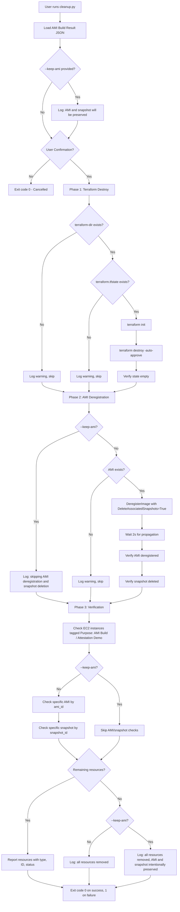
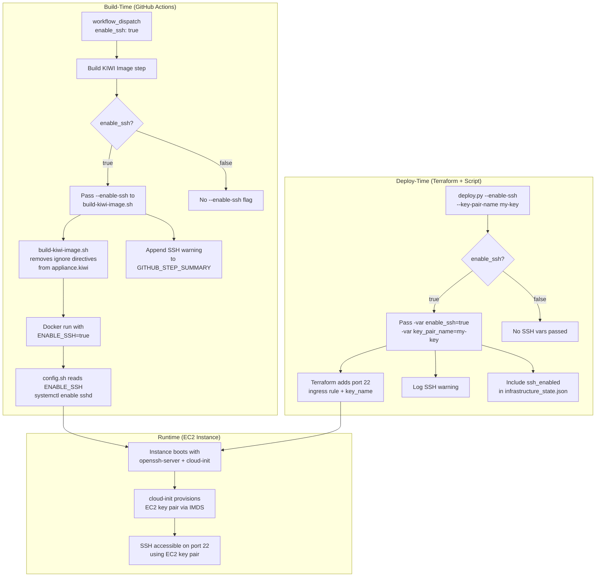

# Design Document: GitHub Actions Remote Executor

## Overview

The GitHub Actions Remote Executor is an HTTP server that runs on an Attestable EC2 instance with NitroTPM, providing a secure and attestable environment for executing scripts from GitHub repositories. The system receives execution requests from GitHub Actions workflows, generates cryptographic attestation documents proving the execution environment, and executes scripts inside ephemeral Docker containers asynchronously while allowing clients to poll for output and status. Each script execution runs in a newly created Docker container that is destroyed after completion, ensuring complete isolation between executions. All request and response payloads on protected endpoints are encrypted using PQ_Hybrid_KEM (post-quantum hybrid key encapsulation combining X25519 ECDH with ML-KEM-768), with the server's composite public key attested via the NitroTPM to establish trust.

This design document covers five major aspects of the system:

1. **Runtime Design**: How the Remote Executor operates when deployed - the HTTP server, request handling, script execution, attestation generation, and output polling mechanisms.

2. **Build Design**: How the attestable AMI containing the Remote Executor is built - the GitHub Actions workflow that builds a KIWI image in a reproducible Docker environment, attests build artifacts using GitHub's attestation service, publishes them to GitHub Container Registry with PCR measurements, and converts the KIWI image to an AWS AMI using a temporary EC2 instance that verifies signatures before AMI creation.

3. **Deployment Design**: How the built attestable AMI is deployed as a running target EC2 instance - provisioning an isolated VPC with network infrastructure, configuring security groups with port 8080 open to the world, launching the instance with NitroTPM and IMDSv2, and automating the deployment via a Python script that orchestrates Terraform and persists infrastructure state.

4. **Cleanup Design**: How all AWS resources created during the build and deployment process are removed - loading resource identifiers from the AMI build result file, destroying Terraform-managed infrastructure, deregistering the AMI and associated EBS snapshot, and verifying all resources have been cleaned up.

5. **Debug Design**: How optional SSH debug access is enabled across the build and deployment pipeline - adding a `workflow_dispatch` input to the GitHub Actions workflow, modifying the KIWI image build to conditionally include SSH packages, and extending the deploy script and Terraform to open port 22 and attach an EC2 key pair when debug access is requested.

### Key Design Principles

1. **Asynchronous Execution Model**: Requests return immediately with an execution ID and attestation document, while script execution proceeds in the background
2. **Polling-based Output Retrieval**: Clients poll a separate endpoint to retrieve incremental output rather than maintaining long HTTP connections
3. **Ephemeral Docker Container Isolation**: Each script execution runs inside a newly created Docker container from a configured Container_Image; containers are never reused and are destroyed after completion, failure, or timeout
4. **Attestable Environment**: NitroTPM-based attestation on the Attestable EC2 instance provides cryptographic proof of the execution environment
5. **Stateless Request Handling**: Each request is independent, with execution state stored separately
6. **PQ Hybrid Encrypted Communication**: All request and response payloads on /execute and /execution/{id}/output are encrypted using PQ_Hybrid_KEM (X25519 + ML-KEM-768). The server generates a composite keypair at startup (held in memory only), attests the public key via /attest (SHA-256 fingerprint in the attestation document's public_key field, full composite key in the JSON response body), and derives per-execution shared keys via HKDF-SHA256 combining both X25519 ECDH and ML-KEM-768 shared secrets for symmetric encryption of all subsequent communication. The OIDC token is transmitted inside the encrypted /execute payload rather than in HTTP headers. The /execution/{id}/output endpoint does not require an OIDC token; possession of the execution-bound Shared_Key itself serves as authentication for output retrieval.

### Architecture Goals

- Support concurrent execution of multiple scripts
- Provide verifiable proof of execution environment through attestation
- Enable reliable output retrieval through polling
- Maintain execution tracking and monitoring capabilities

### Python Dependency Management

The project maintains separate Python dependency configurations:

- **Remote Executor (pyproject.toml)**: Contains dependencies for the HTTP service (fastapi, uvicorn, requests, docker) that runs in the KIWI image. The remote executor does NOT use boto3. Dependencies are installed into the KIWI image using a lockfile-enforced path: `uv.lock` is the authoritative source, exported via `uv export --frozen --format requirements-txt --no-dev` (hashes are included by default) and installed with `pip install --require-hashes` (or `uv sync --frozen`). Version ranges from `pyproject.toml` are NOT used directly for AMI-embedded dependencies. The `build-and-publish` workflow job must install `uv` (via `astral-sh/setup-uv` action) because `build-kiwi-image.sh` invokes `uv export --frozen` to produce the hash-checked requirements file from `uv.lock`.
- **Build Scripts (scripts/pyproject.toml)**: Contains dependencies for build and deployment scripts (boto3, paramiko) used during AMI creation. These are NOT installed in the KIWI image.

This separation ensures the KIWI image only contains libraries needed for the remote executor service, keeping it minimal and focused.

---

# PART 1: RUNTIME DESIGN

## Architecture

### System Components

The system consists of the following major components:

```
┌─────────────────────────────────────────────────────────────┐
│                     GitHub Actions Workflow                  │
└────┬──────────────────┬─────────────────────┬────────────────┘
     │ GET /attest      │ POST /execute       │ POST /execution/{id}/output
     │                  │ (encrypted)         │ (encrypted req & resp)
     │                  │                     │
┌────▼──────────────────▼─────────────────────▼────────────────┐
│                        HTTP Server                            │
│  ┌────────────────┐ ┌──────────────────┐ ┌────────────────┐ │
│  │ Attest Handler │ │ Request Handler  │ │ Output Handler │ │
│  └───────┬────────┘ └────────┬─────────┘ └───────┬────────┘ │
└──────────┼───────────────────┼───────────────────┼──────────┘
           │                   │                   │
┌──────────▼───────────────────▼───────────────────▼──────────┐
│                    Core Services Layer                        │
│  ┌──────────────┐ ┌──────────────┐ ┌──────────────┐        │
│  │  Encryption  │ │   Request    │ │  Repository  │        │
│  │   Manager    │ │  Validator   │ │    Client    │        │
│  └──────────────┘ └──────────────┘ └──────────────┘        │
│  ┌──────────────┐                                           │
│  │ Attestation  │                                           │
│  │  Generator   │                                           │
│  └──────────────┘                                           │
└───────────────────────────────────────────────────────────────┘
           │                   │                   │
┌──────────▼───────────────────▼───────────────────▼──────────┐
│                   Execution Management Layer                  │
│  ┌──────────────┐  ┌──────────────┐  ┌──────────────┐      │
│  │  Execution   │  │    Script    │  │    Output    │      │
│  │   Manager    │  │   Executor   │  │  Collector   │      │
│  └──────────────┘  └──┬───────┬──┘  └──────────────┘      │
│                        │       │                             │
│              ┌─────────▼───────▼──────────┐                 │
│              │     Docker Daemon (SDK)     │                 │
│              │  ┌────────┐  ┌────────┐    │                 │
│              │  │Container│  │Container│   │                 │
│              │  │ exec-1  │  │ exec-2 │   │                 │
│              │  └────────┘  └────────┘    │                 │
│              └────────────────────────────┘                 │
└───────────────────────────────────────────────────────────────┘
           │                   │                   │
┌──────────▼───────────────────▼───────────────────▼──────────┐
│                    Storage Layer                              │
│  ┌──────────────┐  ┌──────────────┐  ┌──────────────┐      │
│  │  Execution   │  │  Temporary   │  │  Encryption  │      │
│  │    Store     │  │   Storage    │  │   Contexts   │      │
│  └──────────────┘  └──────────────┘  └──────────────┘      │
└───────────────────────────────────────────────────────────────┘
```

### Component Responsibilities

**HTTP Server**
- Listens for incoming HTTP requests on configured port
- Routes requests to appropriate handlers
- Manages concurrent connections
- Implements rate limiting per source IP; the rate limiter periodically evicts stale IP entries (IPs whose last request timestamp is outside the current window) during the periodic cleanup task to prevent the per-IP tracking dictionary from growing without bound under distributed traffic

**Encryption Manager**
- Generates a Server_Keypair at server startup and holds it in memory for the server's entire lifetime; the keypair is never persisted to disk
- Uses the `cryptography` library for X25519 key generation and ECDH, and the `wolfcrypt-py` library (via `wolfcrypt.ciphers` module: `MlKemType`, `MlKemPrivate`, `MlKemPublic`) for ML-KEM-768 key generation and encapsulation/decapsulation (FIPS 203)
- Provides the Server_Public_Key for inclusion in /attest JSON response body; a SHA-256 fingerprint is placed in the attestation document's public_key field (see glossary for serialization format and size constraint rationale)
- Derives a Shared_Key from the Client_Public_Key (containing the client's X25519 public key + ML-KEM-768 ciphertext, sent unencrypted) and the Server_Keypair via PQ_Hybrid_KEM for each /execute request: performs X25519 ECDH and ML-KEM-768 decapsulation, then combines both shared secrets via HKDF-SHA256 with domain-separation label b"pq-hybrid-shared-key"
- Decrypts incoming /execute request payloads using the derived Shared_Key
- Stores the Shared_Key in an Encryption_Context keyed by Execution_ID; the context is held in memory only and never persisted to disk
- Encrypts /execute response payloads using the Shared_Key from the Encryption_Context
- Decrypts incoming /execution/{id}/output request payloads using the Shared_Key from the Encryption_Context for that execution_id
- Encrypts /execution/{id}/output response payloads using the Shared_Key from the Encryption_Context
- Removes the Encryption_Context when the execution record is cleaned up
- Does NOT encrypt responses for /attest or /health endpoints
- Logs Server_Keypair generation at startup at INFO level without logging private key material or decapsulation key material

**Attest Handler**
- Handles GET /attest requests (unauthenticated)
- Accepts an optional `nonce` query parameter
- Includes a SHA-256 fingerprint of the Server_Public_Key (see Encryption Manager) in the Attestation_Document's `public_key` field, alongside the full composite key in the JSON response body
- Does NOT include user_data in the attestation document (only public_key fingerprint and optional nonce are included)
- Returns the Attestation_Document in base64 encoding, unencrypted
- Returns HTTP 500 if attestation generation fails

**Request Handler**
- Enforces request body size limits before any JSON parsing or base64 decoding: rejects requests exceeding MAX_REQUEST_BODY_BYTES (default 1 MB) with HTTP 413; validates `encrypted_payload` field size against MAX_ENCRYPTED_PAYLOAD_BYTES (default 512 KB) and `client_public_key` field size (max 2048 bytes) after JSON parsing; validates decrypted payload size against MAX_DECRYPTED_PAYLOAD_BYTES (default 256 KB) after decryption
- Receives encrypted /execute request payloads and delegates decryption to the Encryption Manager (see Encryption Manager for PQ_Hybrid_KEM key derivation details)
- Extracts the OIDC_Token from the decrypted request body `oidc_token` field (NOT from the Authorization header)
- Extracts the mandatory `nonce` from the decrypted request body; rejects with HTTP 400 if nonce is missing or empty (replay protection is mandatory, not optional)
- Extracts the optional `script_env` dictionary from the decrypted request body, sanitizes it (string keys and string values only), and passes it to the Script Executor for injection into the Execution_Container as environment variables
- Validates the decrypted request using the Request Validator
- After OIDC validation, verifies the `repository` claim matches the `repository_url` in the request; rejects with HTTP 403 if mismatch
- Checks nonce against the Nonce_Cache; rejects with HTTP 400 if duplicate
- Coordinates repository file retrieval; wraps all post-clone processing in a `finally` block to ensure clone directory cleanup on unexpected errors
- Generates attestation documents with execution_id in user_data (without Server_Public_Key; nonce included if provided)
- Creates execution records (stores `repository` claim in the record)
- Stores the Shared_Key in the Encryption_Context for the new Execution_ID
- Initiates asynchronous script execution with optional script_env
- Once decryption succeeds, returns ALL subsequent errors (validation, auth, clone, attestation, capacity) as encrypted error envelopes using the Shared_Key, rather than plaintext HTTP errors
- Encrypts the response payload using the Shared_Key before returning

**Output Handler**
- Enforces request body size limits before JSON parsing (same MAX_REQUEST_BODY_BYTES limit as /execute)
- Receives encrypted /execution/{id}/output request payloads; decrypts via the Encryption Manager using the execution-bound Shared_Key (returns HTTP 400 if no Encryption_Context exists)
- Authentication is provided by possession of the execution-bound Shared_Key itself — only the original caller who performed the PQ_Hybrid_KEM exchange during /execute possesses this key, so no separate OIDC token validation is required
- Extracts the mandatory `nonce` from the decrypted request body; rejects with HTTP 400 if nonce is missing or empty (replay protection is mandatory, not optional)
- Checks nonce against the Nonce_Cache; rejects with HTTP 400 if duplicate
- Retrieves execution status and output by execution ID
- Supports offset-based output retrieval
- Returns completion status and exit codes
- On every poll response, generates an Output_Attestation_Document containing a SHA-256 digest of the current Script_Output (stdout + stderr + exit_code at that point in time) in the user_data field, with execution_id included (without Server_Public_Key; nonce included if provided), regardless of whether execution is running, completed, failed, or timed_out
- Returns Output_Attestation_Document in base64 encoding alongside Script_Output and Attestation_Document on every poll response
- If Output_Attestation_Document generation fails, still returns Script_Output and Attestation_Document with an error field
- Once decryption succeeds, returns ALL subsequent errors (nonce duplicate, execution not found, attestation failure) as encrypted error envelopes using the Shared_Key
- Encrypts the response payload using the Shared_Key before returning

**Request Validator**
- Validates OIDC JWT tokens per Requirement 2 (signature via JWKS, iss, aud, repository, exp claims, optional branch/ref restrictions); uses PyJWT with RS256 algorithm and the `cryptography` backend for signature verification
- Fetches and caches GitHub's OIDC provider JWKS; refreshes cache on unknown key ID
- Returns 401 for missing/invalid/expired tokens and signature failures; returns 403 for unauthorized repositories or branch/ref mismatches
- Does NOT require authentication for /health or /attest endpoints
- Validates request structure and required fields
- Validates repository URL format
- Validates Git commit SHA format
- Validates script file path: rejects empty paths, path traversal sequences (`../`, `..\`), absolute paths (starting with `/` or `\`), and null bytes (`\x00`); absolute paths are explicitly rejected because `os.path.join(clone_path, script_path)` silently discards the clone prefix when given an absolute path, which would cause the pre-execution size check to read arbitrary host files
- Validates file size limits

**Repository Client**
- Clones the entire repository at the specified commit into a temporary directory under `temp_storage_path` using `git clone --depth 1`
- Authenticates using the GitHub token embedded in the clone URL (`https://{token}@github.com/owner/repo.git`)
- Checks out the exact commit after cloning
- After successful clone, strips the GitHub token from `.git/config` by running `git remote set-url origin https://github.com/{owner}/{repo}.git` (without the token)
- After token stripping, removes the `.git` directory entirely from the cloned repository before mounting into the Execution_Container
- Validates the script file exists within the cloned repository
- Returns the path to the cloned repository directory and the relative script path
- Handles clone failures (authentication errors, repository not found, network errors)
- Cleans up cloned repository directories after execution
- The server wraps all post-clone processing in a `finally` block that removes the clone directory on unexpected exceptions (unless ownership has been handed to the Script_Executor); uses `shutil.rmtree` with `ignore_errors=True` to avoid secondary exceptions

**Attestation Generator**
- Interfaces with the NitroTPM on the Attestable EC2 instance via the `nitro-tpm-attest` command-line tool
- Creates attestation documents with execution metadata
- When generating for the /attest endpoint: computes a SHA-256 fingerprint of the Server_Public_Key (composite key) and includes the fingerprint in the `public_key` field of the attestation document (because the composite key exceeds the 1024-byte field limit), but does NOT include user_data (no `--user-data` flag is passed to nitro-tpm-attest)
- When generating for /execute or /execution/{id}/output: does NOT include the Server_Public_Key in the attestation document, but DOES include user_data with execution metadata (repository_url, commit_hash, script_path, script_env_hash, execution_id, timestamp)
- Accepts an optional nonce parameter; when provided, passes it to nitro-tpm-attest for inclusion in the attestation document
- Signs documents using NitroTPM cryptographic capabilities
- Encodes attestation in standard format (CBOR)
- Implementation approach (based on `demo_api.py::AttestationAPIHandler.generate_attestation_document()`):
  1. Accepts optional user_data and nonce parameters for inclusion in attestation
  2. Writes user_data and nonce to temporary files if provided; when called for /attest, user_data is not provided so the `--user-data` flag is omitted
  3. Invokes `/usr/bin/nitro-tpm-attest` with optional `--user-data` and `--nonce` flags
  4. Captures binary CBOR-encoded attestation document from stdout
  5. Implements 30-second timeout for attestation generation
  6. Returns attestation document as bytes or detailed error information
  7. Cleans up temporary files in finally block
  8. Error handling includes: subprocess failures, timeouts, and OS errors
  9. Error responses include command, exit code, stdout, stderr, and context for debugging

**Execution Manager**
- Generates unique execution IDs
- Maintains execution state (queued, running, completed, failed, timed_out)
- Manages execution lifecycle
- Implements execution timeout handling
- Before creating a new execution record, checks the count of active executions (queued and running) against MAX_CONCURRENT_EXECUTIONS atomically to prevent race conditions
- Stores the `repository` claim from the validated OIDC_Token in the execution record at creation time
- Cleans up completed executions after retention period
- Periodic cleanup_expired invocation is scheduled by the server; cleanup calls remove_output on the Output_Collector and remove_encryption_context on the Encryption_Manager for each expired execution record
- Stores execution durations in a bounded `collections.deque(maxlen=10000)` rather than an unbounded list, so that the duration history does not grow without bound in long-running deployments

**Script Executor**
- Creates a new ephemeral Docker container (Execution_Container) from the configured Container_Image for each script execution using the Docker SDK (`docker` Python package)
- Assigns a unique container name derived from the Execution_ID to each container
- Configures containers with security constraints: memory limits, CPU limits, writable root filesystem, no privilege escalation, running as root user; internet access is enabled by default (no `network_mode` restriction) since scripts may need to download dependencies or upload artifacts
- Creates each container with cap_drop=ALL to remove all Linux capabilities, then adds back a minimal set required for build scripts: CAP_CHOWN, CAP_DAC_OVERRIDE, CAP_FOWNER, CAP_SETUID, CAP_SETGID, CAP_NET_BIND_SERVICE, CAP_KILL (see Requirement 8.18 for per-capability justification)
- Mounts the cloned repository directory read-only into the container at `/workspace` using Docker volumes
- Sets the container working directory to `/workspace` so the script can reference sibling files
- Ensures the cloned repository directory is readable before mounting into the container
- Accepts an optional `script_env` dictionary of string key-value pairs and passes it as the `environment` parameter to the Docker container, allowing the caller to forward environment variables (e.g., `GITHUB_TOKEN`, `GITHUB_RUN_ID`, `ACTIONS_RUNTIME_TOKEN`, `ACTIONS_RUNTIME_URL`) into the Execution_Container so that build scripts can interact with external services
- Executes the script via `command=["bash", "/workspace/{script_path}"]` where `script_path` is the relative path within the repo
- Streams stdout and stderr incrementally from the container during execution using a Log_Streaming_Thread that calls `container.logs(stream=True, follow=True)` and feeds chunks to the Output_Collector in real time, so that polling clients observe partial output while the script is still running
- Monitors execution progress and enforces timeout
- Removes the container and its resources after completion, failure, or timeout
- Never reuses a container for more than one execution
- Verifies container removal after destruction
- Cleans up any dangling containers matching the naming convention on startup
- Records exit codes

**Output Collector**
- Receives incremental output chunks from the Log_Streaming_Thread during script execution via `capture_output()`
- Stores output incrementally in thread-safe buffers, enabling polling clients to observe partial output while the container is still running
- Supports offset-based retrieval
- Manages output retention
- Enforces MAX_OUTPUT_SIZE_BYTES limit on combined stdout and stderr buffers; truncates and marks output as truncated when exceeded

**Execution Store**
- Persists execution metadata and state
- Stores output data
- Provides query interface by execution ID
- Implements retention policy

**Temporary Storage**
- Manages temporary storage for cloned repository directories
- Provides isolated directories per execution
- Handles cleanup of cloned repos after execution

### Request Flow

**Attestation Request Flow:**

1. Client sends GET request to `/attest` with optional `nonce` query parameter
2. No authentication required
3. Attestation Generator creates attestation document with SHA-256 fingerprint of the Server_Public_Key (composite key) in the `public_key` field, optional nonce, and no user_data
4. Response returned with base64-encoded attestation document and base64-encoded Server_Public_Key as separate JSON fields (unencrypted)

**Execution Request Flow:**

1. Client sends POST request to `/execute` with encrypted payload and unencrypted Client_Public_Key
2. Server enforces MAX_REQUEST_BODY_BYTES limit; rejects with HTTP 413 if exceeded (before JSON parsing)
3. Server validates `encrypted_payload` size against MAX_ENCRYPTED_PAYLOAD_BYTES and `client_public_key` size (max 2048 bytes); rejects with HTTP 400 if exceeded
4. Encryption Manager derives Shared_Key via PQ_Hybrid_KEM (see Encryption Manager component) and decrypts the request payload
5. Server validates decrypted payload size against MAX_DECRYPTED_PAYLOAD_BYTES; rejects with HTTP 400 if exceeded
6. Request Handler validates mandatory `nonce` field is present and non-empty; rejects with HTTP 400 if missing or empty
7. Request Handler extracts OIDC_Token from decrypted body `oidc_token` field
8. Request Validator validates the OIDC_Token (signature via JWKS, iss, aud, repository, exp claims)
9. Request Validator verifies `repository` claim matches `repository_url` in the request; rejects with HTTP 403 if mismatch
10. Request Validator validates optional branch/ref restrictions (Allowed_Branches, REQUIRE_PROTECTED_REF)
11. Request Handler checks nonce against Nonce_Cache; rejects with HTTP 400 if duplicate
12. Request Handler validates request structure from decrypted body
13. Request Validator validates all request body fields (repository_url, commit_hash, script_path, github_token)
14. Request Validator checks script file size against MAX_SCRIPT_SIZE_BYTES; rejects with HTTP 413 if exceeded
15. Execution Manager checks active execution count against MAX_CONCURRENT_EXECUTIONS atomically; rejects with HTTP 503 if at capacity
16. Repository Client authenticates and clones the repository at the specified commit into a temporary directory (wrapped in `finally` block for cleanup on unexpected errors)
17. Repository Client strips token from .git/config and removes .git directory
18. Attestation Generator creates attestation document with execution metadata (repository_url, commit_hash, script_path, script_env_hash, execution_id, timestamp) and nonce (no Server_Public_Key)
19. Execution Manager creates execution record with unique ID (stores `repository` claim)
20. Encryption Manager stores Shared_Key in Encryption_Context keyed by Execution_ID
21. Response payload (execution ID, attestation document, status) encrypted with Shared_Key and returned (all post-decryption errors from steps 6-18 are also returned as encrypted error envelopes)
22. Request Handler extracts optional `script_env` dictionary from the decrypted body, sanitizes it (string keys and values only), and passes it to the Script Executor
23. Script Executor creates a new Docker container from the configured Container_Image (with cap_drop=ALL and cap_add for the minimal build-script capability set), injects `script_env` as container environment variables, and begins asynchronous execution inside it
24. Script Executor starts a Log_Streaming_Thread that uses `container.logs(stream=True, follow=True)` to incrementally capture stdout/stderr and feed chunks to the Output_Collector in real time during execution (enforcing MAX_OUTPUT_SIZE_BYTES)
25. Execution Manager updates status upon completion; Log_Streaming_Thread terminates; container is removed

**Output Polling Flow:**

1. Client sends POST request to `/execution/{id}/output` with encrypted payload containing mandatory `nonce` and `offset`
2. Server enforces MAX_REQUEST_BODY_BYTES limit; rejects with HTTP 413 if exceeded
3. Encryption Manager decrypts the request payload using the execution-bound Shared_Key (returns HTTP 400 if no Encryption_Context exists); successful decryption proves the caller possesses the Shared_Key, which serves as authentication
4. Output Handler validates mandatory `nonce` field is present and non-empty; rejects with HTTP 400 if missing or empty
5. Output Handler checks nonce against Nonce_Cache; rejects with HTTP 400 if duplicate
6. Output Handler retrieves execution record by ID
7. Output Collector returns current status, output from offset, and completion flag
8. Output Handler computes SHA-256 digest of the current Script_Output (stdout + stderr + exit_code at that point in time) and generates an Output_Attestation_Document with the digest and execution_id in user_data, plus nonce (no Server_Public_Key)
9. Response includes Script_Output, Attestation_Document, Output_Attestation_Document, and exit code (if available) on every poll response regardless of execution status
10. If Output_Attestation_Document generation fails, response still includes Script_Output and Attestation_Document with an attestation_error field
11. Response payload encrypted with Shared_Key and returned (all post-decryption errors from steps 4-6 are also returned as encrypted error envelopes)
12. Client decrypts response using the same Shared_Key derived during PQ_Hybrid_KEM key exchange
13. Client repeats polling until execution completes
14. Client can verify output integrity on every poll by comparing SHA-256 of returned Script_Output against the digest in Output_Attestation_Document's user_data

### Concurrency Model

- HTTP server handles multiple concurrent connections using async I/O (FastAPI with uvicorn)
- Each execution runs in a separate ephemeral Docker container (Execution_Container) created from the configured Container_Image
- Containers are never reused — each execution gets a fresh container that is destroyed after completion, failure, or timeout
- Execution state stored in thread-safe in-memory data structure
- Encryption_Contexts (Shared_Keys keyed by Execution_ID) stored in thread-safe in-memory data structure alongside execution state
- Output collection uses buffered writes to avoid blocking; each execution has a dedicated Log_Streaming_Thread (daemon thread) that reads from the Docker log stream and writes to the Output_Collector concurrently with `container.wait()`
- Maximum concurrent Execution_Containers configurable to prevent resource exhaustion; enforced atomically before creating execution records
- Docker daemon manages container lifecycle and resource isolation
- Server_Keypair generated once at startup and shared across all concurrent requests (read-only after initialization; see Encryption Manager for details)

## Components and Interfaces

### HTTP API Endpoints

#### GET /attest

Returns an attestation document containing a SHA-256 fingerprint of the Server_Public_Key in the public_key field, alongside the full composite Server_Public_Key in the JSON response body. Unauthenticated. The attestation document does NOT include user_data — only `public_key` (fingerprint) and optionally `nonce` are included.

**Query Parameters:**
- `nonce` (optional): Client-provided nonce for attestation freshness verification

**Response (200 OK):**
```json
{
  "attestation_document": "base64-encoded-cbor",
  "server_public_key": "base64-encoded-composite-key"
}
```

The attestation document's `public_key` field contains a SHA-256 fingerprint of the Server_Public_Key (because the composite key exceeds the 1024-byte field limit). The full Server_Public_Key (length-prefixed concatenation of X25519 public key + ML-KEM-768 encapsulation key) is returned as a separate base64-encoded field in the JSON body. The client verifies the key by computing SHA-256 of the received composite key and comparing against the fingerprint in the attestation document. The attestation document does NOT contain user_data. The response is NOT encrypted.

**Error Responses:**
- 500 Internal Server Error: Attestation generation failure

#### POST /execute

Initiates script execution. Request and response payloads are encrypted using PQ_Hybrid_KEM (X25519 + ML-KEM-768).

**Request Body (outer, unencrypted envelope):**
```json
{
  "encrypted_payload": "base64-encoded-ciphertext",
  "client_public_key": "base64-encoded-length-prefixed-x25519-pubkey-and-mlkem768-ciphertext"
}
```

**Decrypted Payload (inner, after PQ_Hybrid_KEM decryption):**
```json
{
  "repository_url": "https://github.com/owner/repo",
  "commit_hash": "abc123def456...",
  "script_path": "scripts/build.sh",
  "github_token": "ghp_...",
  "oidc_token": "eyJhbGciOiJSUzI1NiIs...",
  "nonce": "unique-client-nonce-required",
  "script_env": {
    "GITHUB_RUN_ID": "123456",
    "GITHUB_REPOSITORY": "owner/repo",
    "ACTIONS_RUNTIME_TOKEN": "...",
    "ACTIONS_RUNTIME_URL": "https://pipelines.actions.githubusercontent.com/..."
  }
}
```

**Response (200 OK, encrypted with Shared_Key):**
The response body is an encrypted payload. After decryption by the client:
```json
{
  "execution_id": "uuid-v4",
  "attestation_document": "base64-encoded-cbor",
  "status": "queued"
}
```

The attestation document in the /execute response does NOT include the Server_Public_Key in the `public_key` field.

**Error Responses (pre-decryption, plaintext HTTP):**
- 400 Bad Request: Decryption failure, malformed request, invalid Client_Public_Key (invalid X25519 or ML-KEM-768 components), encrypted_payload or client_public_key field size exceeded
- 413 Payload Too Large: Request body exceeds MAX_REQUEST_BODY_BYTES
- 429 Too Many Requests: Rate limit exceeded
- 500 Internal Server Error: Attestation or system failure

**Error Responses (post-decryption, returned as encrypted error envelopes with HTTP 200):**
- 400 Bad Request: Missing/empty nonce, duplicate nonce, validation failure, decrypted payload size exceeded
- 401 Unauthorized: Missing/invalid/expired OIDC token (from decrypted body), signature verification failure, invalid iss or aud claim
- 403 Forbidden: Valid OIDC token from an unauthorized repository, repository claim does not match repository_url, branch/ref restriction violation
- 404 Not Found: Repository, commit, or file not found
- 413 Payload Too Large: Script file exceeds size limit
- 503 Service Unavailable: Maximum concurrent executions reached

#### POST /execution/{execution_id}/output

Retrieves execution status and output. Request and response payloads are encrypted with the execution-bound Shared_Key. Authentication is provided by possession of the Shared_Key itself — only the original caller who performed the PQ_Hybrid_KEM exchange during /execute possesses this key.

**Request Body (encrypted with Shared_Key):**
After decryption:
```json
{
  "nonce": "unique-client-nonce-required",
  "offset": 0
}
```

**Response (200 OK, encrypted with Shared_Key):**
After decryption by the client (every poll response includes output_attestation_document):
```json
{
  "execution_id": "uuid-v4",
  "status": "running|completed|failed|timed_out",
  "stdout": "output text...",
  "stderr": "error text...",
  "stdout_offset": 1024,
  "stderr_offset": 256,
  "complete": false,
  "exit_code": null,
  "output_attestation_document": "base64-encoded-cbor"
}
```

When complete (after decryption):
```json
{
  "execution_id": "uuid-v4",
  "status": "completed",
  "stdout": "output text...",
  "stderr": "error text...",
  "stdout_offset": 2048,
  "stderr_offset": 512,
  "complete": true,
  "exit_code": 0,
  "output_attestation_document": "base64-encoded-cbor"
}
```

The attestation documents in the /output response do NOT include the Server_Public_Key. Attestation documents are included as-is within the encrypted payload (not separately encrypted).

When Output_Attestation_Document generation fails (after decryption, any status):
```json
{
  "execution_id": "uuid-v4",
  "status": "running|completed|failed|timed_out",
  "stdout": "output text...",
  "stderr": "error text...",
  "stdout_offset": 2048,
  "stderr_offset": 512,
  "complete": false,
  "exit_code": null,
  "output_attestation_document": null,
  "attestation_error": "Failed to generate output attestation document"
}
```

**Error Responses (pre-decryption, plaintext HTTP):**
- 400 Bad Request: No Encryption_Context for execution_id, decryption failure
- 413 Payload Too Large: Request body exceeds MAX_REQUEST_BODY_BYTES

**Error Responses (post-decryption, returned as encrypted error envelopes with HTTP 200):**
- 400 Bad Request: Missing/empty nonce, duplicate nonce
- 404 Not Found: Execution ID does not exist

#### GET /health

Health check endpoint for monitoring. Rate-limited per IP. Returns only simple healthy/unhealthy status without Docker availability, disk space, or active execution count details.

**Response (200 OK):**
```json
{
  "status": "healthy"
}
```

**Response (503 Service Unavailable):**
```json
{
  "status": "unhealthy"
}
```

### Internal Interfaces

#### EncryptionManager Interface

```python
from cryptography.hazmat.primitives.asymmetric.x25519 import X25519PrivateKey, X25519PublicKey
from wolfcrypt.ciphers import MlKemType, MlKemPrivate, MlKemPublic

class EncryptionManager:
    def __init__(self):
        """Generate composite Server_Keypair (X25519 + ML-KEM-768) at initialization and hold in memory."""
        pass

    @property
    def server_public_key(self) -> bytes:
        """Return the serialized Server_Public_Key as length-prefixed concatenation
        of 32-byte X25519 public key + 1184-byte ML-KEM-768 encapsulation key.
        Each component is preceded by a 4-byte big-endian length prefix."""
        pass

    @property
    def server_public_key_fingerprint(self) -> bytes:
        """Return the SHA-256 fingerprint of the serialized Server_Public_Key.
        Used in the attestation document's public_key field because the composite
        key exceeds the 1024-byte field limit."""
        pass

    def decrypt_request(self, encrypted_payload: bytes, client_public_key: bytes) -> tuple[dict, bytes]:
        """
        Parse Client_Public_Key (length-prefixed X25519 public key + ML-KEM-768 ciphertext),
        perform X25519 ECDH and ML-KEM-768 decapsulation using Server_Keypair,
        combine both shared secrets via HKDF-SHA256 with label b"pq-hybrid-shared-key",
        then decrypt the request payload using the derived Shared_Key.
        Returns (decrypted_payload_dict, shared_key_bytes).
        Raises ValueError on decryption failure or invalid Client_Public_Key.
        """
        pass

    def encrypt_response(self, payload: dict, shared_key: bytes) -> bytes:
        """Encrypt a response payload using the given Shared_Key."""
        pass

    def decrypt_with_shared_key(self, encrypted_payload: bytes, shared_key: bytes) -> dict:
        """
        Decrypt a request payload using a previously stored Shared_Key.
        Used for /execution/{id}/output requests.
        Raises ValueError on decryption failure.
        """
        pass

    def store_encryption_context(self, execution_id: str, shared_key: bytes) -> None:
        """Store Shared_Key in Encryption_Context keyed by execution_id."""
        pass

    def get_shared_key(self, execution_id: str) -> bytes | None:
        """Retrieve Shared_Key for an execution_id, or None if not found."""
        pass

    def remove_encryption_context(self, execution_id: str) -> None:
        """Remove Encryption_Context when execution is cleaned up."""
        pass
```

#### RequestValidator Interface

```python
class RequestValidator:
    def __init__(self, allowed_repositories: list[str], expected_audience: str,
                 allowed_branches: list[str] | None = None, require_protected_ref: bool = False):
        """Initialize with OIDC configuration and optional branch/ref restrictions"""
        pass

    def validate_oidc_token(self, oidc_token: str | None) -> OIDCValidationResult:
        """
        Validates the OIDC token extracted from the decrypted request body.
        Fetches JWKS from GitHub's OIDC provider, verifies JWT signature,
        and validates iss, aud, repository, and exp claims.
        When Allowed_Branches is configured, validates ref claim against allowed patterns.
        When REQUIRE_PROTECTED_REF is true, validates ref_protected claim is "true".
        Returns 401 for missing/invalid/expired tokens, 403 for unauthorized repos or branch/ref violations.
        """
        pass

    def validate_repository_binding(self, oidc_claims: dict, repository_url: str) -> bool:
        """
        Validates that the repository claim from the OIDC token matches the
        repository_url in the execution request. Returns False on mismatch.
        """
        pass

    def _fetch_jwks(self, force_refresh: bool = False) -> dict:
        """
        Fetches JWKS from https://token.actions.githubusercontent.com/.well-known/jwks
        Caches the result; refreshes when force_refresh=True (e.g., unknown key ID).
        """
        pass

    def validate_execution_request(self, request: dict) -> ValidationResult:
        """Validates execution request structure and fields"""
        pass
    
    def validate_repository_url(self, url: str) -> bool:
        """Validates GitHub repository URL format"""
        pass
    
    def validate_commit_hash(self, hash: str) -> bool:
        """Validates Git commit SHA format"""
        pass
    
    def validate_script_path(self, path: str) -> bool:
        """Validates script file path"""
        pass
```

#### RepositoryClient Interface

```python
class RepositoryClient:
    def authenticate(self, token: str) -> AuthResult:
        """Authenticates with GitHub using token"""
        pass
    
    def clone_repo(self, repo_url: str, commit: str, token: str) -> CloneResult:
        """Clones repository at specific commit into temp directory.
        After cloning, strips token from .git/config and removes .git directory."""
        pass
    
    def validate_script_exists(self, clone_path: str, script_path: str) -> bool:
        """Validates script file exists within cloned repo"""
        pass
    
    def cleanup_clone(self, clone_path: str) -> None:
        """Removes cloned repository directory"""
        pass
```

#### AttestationGenerator Interface

```python
class AttestationGenerator:
    def generate_attestation(
        self,
        metadata: ExecutionMetadata = None,
        nonce: Optional[str] = None,
        public_key: Optional[bytes] = None,
    ) -> AttestationDocument:
        """
        Generates signed attestation document.
        
        Args:
            metadata: Execution metadata to include in user_data (repository_url,
                      commit_hash, script_path, script_env_hash, execution_id, timestamp).
                      When None (e.g., for /attest), user_data is omitted entirely
                      from the attestation document. script_env_hash is the SHA-256
                      hex digest of canonicalized script_env (keys sorted, JSON no
                      whitespace); SHA-256("{}") when script_env is empty or not provided.
                      execution_id binds the attestation to the specific server execution
                      record so consumers can verify which execution produced the attestation.
            nonce: Optional client-provided nonce for freshness verification
            public_key: Optional SHA-256 fingerprint of the Server_Public_Key to include
                        in the public_key field. Only provided when generating for the
                        /attest endpoint. The fingerprint is used because the full composite
                        key (1216+ bytes) exceeds the 1024-byte public_key field limit.
        """
        pass
    
    def verify_tpm_available(self) -> bool:
        """Checks if NitroTPM device is available"""
        pass
```

#### ExecutionManager Interface

```python
class ExecutionManager:
    def create_execution(self, request: ExecutionRequest, repository_claim: str) -> ExecutionID:
        """Creates new execution record, storing the repository claim from the OIDC token.
        Checks active execution count against MAX_CONCURRENT_EXECUTIONS atomically before creating."""
        pass
    
    def get_execution(self, execution_id: str) -> ExecutionRecord:
        """Retrieves execution record by ID"""
        pass
    
    def update_status(self, execution_id: str, status: ExecutionStatus) -> None:
        """Updates execution status"""
        pass
    
    def cleanup_expired(self) -> None:
        """Removes executions past retention period. Calls remove_output on OutputCollector
        and remove_encryption_context on EncryptionManager for each expired record."""
        pass
```

#### ScriptExecutor Interface

```python
import docker

class ScriptExecutor:
    def __init__(self, docker_client: docker.DockerClient, container_image: str,
                 memory_limit: str, cpu_limit: float, timeout_seconds: int):
        """
        Initialize with Docker client and container configuration.
        The docker_client connects to the rootless Docker socket at
        /run/user/{uid}/docker.sock (where uid is the gha-executor user's UID).
        
        Args:
            docker_client: Docker SDK client instance (connected to rootless socket)
            container_image: Name of the Container_Image to use for Execution_Containers
            memory_limit: Docker memory constraint (e.g., '4g')
            cpu_limit: Docker CPU constraint (e.g., 1.0 for one CPU)
            timeout_seconds: Maximum execution timeout
        """
        pass

    def execute_async(self, execution_id: str, repo_path: str, script_path: str, script_env: dict[str, str] | None = None) -> None:
        """
        Creates a new Execution_Container from Container_Image, mounts the
        cloned repository directory read-only at /workspace, injects optional
        script_env as container environment variables, and executes the
        script asynchronously. The container is assigned a unique name derived
        from the execution_id.

        Args:
            execution_id: Unique execution identifier
            repo_path: Path to the cloned repository directory on the host
            script_path: Relative path to the script within the repo
            script_env: Optional dictionary of environment variables to inject
                        into the container (e.g., GITHUB_TOKEN, GITHUB_RUN_ID)

        After starting the container, launches a Log_Streaming_Thread (daemon thread)
        that calls container.logs(stream=True, follow=True) to incrementally capture
        stdout and stderr, feeding each chunk to the Output_Collector in real time.
        The streaming thread runs concurrently with container.wait() so that polling
        clients observe partial output while the script is still running. When the
        container exits, the streaming thread terminates naturally (the Docker log
        stream ends), and no batch re-capture of logs is performed.
        """
        pass

    def terminate(self, execution_id: str) -> None:
        """Stops and removes the Execution_Container for the given execution"""
        pass

    def cleanup_dangling_containers(self) -> None:
        """
        Removes any dangling Execution_Containers on startup that match
        the container naming convention.
        """
        pass

    def verify_container_removed(self, execution_id: str) -> bool:
        """Verifies the container no longer exists on the Docker host"""
        pass

    def verify_docker_daemon(self) -> bool:
        """Checks if the Docker daemon is accessible"""
        pass
```

#### OutputCollector Interface

```python
class OutputCollector:
    def __init__(self, max_output_size_bytes: int):
        """Initialize with the configured maximum output buffer size.
        The server MUST pass config.max_output_size_bytes here at init time."""
        pass

    def capture_output(self, execution_id: str, stream: str, data: bytes) -> None:
        """Captures output data from execution. Enforces max_output_size_bytes limit;
        truncates and marks as truncated when exceeded."""
        pass
    
    def get_output(self, execution_id: str, offset: int = 0) -> OutputData:
        """Retrieves output from specified offset"""
        pass

    def remove_output(self, execution_id: str) -> None:
        """Removes stored output for an execution"""
        pass
```

## Data Models

### ExecutionRequest

```python
@dataclass
class ExecutionRequest:
    repository_url: str
    commit_hash: str
    script_path: str
    github_token: str
```

### ExecutionRecord

```python
@dataclass
class ExecutionRecord:
    execution_id: str
    repository_url: str
    commit_hash: str
    script_path: str
    status: ExecutionStatus
    created_at: datetime
    started_at: Optional[datetime]
    completed_at: Optional[datetime]
    exit_code: Optional[int]
    timeout_seconds: int
    repository_claim: str  # OIDC repository claim stored at creation for output binding
```

### ExecutionStatus

```python
class ExecutionStatus(Enum):
    QUEUED = "queued"
    RUNNING = "running"
    COMPLETED = "completed"
    FAILED = "failed"
    TIMED_OUT = "timed_out"
```

### AttestationDocument

```python
@dataclass
class AttestationDocument:
    repository_url: str
    commit_hash: str
    script_path: str
    script_env_hash: str  # SHA-256 hex digest of canonicalized script_env (keys sorted, JSON no whitespace); SHA-256("{}") when empty
    execution_id: str  # UUID v4 binding the attestation to the specific server execution record
    timestamp: datetime
    signature: bytes  # CBOR-encoded NitroTPM attestation
```

### OutputData

```python
@dataclass
class OutputData:
    stdout: str
    stderr: str
    stdout_offset: int
    stderr_offset: int
    complete: bool
    exit_code: Optional[int]
    truncated: bool  # True when output exceeded MAX_OUTPUT_SIZE_BYTES
```

### Configuration

```python
@dataclass
class ServerConfig:
    port: int
    max_concurrent_executions: int
    execution_timeout_seconds: int
    max_script_size_bytes: int
    max_output_size_bytes: int  # Maximum combined stdout/stderr buffer size; passed to OutputCollector at init
    max_request_body_bytes: int  # Maximum HTTP request body size before JSON parsing (default 1 MB)
    max_encrypted_payload_bytes: int  # Maximum encrypted_payload field size after JSON parsing (default 512 KB)
    max_decrypted_payload_bytes: int  # Maximum decrypted JSON payload size (default 256 KB)
    rate_limit_per_ip: int
    rate_limit_window_seconds: int
    temp_storage_path: str
    output_retention_hours: int
    tpm_attest_path: str
    allowed_repositories: list[str]
    expected_audience: str
    container_image: str  # Docker image name for Execution_Containers
    container_image_digest: str  # Required SHA-256 digest for image verification; server fails to start if empty and container_image lacks @sha256:
    container_memory_limit: str  # Docker memory constraint (e.g., '4g')
    container_cpu_limit: float  # Docker CPU constraint (e.g., 1.0)
    nonce_cache_ttl_seconds: int  # TTL for nonce cache entries, matching OIDC token lifetime
    allowed_branches: list[str] | None  # Optional branch patterns for OIDC ref claim validation
    require_protected_ref: bool  # When true, require ref_protected claim to be "true"; parsed with strict boolean validation (only true/1/yes/false/0/no accepted; unrecognized values fail startup)
```

### OIDCValidationResult

```python
@dataclass
class OIDCValidationResult:
    valid: bool
    status_code: int  # 200 on success, 401 or 403 on failure
    error_message: str | None
    claims: dict | None  # Decoded JWT claims on success
```

### OIDCTokenClaims

```python
@dataclass
class OIDCTokenClaims:
    iss: str       # Must be https://token.actions.githubusercontent.com
    aud: str       # Must match Expected_Audience
    repository: str  # Must match an entry in Allowed_Repositories
    exp: int       # Unix timestamp, must not be expired
    sub: str       # Subject (e.g., repo:owner/repo:ref:refs/heads/main)
    ref: str       # Git ref (e.g., refs/heads/main); validated against Allowed_Branches when configured
    ref_protected: str  # "true" or "false"; validated when REQUIRE_PROTECTED_REF is true
```

### CloneResult

```python
@dataclass
class CloneResult:
    clone_path: str      # Path to cloned repository directory
    script_path: str     # Relative path to script within repo
```

### EncryptedRequest

```python
@dataclass
class EncryptedRequest:
    encrypted_payload: bytes  # AES-256-GCM encrypted ciphertext
    client_public_key: bytes  # Unencrypted Client_Public_Key: length-prefixed concatenation of
                              # client's X25519 public key (32 bytes) + ML-KEM-768 ciphertext (1088 bytes)
```

### DecryptedExecuteRequest

```python
@dataclass
class DecryptedExecuteRequest:
    repository_url: str
    commit_hash: str
    script_path: str
    github_token: str
    oidc_token: str
    nonce: str  # Mandatory; server rejects requests with missing or empty nonce for replay protection
    script_env: Optional[dict[str, str]] = None  # Environment variables to inject into the Execution_Container
```

### DecryptedOutputRequest

```python
@dataclass
class DecryptedOutputRequest:
    nonce: str  # Mandatory; server rejects requests with missing or empty nonce for replay protection
    offset: int = 0
```

### EncryptionContext

```python
@dataclass
class EncryptionContext:
    execution_id: str
    shared_key: bytes  # PQ_Hybrid_KEM-derived symmetric key (X25519 ECDH + ML-KEM-768 via HKDF-SHA256), held in memory only
```


## Correctness Properties

*A property is a characteristic or behavior that should hold true across all valid executions of a system-essentially, a formal statement about what the system should do. Properties serve as the bridge between human-readable specifications and machine-verifiable correctness guarantees.*

### Property 1: Valid Request Acceptance

*For any* execution request containing a valid repository URL, commit hash, script file path, and GitHub token, the server should accept and process the request.

**Validates: Requirements 1.3**

### Property 2: Malformed Request Rejection

*For any* malformed request body, the Request Validator should return HTTP 400 with a descriptive error message.

**Validates: Requirements 1.4**

### Property 3: Concurrent Request Handling

*For any* set of concurrent execution requests, the server should handle all requests without blocking or failure.

**Validates: Requirements 1.5**

### Property 4: Required Field Validation

*For any* execution request with one or more missing required fields (repository_url, commit_hash, script_path, github_token), the Request Validator should reject the request and return HTTP 400.

**Validates: Requirements 2.1, 2.6**

### Property 5: Repository URL Format Validation

*For any* invalid repository URL format, the Request Validator should reject the request and return HTTP 400.

**Validates: Requirements 2.2**

### Property 6: Commit Hash Format Validation

*For any* invalid Git commit SHA format, the Request Validator should reject the request and return HTTP 400.

**Validates: Requirements 2.3**

### Property 7: Validation Error Response

*For any* validation failure, the Request Validator should return HTTP 400 with specific validation error details.

**Validates: Requirements 2.5**

### Property 8: OIDC Token Required on Execute Endpoint

*For any* request to `/execute` without a valid `oidc_token` field in the decrypted request body, the server should reject the request with HTTP 401 Unauthorized. The `/execution/{id}/output` endpoint does not require an OIDC token; possession of the execution-bound Shared_Key serves as authentication.

**Validates: Requirements 2.1, 2.2, 2.3**

### Property 9: Exact Commit File Retrieval

*For any* valid repository, commit hash, and file path, the Repository Client should fetch the file content that exists at that exact commit.

**Validates: Requirements 3.2**

### Property 10: OIDC Token Signature Verification

*For any* OIDC_Token whose signature cannot be verified against the JWKS fetched from GitHub's OIDC provider, the Request Validator should reject the request with HTTP 401 Unauthorized.

**Validates: Requirements 2.4, 2.6**

### Property 11: Repository Not Found Response

*For any* non-existent repository URL, the Repository Client should return HTTP 404 with a repository not found error.

**Validates: Requirements 3.4**

### Property 12: Commit Not Found Response

*For any* non-existent commit hash in a valid repository, the Repository Client should return HTTP 404 with a commit not found error.

**Validates: Requirements 3.5**

### Property 13: File Not Found Response

*For any* non-existent file path at a valid commit, the Repository Client should return HTTP 404 with a file not found error.

**Validates: Requirements 3.6**

### Property 14: Temporary Repository Clone Storage

*For any* successfully cloned repository, the Repository Client should clone the repository into a temporary secure directory accessible by the execution ID.

**Validates: Requirements 3.7**

### Property 15: Attestation Document Generation

*For any* successfully retrieved script file, the Attestation Generator should create an attestation document.

**Validates: Requirements 4.1**

### Property 16: Attestation Document Completeness

*For any* generated attestation document, it should include the repository URL, commit hash, script file path, and timestamp.

**Validates: Requirements 4.2, 4.3, 4.4, 4.5**

### Property 17: Attestation Document Signing

*For any* generated attestation document, it should be signed using NitroTPM attestation capabilities on the Attestable EC2 instance and the signature should be verifiable.

**Validates: Requirements 4.6**

### Property 18: Execution ID Uniqueness

*For any* set of execution requests, all generated execution IDs should be unique.

**Validates: Requirements 4.7**

### Property 19: Immediate Response with Attestation

*For any* valid execution request, the server should return a response containing both the attestation document and execution ID before script execution completes.

**Validates: Requirements 4.8, 4.9**

### Property 20: Attestation Failure Response

*For any* attestation generation failure, the server should return HTTP 500 with an attestation error message.

**Validates: Requirements 4.10**

### Property 21: Asynchronous Script Execution

*For any* execution request, the script should execute asynchronously after the initial response is sent.

**Validates: Requirements 5.1**

### Property 22: Docker Container Isolation

*For any* script execution, the script should run inside a newly created ephemeral Docker container (Execution_Container) that is separate from the server process and from all other executions.

**Validates: Requirements 5.1, 5.2, 5.3, 5.11**

### Property 23: Output Stream Capture

*For any* script execution, both stdout and stderr streams should be captured completely and incrementally during execution via the Log_Streaming_Thread, so that partial output is available to polling clients before the container exits.

**Validates: Requirements 5.3, 5.14, 44.1, 44.2, 44.3, 44.4**

### Property 24: Output Storage Round-Trip

*For any* script execution with captured output, storing the output by execution ID and then retrieving it should return the same output content.

**Validates: Requirements 5.4, 6.3, 6.4**

### Property 25: Execution Timeout Configuration

*For any* configured timeout value, script executions should respect that timeout limit.

**Validates: Requirements 5.5**

### Property 26: Timeout Termination

*For any* script execution that exceeds the configured timeout, the Script Executor should terminate the process and mark the execution status as timed_out.

**Validates: Requirements 5.6**

### Property 27: Exit Code Capture

*For any* completed script execution, the exit code should be captured and stored with the execution record.

**Validates: Requirements 5.7**

### Property 28: Execution Container and Cloned Repository Cleanup

*For any* script execution (successful, failed, or timed out), the Execution_Container should be removed and the cloned repository directory should be cleaned up after execution completes.

**Validates: Requirements 5.4, 5.5, 5.10, 8.9**

### Property 29: Execution Status Tracking

*For any* script execution, the status should transition correctly through the states: queued → running → (completed|failed|timed_out).

**Validates: Requirements 5.9**

### Property 30: Output Endpoint Status Return

*For any* execution ID, accessing the output endpoint should return the current execution status.

**Validates: Requirements 6.2**

### Property 31: Output Structure Separation

*For any* output endpoint response, stdout and stderr should be in separate, distinguishable fields.

**Validates: Requirements 6.5**

### Property 32: Offset-Based Output Retrieval

*For any* execution with captured output and a specified offset, the output endpoint should return only the output from that offset onward.

**Validates: Requirements 6.6**

### Property 33: Completion Exit Code Inclusion

*For any* completed script execution, the output endpoint response should include the exit code.

**Validates: Requirements 6.5**

### Property 34: Completion Flag Accuracy

*For any* execution, the output endpoint response should include a boolean completion flag that accurately reflects whether execution is complete.

**Validates: Requirements 6.4**

### Property 35: Invalid Execution ID Response

*For any* non-existent execution ID, the output endpoint should return HTTP 404 with an execution not found error.

**Validates: Requirements 6.10**

### Property 36: Output Retention Period

*For any* completed execution, the output should be retained and accessible for the configured retention period, and removed after that period expires.

**Validates: Requirements 6.12**

### Property 37: Error Logging with Context

*For any* error that occurs, the server should create a log entry containing the error, timestamp, and request context.

**Validates: Requirements 7.1**

### Property 38: Request Logging without Token

*For any* incoming execution request, the server should log the request details (repository URL, commit hash, script path) but exclude the GitHub token.

**Validates: Requirements 7.2**

### Property 39: Execution Event Logging

*For any* script execution, the server should log both the execution start event and the completion event.

**Validates: Requirements 7.3**

### Property 40: Attestation Event Logging

*For any* attestation generation, the server should log the attestation generation event.

**Validates: Requirements 7.4**

### Property 41: Unexpected Error Response

*For any* unexpected error, the server should return HTTP 500 with a generic error message.

**Validates: Requirements 7.5**

### Property 42: Error Response Security

*For any* error response, the message should not expose internal system details such as file paths, stack traces, or configuration values.

**Validates: Requirements 7.6**

### Property 43: Request Phase Duration Logging

*For any* execution request, the server should log the duration of each processing phase (validation, authentication, file retrieval, attestation, execution).

**Validates: Requirements 7.7**

### Property 47: Script Size Validation

*For any* execution request, the server should validate the script file size before execution.

**Validates: Requirements 8.2**

### Property 48: Oversized Script Rejection

*For any* script file that exceeds the maximum allowed size, the server should return HTTP 413 with a file too large error.

**Validates: Requirements 8.3**

### Property 49: Rate Limiting per IP

*For any* source IP address that exceeds the configured rate limit, subsequent requests should be rejected with HTTP 429.

**Validates: Requirements 8.5**

### Property 50: Configuration Loading

*For any* server startup, configuration should be loaded from environment variables or a configuration file, including Allowed_Repositories and Expected_Audience.

**Validates: Requirements 9.1**

### Property 51: Port Configuration

*For any* configured HTTP port value, the server should listen on that port.

**Validates: Requirements 9.2**

### Property 52: Timeout Configuration

*For any* configured execution timeout value, that timeout should be applied to script executions.

**Validates: Requirements 9.3**

### Property 53: Size Limit Configuration

*For any* configured maximum script file size, that limit should be enforced during validation.

**Validates: Requirements 9.4**

### Property 54: Rate Limit Configuration

*For any* configured rate limiting parameters, those limits should be enforced for incoming requests.

**Validates: Requirements 9.5**

### Property 55: Storage Path Configuration

*For any* configured temporary file storage location, temporary files should be stored in that location.

**Validates: Requirements 9.6**

### Property 56: Retention Period Configuration

*For any* configured output retention period, execution output should be retained for that duration.

**Validates: Requirements 9.7**

### Property 57: Missing Configuration Failure

*For any* required configuration parameter that is missing, the server should fail to start with a descriptive error message.

**Validates: Requirements 9.8**

### Property 58: Health Check Simple Status

*For any* health check request, the response should include only a simple healthy/unhealthy status without Docker availability, disk space, or active execution count details.

**Validates: Requirements 10.4, 10.5**

### Property 44: Output Attestation Digest Integrity

*For any* /execution/{id}/output poll response with Script_Output (regardless of execution status), the Output_Attestation_Document's user_data field should contain a SHA-256 digest that matches the SHA-256 digest of the current Script_Output (stdout + stderr + exit_code at that point in time), enabling the client to verify output integrity via round-trip comparison on every poll.

**Validates: Requirements 6.7, 6.9**

### Property 45: Output Attestation Base64 Encoding

*For any* /execution/{id}/output poll response where Output_Attestation_Document generation succeeds (regardless of execution status), the output_attestation_document field in the response should be a valid base64-encoded string.

**Validates: Requirements 6.8**

### Property 46: Output Attestation Failure Graceful Degradation

*For any* /execution/{id}/output poll response where Output_Attestation_Document generation fails (regardless of execution status), the response should still include the Script_Output and Attestation_Document, with an attestation_error field indicating the failure reason and output_attestation_document set to null.

**Validates: Requirements 6.11**

### Property 104: OIDC Issuer Claim Validation

*For any* OIDC_Token where the `iss` claim does not match `https://token.actions.githubusercontent.com`, the Request Validator should reject the request with HTTP 401 Unauthorized.

**Validates: Requirements 2.7, 2.8**

### Property 105: OIDC Audience Claim Validation

*For any* OIDC_Token where the `aud` claim does not match the configured Expected_Audience, the Request Validator should reject the request with HTTP 401 Unauthorized.

**Validates: Requirements 2.9, 2.10**

### Property 106: OIDC Repository Authorization

*For any* OIDC_Token where the `repository` claim does not match any entry in the configured Allowed_Repositories, the Request Validator should reject the request with HTTP 403 Forbidden.

**Validates: Requirements 2.11, 2.12**

### Property 107: OIDC Token Expiration Validation

*For any* OIDC_Token where the `exp` claim is in the past relative to the current time, the Request Validator should reject the request with HTTP 401 Unauthorized.

**Validates: Requirements 2.13, 2.14**

### Property 108: Health Endpoint No Authentication

*For any* request to the /health endpoint, the server should respond without requiring any authentication.

**Validates: Requirements 2.20**

### Property 109: Container Non-Reuse

*For any* two script executions, the Execution_Containers used should be distinct — no container is ever reused for more than one execution.

**Validates: Requirements 5.3**

### Property 110: Container Unique Naming

*For any* script execution, the Execution_Container should be assigned a unique container name derived from the Execution_ID.

**Validates: Requirements 5.13**

### Property 111: Docker Container Security Constraints

*For any* Execution_Container created by the Script_Executor, the container should be configured with: root user, a writable root filesystem, privilege escalation disabled, memory limits enforced, CPU limits enforced, cap_drop=ALL with cap_add for the minimal build-script capability set (CAP_CHOWN, CAP_DAC_OVERRIDE, CAP_FOWNER, CAP_SETUID, CAP_SETGID, CAP_NET_BIND_SERVICE, CAP_KILL). Internet access is enabled by default (no `network_mode` restriction) since scripts may need to download dependencies or upload artifacts.

**Validates: Requirements 8.1, 8.2, 8.3, 8.5, 8.6, 8.17, 8.18, 8.19**

### Property 112: Container Removal Verification

*For any* Execution_Container that is removed, the Script_Executor should verify the container no longer exists on the Docker host.

**Validates: Requirements 8.9**

### Property 113: Dangling Container Cleanup on Startup

*For any* server startup, the Script_Executor should remove any dangling Execution_Containers that match the container naming convention.

**Validates: Requirements 8.10**

### Property 114: Docker Daemon Accessibility Check

*For any* server startup, the Script_Executor should verify that the Docker daemon is accessible; if not, the server should fail to start with a descriptive error.

**Validates: Requirements 9.11, 9.12**

### Property 115: Container Image Configuration

*For any* configured Container_Image name, the Script_Executor should use that image when creating Execution_Containers.

**Validates: Requirements 9.7**

### Property 122: Server Keypair Consistency

*For any* two requests to the /attest endpoint during the same server lifetime, the Server_Public_Key (composite X25519 + ML-KEM-768 key) included in the JSON response body should be identical, and the SHA-256 fingerprint in the attestation document's public_key field should be identical.

**Validates: Requirements 36.3, 37.4, 37.6**

### Property 123: Attest Endpoint No Authentication

*For any* request to the /attest endpoint without any authentication credentials, the server should return a successful response containing an attestation document.

**Validates: Requirements 37.2, 2.21**

### Property 124: Attest Attestation Contains Server Public Key Fingerprint

*For any* request to the /attest endpoint, the generated Attestation_Document should include a SHA-256 fingerprint of the Server_Public_Key in the `public_key` field (because the composite key exceeds the 1024-byte field limit), and the JSON response body should include the full composite Server_Public_Key as a separate field.

**Validates: Requirements 37.4, 37.6, 39.1, 39.3**

### Property 125: Non-Attest Attestation Excludes Server Public Key

*For any* attestation document generated for the /execute or /execution/{id}/output endpoints, the document should NOT include the Server_Public_Key fingerprint in the `public_key` field.

**Validates: Requirements 37.9, 39.2**

### Property 126: Nonce Passthrough in Attestation

*For any* client-provided nonce value on any endpoint that generates an Attestation_Document (/attest, /execute, /execution/{id}/output), the nonce should be passed to the nitro-tpm-attest tool and included in the generated Attestation_Document.

**Validates: Requirements 37.5, 38.2, 38.3, 38.4, 38.6**

### Property 127: Server Public Key Serialization Round-Trip

*For any* Server_Public_Key (composite X25519 + ML-KEM-768), serializing it as a length-prefixed concatenation, computing its SHA-256 fingerprint, and then extracting the composite key from the /attest JSON response body and recomputing the fingerprint should produce the same fingerprint as found in the attestation document's public_key field, and the deserialized key components should be usable for PQ_Hybrid_KEM key exchange.

**Validates: Requirements 36.6, 37.6, 37.11, 39.3, 39.4**

### Property 128: PQ Hybrid Encrypt-Decrypt Round-Trip for Execute

*For any* valid execution request payload, encrypting it with a client-derived Shared_Key (via PQ_Hybrid_KEM: X25519 ECDH + ML-KEM-768 encapsulation against the Server_Public_Key, combined via HKDF-SHA256 with label b"pq-hybrid-shared-key") and then having the server decrypt it (via X25519 ECDH + ML-KEM-768 decapsulation using the Server_Keypair, combined via the same HKDF-SHA256) should produce the original payload.

**Validates: Requirements 40.1, 40.3, 40.4, 40.8, 40.11**

### Property 129: Decryption Failure Returns HTTP 400

*For any* request to /execute or /execution/{id}/output with an invalid encrypted payload (random bytes, wrong key, corrupted ciphertext), the server should return HTTP 400 Bad Request with an error message indicating decryption failure.

**Validates: Requirements 40.5, 42.7**

### Property 130: OIDC Token Extracted from Decrypted Body

*For any* encrypted /execute request, the server should extract and validate the OIDC_Token from the `oidc_token` field of the decrypted request body, not from the Authorization header. The /execution/{id}/output endpoint does not require or validate an OIDC token; the Shared_Key possession serves as authentication.

**Validates: Requirements 40.6, 40.9, 2.1, 2.2**

### Property 131: Encryption Context Lifecycle

*For any* successful /execute request, the server should store the Shared_Key in an Encryption_Context associated with the Execution_ID, and the context should persist until the execution record is cleaned up, at which point it is removed from memory.

**Validates: Requirements 41.1, 41.2, 41.6**

### Property 132: Execute Response Encryption Round-Trip

*For any* /execute response payload, the server encrypts it with the Shared_Key (derived via PQ_Hybrid_KEM) and the client decrypts it with the same Shared_Key, producing the original response content (execution_id, attestation_document, status).

**Validates: Requirements 41.3, 42.1, 42.8**

### Property 133: Output Request-Response Encryption Round-Trip

*For any* /execution/{id}/output request and response, the client encrypts the request with the Shared_Key (derived via PQ_Hybrid_KEM), the server decrypts it, processes it, encrypts the response with the same Shared_Key, and the client decrypts the response — producing the original request and response content.

**Validates: Requirements 41.4, 41.5, 42.2, 42.3, 42.4, 42.8**

### Property 134: Missing Encryption Context Returns HTTP 400

*For any* request to /execution/{id}/output where no Encryption_Context exists for the given execution_id, the server should return HTTP 400 Bad Request with an error message indicating no encryption context is available.

**Validates: Requirements 42.6**

### Property 135: Encryption Exemption for Non-Context Endpoints

*For any* request to /attest or /health, the response should be plain unencrypted JSON. Encryption is applied only to /execute and /execution/{id}/output endpoints.

**Validates: Requirements 43.1, 43.2, 43.4**

### Property 136: Attest Attestation Excludes User Data

*For any* request to the /attest endpoint, the generated Attestation_Document should NOT include user_data. Only the `public_key` field (containing the SHA-256 fingerprint of the Server_Public_Key) and optionally the `nonce` should be present in the attestation document.

**Validates: Requirements 37.10**

### Property 137: Incremental Output Availability During Execution

*For any* script execution that produces output while running, the Output_Collector should contain partial output within one poll interval of the output being produced, so that clients polling the /execution/{id}/output endpoint observe incremental output before the container exits.

**Validates: Requirements 5.14, 44.4, 44.8**

### Property 138: Log Streaming Thread Concurrent with Container Wait

*For any* script execution, the Log_Streaming_Thread should run concurrently with `container.wait()` without blocking it, so that the Script_Executor can detect container completion while output is being streamed.

**Validates: Requirements 44.9**

### Property 139: Log Streaming Thread Graceful Termination

*For any* script execution, the Log_Streaming_Thread should terminate gracefully when the container exits (the Docker SDK log stream ends naturally), and should capture any output produced up to the point of termination when the container is stopped due to a timeout.

**Validates: Requirements 44.5, 44.10**

### Property 140: No Batch Re-Capture After Streaming

*For any* script execution where the Log_Streaming_Thread has been streaming output, the Script_Executor should NOT call `_capture_container_logs()` to re-capture the full output in a single batch after the container exits, because the streaming thread has already captured all output incrementally.

**Validates: Requirements 44.7**

### Property 141: Log Streaming Thread Is Daemon Thread

*For any* Log_Streaming_Thread started by the Script_Executor, the thread should be a daemon thread so that it does not prevent the server process from shutting down.

**Validates: Requirements 44.11**

### Property 142: OIDC Repository Claim Binding

*For any* /execute request where the `repository` claim from the validated OIDC_Token does not match the `repository_url` field in the Execution_Request, the server should reject the request with HTTP 403 Forbidden.

**Validates: Requirements 2.22, 2.23, 2.24**

### Property 143: Branch Restriction Enforcement

*For any* /execute request where Allowed_Branches is configured and the `ref` claim in the OIDC_Token does not match any allowed branch pattern, the server should reject the request with HTTP 403 Forbidden. When Allowed_Branches is not configured, the request should not be rejected on branch grounds.

**Validates: Requirements 2.25, 2.26, 2.27, 2.31**

### Property 144: Protected Ref Enforcement

*For any* /execute request where REQUIRE_PROTECTED_REF is true and the `ref_protected` claim in the OIDC_Token is not "true", the server should reject the request with HTTP 403 Forbidden. When REQUIRE_PROTECTED_REF is not configured or false, the request should not be rejected on ref protection grounds.

**Validates: Requirements 2.28, 2.29, 2.30, 2.32**

### Property 145: Token Stripping and .git Removal

*For any* successfully cloned repository, the Repository_Client should strip the GitHub token from .git/config and then remove the .git directory entirely before the repository is mounted into the Execution_Container.

**Validates: Requirements 3.10, 3.11, 3.12**

### Property 146: Output Buffer Size Enforcement

*For any* script execution whose combined stdout and stderr output exceeds MAX_OUTPUT_SIZE_BYTES, the Output_Collector should truncate the output and mark the output record as truncated.

**Validates: Requirements 5.15, 5.16**

### Property 147: Execution Output Shared Key Authentication

*For any* /execution/{id}/output request, the server should authenticate the caller solely by verifying successful decryption of the request payload using the execution-bound Shared_Key. No separate OIDC token validation or repository binding check is required on this endpoint, because only the original caller who initiated the /execute request possesses the Shared_Key.

**Validates: Requirements 6.3**

### Property 148: Contextvars Log Isolation

*For any* two concurrent requests or tasks, the log context for one should not be visible to or modifiable by the other, ensuring per-request isolation via contextvars.ContextVar.

**Validates: Requirements 7.9, 7.10**

### Property 149: Concurrency Enforcement

*For any* /execute request received when the count of active executions (queued and running) equals MAX_CONCURRENT_EXECUTIONS, the server should reject the request with HTTP 503 Service Unavailable. The concurrency check should be atomic.

**Validates: Requirements 8.11, 8.12**

### Property 150: Script Size Enforcement

*For any* script file whose size exceeds MAX_SCRIPT_SIZE_BYTES, the server should reject the request with HTTP 413 Payload Too Large.

**Validates: Requirements 8.13, 8.14**

### Property 151: Periodic Cleanup Scheduling

*For any* running server, cleanup_expired should be invoked periodically, and each invocation should call remove_output and remove_encryption_context for expired execution records.

**Validates: Requirements 8.15, 8.16**

### Property 152: Capability Drop and Add-Back

*For any* Execution_Container created by the Script_Executor, the container should have cap_drop set to ALL and cap_add set to exactly [CAP_CHOWN, CAP_DAC_OVERRIDE, CAP_FOWNER, CAP_SETUID, CAP_SETGID, CAP_NET_BIND_SERVICE, CAP_KILL]. No capabilities beyond this set should be added.

**Validates: Requirements 8.17, 8.18, 8.19**

### Property 153: Health Endpoint Rate Limiting

*For any* source IP address that exceeds the configured rate limit on the /health endpoint, subsequent requests should be rejected with HTTP 429.

**Validates: Requirements 10.4**

### Property 154: Anti-Replay Nonce Validation

*For any* encrypted /execute or /execution/{id}/output request with a missing or empty nonce field, the server should reject the request with HTTP 400 Bad Request. *For any* encrypted request whose nonce has been previously seen in the Nonce_Cache, the server should reject the request with HTTP 400 Bad Request. Nonce cache entries should expire after a configurable TTL.

**Validates: Requirements 45.1, 45.2, 45.3, 45.4, 45.5, 45.6, 45.7, 45.8, 45.9**

### Property 155: Attest Endpoint Rate Limiting

*For any* source IP address that exceeds the configured rate limit on the /attest endpoint, subsequent requests should be rejected with HTTP 429 Too Many Requests.

**Validates: Requirements 37.12, 37.13**

### Property 156: Container Image Digest Verification

*For any* server startup, if CONTAINER_IMAGE_DIGEST is empty and CONTAINER_IMAGE does not contain `@sha256:`, the server MUST fail to start. *For any* configured CONTAINER_IMAGE_DIGEST, the GHA_Server should verify the pulled image digest matches the expected digest at startup. If the digest does not match, the server should fail to start.

**Validates: Requirements 34.7, 34.8, 34.9, 34.10**

### Property 157: Artifact Ref Validation

*For any* artifact_ref argument, the AMI_Converter should validate it against a strict regex allowlist before any shell interpolation. If the artifact_ref contains characters outside the allowlist, the converter should reject and terminate.

**Validates: Requirements 15.15, 15.16**

### Property 158: ORAS Checksum Verification

*For any* ORAS CLI download, the AMI_Converter should verify the downloaded archive against a known SHA-256 checksum before installation. If the checksum does not match, the converter should fail with an integrity verification error.

**Validates: Requirements 17.13, 17.14**

### Property 159: Coldsnap Pinned Version

*For any* coldsnap installation, the AMI_Converter should clone coldsnap at a specific pinned git tag or commit hash rather than HEAD.

**Validates: Requirements 17.15**

### Property 160: Secure SSH Key Deletion

*For any* AMI build cleanup, the AMI_Converter should overwrite the temporary SSH key file with random bytes before unlinking.

**Validates: Requirements 21.15**

### Property 161: Debug Image Annotation

*For any* KIWI image build, the Artifact_Publisher should add a `debug=true` annotation when built with --enable-ssh and `debug=false` when built without --enable-ssh.

**Validates: Requirements 46.1, 46.2**

### Property 162: Debug Image Production Gate

*For any* artifact with `debug=true` annotation, the AMI_Converter should refuse to build the AMI unless an explicit `--allow-debug` CLI flag is provided. *For any* artifact where the debug annotation cannot be determined (manifest fetch failure or JSON parsing failure), the AMI_Converter should refuse to build the AMI unless `--allow-debug` is explicitly provided (fail closed).

**Validates: Requirements 46.3, 46.4, 46.5, 46.6, 46.7, 46.8, 46.9**

### Property 163: Artifact Provenance Workflow Verification

*For any* AMI conversion where --expected-workflow is provided, the Signature_Verifier should run `gh attestation verify --format json` (without GH_FORCE_TTY) to produce machine-readable output, extract the workflow identity from the certificate's SubjectAlternativeName (SAN) field using `jq -r '.[0].verificationResult.signature.certificate.subjectAlternativeName'`, and verify the expected workflow path appears as a substring of the SAN. If it does not match, the converter should terminate with an error.

**Validates: Requirements 47.1, 47.2, 47.3, 47.4, 47.5, 47.6, 47.7, 47.8**

### Property 164: Docker Daemon Security Configuration

*For any* KIWI image build, the image should include a daemon.json at `~gha-executor/.config/docker/daemon.json` with `no-new-privileges` set to true, `live-restore` set to false, and `data-root` set to `/var/lib/gha-executor/docker`. The rootless Docker daemon should run under the `gha-executor` service user with rootlesskit, slirp4netns, fuse-overlayfs compiled from source by build-kiwi-image.sh, libslirp compiled from a release tarball in the Dockerfile, and dockerd-rootless.sh downloaded from the Moby repository, all installed at `/usr/local/bin/` (binaries) and `/usr/local/lib64/` (libslirp shared library), `/etc/subuid` and `/etc/subgid` configured with two non-overlapping 65536-ID ranges, `loginctl enable-linger` enabled, a udev rule granting TPM device ownership to gha-executor, and `/etc/ld.so.conf.d/usr-local-lib64.conf` ensuring libslirp is discoverable at runtime.

**Validates: Requirements 48.1, 48.2, 48.3, 48.4, 48.5**

### Property 165: Systemd Service Hardening

*For any* KIWI image build, the systemd service unit for github-actions-remote-executor should set User=gha-executor, Group=gha-executor, NoNewPrivileges=true, ProtectSystem=strict, ProtectHome=read-only, RestrictAddressFamilies, StateDirectory=gha-executor, LogsDirectory=github-actions-executor, ReadWritePaths including /var/lib/gha-executor, /var/log/github-actions-executor, and /tmp, DeviceAllow=/dev/tpm0 rw, LimitCORE=0, After=user@1000.service, Requires=user@1000.service, and an ExecStartPre that waits for the rootless Docker socket. PrivateTmp should NOT be set to true because the service bind-mounts temporary directories into Docker containers and PrivateTmp would make those paths invisible to the Docker daemon. TEMP_STORAGE_PATH should be set to /var/lib/gha-executor (outside /tmp). The Script_Executor should connect to the rootless Docker socket at /run/user/{uid}/docker.sock. The `gha-executor` user MUST be created with an explicitly pinned UID (1000) so the socket path in the systemd unit is guaranteed to match.

**Validates: Requirements 49.1, 49.2, 49.3, 49.4, 49.5, 49.6, 49.7, 49.8, 49.9, 49.10, 49.11, 49.12, 49.13, 49.14, 49.15, 49.16, 49.17**

### Property 168: Host Login Access Hardening

*For any* KIWI image build (production or debug), the `config.sh` script should lock the root account via `passwd -l root` and mask `serial-getty@ttyS0.service` via `systemctl mask`, unconditionally and outside the `ENABLE_SSH` conditional block. When SSH debug access is enabled, the `ec2-user` account should remain unaffected by the root lock, and SSH connectivity over the network should be unaffected by the serial getty mask.

**Validates: Requirements 51.1, 51.2, 51.3, 51.4**

### Property 166: AMI Build IAM Permission Scoping

*For any* Terraform IAM policy for the Build_Instance, EC2 and EBS permissions should use explicit resource ARN patterns scoped to the build region (snapshot, image, and volume ARNs) with an `aws:RequestedRegion` condition, and should NOT use Resource="*" for EC2 snapshot and image operations.

**Validates: Requirements 50.1, 50.2, 50.3, 50.4**

### Property 167: Build Environment Pinning

*For any* GitHub Actions workflow, the runner should be pinned to a specific Ubuntu version (not ubuntu-latest). The Build_Instance AMI data source should use a specific AMI ID or name filter with a specific version instead of most_recent=true. The KIWI image description (`appliance.kiwi`) should pin the AL2023 package repository URL to a specific release version instead of the floating `latest` mirrorlist path.

**Validates: Requirements 11.9, 11.10, 11.13**

### Property 169: Script Environment Variable Forwarding

*For any* /execute request containing a `script_env` dictionary with string key-value pairs in the decrypted payload, the GHA_Server should extract and sanitize the dictionary (accepting only string keys and string values), pass it to the Script_Executor, and the resulting Execution_Container should have those key-value pairs set as environment variables. When `script_env` is absent or empty, the container should be created with no additional environment variables. Non-string keys or values in `script_env` should be silently coerced to strings or dropped.

**Validates: Requirements 52.1, 52.2, 52.3, 52.4, 52.5, 52.6**

### Error Categories

The system handles errors in the following categories:

1. **Pre-Decryption Client Errors (returned as plaintext HTTP responses)**
   - 400 Bad Request: Malformed JSON, PQ_Hybrid_KEM decryption failures, invalid Client_Public_Key (invalid X25519 or ML-KEM-768 components), missing Encryption_Context for execution_id, encrypted_payload or client_public_key field size exceeded
   - 413 Payload Too Large: Request body exceeds MAX_REQUEST_BODY_BYTES
   - 429 Too Many Requests: Rate limit exceeded

2. **Post-Decryption Application Errors (returned as encrypted error envelopes with HTTP 200)**
   - 400 Bad Request: Missing/empty nonce, duplicate nonce, validation failures
   - 401 Unauthorized: Missing/invalid/expired OIDC tokens (from decrypted body), JWT signature verification failures, invalid iss or aud claims
   - 403 Forbidden: Valid OIDC token from an unauthorized repository (repository claim not in Allowed_Repositories), repository claim does not match repository_url, branch/ref restriction violation
   - 404 Not Found: Repository, commit, file, or execution ID not found
   - 413 Payload Too Large: Script file exceeds size limit, decrypted payload exceeds MAX_DECRYPTED_PAYLOAD_BYTES
   - 503 Service Unavailable: Maximum concurrent executions reached

3. **Server Errors (5xx)**
   - 500 Internal Server Error: Attestation failures, encryption system failures, unexpected errors

### Error Response Format

All error responses follow a consistent JSON structure:

```json
{
  "error": "error_code",
  "message": "Human-readable error description",
  "details": {
    "field": "Additional context when applicable"
  }
}
```

### Error Handling Strategies

**Request Validation Errors**
- Validate all fields before processing
- Return specific error messages for each validation failure
- Log validation failures with request context

**GitHub API Errors**
- Distinguish between authentication, not found, and rate limit errors
- Map GitHub API error codes to appropriate HTTP status codes
- Retry transient errors with exponential backoff

**OIDC Authentication Errors**
- OIDC token extracted from decrypted request body `oidc_token` field (not Authorization header)
- Error responses follow the status code mapping defined in Requirement 2 (401 for missing/invalid/expired tokens and signature failures; 403 for unauthorized repositories, repository mismatches, and branch/ref violations)
- JWKS cached and refreshed on unknown key ID to handle key rotation
- Authentication failures logged with claim details (excluding the token itself)

**Anti-Replay Errors**
- Return 400 for missing or empty nonces on /execute and /execution/{id}/output (nonce is mandatory)
- Return 400 for duplicate nonces on /execute and /execution/{id}/output
- Nonce cache entries expire after configurable TTL matching OIDC token lifetime
- Log duplicate nonce rejections with request context

**PQ Hybrid Encryption Errors**
- Return 400 for /execute requests where PQ_Hybrid_KEM decryption fails (invalid Client_Public_Key with invalid X25519 or ML-KEM-768 components, corrupted ciphertext, wrong key)
- Return 400 for /execution/{id}/output requests where no Encryption_Context exists for the execution_id
- Return 400 for /execution/{id}/output requests where decryption with the stored Shared_Key fails
- Log decryption failures with execution_id context (excluding key material)
- Server_Keypair generation failure at startup: fail to start with descriptive error
- Encryption_Context cleanup: remove context when execution record is cleaned up; log cleanup events
- Pre-decryption errors (malformed JSON, invalid client_public_key, decryption failure, missing encryption context, body size exceeded) are returned as plaintext HTTP errors since no shared key is available
- Post-decryption errors (all application failures after successful decryption) are returned as encrypted error envelopes using the derived Shared_Key, with HTTP 200 at the transport layer and the actual error code inside the encrypted payload

**Encrypted Error Envelope Format**
- Once request decryption succeeds, ALL subsequent application-level errors are encrypted with the Shared_Key before returning
- The encrypted error envelope is a JSON payload: `{"error": "description", "error_code": 403, "error_details": {...}}`
- The envelope is returned with HTTP 200 OK at the transport layer so observers cannot distinguish errors from successes
- On /execute: covers OIDC failures (401/403), repository mismatch (403), nonce duplicate (400), validation errors (400), script size exceeded (413), capacity exceeded (503), clone failures, attestation failures
- On /execution/{id}/output: covers nonce duplicate (400), execution not found (404), attestation failures

**Attestation Errors**
- Verify NitroTPM device availability at startup
- Return 500 errors for pre-execution attestation failures
- Log detailed attestation error information
- Include health check status for attestation capability

**Output Attestation Errors**
- When Output_Attestation_Document generation fails on any poll response, do NOT fail the entire response
- Return Script_Output and Attestation_Document normally with an attestation_error field
- Set output_attestation_document to null in the response
- Log the output attestation failure with execution ID context

**Execution Errors**
- Capture script stderr from the Execution_Container for error diagnosis
- Mark execution status appropriately (failed vs timed_out)
- Remove the Execution_Container and clean up resources even when errors occur
- Verify container removal after destruction
- Log execution errors with execution ID context

**Docker Container Errors**
- Docker daemon not accessible at startup: fail to start with descriptive error
- Container creation failure: record error for execution ID, log Docker API error
- Container timeout: stop and remove container, mark execution as timed_out
- Container removal failure: log error, retry removal, verify container state
- Dangling container cleanup failure on startup: log warning, continue startup

**Resource Exhaustion**
- Implement rate limiting to prevent abuse
- Limit concurrent Execution_Containers to prevent resource exhaustion
- Monitor disk space and reject requests when low
- Implement execution timeouts to prevent runaway containers
- Docker memory and CPU constraints prevent individual containers from consuming excessive host resources

### Logging Strategy

**Log Levels**
- ERROR: All errors, failed executions, attestation failures
- WARN: Rate limit hits, approaching resource limits, long execution times
- INFO: Request received, execution started, execution completed, cleanup events
- DEBUG: Detailed request/response data, GitHub API calls, attestation details

**Log Context**
- Use `contextvars.ContextVar` for per-request/per-task log context instead of a process-global mutable dictionary
- Each request/task gets its own isolated context that is not visible to or modifiable by concurrent requests
- Include execution ID in all execution-related logs
- Include request ID for request tracing
- Include timestamp in ISO 8601 format
- Exclude sensitive data (tokens, credentials)

**Log Retention**
- Rotate logs daily
- Retain logs for configurable period (default 30 days)
- Compress archived logs

## Security Hardening Components

### Anti-Replay Nonce Cache (Requirement 45)

The server maintains an in-memory Nonce_Cache to prevent replay attacks on encrypted requests. Nonces are **mandatory** — requests without a nonce or with an empty nonce are rejected before the cache check.

**Design:**
- The Nonce_Cache is a dictionary mapping nonce strings to their insertion timestamps
- When an encrypted /execute or /execution/{id}/output request is received, the server first validates that the `nonce` field is present and non-empty (rejects with HTTP 400 if missing or empty)
- The nonce is then checked against the cache; if already present, the request is rejected with HTTP 400 Bad Request
- If the nonce is new, it is added to the cache with the current timestamp
- Cache entries expire after a configurable TTL matching the OIDC_Token lifetime
- A background task periodically purges expired entries
- The cache is thread-safe for concurrent access

```python
class NonceCache:
    def __init__(self, ttl_seconds: int):
        """Initialize with TTL matching OIDC token lifetime."""
        pass

    def check_and_store(self, nonce: str) -> bool:
        """Returns True if nonce is new (accepted), False if duplicate (rejected).
        Caller must validate nonce is non-empty before calling this method."""
        pass

    def cleanup_expired(self) -> None:
        """Remove expired nonce entries."""
        pass
```

### Docker Daemon Security Configuration (Requirement 48)

The KIWI image provisions rootless Docker under a dedicated `gha-executor` service user. The rootless Docker daemon configuration is placed at `~gha-executor/.config/docker/daemon.json`.

**Required Packages:** docker (from AL2023 repos); rootlesskit, slirp4netns, fuse-overlayfs (compiled from source by build-kiwi-image.sh); libslirp (compiled from release tarball in Dockerfile with curl retry for CI resilience); dockerd-rootless.sh (downloaded from Moby repository — see Requirement 53)

**User Configuration:**
- Dedicated service user: `gha-executor` with explicitly pinned UID 1000 (via `useradd --uid 1000`) to guarantee the rootless Docker socket path `/run/user/1000/docker.sock` matches the systemd unit's `ExecStartPre` and `After=user@1000.service` directives
- `/etc/subuid` and `/etc/subgid` configured with two non-overlapping 65536-ID ranges for `gha-executor` (e.g., `100000:65536` and `200000:65536`) to avoid "Invalid argument" errors from `newuidmap` when rootlesskit generates a third UID/GID mapping entry
- `loginctl enable-linger` enabled for `gha-executor` so the rootless daemon persists without an active login session
- Rootless Docker data-root explicitly set to `/var/lib/gha-executor/docker` via daemon.json
- Runtime directories (`/var/lib/gha-executor/docker`, `/home/gha-executor/.local/share`) pre-created during image build

**daemon.json Configuration (~gha-executor/.config/docker/daemon.json):**
```json
{
  "no-new-privileges": true,
  "live-restore": false,
  "data-root": "/var/lib/gha-executor/docker"
}
```

**Design Rationale:**
- `no-new-privileges`: Prevents privilege escalation via setuid/setgid binaries inside containers
- `live-restore: false`: Ensures containers stop when the daemon restarts, preventing orphaned containers from persisting across daemon restarts
- `data-root`: Explicitly places Docker storage on a writable path that survives the read-only erofs root filesystem, rather than relying on the default `~/.local/share/docker` which may not be writable
- `userns-remap` is not needed because rootless Docker natively runs in a user namespace — the `gha-executor` user's subordinate UID/GID mappings provide equivalent isolation without explicit daemon configuration
- The configuration is placed at the rootless config path (`~gha-executor/.config/docker/daemon.json`) rather than `/etc/docker/daemon.json` which is for the system-wide (rootful) daemon
- The expected Docker daemon security configuration is documented in code comments

**TPM Device Access:**
- A udev rules file (`/etc/udev/rules.d/99-tpm.rules`) sets ownership of `/dev/tpm[0-9]*` and `/dev/tpmrm[0-9]*` to `gha-executor` with mode 0600
- The systemd unit includes `DeviceAllow=/dev/tpm0 rw` because `ProtectSystem=strict` implies `DevicePolicy=closed`

**Dynamic Linker Configuration:**
- `/etc/ld.so.conf.d/usr-local-lib64.conf` adds `/usr/local/lib64` to the linker search path
- `ldconfig` is run during image preparation so `libslirp.so` (compiled from source) is discoverable at runtime

### Systemd Service Hardening (Requirement 49)

The systemd service unit for `github-actions-remote-executor` includes security hardening directives and runs as the dedicated `gha-executor` service user.

**Service Unit Hardening:**
```ini
[Unit]
After=network-online.target user@1000.service
Wants=network-online.target
Requires=user@1000.service

[Service]
User=gha-executor
Group=gha-executor
ExecStartPre=/bin/bash -c 'for i in $(seq 1 30); do [ -S /run/user/1000/docker.sock ] && exit 0; sleep 1; done; echo "Timed out waiting for rootless Docker socket"; exit 1'
NoNewPrivileges=true
ProtectSystem=strict
ProtectHome=read-only
RestrictAddressFamilies=AF_INET AF_INET6 AF_UNIX AF_NETLINK
StateDirectory=gha-executor
LogsDirectory=github-actions-executor
ReadWritePaths=/var/lib/gha-executor /var/log/github-actions-executor /tmp
DeviceAllow=/dev/tpm0 rw
LimitCORE=0
```

**Design Rationale:**
- `After=user@1000.service` / `Requires=user@1000.service`: Ensures the gha-executor user's systemd instance (which manages the rootless Docker daemon) is started before the executor service. Without this, the rootless Docker socket may not exist when the service tries to connect.
- `ExecStartPre` socket wait: Polls for the rootless Docker socket at `/run/user/1000/docker.sock` with a 30-second timeout. Even with the `Requires` dependency, the user service may take a moment to create the socket. This prevents startup races.
- `User=gha-executor` / `Group=gha-executor`: The service runs as the dedicated rootless Docker user, connecting to the rootless Docker socket at `/run/user/{uid}/docker.sock`
- `NoNewPrivileges=true`: Prevents the service process and its children from gaining new privileges
- `PrivateTmp` is intentionally NOT set to true: The service creates temporary directories under `TEMP_STORAGE_PATH` and passes those host paths to the Docker daemon as bind-mount sources. With `PrivateTmp=true`, systemd places the service's `/tmp` in a private namespace (e.g., `/tmp/systemd-private-xxx-.../tmp/`). The Docker daemon runs outside this namespace, so it cannot see the private paths — every container bind mount would fail with "path not found". To avoid this, `PrivateTmp` is left at its default (false), and `TEMP_STORAGE_PATH` is moved out of `/tmp` entirely to `/var/lib/gha-executor`
- `ProtectSystem=strict`: Makes the entire filesystem read-only except for explicitly allowed paths
- `ProtectHome=read-only`: Allows read access to the gha-executor home directory (needed for rootless Docker config and socket) while preventing writes
- `RestrictAddressFamilies`: Limits network socket types to IPv4, IPv6, Unix, and Netlink
- `StateDirectory=gha-executor`: Instructs systemd to create and manage `/var/lib/gha-executor` with correct ownership; this is the preferred way to declare persistent state directories under `ProtectSystem=strict`
- `LogsDirectory=github-actions-executor`: Instructs systemd to create and manage `/var/log/github-actions-executor` for service log files
- `ReadWritePaths`: Allows write access to `/var/lib/gha-executor` (temporary storage for repo clones and attestation temp files), `/var/log/github-actions-executor` (log files), and `/tmp` (needed for Python's `tempfile` module and other transient operations). `/var/run/docker.sock` is no longer needed because the Script_Executor connects to the rootless Docker socket at `/run/user/{uid}/docker.sock` which is owned by the `gha-executor` user
- `DeviceAllow=/dev/tpm0 rw`: Grants access to the NitroTPM device. `ProtectSystem=strict` implies `DevicePolicy=closed`, which blocks all device access by default. This explicit allowance is required for attestation generation.
- `LimitCORE=0`: Prevents core dumps from the executor process, reducing the risk of secret exposure (e.g., Shared_Keys, OIDC tokens in memory) after a crash or service compromise.

**TEMP_STORAGE_PATH Change:**
- The `TEMP_STORAGE_PATH` environment variable is changed from `/tmp/gha-executor` to `/var/lib/gha-executor`
- This path is outside `/tmp`, ensuring Docker bind mounts resolve correctly regardless of any `PrivateTmp` configuration
- The `StateDirectory` directive in the systemd unit manages this path, and `ReadWritePaths` explicitly allows writes to it

### Host Login Access Hardening (Requirement 51)

The KIWI image `config.sh` script unconditionally locks the root account and masks the serial console login prompt during image creation, regardless of whether SSH debug access is enabled.

**Design:**
- `passwd -l root` is called unconditionally in `config.sh`, outside the `ENABLE_SSH` conditional block, so it applies to every image build (production and debug)
- `systemctl mask serial-getty@ttyS0.service` is called unconditionally in `config.sh` for the same reason

**Design Rationale:**
- **Root account lock**: The KIWI image has no password set for root by default, but locking the account explicitly (`passwd -l`) prevents any future password-based login attempt from succeeding, even if a console or out-of-band access path were somehow reachable. This is a defence-in-depth measure on top of the `<ignore name="openssh-server"/>` directive.
- **Serial getty mask**: The kernel cmdline includes `console=ttyS0` so that boot logs and service output are visible via the EC2 serial console (read-only in AWS). Without masking the getty unit, systemd would spawn a login prompt on that same tty. Masking `serial-getty@ttyS0.service` prevents the interactive login prompt while leaving the console available for log streaming.
- **No impact on SSH debug access**: The debug flow uses `ec2-user` (created by `useradd` in the `ENABLE_SSH` block) with key-based auth via cloud-init. `passwd -l root` only locks the root account; `ec2-user` is unaffected. `systemctl mask serial-getty@ttyS0.service` only blocks a login prompt on the serial console; SSH listens on the network via `sshd` and is completely unrelated.
- **Baked into the read-only erofs layer**: Because these commands run during `config.sh` (the KIWI image preparation phase), the resulting state is baked into the read-only erofs base layer and cannot be modified at runtime.

### Debug Image Annotation and Production Gate (Requirement 45)

The build workflow annotates artifacts with a machine-readable `debug` flag, and the AMI converter gates production builds against debug artifacts.

**Build-Time Annotation:**
- When `--enable-ssh` is passed, the ORAS push includes `--annotation "debug=true"`
- When `--enable-ssh` is not passed, the ORAS push includes `--annotation "debug=false"`

**AMI Converter Gate:**
- After downloading the artifact, the AMI_Converter checks for the `debug` annotation
- If `debug=true` and `--allow-debug` is not provided, the converter refuses to build and terminates with an error
- If `debug=true` and `--allow-debug` is provided, the converter logs a prominent warning and proceeds
- If `debug=false`, the converter proceeds normally

### Artifact Provenance Workflow Verification (Requirement 46)

The AMI converter optionally verifies the producing workflow identity in the attestation.

**Design:**
- The AMI_Converter accepts an optional `--expected-workflow` CLI argument
- When provided, after verifying the attestation, the Signature_Verifier runs `gh attestation verify` with `--format json` (without GH_FORCE_TTY, which would inject ANSI codes that break jq parsing) and saves the output to `attestation_result.json`
- The Signature_Verifier also runs `gh attestation verify` with GH_FORCE_TTY=1 (without --format json) separately to produce human-readable output for logging
- The workflow identity is extracted from the certificate's SubjectAlternativeName (SAN) field using `jq -r '.[0].verificationResult.signature.certificate.subjectAlternativeName' attestation_result.json`
- The SAN is populated directly from GitHub's OIDC token and cannot be forged by the workflow that produced the attestation; its format is `https://github.com/<owner>/<repo>/<path/to/workflow.yml>@refs/...`
- If the expected workflow path appears as a substring of the SAN, the identity check passes
- If the SAN does not contain the expected workflow path, the converter terminates with an error
- When not provided, workflow identity verification is skipped

### AMI Build IAM Permission Scoping (Requirement 49)

The Terraform IAM policy for the Build_Instance scopes EC2 and EBS permissions to the specific region.

**Design:**
- Resource ARN patterns use explicit resource-type paths scoped to the build region:
  - Snapshots: `arn:aws:ec2:{region}::snapshot/*`
  - Images: `arn:aws:ec2:{region}::image/*`
  - Volumes: `arn:aws:ec2:{region}:{account}:volume/*`
- The `aws:RequestedRegion` condition key restricts all operations to the build region
- The `aws:ResourceAccount` condition is not used because snapshot and image ARNs in AWS do not include an account ID segment (they use the `::` double-colon format), making account-level scoping via ARN patterns impractical for those resource types; region scoping via ARN and `aws:RequestedRegion` provides the primary blast-radius reduction
- No `Resource = "*"` is used for EC2 snapshot and image operations
- This limits the blast radius of build instance compromise to only the resources in the build region

## Testing Strategy

Testing uses `hypothesis` for property-based tests (minimum 100 iterations each, tagged with `# Feature: github-actions-remote-executor, Property {number}: {text}`) and `pytest` for unit tests. All correctness properties from the Correctness Properties section above are implemented as property-based tests. See the `tests/` directory for the actual test implementations.


---

# PART 2: BUILD DESIGN

## Build Overview

The build process creates an attestable AMI containing the GitHub Actions Remote Executor. The build is performed in two distinct phases:

1. **KIWI Image Build Phase**: A GitHub Actions workflow builds a KIWI image inside a Docker container, generates PCR measurements, attests the artifacts using GitHub's attestation service, and publishes them to GitHub Container Registry (GHCR). The KIWI image includes rootless Docker provisioned under the `gha-executor` service user (with uidmap from AL2023 repos; rootlesskit, slirp4netns, and fuse-overlayfs compiled from source inside the builder container; libslirp compiled from a release tarball in the Dockerfile). The Container_Image used for Execution_Containers is pulled by the GHA_Server at startup time, not baked into the KIWI image.

2. **AMI Conversion Phase**: A Python script provisions a temporary EC2 instance using Terraform, installs required tools, verifies artifact signatures, downloads the KIWI image, uploads it as an EBS snapshot using coldsnap, and registers it as an AMI with TPM 2.0 support.

### Build Design Principles

1. **Reproducible Builds**: KIWI image built in Docker with pinned dependency versions
2. **Cryptographic Attestation**: Build artifacts signed using GitHub's attestation service with Sigstore
3. **Signature Verification**: AMI conversion only proceeds after verifying artifact signatures
4. **Isolated Build Environment**: Temporary EC2 instance provisioned for each AMI build
5. **Infrastructure as Code**: Terraform manages all build infrastructure
6. **Automated Cleanup**: All temporary resources destroyed after build completion

## Build Architecture

### Build System Components

```
┌─────────────────────────────────────────────────────────────────┐
│                    GitHub Actions Workflow                       │
│                  (build-attestable-image.yml)                    │
└────────┬────────────────────────────────────┬───────────────────┘
         │                                    │
         │ 1. Build KIWI Image                │ 2. Attest & Publish
         │                                    │
┌────────▼────────────────────┐    ┌─────────▼──────────────────┐
│   KIWI Builder Container    │    │  GitHub Attestation Service │
│  (Docker + KIWI NG)         │    │     (Sigstore)              │
└────────┬────────────────────┘    └─────────┬──────────────────┘
         │                                    │
         │ Produces                           │ Signs
         │                                    │
┌────────▼────────────────────────────────────▼──────────────────┐
│              GitHub Container Registry (GHCR)                   │
│  ┌──────────────────────────────────────────────────────────┐  │
│  │  Artifact Bundle:                                        │  │
│  │    - KIWI raw disk image (.raw)                         │  │
│  │    - PCR measurements (pcr_measurements.json)           │  │
│  │    - Attestation bundle (Sigstore signature)            │  │
│  │  Annotations: pcr4, pcr7                                │  │
│  └──────────────────────────────────────────────────────────┘  │
└────────────────────────────┬───────────────────────────────────┘
                             │
                             │ 3. Pull & Verify
                             │
┌────────────────────────────▼───────────────────────────────────┐
│                    AMI Converter Script                         │
│                     (build-ami.py)                              │
└────────┬───────────────────────────────────────┬───────────────┘
         │                                       │
         │ 4. Provision                          │ 5. Convert
         │                                       │
┌────────▼────────────────────┐    ┌────────────▼───────────────┐
│  Terraform Infrastructure   │    │   Build Instance (EC2)     │
│  - EC2 Instance             │    │   - Verify Signature       │
│  - Security Groups          │    │   - Download Artifacts     │
│  - SSH Key Pair             │    │   - Upload Snapshot        │
└─────────────────────────────┘    │   - Register AMI           │
                                   └────────────────────────────┘
                                              │
                                              │ 6. Create
                                              │
                                   ┌──────────▼─────────────────┐
                                   │   AWS AMI with TPM 2.0     │
                                   │   - EBS Snapshot           │
                                   │   - UEFI Boot Mode         │
                                   │   - PCR Measurements       │
                                   └────────────────────────────┘
```

### Build Component Responsibilities

**Build_Workflow (GitHub Actions)**
- Orchestrates the entire KIWI image build process
- Checks out repository with submodules
- Builds KIWI builder Docker image
- Configures loop devices for KIWI image building
- Executes KIWI NG build script inside container (optionally with `--enable-ssh` flag — see [PART 5: DEBUG DESIGN](#part-5-debug-design))
- Extracts PCR measurements from build output
- Installs ORAS CLI (same version as AMI_Converter) with SHA-256 checksum verification before extraction; fails the workflow if the checksum does not match
- Publishes artifacts to GHCR with ORAS
- Triggers GitHub attestation service
- Generates workflow summary with verification instructions (includes SSH warning when debug access is enabled)

**KIWI_Builder (Docker Container)**
- Provides reproducible build environment
- Contains KIWI NG and all build dependencies with pinned versions
- Executes KIWI image build process
- Generates raw disk image (.raw file)
- Calculates PCR4 and PCR7 measurements
- Outputs pcr_measurements.json file

**Artifact_Publisher (ORAS)**
- Authenticates to GitHub Container Registry
- Bundles KIWI image and PCR measurements
- Annotates artifacts with PCR values
- Annotates artifacts with `debug=true` when built with --enable-ssh, `debug=false` otherwise
- Pushes artifacts to GHCR
- Calculates and returns artifact digest

**Attestation_Service (GitHub + Sigstore)**
- Generates build provenance attestation
- Signs attestation using Sigstore
- Includes artifact digest and repository identity
- Pushes attestation bundle to registry
- Provides attestation ID and verification URL

**AMI_Converter (Python Script)**
- Validates artifact_ref against a strict regex allowlist (`^ghcr\.io/[a-zA-Z0-9._-]+/[a-zA-Z0-9._-]+(?:/[a-zA-Z0-9._-]+)*:[a-zA-Z0-9._-]+$`, supporting ghcr.io/owner/repo/package:tag format) before any shell interpolation; rejects and terminates if invalid
- Provisions temporary EC2 build instance using Terraform
- Detects user's public IP for SSH access configuration (via checkip.amazonaws.com)
- Manages SSH connectivity with keepalive (30-second intervals) using paramiko
- Installs required tools:
  - System dependencies: git, gcc via dnf
  - Rust toolchain via official standalone installer tarball: downloads `rust-1.94.1-x86_64-unknown-linux-gnu.tar.gz` and its detached GPG signature (`.asc`) from `https://static.rust-lang.org/dist/`, verifies the GPG signature using the official Rust project signing key (85AB96E6FA1BE5FE) before extracting, runs `install.sh`, then removes the tarball and signature (trust assumption documented in code comments; standalone tarballs are GPG-signed per https://forge.rust-lang.org/infra/other-installation-methods.html#standalone-installers)
  - ORAS CLI 1.3.0 from GitHub releases, verified against a known SHA-256 checksum before installation
  - GitHub CLI via dnf repository (trust assumption documented in code comments)
  - Coldsnap cloned at a specific pinned git tag or commit hash (not HEAD), built from source using cargo
- Checks for `debug` annotation on downloaded artifact; refuses to build AMI if `debug=true` unless `--allow-debug` CLI flag is provided
- Accepts optional `--expected-workflow` CLI argument; when provided, verifies attestation workflow identity matches
- Verifies artifact signatures before proceeding
- Downloads artifacts from GHCR to ~/artifacts/build-output
- Uploads raw disk image to EBS snapshot using coldsnap
- Waits for snapshot completion (15s delay, 40 attempts) using boto3
- Registers AMI with TPM 2.0, UEFI boot mode, and ENA support using boto3
- Saves build results with PCR measurements to JSON file
- Cleans up all temporary infrastructure in finally block
- Overwrites temporary SSH key file with random bytes before unlinking (documents Terraform state sensitivity)
- Dependencies: boto3 (AWS SDK), paramiko (SSH connectivity)

**Signature_Verifier (GitHub CLI)**
- Extracts repository identity from artifact reference (owner/repo format)
- Fetches artifact manifest digest using ORAS manifest fetch
- Downloads GitHub attestation bundle from GitHub API
- Verifies attestation using gh attestation verify in offline mode with bundle.json
- When --expected-workflow is provided, verifies the attestation's workflow identity matches the expected workflow path; terminates if mismatch
- Sets GH_FORCE_TTY=1 environment variable to force output
- Terminates build process if verification fails
- Logs detailed verification output for debugging

**Build_Instance (EC2)**
- Temporary Amazon Linux 2023 instance
- Provides isolated environment for artifact verification and AMI conversion
- Runs coldsnap from /home/ec2-user/.cargo/bin/coldsnap
- Configured with IMDSv2 enforcement (http_tokens = "required")
- Automatically destroyed after build completion via Terraform destroy

### Build Request Flow

**KIWI Image Build Flow:**

1. GitHub Actions workflow triggered (push to main or manual dispatch)
2. Repository checked out with submodules
3. KIWI builder Docker image built from Dockerfile
4. Build output directory created on host
5. Loop devices configured on host for KIWI
6. KIWI NG build script executed inside container (with `--enable-ssh` if `workflow_dispatch` input is true — see [PART 5: DEBUG DESIGN](#part-5-debug-design))
7. Raw disk image and PCR measurements generated
8. PCR4 and PCR7 extracted from pcr_measurements.json
9. ORAS CLI installed with SHA-256 checksum verification (same version as AMI_Converter); workflow fails if checksum does not match
10. Artifacts pushed to GHCR with ORAS (with PCR annotations)
11. GitHub attestation service signs artifacts
12. Workflow summary generated with verification instructions (SSH warning appended if debug access enabled)

**Artifact Publishing Flow:**

1. Artifact tag generated from branch name and timestamp
2. ORAS authenticates to GHCR using GitHub token
3. Artifact bundle created with raw image and PCR measurements
4. PCR4 and PCR7 added as artifact annotations
5. Debug annotation added: `debug=true` if built with --enable-ssh, `debug=false` otherwise
6. Artifact pushed to GHCR
7. Manifest digest calculated and returned
8. GitHub attestation action triggered with artifact digest
9. Attestation bundle pushed to registry

**Signature Verification Flow:**

See Implementation Details section below for the multi-step verification process (ORAS manifest fetch → SHA-256 digest → GitHub attestation bundle → `gh attestation verify` offline).

**AMI Conversion Flow:**

See Implementation Details section below. The flow is: provision EC2 via Terraform → install tools → verify artifact signature → download artifacts → upload snapshot via coldsnap → register AMI → cleanup infrastructure.

### Build Concurrency Model

- GitHub Actions workflow runs on a pinned Ubuntu version (e.g., ubuntu-24.04) rather than ubuntu-latest
- KIWI build executes inside Docker container with privileged access
- Loop devices shared between host and container
- AMI conversion uses single EC2 instance per build
- Multiple builds can run concurrently (separate instances)
- Terraform state isolated per build execution
- Each build creates unique artifact tags with timestamps

### Python Dependency and Image Provisioning

Python dependencies are split between `pyproject.toml` (remote executor: fastapi, uvicorn, requests, docker, cryptography, wolfcrypt-py, PyJWT) and `scripts/pyproject.toml` (build scripts: boto3, paramiko). Only remote executor deps are installed in the KIWI image via a two-phase process: pre-download wheels with network (build-kiwi-image.sh) → offline install from wheels (config.sh). See Requirement 12 and the Overview section for details.

The KIWI image also includes: rootless Docker under the `gha-executor` service user (with uidmap from AL2023 repos; rootlesskit, slirp4netns, fuse-overlayfs compiled from source by the build script; libslirp compiled from a release tarball in the Dockerfile with curl retry for CI resilience; hardened daemon.json at `~gha-executor/.config/docker/daemon.json` — Requirements 33, 48, 53), git package (for repository cloning — Requirement 35). The Container_Image for Execution_Containers is pulled at server startup, not baked into the KIWI image (Requirement 34).

## Implementation Details

The following implementation details are documented in the source files:

- **Infrastructure Provisioning**: VPC (10.2.0.0/16), public subnet, IGW, security group (SSH from user IP only), IAM role with region-scoped EC2/EBS permissions, Amazon Linux 2023 instance with IMDSv2. See `terraform/build-ami/`.
- **Tool Installation**: git, gcc (dnf), Rust (GPG-verified standalone tarball), ORAS 1.3.0 (SHA-256 verified), GitHub CLI (dnf), coldsnap (pinned git tag, cargo). See `scripts/build-ami.py`.
- **Signature Verification**: ORAS manifest fetch → SHA-256 digest → GitHub attestation bundle → `gh attestation verify` offline with bundle.json. Optional `--expected-workflow` verifies SAN in certificate. See `scripts/build-ami.py`.
- **Artifact Download**: ORAS pull to ~/artifacts/build-output, validate .raw image and pcr_measurements.json. See `scripts/build-ami.py`.
- **Snapshot Upload & AMI Registration**: Enumerate .raw files programmatically (not shell globbing), enforce exactly one file, validate basename against strict allowlist regex `^[a-zA-Z0-9][a-zA-Z0-9._-]*\.raw$`, use `shlex.quote()` or subprocess list arguments to avoid shell injection → coldsnap upload → snapshot waiter (15s/40 attempts) → register_image with hvm/uefi/x86_64/TPM 2.0/ENA. See `scripts/build-ami.py`.
- **Cleanup**: SSH close → terraform destroy → secure SSH key deletion (overwrite + unlink). Guaranteed via finally block. See `scripts/build-ami.py`.
- **SSH Command Execution**: Non-blocking paramiko channels, concurrent stdout/stderr reading, real-time streaming. See `scripts/build-ami.py`.

## Build Data Models

### ArtifactReference

```python
@dataclass
class ArtifactReference:
    registry: str  # ghcr.io
    owner: str
    repository: str
    tag: str
    digest: Optional[str]
```

### PCRMeasurements

```python
@dataclass
class PCRMeasurements:
    pcr4: str  # Hex-encoded SHA-384 hash
    pcr7: str  # Hex-encoded SHA-384 hash
```

### BuildResult

```python
@dataclass
class BuildResult:
    ami_id: str
    snapshot_id: str
    region: str
    build_timestamp: datetime
    pcr_measurements: PCRMeasurements
```

### BuildInstanceConfig

```python
@dataclass
class BuildInstanceConfig:
    region: str
    instance_type: str
    allowed_ssh_cidr: str
    ssh_username: str = "ec2-user"
```

### TerraformOutputs

```python
@dataclass
class TerraformOutputs:
    instance_id: str
    instance_public_ip: str
    ssh_private_key: str
```

### AttestationBundle

```python
@dataclass
class AttestationBundle:
    attestation_id: str
    attestation_url: str
    subject_name: str
    subject_digest: str
    repository: str
```

## Build Correctness Properties

*A property is a characteristic or behavior that should hold true across all valid executions of a system-essentially, a formal statement about what the system should do. Properties serve as the bridge between human-readable specifications and machine-verifiable correctness guarantees.*

### Property 61: KIWI Build Reproducibility

*For any* KIWI image build executed with the same source code and Docker image, the build should produce identical PCR measurements.

**Validates: Requirements 11.1, 11.2**

### Property 62: PCR Measurements Presence

*For any* successful KIWI build, the build output should contain both pcr_measurements.json file and a .raw disk image file.

**Validates: Requirements 11.6, 11.7**

### Property 63: PCR Extraction Validation

*For any* pcr_measurements.json file, extracting PCR4 and PCR7 values should succeed and return non-empty hex-encoded strings.

**Validates: Requirements 12.1**

### Property 64: Artifact Annotation Completeness

*For any* artifact pushed to GHCR, the artifact annotations should include both pcr4 and pcr7 values.

**Validates: Requirements 12.5**

### Property 65: Artifact Tag Uniqueness

*For any* two artifact builds from the same branch, the generated tags should be unique due to timestamp inclusion.

**Validates: Requirements 12.3**

### Property 66: Attestation Bundle Completeness

*For any* attested artifact, the attestation bundle should include the artifact digest and repository identity.

**Validates: Requirements 13.3, 13.4**

### Property 67: Signature Verification Requirement

*For any* AMI conversion attempt, the process should verify artifact signatures before downloading artifacts.

**Validates: Requirements 16.5, 16.6**

### Property 68: Untrusted Artifact Rejection

*For any* artifact with invalid or missing attestation, the AMI converter should terminate without creating an AMI.

**Validates: Requirements 16.6, 16.8**

### Property 69: SSH Access Configuration

*For any* build instance provisioning, the security group should allow SSH access only from the user's detected public IP address.

**Validates: Requirements 14.3**

### Property 70: Tool Installation Verification

*For any* tool installation on the build instance, the installation should be verified before proceeding to the next step.

**Validates: Requirements 15.6**

### Property 71: Artifact Download Completeness

*For any* artifact download, both the raw disk image and pcr_measurements.json should be present in the expected directory.

**Validates: Requirements 17.3, 17.4**

### Property 72: PCR Measurements Round-Trip

*For any* artifact with PCR measurements, the PCR values in the artifact annotations should match the values in the downloaded pcr_measurements.json file.

**Validates: Requirements 12.1, 17.5**

### Property 73: Snapshot Upload Success

*For any* successful coldsnap upload, the output should contain a valid snapshot ID starting with "snap-".

**Validates: Requirements 18.3**

### Property 74: AMI Registration Configuration

*For any* registered AMI, it should have TPM 2.0 support, UEFI boot mode, and ENA support enabled.

**Validates: Requirements 18.5, 18.6, 18.7**

### Property 75: Build Result Completeness

*For any* successful AMI build, the build result file should contain ami_id, snapshot_id, region, build_timestamp, and pcr_measurements.

**Validates: Requirements 19.2, 19.3, 19.4, 19.5, 19.6**

### Property 76: Infrastructure Cleanup Guarantee

*For any* AMI build (successful or failed), all temporary infrastructure should be destroyed and SSH keys deleted.

**Validates: Requirements 20.1, 20.2, 20.3, 20.4, 20.5**

### Property 77: Build Failure Cleanup

*For any* build failure at any stage, the cleanup process should still execute and destroy all provisioned resources.

**Validates: Requirements 20.5**

### Property 78: Terraform State Isolation

*For any* concurrent AMI builds, each build should use isolated Terraform state and not interfere with other builds.

**Validates: Build concurrency requirements**

### Property 79: SSH Keepalive Maintenance

*For any* long-running SSH operation, the connection should remain active through keepalive packets.

**Validates: Requirements 14.7**

### Property 80: Coldsnap Output Streaming

*For any* snapshot upload operation, coldsnap output should be streamed to logs in real-time.

**Validates: Requirements 18.2**

### Property 116: Docker Package Inclusion in KIWI Image

*For any* KIWI image build, the `appliance.kiwi` package definition should include the `docker` package (available in AL2023 core repos), plus runtime library dependencies (`fuse3`, `libseccomp`, `glib2`, `libcap`). The `uidmap` package should NOT be listed separately because `shadow-utils` (which provides `newuidmap`/`newgidmap`) is already included via the AL2023 core collection. The `libslirp` package should NOT be listed because it is not available in AL2023 and is instead compiled from source and shipped as a shared library in `/usr/local/lib64/`. The `rootlesskit`, `slirp4netns`, and `fuse-overlayfs` binaries should NOT be listed as DNF packages (they are not available in AL2023) but should instead be compiled from source by the build script and placed at `/usr/local/bin/` in the KIWI image overlay.

**Validates: Requirements 33.1, 33.2, 33.11, 33.12, 53.21, 53.22, 53.23, 53.24**

### Property 117: Docker Service Enablement

*For any* KIWI image build, the `config.sh` script should set up rootless Docker for the `gha-executor` user by installing the rootless Docker systemd unit and enabling it via `systemctl --user enable docker`, ensuring the rootless Docker daemon starts automatically on boot via lingering.

**Validates: Requirements 33.2**

### Property 118: Container Image Pull at Server Startup

*For any* configured Container_Image name, the GHA_Server should pull the image from the container registry at startup and verify it is available in the local Docker image store before accepting any execution requests.

**Validates: Requirements 34.1, 34.2, 34.3**

### Property 119: Container Image Pull Failure Halts Startup

*For any* Container_Image name that cannot be pulled (network error, image not found, authentication failure), the GHA_Server should fail to start with a descriptive error message indicating the image name and failure reason.

**Validates: Requirements 34.4**

### Property 120: Container Image Skip Pull When Already Present

*For any* Container_Image that is already present in the local Docker image store, the GHA_Server should skip pulling from the registry and use the existing image.

**Validates: Requirements 34.5**

### Property 121: Git Package Inclusion in KIWI Image

*For any* KIWI image build, the `appliance.kiwi` package definition should include the `git` package in the image packages list, ensuring the git binary is available at runtime for the Repository_Client to clone repositories.

**Validates: Requirements 35.1**

## Build Error Handling

Build errors are handled per the acceptance criteria in Requirements 11-21. All build failures terminate immediately with descriptive error messages. Infrastructure cleanup is guaranteed via a `finally` block. See `scripts/build-ami.py` for implementation.

## Build Testing Strategy

> See Part 1 Testing Strategy for shared pytest/hypothesis configuration.

Build correctness properties (61-80, 116-121) are tested in `tests/`. See the Build Correctness Properties section above for the property definitions.


---

# PART 3: DEPLOYMENT DESIGN

## Deployment Overview

The deployment phase takes the attestable AMI produced by the build process and launches it as a running target EC2 instance within an isolated VPC. A Python deployment script (`scripts/deploy.py`) orchestrates the process by loading AMI build results, running Terraform to provision infrastructure, and persisting the resulting infrastructure state to a JSON file.

Unlike the build phase which uses a temporary EC2 instance with SSH access for tool installation, the deployment creates a persistent instance with port 8080 open to the world (0.0.0.0/0) — no SSH access is provided by default.

## Deployment Architecture

```
┌─────────────────────────────────────────────────────────────────┐
│                    Deploy Script (scripts/deploy.py)            │
│                                                                 │
│  1. Load AMI build result (ami_build_result.json)               │
│  2. Detect public IP (checkip.amazonaws.com)                    │
│  3. terraform init                                              │
│  4. terraform apply                                             │
│  5. Extract outputs                                             │
│  6. Save infrastructure state (infrastructure_state.json)       │
└────────────────────────────┬────────────────────────────────────┘
                             │
                             ▼
┌─────────────────────────────────────────────────────────────────┐
│                 Terraform (terraform/deploy/)                    │
│                                                                 │
│  ┌───────────────────────────────────────────────────────────┐  │
│  │                  VPC (10.0.0.0/16)                        │  │
│  │                                                           │  │
│  │  ┌─────────────────────────────────────────────────────┐  │  │
│  │  │          Public Subnet (10.0.1.0/24)                │  │  │
│  │  │                                                     │  │  │
│  │  │  ┌───────────────────────────────────────────────┐  │  │  │
│  │  │  │       Target EC2 Instance                     │  │  │  │
│  │  │  │       (Attestable AMI)                        │  │  │  │
│  │  │  │                                               │  │  │  │
│  │  │  │  - Remote Executor HTTP Server (:8080)        │  │  │  │
│  │  │  │  - NitroTPM (auto-enabled via AMI)            │  │  │  │
│  │  │  │  - IMDSv2 required                            │  │  │  │
│  │  │  │  - Detailed monitoring enabled                │  │  │  │
│  │  │  └───────────────────────────────────────────────┘  │  │  │
│  │  └─────────────────────────────────────────────────────┘  │  │
│  │                                                           │  │
│  │  ┌──────────────┐  ┌──────────────┐  ┌──────────────┐    │  │
│  │  │     IGW      │  │ Route Table  │  │ Security Grp │    │  │
│  │  │              │  │ 0.0.0.0/0→IGW│  │IN:8080 0.0.0.0/0│  │
│  │  │              │  │              │  │ OUT: all      │    │  │
│  │  └──────────────┘  └──────────────┘  └──────────────┘    │  │
│  └───────────────────────────────────────────────────────────┘  │
└─────────────────────────────────────────────────────────────────┘
```

## Deployment Infrastructure

### Network Architecture

The deployment provisions a dedicated VPC with internet connectivity:

- **VPC**: CIDR `10.0.0.0/16` with DNS hostnames and DNS support enabled
- **Public Subnet**: CIDR `10.0.1.0/24` in the first available AZ, with `map_public_ip_on_launch = true`
- **Internet Gateway**: Attached to the VPC for internet access
- **Route Table**: Default route `0.0.0.0/0` through the IGW, associated with the public subnet
- **Resource Tagging**: All resources tagged with Name prefix `github-runner-ec2-attestation-`

### Security Group

The security group allows HTTP access from anywhere by default — no SSH:

| Direction | Protocol | Port  | Source/Destination     |
|-----------|----------|-------|------------------------|
| Ingress   | TCP      | 8080  | `0.0.0.0/0`           |
| Egress    | All      | All   | `0.0.0.0/0`           |

By default, there is no ingress rule for port 22 (SSH). The target instance is managed exclusively through the attestation HTTP API. When debug SSH access is enabled (`var.enable_ssh = true`), an additional ingress rule for TCP port 22 is added from `var.allowed_ssh_cidr` — see [PART 5: DEBUG DESIGN](#part-5-debug-design).

### EC2 Instance

The target instance is launched from the attestable AMI:

- **AMI**: `var.attestable_ami_id` (required, no default)
- **Instance Type**: `var.instance_type` (default `c5.9xlarge`)
- **Subnet**: Placed in the public subnet with `associate_public_ip_address = true`
- **Security Group**: Attached deployment security group (HTTP 8080 open to 0.0.0.0/0)
- **Monitoring**: `monitoring = true` (detailed CloudWatch monitoring)
- **IMDSv2**: `http_tokens = "required"`, `http_put_response_hop_limit = 1`
- **NitroTPM**: Automatically enabled — the attestable AMI has UEFI boot mode and TPM 2.0 support baked in, so NitroTPM is auto-enabled on launch without explicit Terraform configuration

### Terraform Variables

| Variable             | Type   | Required | Default      | Description                              |
|----------------------|--------|----------|--------------|------------------------------------------|
| `attestable_ami_id`  | string | Yes      | —            | AMI ID from the build process            |
| `instance_type`      | string | No       | `c5.9xlarge` | EC2 instance type (NitroTPM-compatible)  |
| `aws_region`         | string | No       | `us-east-1`  | AWS region for deployment                |
| `enable_ssh`         | bool   | No       | `false`      | Enable SSH debug access (see [PART 5](#part-5-debug-design)) |
| `key_pair_name`      | string | No       | `""`         | EC2 key pair name for SSH access         |
| `allowed_ssh_cidr`   | string | No       | `""`         | CIDR for SSH access on port 22 (only used when `enable_ssh = true`) |

### Terraform Outputs

| Output                | Description                                      |
|-----------------------|--------------------------------------------------|
| `vpc_id`              | ID of the created VPC                            |
| `subnet_id`           | ID of the public subnet                          |
| `security_group_id`   | ID of the security group                         |
| `instance_id`         | ID of the launched EC2 instance                  |
| `instance_public_ip`  | Public IP address of the instance                |
| `attestation_api_url` | Full URL: `http://{instance_public_ip}:8080`     |

## Deployment Script Design

### CLI Arguments

```
scripts/deploy.py [--ami-build-result FILE] [--instance-type TYPE] [--output-file FILE] [--enable-ssh --key-pair-name NAME]
```

| Argument              | Default                    | Description                          |
|-----------------------|----------------------------|--------------------------------------|
| `--ami-build-result`  | `ami_build_result.json`    | Path to AMI build result JSON file   |
| `--instance-type`     | `c5.9xlarge`               | EC2 instance type                    |
| `--output-file`       | `infrastructure_state.json`| Output file for infrastructure state |
| `--enable-ssh`        | `False` (flag)             | Enable SSH debug access (see [PART 5](#part-5-debug-design)) |
| `--key-pair-name`     | —                          | EC2 key pair name (required when `--enable-ssh` is set) |

### Execution Flow

```
Load AMI Build Result (ami_build_result.json)
    │
    ├── Extract: ami_id, snapshot_id, region
    │
    ▼
terraform init (terraform/deploy/)
    │
    ▼
terraform apply -auto-approve
    │
    ├── -var attestable_ami_id=...
    ├── -var instance_type=...
    ├── -var aws_region=...
    ├── -var enable_ssh=...        (if --enable-ssh)
    ├── -var key_pair_name=...     (if --enable-ssh)
    ├── -var allowed_ssh_cidr=...  (if --enable-ssh, detected IP/32)
    │
    ▼
terraform output -json
    │
    ├── Extract "value" from each output entry
    │
    ▼
Save Infrastructure State (infrastructure_state.json)
    │
    ├── Includes ssh_enabled field
```

### Functions

| Function                | Purpose                                                    |
|-------------------------|------------------------------------------------------------|
| `terraform_init()`      | Runs `terraform init` in the deploy directory              |
| `terraform_apply()`     | Runs `terraform apply` with variables, returns raw outputs |
| `load_terraform_output()`| Extracts `value` field from each raw Terraform output     |
| `parse_arguments()`     | Parses CLI arguments with argparse                         |
| `main()`                | Orchestrates the full deployment flow                      |

### Error Handling

| Error Condition                    | Exception Type       | Behavior                                              |
|------------------------------------|----------------------|-------------------------------------------------------|
| AMI build result file missing      | `FileNotFoundError`  | Fail immediately with descriptive message             |
| AMI build result unparseable       | `RuntimeError`       | Fail with parsing error details                       |
| Terraform directory missing        | `FileNotFoundError`  | Fail immediately                                      |
| `terraform init` non-zero exit     | `RuntimeError`       | Fail with exit code and stderr                        |
| `terraform apply` non-zero exit    | `RuntimeError`       | Fail with exit code and stderr                        |
| `terraform output` parse failure   | `RuntimeError`       | Fail with JSON decode error                           |
| Infrastructure state write failure | `RuntimeError`       | Fail with write error details                         |
| Any failure                        | —                    | Log advice to run `terraform destroy` for cleanup     |

### Logging

- Dual output: `stdout` (StreamHandler) and `deploy.log` (FileHandler)
- Format: `%(asctime)s - %(name)s - %(levelname)s - %(message)s`
- Logs Terraform variable values, command outputs, and final infrastructure state summary
- Section headers with `=` separators for readability

## Deployment Security

### HTTP-Only Access (Default)

By default, the target instance has no SSH access. Unlike the build instance (which requires SSH for tool installation and AMI conversion), the deployed instance is accessed exclusively through the Remote Executor HTTP API on port 8080, which is open to the world (0.0.0.0/0). Authentication is handled at the application layer via OIDC tokens and PQ_Hybrid_KEM encryption (X25519 + ML-KEM-768). When debug SSH access is enabled, port 22 is additionally opened from the deployer's IP — see [PART 5: DEBUG DESIGN](#part-5-debug-design) for details.

### IMDSv2 Enforcement

Instance metadata access requires token-based authentication:
- `http_tokens = "required"` — disables IMDSv1
- `http_put_response_hop_limit = 1` — prevents token forwarding from containers

### IP Whitelisting

SSH debug access (when enabled) uses IP whitelisting: the deploy script auto-detects the user's public IP via `checkip.amazonaws.com` and passes `allowed_ssh_cidr` as `{ip}/32` to Terraform. HTTP access on port 8080 is open to the world (0.0.0.0/0) and does not use IP whitelisting — authentication is handled at the application layer.

### NitroTPM

NitroTPM is automatically enabled when launching from the attestable AMI because the AMI was registered with `TpmSupport = v2.0` and `BootMode = uefi` during the build phase. No explicit Terraform configuration is needed — the instance inherits TPM support from the AMI.

## Key Differences from Build Infrastructure

| Aspect                  | Build (`terraform/build-ami/`)         | Deploy (`terraform/deploy/`)           |
|-------------------------|----------------------------------------|----------------------------------------|
| VPC CIDR                | `10.2.0.0/16`                          | `10.0.0.0/16`                          |
| Inbound Access          | SSH on port 22 (user IP only)          | HTTP on port 8080 (0.0.0.0/0)         |
| SSH Access              | Yes (RSA 4096-bit key pair)            | No (unless debug SSH enabled — see [PART 5](#part-5-debug-design)) |
| IAM Instance Profile    | Yes (EC2/EBS permissions)              | No                                     |
| SSH Key Pair            | Generated via `tls_private_key`        | None (unless debug SSH enabled)        |
| Instance Lifecycle      | Temporary (destroyed after AMI build)  | Persistent (runs the service)          |
| AMI Source              | Amazon Linux 2023                      | Attestable AMI (custom KIWI build)     |
| Purpose                 | Tool installation + AMI conversion     | Run Remote Executor service            |

## Deployment Correctness Properties

*A property is a characteristic or behavior that should hold true across all valid executions of a system — essentially, a formal statement about what the system should do. Properties serve as the bridge between human-readable specifications and machine-verifiable correctness guarantees.*

### Property 81: Deployment VPC Isolation

*For any* deployment Terraform configuration, the VPC should be created with CIDR block `10.0.0.0/16` and have both DNS hostnames and DNS support enabled.

**Validates: Requirements 22.1**

### Property 82: Security Group HTTP-Only Access

*For any* deployment security group configuration, port 8080 should be open to `0.0.0.0/0` (the world), and by default no SSH (port 22) or any other port should be permitted inbound.

**Validates: Requirements 23.2, 23.4, 23.5**

### Property 83: IMDSv2 Enforcement

*For any* target EC2 instance launched by the deployment, IMDSv2 should be enforced with `http_tokens` set to `"required"` and `http_put_response_hop_limit` set to `1`.

**Validates: Requirements 24.7, 24.8**

### Property 84: Infrastructure State Persistence

*For any* raw Terraform output JSON where each key contains a `value` field, extracting the values and writing them to a JSON file with 2-space indentation, then reading back the file, should produce a dictionary equivalent to the extracted values.

**Validates: Requirements 25.1, 25.2, 25.3, 25.4, 25.5, 25.6, 27.7, 27.8**

### Property 85: Deployment IP Auto-Detection

*For any* valid IPv4 address returned by the IP detection service, when `--enable-ssh` is provided, the deployment script should construct the `allowed_ssh_cidr` as `{ip}/32` and pass it to Terraform.

**Validates: Requirements 32.27**

### Property 86: AMI Build Result Loading

*For any* valid JSON file containing `ami_id`, `snapshot_id`, and `region` fields, the deployment script should correctly parse and extract all three fields.

**Validates: Requirements 26.5**

## Deployment Error Handling

Deployment errors are handled per Requirements 22-27. On failure, the script logs advice to run `terraform destroy` for cleanup. See `scripts/deploy.py`.

---

# PART 4: CLEANUP DESIGN

## Overview

The cleanup system removes all AWS resources created during the build and deployment process. It is implemented as a standalone Python script (`scripts/cleanup.py`) that orchestrates three phases: Terraform infrastructure destruction, AMI/snapshot deregistration, and verification of complete resource removal.

The cleanup script is intentionally separate from the build and deployment scripts — it runs after the user is done with the deployed infrastructure and wants to tear everything down.

## Architecture



## Components and Interfaces

### Cleanup Script (`scripts/cleanup.py`)

The cleanup script consists of five functions:

#### `parse_arguments() -> argparse.Namespace`

Parses CLI arguments:
- `--ami-build-result`: Path to AMI build result JSON file (default: `ami_build_result.json`)
- `--terraform-dir`: Path to Terraform configuration directory (default: `terraform/deploy`)
- `--keep-ami`: Boolean flag that defaults to `False`. When provided, instructs the script to skip AMI deregistration and snapshot deletion.

#### `destroy_infrastructure(terraform_dir: str) -> None`

Destroys Terraform-managed infrastructure:
1. Checks if `terraform_dir` exists — skips with warning if not
2. Checks if `terraform.tfstate` exists in `terraform_dir` — skips with warning if not
3. Runs `terraform init` in `terraform_dir`
4. Runs `terraform destroy -auto-approve` with dummy variable values:
   - `-var 'attestable_ami_id=dummy'`
5. Verifies Terraform state file shows no remaining resources by parsing `terraform.tfstate` JSON and checking the `resources` array is empty

#### `deregister_ami(ec2_client, ami_id: str, snapshot_id: str, keep_ami: bool = False) -> None`

Deregisters the AMI and associated snapshot, unless `keep_ami` is `True`:
1. If `keep_ami` is `True`, logs at INFO level that AMI deregistration and snapshot deletion were skipped, then returns immediately
2. Calls `describe_images(ImageIds=[ami_id])` to check AMI exists
3. If `InvalidAMIID.NotFound`, logs warning and returns (skip)
4. Calls `deregister_image(ImageId=ami_id, DeleteAssociatedSnapshots=True)`
5. Waits 2 seconds for propagation
6. Verifies AMI deregistration via `describe_images` (expects `InvalidAMIID.NotFound`)
7. Verifies snapshot deletion via `describe_snapshots` (expects `InvalidSnapshot.NotFound`)

#### `verify_cleanup(ec2_client, ami_build_result: dict, keep_ami: bool = False) -> None`

Verifies all resources have been cleaned up:
1. Queries EC2 instances with tag filters:
   - `Purpose: AMI Build` or `Purpose: Attestation Demo`
   - States: `pending`, `running`, `stopping`, `stopped`
2. If `keep_ami` is `False`:
   - Checks specific AMI by `ami_id` from build result
   - Checks specific EBS snapshot by `snapshot_id` from build result
3. If `keep_ami` is `True`:
   - Skips AMI and EBS snapshot checks entirely (they are intentionally preserved)
4. Collects remaining resources as list of `{Type, ID, Status}` dicts
5. If remaining resources found, reports each resource's type, ID, and status
6. If no remaining resources found and `keep_ami` is `False`, logs that all resources are removed
7. If no remaining resources found and `keep_ami` is `True`, logs that cleanup is complete and the AMI and snapshot were intentionally preserved

#### `main() -> int`

Orchestrates the full cleanup flow:
1. Parses arguments (including `--keep-ami`)
2. Loads and validates AMI build result JSON (extracts `ami_id`, `snapshot_id`, `region`)
3. If `keep_ami` is `True`, logs at INFO level that AMI and snapshot will be preserved
4. Prompts user for confirmation — exits with code 0 if declined
5. Calls `destroy_infrastructure(terraform_dir)`
6. Creates EC2 client with region from build result
7. Calls `deregister_ami(ec2_client, ami_id, snapshot_id, keep_ami=args.keep_ami)`
8. Calls `verify_cleanup(ec2_client, ami_build_result, keep_ami=args.keep_ami)`
9. Returns 0 on success, 1 on any exception

### Logging Configuration

- Dual output: `stdout` and `cleanup.log` file
- Format: `%(asctime)s - %(name)s - %(levelname)s - %(message)s`
- Level: `INFO`

## Data Models

### AMI Build Result (Input)

```json
{
  "ami_id": "ami-0123456789abcdef0",
  "snapshot_id": "snap-0123456789abcdef0",
  "region": "us-east-1"
}
```

### Remaining Resource (Internal)

```python
{
    "Type": "EC2 Instance" | "AMI" | "EBS Snapshot",
    "ID": str,       # e.g. "i-0123...", "ami-0123...", "snap-0123..."
    "Status": str     # e.g. "running", "available", "completed"
}
```

## Correctness Properties

*A property is a characteristic or behavior that should hold true across all valid executions of a system — essentially, a formal statement about what the system should do. Properties serve as the bridge between human-readable specifications and machine-verifiable correctness guarantees.*

### Property 87: Cleanup CLI Argument Parsing

*For any* invocation of the cleanup script with or without `--ami-build-result`, `--terraform-dir`, and `--keep-ami` arguments, the parser should return the provided values or the defaults (`ami_build_result.json`, `terraform/deploy`, and `False` respectively).

**Validates: Requirements 28.1, 28.2, 28.3**

### Property 88: Cleanup Build Result Loading

*For any* valid JSON file containing `ami_id`, `snapshot_id`, and `region` fields, the cleanup script should correctly parse and extract all three fields.

**Validates: Requirements 28.5**

### Property 89: Cleanup User Cancellation

*For any* user input string that is not "yes" or "y" (case-insensitive), the cleanup script should exit with return code 0 without performing any resource deletion.

**Validates: Requirements 28.10, 28.11**

### Property 90: Terraform Subprocess Error Propagation

*For any* non-zero exit code from `terraform init` or `terraform destroy`, the `destroy_infrastructure` function should raise a `RuntimeError`.

**Validates: Requirements 29.4, 29.6**

### Property 91: Post-Destroy State Verification

*For any* Terraform state file JSON, if the `resources` array is empty after destroy, the function should log success; if the `resources` array is non-empty, the function should log a warning about remaining resources.

**Validates: Requirements 29.7, 29.8**

### Property 92: AMI Deregistration Verification

*For any* AMI ID that exists, after calling `deregister_image` with `DeleteAssociatedSnapshots=True` (when `keep_ami` is `False`), the function should verify both AMI deregistration and snapshot deletion by calling `describe_images` and `describe_snapshots` respectively.

**Validates: Requirements 30.2, 30.4, 30.5, 30.6**

### Property 93: Cleanup Resource Verification and Reporting

*For any* set of remaining AWS resources (EC2 instances, AMIs, EBS snapshots) and any value of `keep_ami`, the `verify_cleanup` function should include AMI and EBS snapshot in the remaining-resource check if and only if `keep_ami` is `False`. If `keep_ami` is `True`, AMI and snapshot should be excluded from the check. If no resources remain, it should log that all resources are removed (with a note about intentional AMI/snapshot preservation when `keep_ami` is `True`).

**Validates: Requirements 31.1, 31.2, 31.3, 31.4, 31.5, 31.6, 31.8**

### Property 94: Cleanup Exit Code Correctness

*For any* execution of the cleanup script, if all steps succeed the exit code should be 0; if any step raises an exception the exit code should be 1.

**Validates: Requirements 31.9, 31.10**

### Property 95: Keep-AMI Controls Deregistration

*For any* AMI ID and snapshot ID, calling `deregister_ami` with `keep_ami=True` should result in zero AWS API calls for deregistration or snapshot deletion. Calling `deregister_ami` with `keep_ami=False` should proceed with the normal deregistration flow (check existence, deregister, verify).

**Validates: Requirements 30.2, 30.4, 30.8, 30.9**

## Cleanup Error Handling

Cleanup uses a defensive approach: skip on missing resources, fail on subprocess errors, re-raise API errors. See `scripts/cleanup.py`.

---

# PART 5: DEBUG DESIGN

## Overview

The debug SSH access feature provides an opt-in mechanism to build KIWI images with SSH packages included and deploy instances with port 22 open. This enables DevOps engineers to SSH into running instances for troubleshooting. The feature is disabled by default at every layer — the GitHub Actions workflow, the build script, and the deploy script all default to the secure (no-SSH) configuration.

The feature spans three phases:

1. **Build-Time**: The GitHub Actions workflow passes `--enable-ssh` to the build script, which removes SSH package ignore directives from the KIWI image description and passes `ENABLE_SSH` to the Docker container so `config.sh` can enable `sshd`.
2. **Deploy-Time**: The deploy script detects the user's public IP, passes `enable_ssh`, `key_pair_name`, and `allowed_ssh_cidr` Terraform variables, which conditionally open port 22 in the security group from the deployer's IP and attach an EC2 key pair to the instance.
3. **Key Provisioning**: SSH keys are provisioned via standard EC2 key pair mechanisms using `cloud-init` and `ec2-instance-connect` — no keys are baked into the image.

### Design Principles

1. **Secure by Default**: SSH is disabled at every layer unless explicitly opted in
2. **No Baked-In Keys**: SSH key provisioning relies on cloud-init and ec2-instance-connect, never hardcoded keys
3. **Visible Warnings**: Both the GHA job summary and deploy script log prominent warnings when SSH is enabled
4. **Two-Phase Opt-In**: SSH must be enabled at both build time (to include packages) and deploy time (to open port 22 and attach key pair)

## Architecture



## Build-Time Design

### GitHub Actions Workflow Changes

The workflow (`build-attestable-image.yml`) adds a `workflow_dispatch` input:

```yaml
on:
  push:
    branches: [main, develop]
  workflow_dispatch:
    inputs:
      enable_ssh:
        description: 'Enable SSH debug access in the built image (NOT for production)'
        required: false
        type: boolean
        default: false
```

The "Build KIWI image" step conditionally passes the flag:

```yaml
- name: Build KIWI image
  run: |
    chmod +x .github/scripts/build-kiwi-image.sh
    SSH_FLAG=""
    if [ "${{ github.event_name }}" = "workflow_dispatch" ] && [ "${{ inputs.enable_ssh }}" = "true" ]; then
      SSH_FLAG="--enable-ssh"
    fi
    .github/scripts/build-kiwi-image.sh $SSH_FLAG
```

When SSH is enabled, a warning is appended to the job summary:

```yaml
- name: SSH debug warning
  if: github.event_name == 'workflow_dispatch' && inputs.enable_ssh == true
  run: |
    echo "" >> $GITHUB_STEP_SUMMARY
    echo "> ⚠️ **WARNING: This image was built with SSH debug access enabled.**" >> $GITHUB_STEP_SUMMARY
    echo "> This image includes openssh-server, cloud-init, and ec2-instance-connect." >> $GITHUB_STEP_SUMMARY
    echo "> **It is NOT intended for production use.**" >> $GITHUB_STEP_SUMMARY
```

### Build Script Changes (`build-kiwi-image.sh`)

The build script parses the `--enable-ssh` flag:

```bash
ENABLE_SSH="false"
while [[ $# -gt 0 ]]; do
    case $1 in
        --enable-ssh)
            ENABLE_SSH="true"
            shift
            ;;
        *)
            echo "::error::Unknown argument: $1"
            exit 1
            ;;
    esac
done
```

When `--enable-ssh` is passed, the script removes the SSH-related ignore directives from the copied `appliance.kiwi` before building:

```bash
if [ "$ENABLE_SSH" = "true" ]; then
    echo "=== SSH Debug Access Enabled ==="
    echo "Removing ignore directives for SSH packages..."
    sed -i '/<ignore name="openssh-server"\/>/d' "${TEMP_IMAGE_DIR}/appliance.kiwi"
    sed -i '/<ignore name="cloud-init"\/>/d' "${TEMP_IMAGE_DIR}/appliance.kiwi"
    sed -i '/<ignore name="cloud-init-cfg-ec2"\/>/d' "${TEMP_IMAGE_DIR}/appliance.kiwi"
    sed -i '/<ignore name="ec2-instance-connect"\/>/d' "${TEMP_IMAGE_DIR}/appliance.kiwi"
    echo "✓ SSH packages will be included in the image"
fi
```

The `ENABLE_SSH` environment variable is passed to the Docker container:

```bash
docker run --rm \
    --privileged \
    -v /dev:/dev \
    -v "${TEMP_IMAGE_DIR}:/workspace" \
    -v "${BUILD_OUTPUT_DIR}:/output" \
    -e "ENABLE_SSH=${ENABLE_SSH}" \
    kiwi-builder:latest \
    bash -c "cd /workspace && kiwi-ng system build --description . --target-dir /output"
```

### Config Script Changes (`config.sh`)

The config script reads the `ENABLE_SSH` environment variable and conditionally enables `sshd`:

```bash
################################
# Conditional SSH Enablement   #
################################
if [ "${ENABLE_SSH}" = "true" ]; then
    echo "=== Enabling SSH Debug Access ==="
    systemctl enable sshd
    echo "✓ sshd service enabled"
else
    echo "SSH debug access is disabled (default secure behavior)"
fi
```

This block runs after the existing service enablement and before the Python dependency installation. When `ENABLE_SSH` is not set or is any value other than `"true"`, sshd is not enabled.

### KIWI Image Description Modification

The `appliance.kiwi` file currently contains these ignore directives that exclude SSH packages:

```xml
<!-- Remove operator access by not installing these packages -->
<ignore name="openssh-server"/>
<ignore name="amazon-ssm-agent"/>
<ignore name="cloud-init"/>
<ignore name="cloud-init-cfg-ec2"/>
<ignore name="update-motd" />
<ignore name="ec2-instance-connect"/>
```

When `--enable-ssh` is passed, the build script removes exactly four of these directives:
- `<ignore name="openssh-server"/>` — the SSH server itself
- `<ignore name="cloud-init"/>` — cloud-init for key provisioning
- `<ignore name="cloud-init-cfg-ec2"/>` — EC2-specific cloud-init config
- `<ignore name="ec2-instance-connect"/>` — EC2 Instance Connect for key delivery

The remaining directives (`amazon-ssm-agent`, `update-motd`) are NOT removed — SSM agent and MOTD remain excluded even in debug builds.

## Deploy-Time Design

### Deploy Script Changes (`deploy.py`)

Two new CLI arguments are added:

```python
parser.add_argument(
    '--enable-ssh',
    action='store_true',
    default=False,
    help='Enable SSH debug access (requires --key-pair-name)'
)

parser.add_argument(
    '--key-pair-name',
    type=str,
    default='',
    help='EC2 key pair name for SSH access (required when --enable-ssh is set)'
)
```

Validation in `main()` ensures `--key-pair-name` is provided when SSH is enabled:

```python
if args.enable_ssh and not args.key_pair_name:
    logger.error("--key-pair-name is required when --enable-ssh is provided")
    return 1
```

When `--enable-ssh` is provided, the deploy script:
1. Detects the user's public IP via `checkip.amazonaws.com`
2. Adds `enable_ssh`, `key_pair_name`, and `allowed_ssh_cidr` (as `{detected_ip}/32`) to the Terraform variables
3. Logs a warning about SSH debug access
4. Includes `ssh_enabled` in the infrastructure state output

```python
if args.enable_ssh:
    user_ip = get_user_public_ip()
    tf_vars['enable_ssh'] = 'true'
    tf_vars['key_pair_name'] = args.key_pair_name
    tf_vars['allowed_ssh_cidr'] = f'{user_ip}/32'
    logger.warning("⚠️  SSH debug access is enabled. The instance will be accessible on port 22.")

# After saving terraform output:
terraform_output['ssh_enabled'] = args.enable_ssh
```

### Terraform Changes (`terraform/deploy/`)

Two new variables are added to `variables.tf`:

```hcl
variable "enable_ssh" {
  description = "Enable SSH debug access (NOT for production)"
  type        = bool
  default     = false
}

variable "key_pair_name" {
  description = "EC2 key pair name for SSH access"
  type        = string
  default     = ""
}

variable "allowed_ssh_cidr" {
  description = "CIDR for SSH access on port 22 (only used when enable_ssh is true)"
  type        = string
  default     = ""
}
```

The security group in `main.tf` gets a conditional SSH ingress rule:

```hcl
dynamic "ingress" {
  for_each = var.enable_ssh ? [1] : []
  content {
    description = "SSH debug access"
    from_port   = 22
    to_port     = 22
    protocol    = "tcp"
    cidr_blocks = [var.allowed_ssh_cidr]
  }
}
```

The EC2 instance conditionally attaches the key pair:

```hcl
resource "aws_instance" "target" {
  ami                    = var.attestable_ami_id
  instance_type          = var.instance_type
  subnet_id              = aws_subnet.public.id
  vpc_security_group_ids = [aws_security_group.attestation_api.id]
  key_name               = var.enable_ssh ? var.key_pair_name : null

  # ... rest of instance config unchanged
}
```

When `enable_ssh` is `false` (default), `key_name` is `null` (no key pair attached) and no port 22 ingress rule exists. When `enable_ssh` is `true`, the key pair is attached and port 22 is opened from `allowed_ssh_cidr`.

### Security Group Configuration Summary

| `enable_ssh` | Port 8080          | Port 22                    | Key Pair |
|--------------|--------------------|----------------------------|----------|
| `false`      | Open (0.0.0.0/0)   | Closed                     | None     |
| `true`       | Open (0.0.0.0/0)   | Open (`allowed_ssh_cidr`)  | Attached |

## Data Models

### Infrastructure State (with SSH)

When SSH is enabled, the infrastructure state JSON includes the `ssh_enabled` field:

```json
{
  "vpc_id": "vpc-0123456789abcdef0",
  "subnet_id": "subnet-0123456789abcdef0",
  "security_group_id": "sg-0123456789abcdef0",
  "instance_id": "i-0123456789abcdef0",
  "instance_public_ip": "203.0.113.42",
  "attestation_api_url": "http://203.0.113.42:8080",
  "ssh_enabled": true
}
```

When SSH is disabled (default):

```json
{
  "vpc_id": "vpc-0123456789abcdef0",
  "...": "...",
  "ssh_enabled": false
}
```

## Correctness Properties

*A property is a characteristic or behavior that should hold true across all valid executions of a system — essentially, a formal statement about what the system should do. Properties serve as the bridge between human-readable specifications and machine-verifiable correctness guarantees.*

### Property 170: Build Flag Propagation

*For any* workflow trigger event, the `--enable-ssh` flag should be passed to `build-kiwi-image.sh` if and only if the event is `workflow_dispatch` with `enable_ssh` input set to `true`. For all other trigger types (push, pull_request, schedule), the flag should never be passed.

**Validates: Requirements 32.1, 32.3, 32.4**

### Property 96: KIWI XML SSH Directive Modification

*For any* KIWI image description XML containing ignore directives for `openssh-server`, `cloud-init`, `cloud-init-cfg-ec2`, and `ec2-instance-connect`, when `--enable-ssh` is passed to the build script, the resulting XML should not contain those four ignore directives. When `--enable-ssh` is not passed, all four ignore directives should remain present.

**Validates: Requirements 32.8, 32.9**

### Property 97: Conditional sshd Enablement

*For any* value of the `ENABLE_SSH` environment variable, the `config.sh` script should enable the `sshd` service if and only if `ENABLE_SSH` equals `"true"`. For all other values (empty, unset, `"false"`, any other string), `sshd` should not be enabled.

**Validates: Requirements 32.10, 32.11, 32.12, 32.13**

### Property 98: GHA Summary SSH Warning

*For any* build triggered via `workflow_dispatch` with `enable_ssh` set to `true`, the GitHub Actions job summary should contain a warning indicating that the image was built with SSH debug access enabled and is not intended for production use. For all other triggers, no such warning should appear.

**Validates: Requirements 32.5**

### Property 99: Deploy Script SSH Argument Validation

*For any* invocation of the deploy script with `--enable-ssh` but without `--key-pair-name`, the script should fail with an error. For any invocation with both `--enable-ssh` and `--key-pair-name`, the script should proceed. For any invocation without `--enable-ssh`, the script should proceed regardless of `--key-pair-name`.

**Validates: Requirements 32.15, 32.16, 32.17**

### Property 100: Terraform SSH Configuration Consistency

*For any* value of the `enable_ssh` Terraform variable, the security group should contain an inbound rule for TCP port 22 from `allowed_ssh_cidr` if and only if `enable_ssh` is `true`. Similarly, the EC2 instance should have a `key_name` attribute set if and only if `enable_ssh` is `true`.

**Validates: Requirements 32.18, 32.19, 32.22, 32.23, 32.24, 32.25**

### Property 101: Deploy Script SSH Terraform Variable Passing

*For any* invocation of the deploy script with `--enable-ssh` and `--key-pair-name`, the Terraform command should include `-var enable_ssh=true`, `-var key_pair_name={name}`, and `-var allowed_ssh_cidr={detected_ip}/32` flags. When `--enable-ssh` is not provided, these variables should not be passed.

**Validates: Requirements 32.26, 32.27**

### Property 102: Infrastructure State SSH Status

*For any* deployment, the infrastructure state JSON output should include an `ssh_enabled` field whose value is `true` when `--enable-ssh` was provided and `false` otherwise.

**Validates: Requirements 32.28**

### Property 103: Deploy Script SSH Warning

*For any* invocation of the deploy script with `--enable-ssh`, the script should log a warning indicating that SSH debug access is enabled and the instance is accessible on port 22. When `--enable-ssh` is not provided, no such warning should be logged.

**Validates: Requirements 32.27**


## Error Handling

Build-time errors fail the build (set -e). Deploy-time errors fail with descriptive messages. See Requirement 32.
